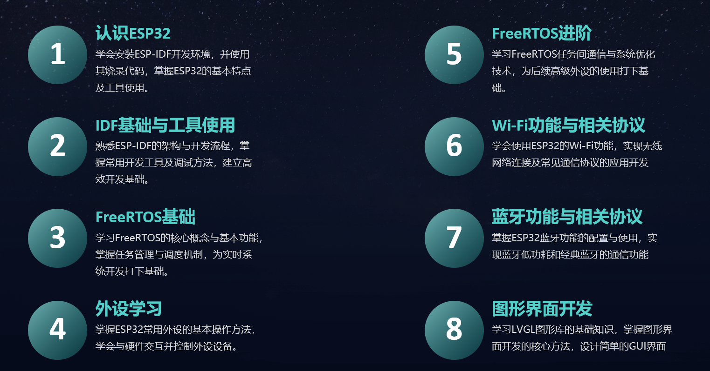
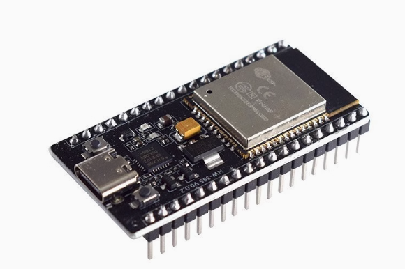

### 前言：

本教程旨在记录并分享个人学习ESP32过程中的经验和心得，以帮助其他初学者快速上手ESP32开发。这是一份从初学者视角出发，整理了学习ESP32的一条较为合理的路径和方法的笔记汇编。

文档内容基于对大量优质ESP32教程、官方文档以及实际项目实践的总结和理解，力求做到内容清晰、条理分明，既注重基础知识的巩固，也兼顾实战技能的提升。希望通过本教程，读者能少走弯路，从初学到实战开发，逐步掌握ESP32的开发技能。

文档内容从基础到进阶，适合循序渐进地学习。如果您是初学者，可以按照章节顺序逐步学习；如果您已有一定的开发经验，可以直接跳转到感兴趣的部分阅读。同时，鼓励读者在学习过程中动手实践，以便更好地理解相关知识点。

此外，文档配有对应的视频教程，可前往[B站（点击跳转）](https://www.bilibili.com/video/BV1fi6qY5EAC/?vd_source=ef5a0ab0106372751602034cdd9ab98e)浏览。

### 初衷：

1. 一方面，本人在从零开始学习ESP32的过程中曾经走过很多弯路，踩过很多坑，现在回过头来觉得有更适合初学者学习的路径，故推荐给大家，希望后来人不要走了弯路。
2. 另一方面，我始终认为，学习嵌入式，学习ESP32的秘诀是以实践促学习，也就是我们常说的费曼学习法—以输出倒逼输入。不要想着等我学会ESP32我就可以做什么，不妨换个思路，想想我现在需要做什么，做的这个东西需要用到ESP32的什么功能，然后点对点的去学习某个部分，这样学习完后可以立马投入使用，加深记忆。这份教程本身也算是我个人践行费曼学习法的实践过程。

### 目录：

本教程共八个章节，三个阶段：基础（1-3），实践（4），进阶（5-8）
其中基础章节一定要确保自己掌握，实践和进阶部分推荐按照个人需求进行选学。

### 修订历史：

|      文档名称       |   版本   |   作者    |     时间     |    备注     |
| :-------------: | :----: | :-----: | :--------: | :-------: |
|    ESP32学习计划    | v1.0.0 | DuRuofu | 2023-08-28 |   首次建立    |
|    ESP32学习计划    | v1.0.1 | DuRuofu | 2023-09-2  |    补充     |
|    ESP32学习计划    | v1.1.0 | DuRuofu | 2023-09-13 |    补充     |
|    ESP32学习计划    | v1.2.0 | DuRuofu |  2024-01   |  补充环境搭建   |
|    ESP32学习计划    | v1.3.0 | DuRuofu |  2024-02   |  补充IDF基础  |
|    ESP32学习计划    | v1.4.0 | DuRuofu |  2024-03   |  补充外设学习   |
|    ESP32学习计划    | v1.4.0 | DuRuofu |  2024-04   | 补充WIFI部分  |
| ESP32从初见到入门（一稿） | v1.5.0 | DuRuofu | 2024-12-26 | 整理汇总，重新编排 |

### 当前进度：

| 章节             | 教程                   | 文字教程 | 视频教程 | 配套代码 | 完成日期       |
| -------------- | -------------------- | :--: | :--: | :--: | ---------- |
| 一、认识ESP32      | 1.1 ESP32介绍          |  ✔   |  ✔   |  无   | 2025/1/3   |
| 一、认识ESP32      | 1.2 ESP32开发环境搭建      |  ✔   | ✔✔✔  |  无   | 2025/1/4-6 |
| 一、认识ESP32      | 1.3 idf.py的基本使用      |  ✔   |  ✔   |  无   | 2025/1/7   |
| 二、IDF基础与工具使用   | 2.1 ESP32工程结构及构建     |  ✔   |  ✔   |  ✔   | 2025/1/9   |
| 二、IDF基础与工具使用   | 2.2 ESP-IDF项目配置      |  ✔   |  ✔   |  ✔   | 2025/1/21  |
| 二、IDF基础与工具使用   | 2.3 ESP-IDF自定义组件     |  ✔   |  ✔   |  ✔   | 2025/1/22  |
| 二、IDF基础与工具使用   | 2.4 ESP-IDF组件管理器     |  ✔   |  ⏳   |  ✔   |            |
| 三、FreeRTOS基础   | 3.1 FreeRTOS概述       |  ⏳   |      |  无   |            |
| 三、FreeRTOS基础   | 3.2 FreeRTOS多任务与任务管理 |  ⏳   |      |      |            |
| 三、FreeRTOS基础   | 3.3 FreeRTOS任务看门狗    |  ⏳   |      |      |            |
| 四、外设学习         | 4.1.1 GPIO入门         |  ⏳   |      |      |            |
| 四、外设学习         | 4.1.2 UART串口通信       |      |      |      |            |
| 四、外设学习         | 4.1.3 硬件定时器          |      |      |      |            |
| 四、外设学习         | 4.1.4 ADC模数转换        |      |      |      |            |
| 四、外设学习         | 4.1.5 DAC数模转换        |      |      |      |            |
| 四、外设学习         | 4.1.6 LED PWM控制      |      |      |      |            |
| 四、外设学习         | 4.1.7 I2C通信          |      |      |      |            |
| 四、外设学习         | 4.1.8 SPI通信          |      |      |      |            |
| 四、外设学习         | 4.2.1 分区表设计          |      |      |      |            |
| 四、外设学习         | 4.2.2 非易失性存储         |      |      |      |            |
| 四、外设学习         | 4.2.3 FAT文件系统        |      |      |      |            |
| 四、外设学习         | 4.2.4 SPIFFS文件系统     |      |      |      |            |
| 五、FreeRTOS进阶   | 5.1 FreeRTOS队列使用教程   |      |      |      |            |
| 五、FreeRTOS进阶   | 5.2 FreeRTOS信号量教程    |      |      |      |            |
| 五、FreeRTOS进阶   | 5.3 FreeRTOS互斥量教程    |      |      |      |            |
| 五、FreeRTOS进阶   | 5.4 FreeRTOS事件组教程    |      |      |      |            |
| 五、FreeRTOS进阶   | 5.5 FreeRTOS任务通知教程   |      |      |      |            |
| 五、FreeRTOS进阶   | 5.6 FreeRTOS软件定时器教程  |      |      |      |            |
| 六、Wi-Fi功能与相关协议 | 6.1.1 Wi-Fi模式与基础操作   |      |      |      |            |
| 六、Wi-Fi功能与相关协议 | 6.1.2 Wi-Fi STA与AP配置 |      |      |      |            |
| 六、Wi-Fi功能与相关协议 | 6.2.1 TCP协议应用        |      |      |      |            |
| 六、Wi-Fi功能与相关协议 | 6.2.2 UDP协议应用        |      |      |      |            |

### 相关硬件及开发板：

学习ESP32离不开一块趁手的开发板，笔者认为初学者学习ESP32的重点不在于一块全能的开发板，重点在于立刻开始学习，很多复杂的外设在初学时是用不到的。所以上手阶段推荐使用市面上常见的ESP32最小系统板，价格一般在20元左右，足够学习本教程除LVGL，特殊外设，实战演练以外的部分。

此外，由于WiFi，蓝牙章节涉及到板间通信，需要使用两块开发板，所以推荐读者准备两块ESP32最小系统板。

遵循以上原则，本教程大部分章节均使用下图所示的开发板，主控型号为ESP32-WROOM-32

至于LVGL，特殊外设，实战演练部分，会在教程章节单独推荐开发板。

## 常见问题及解决方案：

本部分记录搭建环境和开发过程中常见的问题和解决方案，都是本人在开发过程中遇到的，作为经验积累，分享给大家。

> 常见问题及解决方案：[常见问题及解决方案.md](docs/00.常见问题及解决方案/常见问题及解决方案.md)

# 一、认识ESP32  

> 目标：学会安装ESP-IDF开发环境，并使用其烧录代码，掌握ESP32的基本特点及工具使用。  

## 1.1 什么是ESP32

本节主要介绍ESP32的基本概念，包括其硬件特点、应用场景及功能优势。通过本节内容，初学者可以快速了解ESP32的核心能力以及在物联网开发中的广泛应用。  

- 在线文字教程：[ESP32介绍.md](./docs/01.认识ESP32/1.1-ESP32介绍/ESP32介绍.md)
- 在线视频教程：[ESP32介绍](https://www.bilibili.com/video/BV1u861YHEso/?spm_id_from=333.1007.top_right_bar_window_history.content.click&vd_source=ef5a0ab0106372751602034cdd9ab98e)

## 1.2 ESP32开发环境搭建

本节将详细讲解如何在不同操作系统（Windows/Linux/Mac）上搭建ESP-IDF开发环境，涵盖工具链安装、环境变量配置及调试工具的准备等内容。通过本节，读者可以完成开发环境的搭建，为后续开发做好准备。  

- 在线文字教程：[ESP-IDF开发环境搭建.md](./docs/01.认识ESP32/1.2-ESP32开发环境搭建/ESP32开发环境搭建.md)
- 在线视频教程-1：[认识ESP32—1.2.1 Win下安装ESP-IDF开发环境](https://www.bilibili.com/video/BV14o62YQEBC?vd_source=ef5a0ab0106372751602034cdd9ab98e&spm_id_from=333.788.videopod.sections)
- 在线视频教程-2：[认识ESP32—1.2.2 Linux下安装ESP-IDF开发环境](https://www.bilibili.com/video/BV1vLrKYHExy/?vd_source=ef5a0ab0106372751602034cdd9ab98e#reply251069588753)
- 在线视频教程-3：[认识ESP32—1.2.3 Windows下使用ssh调用Linux系统下的开发环境](https://www.bilibili.com/video/BV1vLrKYHExy/?vd_source=ef5a0ab0106372751602034cdd9ab98e#reply251069588753)

## 1.3 初试ESP32-idf.py的基本使用

本节通过“Hello World”示例代码，指导读者创建第一个ESP32工程，并完成编译、烧录及运行调试流程。通过本节内容，初学者可以初步体验ESP-IDF的开发流程，快速进入ESP32开发的世界。  

- 在线文字教程：[ESP32初体验-idf.py的基本使用.md](docs/01.认识ESP32/1.3-初试ESP32-idf.py的基本使用/idf.py的基本使用.md)
- 在线视频教程：[ESP32初体验-idf.py的基本使用](https://www.bilibili.com/video/BV1VLrSY3E15?spm_id_from=333.788.videopod.sections&vd_source=ef5a0ab0106372751602034cdd9ab98e)
- 教程配套代码：[hello_world](https://github.com/DuRuofu/ESP32-Guide-Code/tree/master/01.start/hello_world)

---

# 二、IDF基础与工具使用

> 目标：熟悉ESP-IDF的架构与开发流程，掌握常用开发工具及调试方法，建立高效开发基础。 

## 2.1 ESP32工程结构

本节详细介绍ESP-IDF项目的基本目录结构，包括CMake工具的基础知识，帮助读者掌握ESP32工程的整体组织方式，为日后开发复杂项目奠定基础。  

- 在线文字教程：[ESP32工程结构.md](docs/02.ESP-IDF基础/2.1-ESP32工程结构/ESP-IDF的工程结构.md)
- 在线视频教程：[ESP32工程结构](https://www.bilibili.com/video/BV1CfrzYcEkK/?spm_id_from=333.1387.homepage.video_card.click&vd_source=ef5a0ab0106372751602034cdd9ab98e)
- 教程配套代码：[基础工程模板代码](https://github.com/DuRuofu/ESP32-Guide-Code/tree/master/02.idf_basic/01/sample_project)  

## 2.2 ESP-IDF项目配置

本节将重点讲解如何使用`menuconfig`工具配置项目，包含常见的配置选项及其实际用途。通过本节学习，读者可以根据项目需求快速定制和优化ESP32项目配置。  

- 在线文字教程：[ESP-IDF项目配置.md](docs/02.ESP-IDF基础/2.2-ESP-IDF项目配置/ESP-IDF项目配置.md)
- 在线视频教程：[ESP-IDF项目配置详解](https://www.bilibili.com/video/BV15xwbeiEnD/)
- 教程配套代码：[项目配置示例代码](https://github.com/DuRuofu/ESP32-Guide-Code/tree/master/02.idf_basic/02)  

## 2.3 ESP-IDF自定义组件

本节讲解如何创建和管理ESP-IDF的自定义组件，包括组件的目录结构、声明与调用方法，以及组件的复用和共享技巧，帮助读者构建模块化项目。  

- 在线文字教程：[ESP-IDF自定义组件.md](docs/02.ESP-IDF基础/2.3-ESP-IDF自定义组件/ESP-IDF自定义组件.md)
- 在线视频教程：[ESP-IDF自定义组件](https://www.bilibili.com/video/BV182ftYHEox/?spm_id_from=333.1387.upload.video_card.click&vd_source=ef5a0ab0106372751602034cdd9ab98e)
- 教程配套代码：[组件示例代码](https://github.com/DuRuofu/ESP32-Guide-Code/tree/master/02.idf_basic/03/blink_component)

## 2.4 ESP-IDF组件管理器

本节重点介绍ESP-IDF组件管理器的功能与使用方法，涵盖如何通过组件管理器导入外部库、配置组件依赖，使用官方提供的外部组件。

- 在线文字教程：[ESP-IDF组件管理器.md](docs/02.ESP-IDF基础/2.4-ESP-IDF组件管理器/ESP-IDF组件管理器.md)  
- 在线视频教程：[ESP-IDF组件管理器详解]()
- 教程配套代码：[组件管理器示例代码](https://github.com/DuRuofu/ESP32-Guide-Code/tree/master/02.idf_basic/04/button_blink)

---

# 三、FreeRTOS基础

> 目标：学习FreeRTOS的核心概念与基本功能，掌握任务管理与调度机制，为实时系统开发打下基础。  

## 3.1 FreeRTOS介绍与引入

本节将介绍FreeRTOS的核心概念，包括实时操作系统的特点、FreeRTOS的基本架构和设计思想，以及其在嵌入式开发中的应用场景，帮助读者快速了解FreeRTOS的基础知识。  

> 在线文字教程：[FreeRTOS概述.md](./docs/03.FreeRTOS基础/3.1-FreeRTOS概述/FreeRTOS概述.md)
> 在线视频教程：[FreeRTOS概述讲解]

## 3.2 FreeRTOS多任务与任务管理  

本节讲解FreeRTOS中的多任务机制及任务管理方法，包括任务创建、任务删除、任务优先级和任务状态的管理。通过本节学习，读者可以初步掌握在FreeRTOS中实现并发任务的基本技巧。  

> 在线文字教程：[FreeRTOS多任务与任务管理.md](./docs/03.FreeRTOS基础/3.2-FreeRTOS多任务与任务管理/FreeRTOS多任务与任务管理.md)
> 在线视频教程：[FreeRTOS任务管理详解]  
> 教程配套代码：[FreeRTOS多任务示例代码](#) 

## 3.3 FreeRTOS任务看门狗

本节讲解 FreeRTOS 中任务看门狗机制的原理包括如何监控任务执行状态、检测任务卡死以及触发系统恢复等功能。通过学习任务看门狗，读者可以掌握提高系统可靠性的重要技巧，确保任务能够在异常情况下得到及时处理。

> 在线文字教程：[FreeRTOS任务看门狗.md](./docs/03.FreeRTOS基础/3.3-FreeRTOS任务看门狗/FreeRTOS任务看门狗.md)
> 在线视频教程：[FreeRTOS任务看门狗]  
> 教程配套代码：[FreeRTOS任务看门狗示例代码](#) 

---

# 四、外设学习  

> 目标：掌握ESP32常用外设的基本操作方法，学会与硬件交互并控制外设设备。  

## 4.1 基础外设  

### 4.1.1 GPIO  

本节介绍GPIO（通用输入输出）的基本功能，包括输入、输出及中断操作。通过实际案例，学习如何控制外部设备并响应硬件信号。  

> 在线文字教程：[GPIO入门](./docs/04.外设学习/4.1-基础外设/4.1.1-GPIO/GPIO入门.md)  
> 在线视频教程：[GPIO开发详解]()
> 教程配套代码：[GPIO示例代码](#)  

### 4.1.2 UART  

本节讲解UART串口通信的原理及在ESP32中的实现，内容涵盖UART初始化、数据收发及常见调试方法。  

> 在线文字教程：[UART串口通信](./docs/04.外设学习/4.1-基础外设/4.1.2-UART/UART串口通信.md)  
> 在线视频教程：[UART开发详解]  
> 教程配套代码：[UART示例代码](#)  

### 4.1.3 定时器  

本节内容包括ESP32硬件定时器的初始化、配置及应用，通过案例学习如何实现精确的时间控制与定时任务。  

> 在线文字教程：[定时器](./docs/04.外设学习/4.1-基础外设/4.1.3-定时器/定时器.md)  
> 在线视频教程：[定时器开发详解]  
> 教程配套代码：[定时器示例代码](#)  

### 4.1.4 ADC（模数转换）  

本节讲解ESP32的ADC模块，包括采样的基本配置与信号转换，并通过示例学习如何读取模拟信号。  

> 在线文字教程：[ADC模数转换](./docs/04.外设学习/4.1-基础外设/4.1.4-ADC/ADC模数转换.md)  
> 在线视频教程：[ADC开发详解]  
> 教程配套代码：[ADC示例代码](#)  

### 4.1.5 DAC（数模转换）  

本节讲解DAC模块的基本操作，学习如何将数字信号转换为模拟信号输出。  

> 在线文字教程：[DAC数模转换](./docs/04.外设学习/4.1-基础外设/4.1.5-DAC/DAC数模转换.md)  
> 在线视频教程：[DAC开发详解]  
> 教程配套代码：[DAC示例代码](#)  

### 4.1.6 LED PWM  

本节介绍LED PWM（脉宽调制）的原理及操作方法，通过实际案例学习如何控制LED亮度。  

> 在线文字教程：[LED PWM控制](./docs/04.外设学习/4.1-基础外设/4.1.6-LED_PWM/LED_PWM控制.md)
> 在线视频教程：[PWM开发详解]  
> 教程配套代码：[PWM示例代码](#)  

### 4.1.7 I2C  

本节讲解I2C通信协议及在ESP32中的实现，内容涵盖设备寻址、数据收发及实际应用。  

> 在线文字教程：[I2C通信](./docs/04.外设学习/4.1-基础外设/4.1.7-I2C/I2C通信.md)  
> 在线视频教程：[I2C开发详解]  
> 教程配套代码：[I2C示例代码](#)  

### 4.1.8 SPI  

本节介绍SPI通信协议及其在ESP32中的使用，学习如何通过SPI与外部设备通信。  

> 在线文字教程：[SPI通信](./docs/04.外设学习/4.1-基础外设/4.1.8-SPI/SPI通信.md)  
> 在线视频教程：[SPI开发详解]  
> 教程配套代码：[SPI示例代码](#)  

## 4.2 存储外设  

### 4.2.1 分区表设计  

本节讲解ESP32的分区表结构及设计方法，学习如何规划存储空间以满足不同开发需求。  

> 在线文字教程：[分区表设计](./docs/04.外设学习/4.2-存储外设/4.2.1-分区表/分区表.md)  
> 在线视频教程：[分区表开发详解]  
> 教程配套代码：[分区表示例代码](#)  

### 4.2.2 非易失性存储（NVS）  

本节介绍NVS的使用方法，学习如何在ESP32中存储和读取持久化数据。  

> 在线文字教程：[非易失性存储](./docs/04.外设学习/4.2-存储外设/4.2.2-非易失性存储/非易失性存储.md)  
> 在线视频教程：[NVS开发详解]  
> 教程配套代码：[NVS示例代码](#)  

### 4.2.3 FAT文件系统  

本节讲解FAT文件系统的基本操作，学习如何在ESP32中管理文件及目录。  

> 在线文字教程：[FAT文件系统](./docs/04.外设学习/4.2-存储外设/4.2.3-FAT文件系统/FAT文件系统.md)  
> 在线视频教程：[FAT文件系统开发详解]  
> 教程配套代码：[FAT文件系统示例代码](#)  

### 4.2.4 SPIFFS文件系统  

本节介绍SPIFFS文件系统的基本操作，学习如何在ESP32中使用轻量级文件系统进行数据存储与读取。  

> 在线文字教程：[SPIFFS文件系统](./docs/04.外设学习/4.2-存储外设/4.2.4-SPIFFS文件系统/SPIFFS文件系统.md)  
> 在线视频教程：[SPIFFS开发详解]  
> 教程配套代码：[SPIFFS文件系统示例代码](#)  

---

# 五、FreeRTOS进阶  

> 目标：学习FreeRTOS任务间通信与系统优化技术，为后续高级外设的使用打下基础。  

## 5.1 队列 (Queue)  

  学习FreeRTOS中队列的基本概念及用法，掌握如何在任务之间传递数据，并理解阻塞与优先级特性。  

>在线文字教程：[FreeRTOS队列使用教程](./docs/05.FreeRTOS进阶/5.1-队列/FreeRTOS队列使用教程.md)  
   在线视频教程：[队列开发详解]  
   教程配套代码：[队列示例代码](#)  

## 5.2 信号量 (Semaphore)  

  理解信号量的分类（计数信号量与二值信号量），学习如何通过信号量实现任务同步及资源管理。  

  > 在线文字教程：[FreeRTOS信号量教程](./docs/05.FreeRTOS进阶/5.2-信号量/FreeRTOS信号量教程.md)  
  > 在线视频教程：[信号量开发详解]  
  > 教程配套代码：[信号量示例代码](#)  

## 5.3 互斥量 (Mutex)

  掌握互斥量的作用及优先级反转问题，学习如何保护共享资源以避免竞争条件。  

  > 在线文字教程：[FreeRTOS互斥量教程](./docs/05.FreeRTOS进阶/5.3-互斥量/FreeRTOS互斥量教程.md)  
  > 在线视频教程：[互斥量开发详解]  
  > 教程配套代码：[互斥量示例代码](#)  

## 5.4 事件组 (Event Group)

  学习如何通过事件组实现复杂的任务同步逻辑及事件管理。  

  > 在线文字教程：[FreeRTOS事件组教程](./docs/05.FreeRTOS进阶/5.4-事件组/FreeRTOS事件组教程.md)  
  > 在线视频教程：[事件组开发详解]  
  > 教程配套代码：[事件组示例代码](#)  

## 5.5 任务通知 (Task Notifications)

  了解任务通知的特点，掌握其在任务间高效通信中的实际应用。  

  > 在线文字教程：[FreeRTOS任务通知教程](./docs/05.FreeRTOS进阶/5.5-任务通知/FreeRTOS任务通知教程.md)  
  > 在线视频教程：[任务通知开发详解]  
  > 教程配套代码：[任务通知示例代码](#)  

## 5.6 软件定时器 (Software Timer)

  通过软件定时器实现定时触发任务逻辑，学习其管理及高级用法。  

  > 在线文字教程：[FreeRTOS软件定时器教程](./docs/05.FreeRTOS进阶/5.6-软件定时器/FreeRTOS软件定时器教程.md)  
  > 在线视频教程：[软件定时器开发详解]  
  > 教程配套代码：[软件定时器示例代码](#)  

---

# 六、Wi-Fi功能与相关协议  

> 目标：学会使用ESP32的Wi-Fi功能，实现无线网络连接及常见通信协议的应用开发。  

## 6.1 Wi-Fi功能入门  

### 6.1.1 Wi-Fi模式与基础操作  

本节介绍ESP32的Wi-Fi模式，包括STA模式和AP模式，以及如何进行基本的Wi-Fi操作，如连接网络和设置路由器等。  

> 在线文字教程：[Wi-Fi模式与基础操作](./docs/06. Wi-Fi功能与相关协议/6.1- Wi-Fi功能入门/6.1.1-Wi-Fi模式与基础操作/ Wi-Fi模式与基础操作.md)  
> 在线视频教程：[Wi-Fi模式开发详解]  
> 教程配套代码：[Wi-Fi模式示例代码](#)  

### 6.1.2 Wi-Fi STA与AP配置  

本节介绍如何在ESP32中配置Wi-Fi STA（Station）和AP（Access Point）模式，帮助用户快速实现设备与路由器或其他设备的连接。  

> 在线文字教程：[Wi-Fi STA与AP配置](./docs/06. Wi-Fi功能与相关协议/6.1- Wi-Fi功能入门/6.1.2-Wi-Fi STA与AP配置/ Wi-Fi STA与AP配置.md)  
> 在线视频教程：[Wi-Fi配置详解]  
> 教程配套代码：[Wi-Fi配置示例代码](#)  

## 6.2 网络协议应用  

### 6.2.1 TCP协议  

本节讲解TCP协议的原理及在ESP32中的实现，包含连接、数据传输及断开连接的操作步骤。  

> 在线文字教程：[TCP协议应用](./docs/06. Wi-Fi功能与相关协议/6.2-网络协议应用/6.2.1-TCP协议/TCP协议应用.md)  
> 在线视频教程：[TCP协议开发详解]  
> 教程配套代码：[TCP协议示例代码](#)  

### 6.2.2 UDP协议  

本节介绍UDP协议的工作原理及在ESP32上的应用，包含数据发送与接收的实现方法。  

> 在线文字教程：[UDP协议应用](./docs/06. Wi-Fi功能与相关协议/6.2-网络协议应用/6.2.2-UDP协议/UDP协议应用.md)  
> 在线视频教程：[UDP协议开发详解]  
> 教程配套代码：[UDP协议示例代码](#)  

### 6.2.3 HTTP协议  

本节介绍ESP32如何实现HTTP协议，包括创建HTTP客户端和服务器的步骤，以及常见的应用场景。  

> 在线文字教程：[HTTP协议应用](./docs/06. Wi-Fi功能与相关协议/6.2-网络协议应用/6.2.3- HTTP协议/HTTP协议应用.md)  
> 在线视频教程：[HTTP协议开发详解]  
> 教程配套代码：[HTTP协议示例代码](#)  

### 6.2.4 WebSocket协议  

本节讲解WebSocket协议在ESP32中的应用，如何通过WebSocket实现实时双向通信。  

> 在线文字教程：[WebSocket协议应用](./docs/06. Wi-Fi功能与相关协议/6.2-网络协议应用/6.2.4-WebSocket协议/WebSocket协议应用.md)  
> 在线视频教程：[WebSocket协议开发详解]  
> 教程配套代码：[WebSocket协议示例代码](#)  

### 6.2.5 MQTT协议  

本节介绍ESP32如何实现MQTT协议，包括客户端连接、订阅和发布消息的基本操作。  

> 在线文字教程：[MQTT协议应用](./docs/06. Wi-Fi功能与相关协议/6.2-网络协议应用/6.2.5-MQTT协议/MQTT协议应用.md)  
> 在线视频教程：[MQTT协议开发详解]  
> 教程配套代码：[MQTT协议示例代码](#)  

### 6.2.6 ESP-NOW协议  

本节介绍ESP32的ESP-NOW协议，讲解其在无需Wi-Fi路由器的情况下实现设备间直接通信的应用场景。  

> 在线文字教程：[ESP-NOW协议应用](./docs/06. Wi-Fi功能与相关协议/6.2-网络协议应用/6.2.6-ESP-NOW协议/ESP-NOW协议应用.md)  
> 在线视频教程：[ESP-NOW协议开发详解]  
> 教程配套代码：[ESP-NOW协议示例代码](#)  

## 6.3 Wi-Fi配网技术  

### 6.3.1 智能配网（SmartConfig）  

本节讲解ESP32的智能配网技术（SmartConfig），以及如何实现将ESP32设备快速接入Wi-Fi网络。  

> 在线文字教程：[智能配网](./docs/06. Wi-Fi功能与相关协议/6.3- Wi-Fi配网技术/6.3.1-智能配网/ 智能配网.md)  
> 在线视频教程：[智能配网开发详解]  
> 教程配套代码：[智能配网示例代码](#)  

---

# 七、蓝牙功能与相关协议  

> 目标：掌握ESP32蓝牙功能的配置与使用，实现蓝牙低功耗和经典蓝牙的通信功能。  

## 7.1 蓝牙功能基础

- BLE与经典蓝牙的区别  
- 蓝牙开发环境配置  

## 7.2 BLE开发  

- BLE广播与扫描  
- BLE连接与数据传输  

## 7.3 经典蓝牙开发  
- SPP协议基础  
- 经典蓝牙数据传输  

---

# 八、图形界面开发  

> 目标：学习LVGL图形库的基础知识，掌握图形界面开发的核心方法，设计简单的GUI界面。  

## 8.1 LVGL基础  
- LVGL环境搭建  
- LVGL的基本架构  

## 8.2 常用组件与布局  
- 常用控件的使用（按钮、标签等）  
- 布局系统与屏幕适配  

## 8.3 图形界面项目开发  
- 动态界面更新  
- 图形界面优化技巧  

---

# 九、项目实战

> 目标：通过综合项目实践，整合所学知识，独立开发基于ESP32的完整应用，提升实战能力。  

## 9.1 实战项目：智能家庭控制中心  

- 多外设联动  
- 无线通信与协议实现  
- 图形界面集成  

## 9.2 开发经验总结  
- 常见问题与解决方法  
- 代码优化与性能调试  

# 参考链接

- 孤独的二进制：https://space.bilibili.com/1375767826
- Augtons正(单片机)：https://blog.csdn.net/m0_50064262/article/details/120250151
- 乐鑫文档：https://docs.espressif.com/projects/esp-idf/zh_CN/release-v4.4/esp32c3/index.html
- 第九个下弦月：https://space.bilibili.com/34165842?spm_id_from=333.999.0.0
- **Michael_ee**：https://space.bilibili.com/505630520/fans/follow?tagid=529812
# 常用指令

ESP-IDF:
- 创建工程：`idf.py create-project main` 
- 新建组件`idf.py -C components create-component {componentName}`
- 清除之前的编译：` idf.py fullclean`           
- 编译:  `idf.py build`          
- 向串口烧录固件: `idf.py  -p  /dev/ttyUSB0  flash`    （`/dev/ttyUSB0`  为目标串口参数，根据实际填写）            
- 打开串口监视器:`idf.py  -p  /dev/ttyUSB0  monitor`   （`/dev/ttyUSB0`  为目标串口参数，根据实际填写）   
-  配置菜单 :`idf.py  menuconfig  `             
- 选择芯片型号：` idf.py set-target esp32 `  不输入参数的话，会列出所有可用型号
- 一次性执行构建、烧录和监视过程：`idf.py -p /dev/ttyUSB0 flash monitor`  （`/dev/ttyUSB0`  为目标串口参数，根据实际填写）   

- 获取ADC基准值：`espefuse.py  -p /dev/ttyUSB0 adc_info`
其他:

- 查询可用串口:`ls /dev/ttyUSB*`
- 添加串口权限(需重启)：`sudo usermod -aG dialout username`