# 常见问题与解决

>[!INFO]
>这里也推荐大家参考：[ESP-FAQ](https://docs.espressif.com/projects/esp-faq/zh_CN/latest/index.html) 是由乐鑫官方推出的针对常见问题的总结。在线帮助我们的用户快速检索经常问到的问题，通过简单的解释获得解答。目前常见问题的种类涵盖：开发环境、应用方案、软件平台、硬件相关和测试测试。

## 索引

[[toc]]
## 1. 头文件无法跳转，没有代码提示

**问题**：

>我们使用VS Code打开ESP32项目，有时我们的代码头文件无法跳转，写代码没有代码提示。

无法跳转：
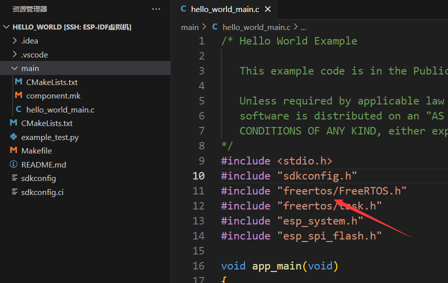
无有效代码提示：

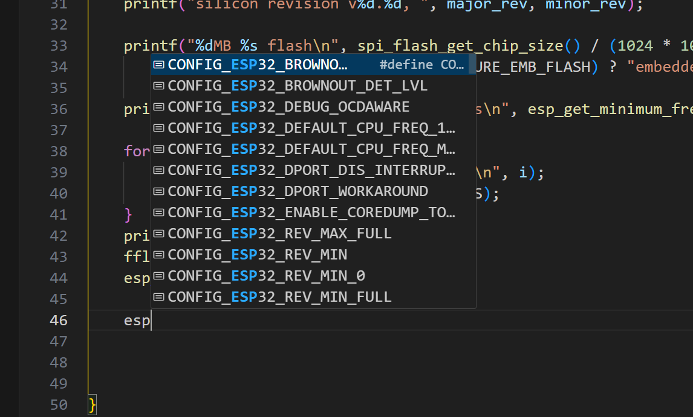

**解决方案**：

先编译代码：

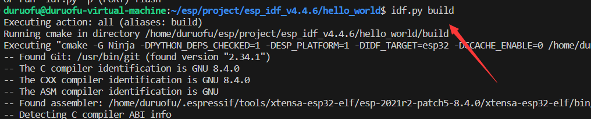

然后找到`build`下的`compile_commands.json`文件：

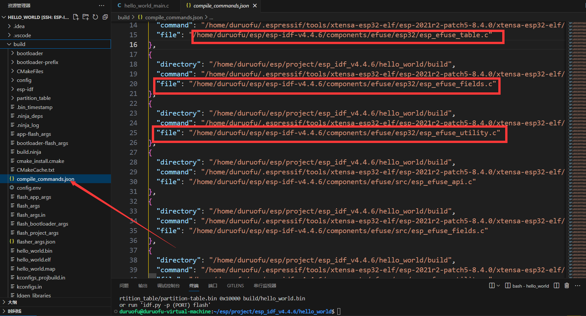

右键复制绝对路径：
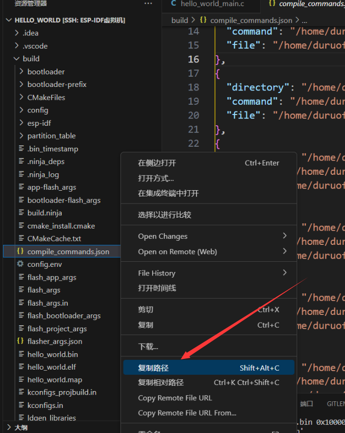

然后打开命令面板：

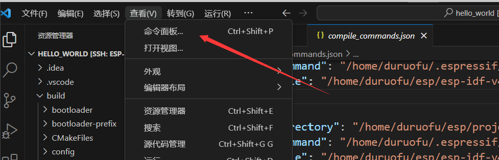

找到这一项：
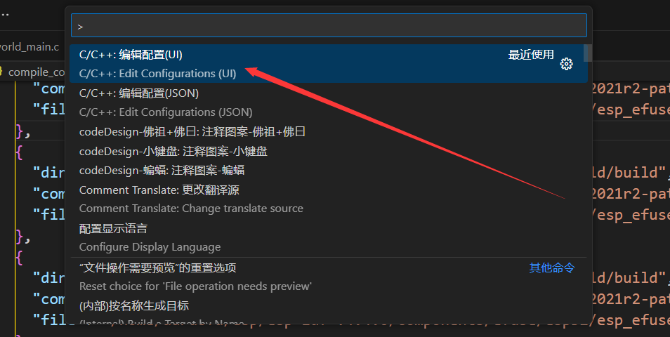

将绝对路径复制到编译命令：
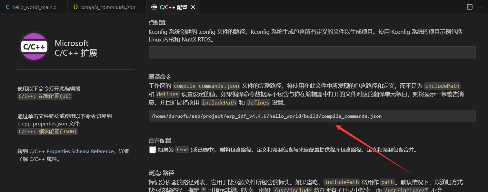


然后就能正常跳转到源码了

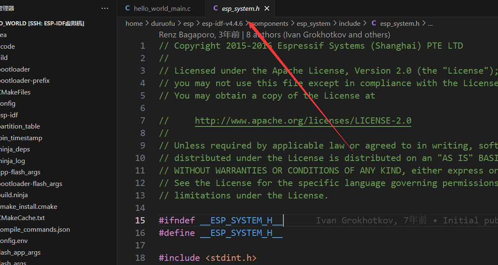

代码提示也有了：

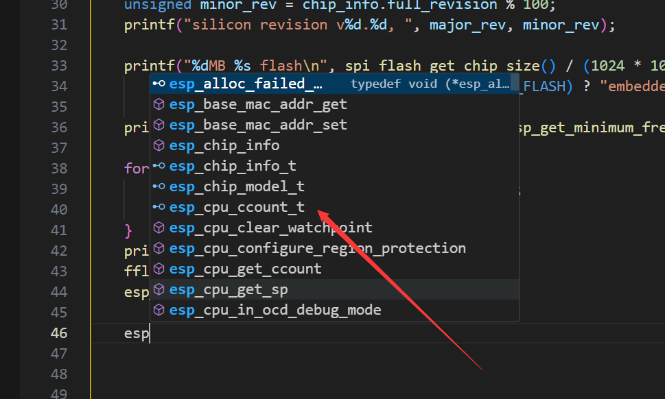

## 2. 开发板在Windows下可以显示端口，但在Linux下找不到

 **问题**：

>开发板在Windows下可以显示端口，但在Linux下找不到

这种情况一般是由于开发板的USB转串口芯片在Linux下没有驱动程序导致的，特别是USB转串口芯片为CH340的开发板，容易找不到驱动。（所以推荐使用USB转串口芯片型号为CP210x的开发板）。

**解决方案**：

安装对应型号的串口驱动程序，上网搜索安装教程一般都能找到。


## 3. Linux下烧录代码报错（没有串口权限）

**问题**：

>Linux下烧录代码报错（没有串口权限）

在Linux下烧录代码，后可能会出现：

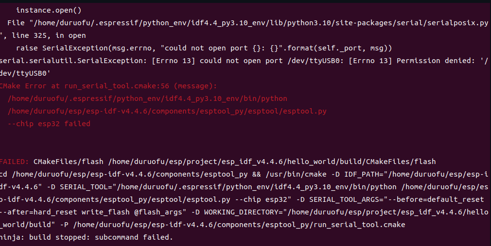

这是由于我们的linux用户没有读写串口的权限

**解决方案**：

可以使用下面的命令添加串口读写权限（也可直接切换root用户）：

```
sudo chmod a+rw /dev/ttyUSB0
```

但是注意`sudo chmod a+rw /dev/ttyUSB0` 的权限更改是暂时的，只会在当前设备被使用的会话期间生效。一旦系统重启或者设备断开并重新连接，设备节点（例如 /dev/ttyUSB0）可能会重新被创建，且权限会被重置为默认状态。

可以使用下面的命令，永久为用户添加串口权限：`sudo usermod -aG dialout username`，设置后重启方能生效。

## 4. 开发板烧录代码时出现MD5校验错误


解决办法如下：


需要在IDF环境下使用命令：]

```bash
esptool.py --port PORT write_flash_status --non-volatile 0
```

其中的PORT需要修改为实际连接的开发板端口。


## 5. 烧录报错：无法验证闪存芯片连接（未收到串行数据。）

报错信息如下：

```bash
Connecting....
Chip is ESP32-D0WD-V3 (revision v3.1)
Features: WiFi, BT, Dual Core, 240MHz, VRef calibration in efuse, Coding Scheme None
WARNING: Detected crystal freq 15.32MHz is quite different to normalized freq 26MHz. Unsupported crystal in use?
Crystal is 26MHz
MAC: fc:e8:c0:7c:b4:24
Uploading stub...
Running stub...
Stub running...
Changing baud rate to 460800
Changed.

A fatal error occurred: Unable to verify flash chip connection (No serial data received.).
CMake Error at run_serial_tool.cmake:66 (message):
  
  /home/duruofu/.espressif/python_env/idf5.3_py3.10_env/bin/python;;/home/duruofu/esp32/esp-idf-v5.3/components/esptool_py/esptool/esptool.py;--chip;esp32
  failed.


FAILED: CMakeFiles/flash /home/duruofu/project/Mock-IoT-Device-ESP32/build/CMakeFiles/flash
```

解决办法：

重新烧录引导程序：长按BOOT键，然后按复位键，再次烧录代码，即可成功烧录。