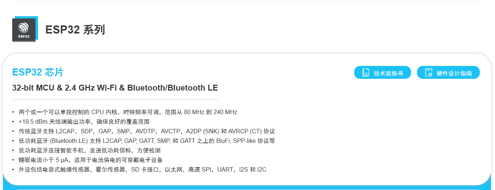
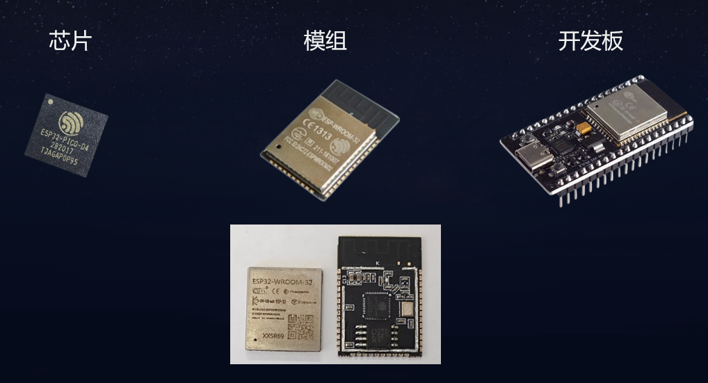
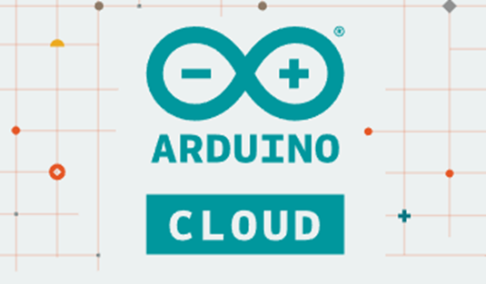
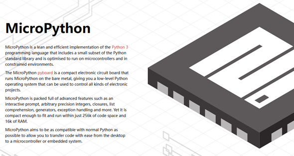

# 一、ESP32是什么？

ESP32是一款由乐鑫（Espressif）公司研发的高性能、低功耗Wi-Fi和蓝牙双模芯片。它专为物联网（IoT）设计，集成了丰富的功能模块和硬件接口，是目前最流行的物联网嵌入式开发平台之一。

ESP32指的是ESP32裸芯片，但我们常说的“ESP32”一词通常指ESP32系列芯片及开发板（一系列硬件）。

以ESP32基础芯片为例，乐鑫官网对其的描述是`32-bit MCU & 2.4 GHz Wi-Fi & Bluetooth/Bluetooth LE`,即ESP32 是集成2.4GHzWi-Fi 和蓝牙双模的单芯片方案。

乐鑫（Espressif）公司开发了多个 ESP32 系列产品，根据性能和成本的不同，满足多样化的项目需求。包括基础版本的ESP32，还有以下系列：

- ESP32-S3 系列：主打 高性能，适合需要图形处理和复杂运算的场景。
- ESP32-C3 系列：采用 RISC-V 架构，主打 低成本 和 高安全性，是 BLE 为主的轻量级应用的理想选择。

以及ESP-P系列，ESP-H系列等，我们可以通过官方给出的芯片选型工具，对各个系列的芯片进行对比：[ESP Product Selector](https://products.espressif.com/#/product-selector?language=zh&names=)

初学阶段，我们使用最基础的ESP32系列进行学习即可，用于熟悉基本的外设操作，后续有其他特殊需求就可以考虑其他系列。

这里还需要补充一点，**初学者应该分清楚芯片，模组，开发板的区别**：

芯片是最基础的核心部件，仅适合专业硬件开发；模组在芯片基础上增加了天线、电源等外围电路，便于嵌入产品；而开发板是在模组或者芯片的基础上，增加外围电路，整合了电源管理、调试接口（如 USB 转串口）、外接引脚等。所以初学者仍建议先用开发板学习，再深入了解芯片和模组的细节。

---

# 二、为什么要学习ESP32？

学习ESP32不仅是掌握一项技能，更是打开物联网开发大门的关键。以下是学习ESP32的几大优势：

1. **物联网核心技能**
   ESP32 集成了 Wi-Fi 和蓝牙功能，是物联网开发的核心硬件平台。掌握 ESP32 就能轻松搭建从传感器数据采集到云端通信的完整物联网系统。
2. **性价比高**
   ESP32 功能强大，价格低廉，非常适合学习、开发和测试物联网项目，不需要高昂的投入。
3. **丰富的开发生态**
   ESP32 支持多种开发环境（如 Arduino IDE、ESP-IDF），并拥有大量开源代码和社区资源，新手也能快速上手。
4. **强大的性能**
   ESP32 拥有双核处理器和低功耗设计，适合处理复杂任务和低功耗场景，是学习高性能嵌入式开发的理想选择。
5. **广泛的应用场景**
   从智能家居到工业物联网、从可穿戴设备到环境监测，ESP32 覆盖了几乎所有物联网领域的应用场景，学习它能帮助你开发多样化的项目。
   
学习 ESP32 不仅能让你掌握物联网开发的基础，还能带你探索软硬件结合的乐趣，为未来的智能时代打下坚实基础。

---

# 三、怎么学习ESP32？

## 3.1 选择开发环境

ESP32开发方式主要分为以下三种，本教程推荐使用第一种ESP-IDF进行开发，下面是几种开发框架的对比分析。
### 3.1.1 ESP-IDF

ESP-IDF（Espressif IoT Development Framework）是乐鑫官方提供的开发框架，适用于 ESP32、ESP32-S、ESP32-C 和 ESP32-H 系列 SoC，功能全面，性能强大。
**特点**：
- 提供底层硬件访问，功能最强大，但学习曲线较陡。
- 支持 C 和 C++ 开发，适合需要高度自定义的项目。
- 内置 FreeRTOS，适合实时多任务开发。
**适用人群**：有嵌入式开发经验或需要深度优化性能的开发者。
推荐使用：官方文档 + VS Code 插件 + Linux/Windows 开发环境。
### 3.1.2 ESP-Arduino

基于 Arduino 平台的开发方式，且有官方支持的库，开发速度比较快，Arduino 生态有丰富的第三方库资源可以调用。缺点是缺点Arduino开发不够底层，无法掌控程序的细节。
**特点**：
- 封装了 ESP32 的底层操作，只需编写少量代码即可实现 Wi-Fi、蓝牙等功能。
- 支持 Arduino 丰富的库和社区资源，可以快速完成项目原型。
- 开发环境轻量，支持 Arduino IDE 或 PlatformIO。
**适用人群**：嵌入式初学者、爱好者以及需要快速开发和验证功能的开发者。
**推荐使用**：Arduino IDE 或 PlatformIO 。

### 3.1.3 Micro Python

使用 Python 编程语言开发 ESP32，简洁高效，特别适合快速开发和教学，但是运行效率不及以C、C++编写的程序，资料教程并不如前面两者丰富和成熟。
**特点：**
- 基于 Python，代码简单，开发效率高。
- 内置交互式 REPL，方便调试和运行代码。
- 适合小型项目和快速验证，但性能和硬件控制能力稍逊于 ESP-IDF。
**适用人群**：编程初学者、Python 开发者，或对嵌入式感兴趣但不熟悉 C/C++ 的用户。
**推荐使用**：Thonny IDE ，结合官方 MicroPython 文档。

## 3.2 学习方法

### 心法：

1. 迅速掌握基本开发知识
   初学阶段不要纠结于细枝末节，重点是快速上手，掌握 ESP32 开发的基本流程和核心概念。
2. 以官方文档为主，视频教程为辅
   官方文档内容权威、完整，是学习的主线；视频教程则适合作为辅助工具，用于加深理解或解决疑问。
3. 用好官方历程代码
   ESP32 提供了丰富的示例代码，覆盖了大部分常用功能模块。通过实践这些代码可以快速熟悉开发框架和基本用法。
4. 以项目驱动学习（费曼学习法）
   学习的最佳方式是通过动手做项目，解决实际问题的过程中不仅巩固知识，还能找到自己的薄弱环节并加以改进。

### 途径：

首先选择一个实际项目作为切入点，例如让 ESP32 控制一个 LED 并通过 Wi-Fi 连接到本地网络进行远程控制。在项目中遇到具体功能需求时，针对性地学习相关模块，比如 GPIO 操作、Wi-Fi 配置等，MQTT协议。通过搜索引擎（如Bing）或视频教程快速理解基础概念，在掌握基础概念后，去阅读官方文档，了解ESP32这个模块如何使用（看不懂再去看视频），以官方历程代码为参考，结合项目需求进行实验和优化。随着学习的深入，可以拓展到更复杂的功能模块，比如蓝牙通信或低功耗模式，最终通过一个个项目的积累，系统掌握 ESP32 的开发技能。这种以项目驱动为核心、逐步深入的学习方式，可以帮助快速上手，同时在实践中巩固知识。

## 3.3 学习资源推荐

重要的事情说三遍：

- **官方文档**：[Espressif 官方文档](https://idf.espressif.com/zh-cn/index.html)
- **官方文档**：[Espressif 官方文档](https://idf.espressif.com/zh-cn/index.html)
- **官方文档**：[Espressif 官方文档](https://idf.espressif.com/zh-cn/index.html)

乐鑫的官方文档和官方历程一定是最好的学习ESP32的素材和指南。

其次，我在这里推荐一些相关的ESP32视频教程UP主，看不懂文档时可以参考他们的视频：

- **Michael_ee**：https://space.bilibili.com/505630520/fans/follow?tagid=529812
- 孤独的二进制：https://space.bilibili.com/1375767826
- 第九个下弦月：https://space.bilibili.com/34165842?spm_id_from=333.999.0.0
- 宸芯IOT：https://space.bilibili.com/1458941333?spm_id_from=333.337.search-card.all.click
- ESP_Friends：https://space.bilibili.com/3493296718482287?spm_id_from=333.337.search-card.all.click
