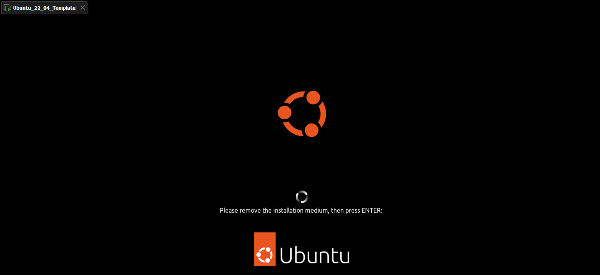
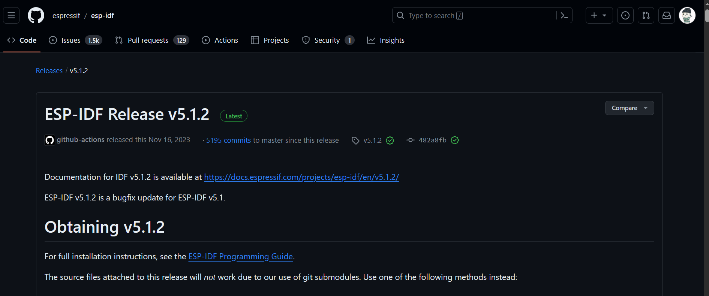
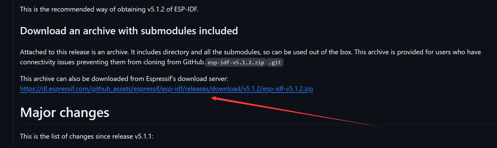
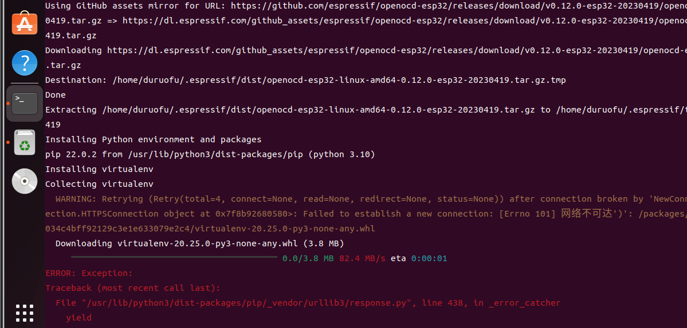
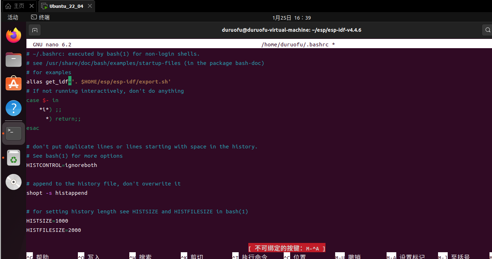
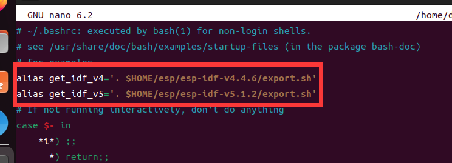
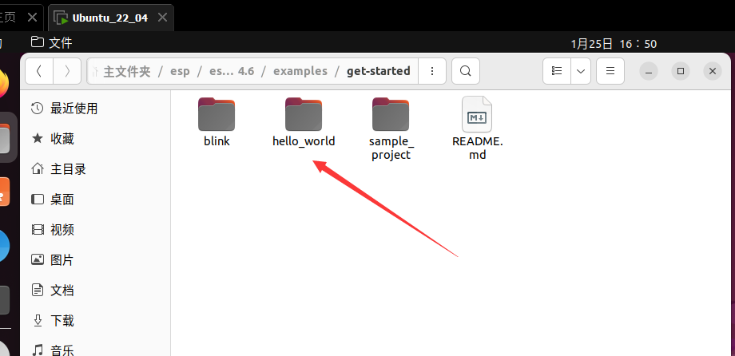
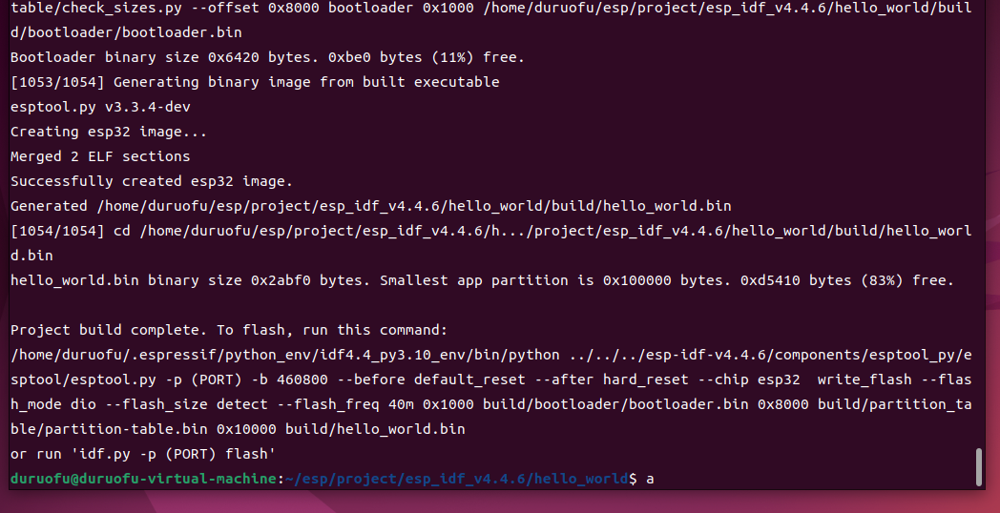

# 二、ESP32开发环境搭建—Linux系统

> [!NOTE]
> 本节介绍在Linux系统下搭建ESP-IDF开发环境，以获得更高的编译速度。<br/>
> 对应视频教程： https://www.bilibili.com/video/BV1vLrKYHExy <br/>

## 一、使用VS Code插件直接安装

这种安装方法和[环境搭建-Windows](1.环境搭建-Windows.md)介绍的Windows下使用VS Code插件直接安装没有太大区别，参考[环境搭建-Windows](1.环境搭建-Windows.md)和官方文档中针对Linux系统的提示即可，这里就不展开描述了。

建议直接参考官方文档：[Install ESP-IDF and Tools](https://docs.espressif.com/projects/vscode-esp-idf-extension/zh_CN/latest/installation.html)进行安装，但相比于在Linux下使用VS code安装，笔者更建议直接手动安装。

## 二、 手动安装

Linux系统下使用ESP-IDF更推荐手动安装，因为Linux系统下我们使用更多的是命令行，VS Code插件提供的可视化操作可有可无。

这部分同样可以优先参考官方文档：[Linux 和 macOS 平台工具链的标准设置](https://docs.espressif.com/projects/esp-idf/zh_CN/stable/esp32/get-started/linux-macos-setup.html)，下面就安装过程进行简单说明：


### 2.1 准备linux的电脑或者虚拟机

教程使用Ubuntu22.04的虚拟机环境，以安装v5.1.2为例，**注意本教程后续使用v5.2.3进行教学**，读者下载时建议下载新的`v5.2.3`版本。




### 2.2 下载ESP-IDF包环境

下载ESP-IDF包环境，这里有两种下载方式：直接使用`git clone`命令下载，或者手动前往ESP-IDF仓库下载

**使用`git clone`下载 (由于网络问题，容易下载失败)**

在终端运行命令：

```sh
mkdir -p ~/esp
cd ~/esp
git clone -b v5.1.2 --recursive https://github.com/espressif/esp-idf.git
```

**手动下载**

前往ESP-IDF仓库：https://github.com/espressif/esp-idf/releases/tag/v5.1.2 ，如下：



找到： `Download an archive with submodules included `一项




下载并解压到 ~/esp/esp-idf 即可

> PS：这里也可以安装多个版本，在这个目录中，不会冲突

### 2.3 安装依赖项

编译 ESP-IDF 需要以下软件包。请根据使用的 Linux 发行版本，选择合适的安装命令。

- Ubuntu 和 Debian:
```sh
sudo apt-get install git wget flex bison gperf python3 python3-pip python3-venv cmake ninja-build ccache libffi-dev libssl-dev dfu-util libusb-1.0-0
```

- CentOS 7 & 8:
```sh
sudo yum -y update && sudo yum install git wget flex bison gperf python3 python3-setuptools cmake ninja-build ccache dfu-util libusbx
```

- Arch:
```sh
sudo pacman -S --needed gcc git make flex bison gperf python cmake ninja ccache dfu-util libusb
```

### 2.4  安装 ESP-IDF 使用的各种工具

这里使用全部安装：

```sh
cd ~/esp/esp-idf
./install.sh all
```

ESP-IDF 工具安装器会下载 Github 发布版本中附带的一些工具，如果访问 Github 较为缓慢，可以设置一个环境变量，从而优先选择 Espressif 的下载服务器进行 Github 资源下载。

```sh
cd ~/esp/esp-idf
export IDF_GITHUB_ASSETS="dl.espressif.com/github_assets"
./install.sh
```


这一步可能会遇到python下载失败的问题：



需要修改镜像源：

Linux下，修改 ~/.pip/pip.conf (没有就创建一个文件夹及文件。文件夹要加“.”，表示是隐藏文件夹)
内容如下：

```ini
[global]
index-url = https://pypi.tuna.tsinghua.edu.cn/simple
[install]
trusted-host=mirrors.aliyun.com
```

> 如果还失败就去修改：~/.config/pip/pip.conf 这个配置文件

### 2.4  配置快捷指令

在终端执行`. $HOME/esp/esp-idf/export.sh`  这个脚本，就可以在当前终端使用esp-idf工具

但是每次执行都要先使用这个脚本激活环境不太方便，可以为执行 `export.sh` 创建一个别名

打开`.bashrc` 配置文件
```
nano ~/.bashrc
```

写入配置文件：


我这里安装了两个版本，于是写两条命令



要立即启用修改后的 .bashrc 文件，无需重启终端，只需要使用以下命令加载 .bashrc 文件：

```sh
source ~/.bashrc
```
### 2.6  测试编译

打开历程目录下的hello_world程序：



使用`idf.py build  `命令编译代码，显示下面的内容则编译成功



至此Linux下开发环境安装完成。

```
# get_idf_env
alias idf53='. $HOME/esp/v532/esp-idf/export.sh'

```
