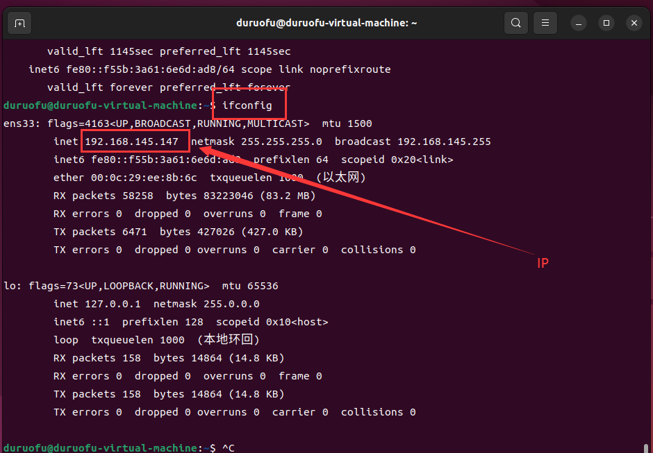
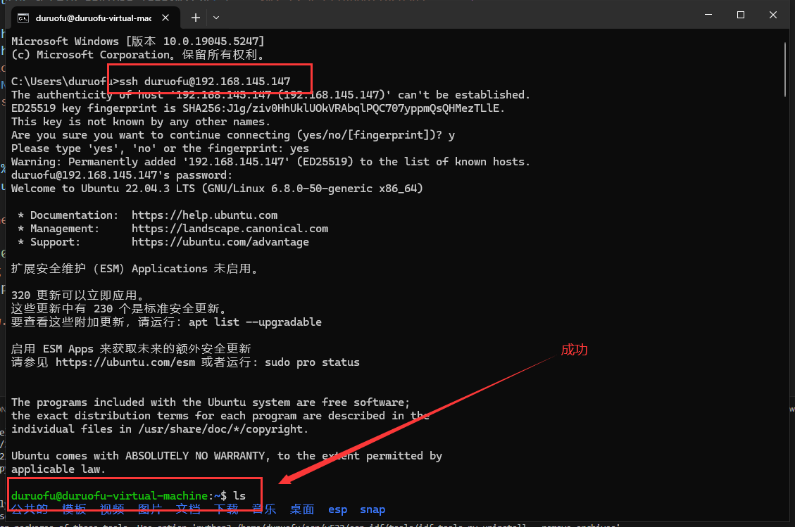
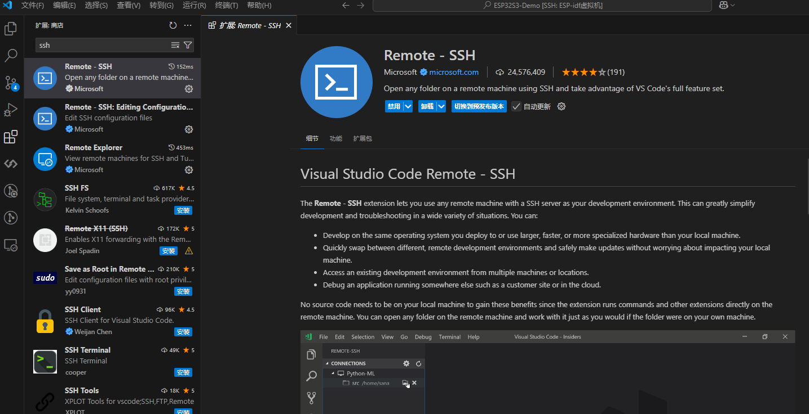

# 三、ESP32开发环境搭建—Windows与虚拟机组合使用（进阶）

> [!TIP] 🚀 进阶教程：Windows + Ubuntu 虚拟机组合使用 
> - 💡 **碎碎念**😎：本节将介绍如何将 [环境搭建-Windows](1.环境搭建-Windows.md) 和 [环境搭建-Ubuntu虚拟机](2.环境搭建-Ubuntu虚拟机.md) 组合使用，属于进阶用法，因此文档会相对简略，建议配合视频教程一起参考。  
> - 📺 **视频教程**：[点击观看](https://www.bilibili.com/video/BV1s2rGYsE4V)  
## 一、SSH介绍

SSH (Secure Shell) 是一种网络协议，用于在不安全的网络上安全地访问远程设备和服务器。它提供了强大的加密功能，可以保护用户和服务器之间的通信免受窃听、篡改和中间人攻击。

使用 ssh 命令可以登录远程服务器：

``` sh
ssh -p 22 user@host
```

其中 -p：指定端口号 、user：登录的用户名。host：登录的主机、默认的端口号为22，当端口号为22的时候，可以省略，直接使用如下方式:

```sh
ssh user@host
```

在Windows下使用VS Code通过SSH调用Linux系统的开发环境，可以在有效提升编译速度的同时，进一步提升开发体验，下面是详细的步骤：

## 二、配置步骤
### 2.1 配置SSH连接，确保可以连接

1. 确保Linux服务器已启动，并记录其IP地址或主机名，在Linux使用`ifconfig`命令查询虚拟机IP（也可以使用`ip a`命令），找不到命令 `ifconfig`，但可以通过以下命令安装它：

```sh
sudo apt install net-tools
```

查看IP：




2. 在 Ubuntu 上启用 SSH，打开终端，并且安装openssh-server软件包

```sh
sudo apt install openssh-server
```

一旦安装完成之后，SSH 服务将会被自动启动。可以s输入下面的命令验证 SSH 是否正在运行：

```sh
sudo systemctl status ssh
```

如果防火墙被启用，还需要下面的命令打开了 SSH 端口

```sh
sudo ufw allow ssh
```

在Windows的CMD进行测试连接，ssh 用户名@服务器IP地址


  
  这一步可能需要在Windows上安装OpenSSH客户端（默认Windows 10及以上版本自带）
### 2.2 安装Remote - SSH插件

打开VS Code，点击左侧的扩展市场图标，搜索`Remote - SSH`插件并安装。




### 2.3 通过Remote - SSH连接到Linux服务器

打开VS Code，按下`Ctrl+Shift+P`，输入`Remote-SSH: Add New SSH Host`并选择该项。

输入SSH连接命令，例如：  `ssh 用户名@服务器IP地址`，然后选择一个保存SSH配置的路径（默认路径是`~/.ssh/config`）。

### 2.4 在VS Code中打开ESP-IDF工程

2. 使用VS Code的`File -> Open Folder`功能，选择Linux服务器中的ESP-IDF项目目录：
   例如： `~/esp/esp-idf/examples/get-started/hello_world`
3. 打开项目后，VS Code会加载远程的文件结构。

### 2.5 配置密钥，实现免密连接

4. 在Windows下使用`ssh-keygen`生成密钥，按提示操作：
   默认保存路径是 ~/.ssh/id_rsa（直接按回车即可）。可为密钥设置密码，如果不想设置，直接回车跳过。生成完成后，会在默认路径下生成：
	- 公钥：~/.ssh/id_rsa.pub
	- 私钥：~/.ssh/id_rsa
5. 将公钥复制到远程服务器
   在本地机器上，找到你的公钥文件（通常在 ~/.ssh/id_rsa.pub）并查看内容，进行复制。
   使用 SSH 登录到远程服务器，创建 .ssh 目录并设置权限
   
``` sh
mkdir -p ~/.ssh
chmod 700 ~/.ssh
```
   
   添加公钥到 authorized_keys 文件，编辑 ~/.ssh/authorized_keys 文件,将复制的公钥粘贴到文件中并保存.
   
``` sh
nano ~/.ssh/authorized_keys
```

最后，设置 authorized_keys 文件的权限：

``` sh
chmod 600 ~/.ssh/authorized_keys
```

### 2.6 编译和调试项目

1. 在终端窗口中，运行以下命令以编译项目： ` idf.py build`

2. 如果需要烧录代码到开发板，确保开发板通过USB连接到Linux服务器，然后运行以下命令：
   `idf.py -p /dev/ttyUSB0 flash`（根据实际情况替换正确的串口设备路径）

3. 编译和烧录完成后，可以通过以下命令监控串口输出：`idf.py -p /dev/ttyUSB0 monitor`

