# 一、Windows系统

## 1.1 使用VS Code插件直接安装

在Windows系统下使用VS Code插件直接安装ESP-IDF可以参考官方文档：[Install ESP-IDF and Tools](https://docs.espressif.com/projects/vscode-esp-idf-extension/zh_CN/latest/installation.html)，下面介绍安装过程：

安装VS Code，并安装ESP-IDF插件

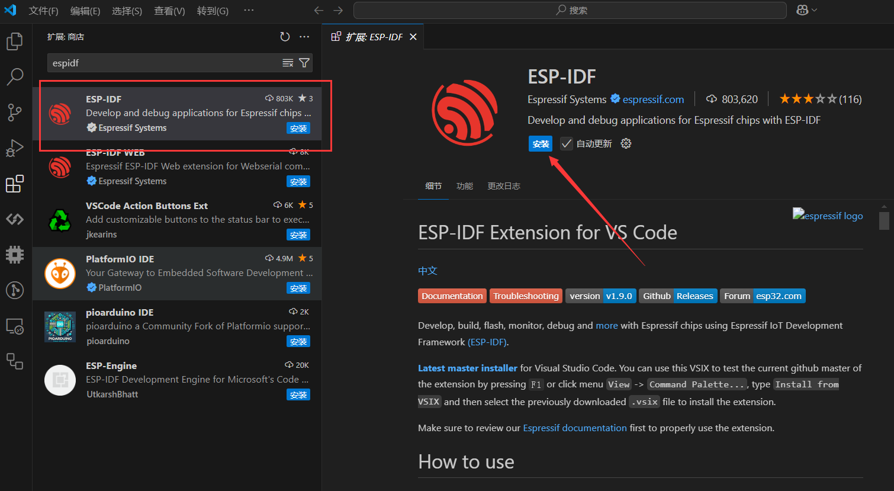

按Ctrl+Shift+P打开命令行，输入`Configure ESP-IDF Extension`


选择`ESP-IDF： Configure ESP-IDF Extension`这一项来配置插件，选择后页面如下图所示：


这里我们选择Express快速安装。


第一项为下载服务器选项，推荐使用 Espressif 下载服务器。
第二项为ESP-IDF版本，建议选择V开头的正式发布板，本教程使用V5.2.3版本。
第三项ESP-IDF源码位置，请选择不带空格的路径，且对应文件夹需要为空。
第四项ESP-IDF 工具 位置，要求同上，**但不能与第三项相同**！
这里我们选择在D盘根目录下新建`Espressif`文件夹。

然后点击安装即可，如下图所示：

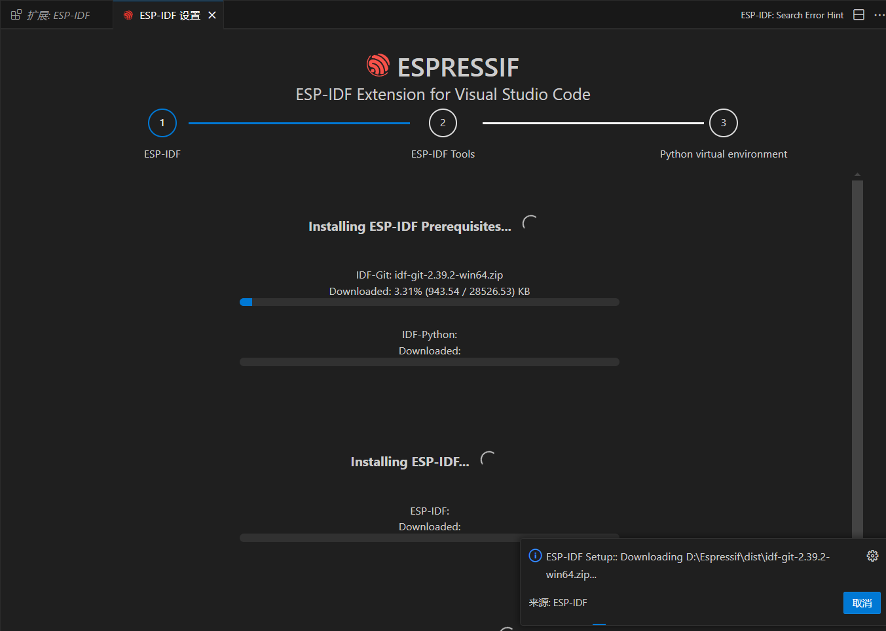

等待十几分钟即可安装完成（网络差可能会久一点），安装完成后如下图所示：


至此开发环境安装完成，我们可以打开一个示例工程编译，验证安装是否完成。


点击shown examples 选择刚才下载的IDF版本


随便选择一个示例工程，这里以blink工程为例：


点击新建示例项目，选择一个存储位置：


VS Code会自动打开项目目录，如下：

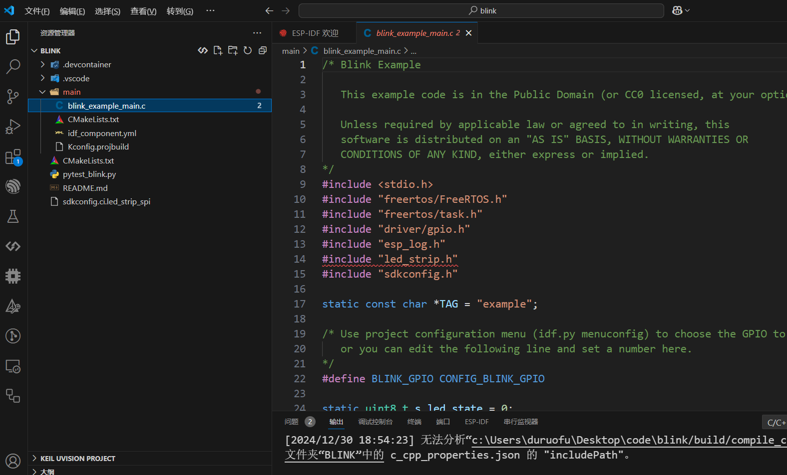

点击扳手图标构建项目：

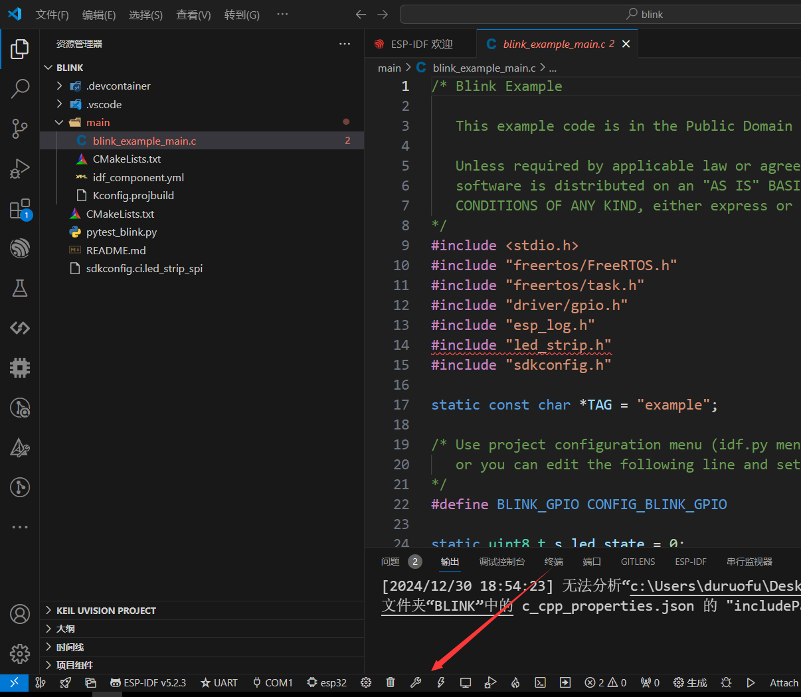

编译停止后，命令行显示下列内容，则开发环境安装无误。至此ESP32的开发环境就准备完毕了。

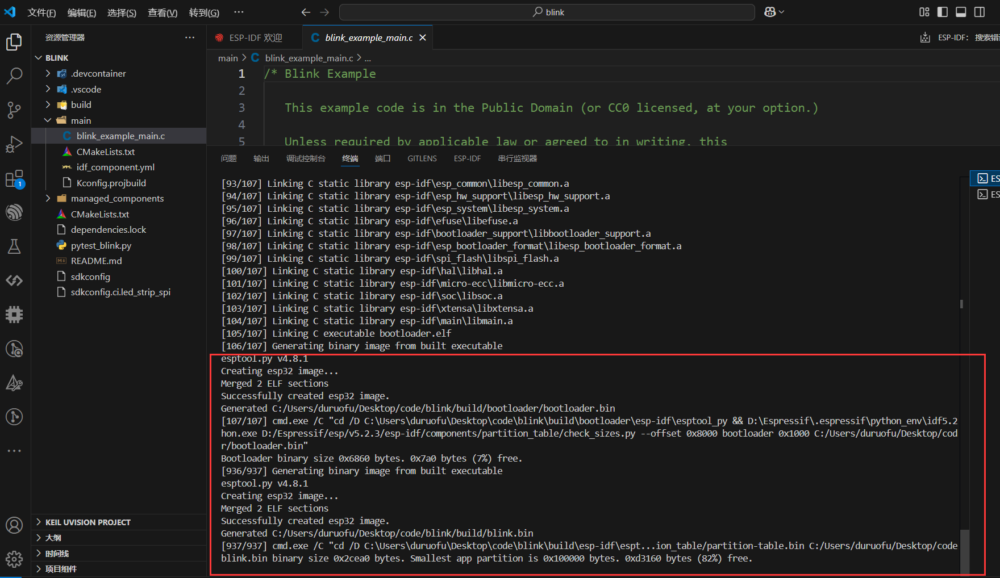

至于进一步烧录代码至开发板，将在下一节介绍。

## 1.2 手动安装

Windows系统下手动安装可以参考官方文档：[Windows 平台工具链的标准设置](https://docs.espressif.com/projects/esp-idf/zh_CN/stable/esp32/get-started/windows-setup.html#),下面简单介绍安装过程：

打开下面的链接，下载 ESP-IDF 工具安装器

>https://docs.espressif.com/projects/esp-idf/zh_CN/stable/esp32/get-started/windows-setup.html


选择自己需要的版本，这里以V5.2.3版本为例（后续教程也使用该版本）


下载完成后打开esp-idf-tools-setup-offline-x.x.x.exe程序即可开始安装

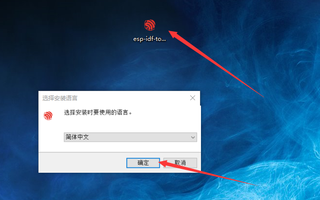

选择安装路径：

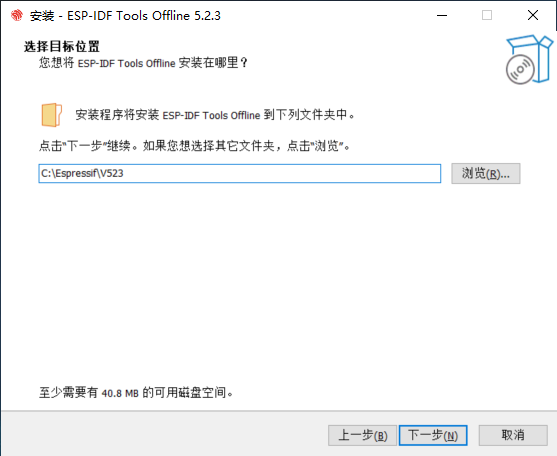

选择需要的组件和驱动程序（建议全选）：

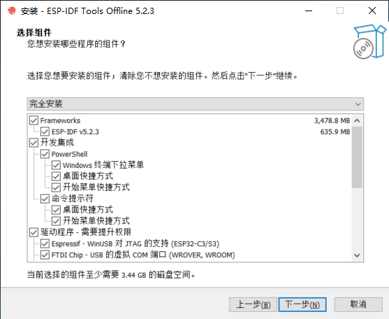

等待安装完成即可，安装完成如下图：


下面编译一个示例工程，以确保ESP-IDF可以正常工作，示例代码位于`安装目录\frameworks\esp-idf-v5.2.3\examples`,如下图:

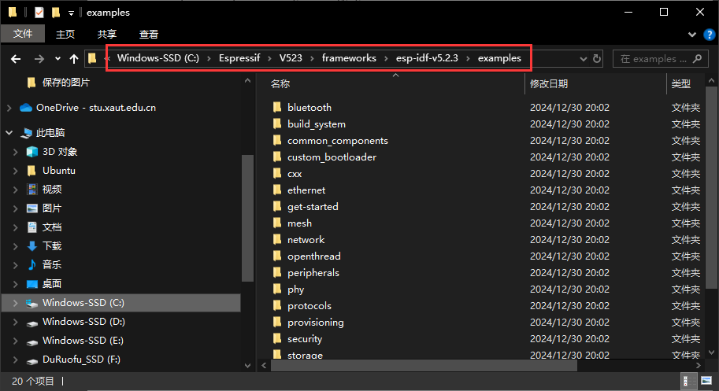

复制`examples/get-started`下的`blink`点灯工程到桌面（或其他位置），在安装完成后弹出的命令行中切换到`blink`目录，并运行`idf.py build`命令：

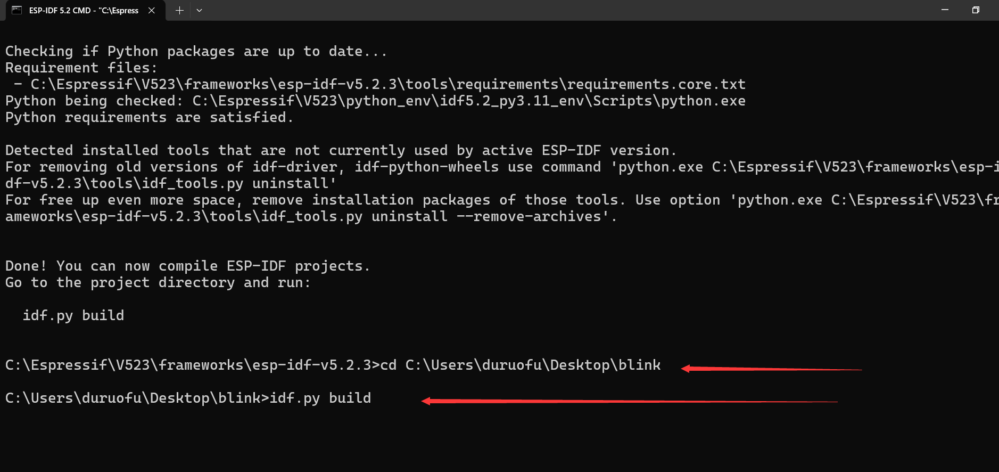

运行后编译完成输出如下，则开发环境安装无误，至此ESP32的开发环境就准备完毕了。

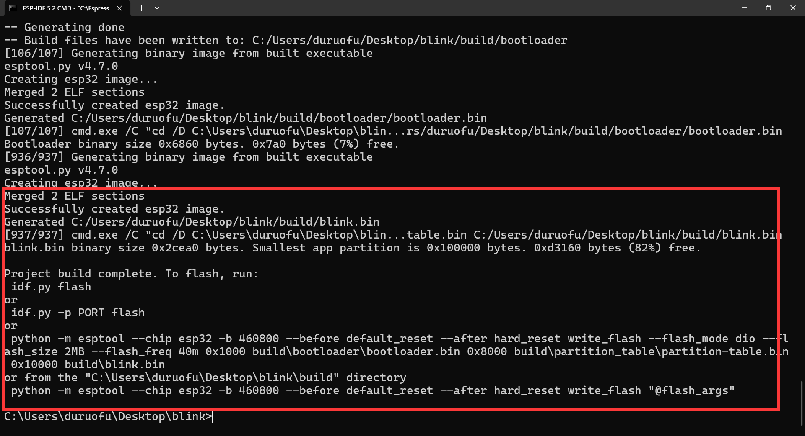


**但如果要使用VS Code插件功能，还需要继续下面的步骤（可选，不使用插件进行开发也完全没有问题）：**

依然是安装VS Code，并安装ESP-IDF插件


按Ctrl+Shift+P打开命令行，输入`Configure ESP-IDF Extension`


选择`ESP-IDF： Configure ESP-IDF Extension`这一项来配置插件，选择后页面如下图所示：


这里我们选择第三个选项，使用现有设置，设置`Enter ESP-IDF directory (IDF_PATH)`为安装根目录下的`frameworks\esp-idf-v5.2.3`目录，设置`Enter ESP-IDF Tools directory (IDF_TOOLS_PATH)`为安装根目录，如下图（本教程中安装根目录为`c:\Espressif\V523`）

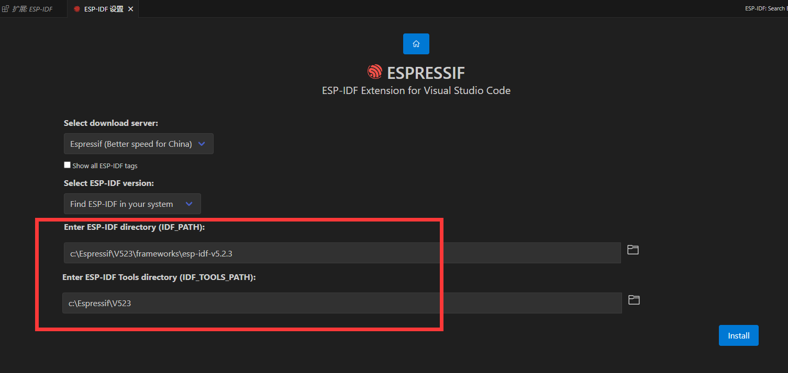

点击安装，等待十几分钟安装完成即可，要注意的是虽然是离线安装，但这个步骤依赖网络下载python环境相关的工具，容易失败（失败很大可能是网络引起的，不妨换个网络环境重新尝试😂）


安装成功显示如下：

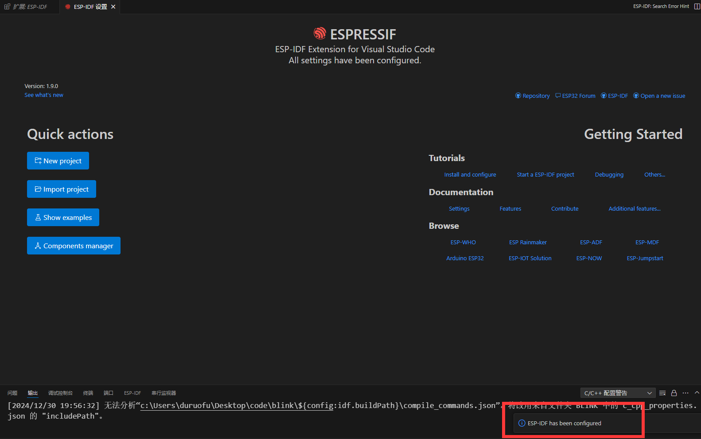


# 二、Linux系统

## 2.1 使用VS Code插件直接安装

这种安装方法和1.1介绍的Windows下使用VS Code插件直接安装没有太大区别，参考1.1部分和官方文档中针对Linux系统的提示即可，这里就不展开描述了。

建议直接参考官方文档：[Install ESP-IDF and Tools](https://docs.espressif.com/projects/vscode-esp-idf-extension/zh_CN/latest/installation.html)进行安装，但相比于在Linux下使用VS code安装，笔者更建议直接手动安装。

## 2.2 手动安装

Linux系统下使用ESP-IDF更推荐手动安装，因为Linux系统下我们使用更多的是命令行，VS Code插件提供的可视化操作可有可无。

这部分同样可以优先参考官方文档：[Linux 和 macOS 平台工具链的标准设置](https://docs.espressif.com/projects/esp-idf/zh_CN/stable/esp32/get-started/linux-macos-setup.html)，下面就安装过程进行简单说明：


### 2.2.1 准备linux的电脑或者虚拟机

教程使用Ubuntu22.04的虚拟机环境，以安装v5.1.2为例，**注意本教程后续使用v5.2.3进行教学**，读者下载时建议下载新的`v5.2.3`版本。


### 2.2.2 下载ESP-IDF包环境

下载ESP-IDF包环境，这里有两种下载方式：直接使用`git clone`命令下载，或者手动前往ESP-IDF仓库下载

**使用`git clone`下载 (由于网络问题，容易下载失败)**

在终端运行命令：

```sh
mkdir -p ~/esp
cd ~/esp
git clone -b v5.1.2 --recursive https://github.com/espressif/esp-idf.git
```

**手动下载**

前往ESP-IDF仓库：https://github.com/espressif/esp-idf/releases/tag/v5.1.2 ，如下：


找到： `Download an archive with submodules included `一项


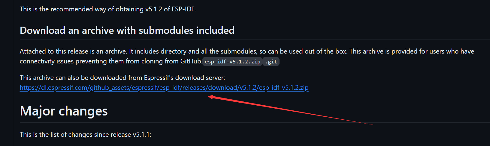

下载并解压到 ~/esp/esp-idf 即可

> PS：这里也可以安装多个版本，在这个目录中，不会冲突

### 2.2.3 安装依赖项

编译 ESP-IDF 需要以下软件包。请根据使用的 Linux 发行版本，选择合适的安装命令。

- Ubuntu 和 Debian:
```sh
sudo apt-get install git wget flex bison gperf python3 python3-pip python3-venv cmake ninja-build ccache libffi-dev libssl-dev dfu-util libusb-1.0-0
```

- CentOS 7 & 8:
```sh
sudo yum -y update && sudo yum install git wget flex bison gperf python3 python3-setuptools cmake ninja-build ccache dfu-util libusbx
```

- Arch:
```sh
sudo pacman -S --needed gcc git make flex bison gperf python cmake ninja ccache dfu-util libusb
```

### 2.2.3  安装 ESP-IDF 使用的各种工具

这里使用全部安装：

```sh
cd ~/esp/esp-idf
./install.sh all
```

ESP-IDF 工具安装器会下载 Github 发布版本中附带的一些工具，如果访问 Github 较为缓慢，可以设置一个环境变量，从而优先选择 Espressif 的下载服务器进行 Github 资源下载。

```sh
cd ~/esp/esp-idf
export IDF_GITHUB_ASSETS="dl.espressif.com/github_assets"
./install.sh
```


这一步可能会遇到python下载失败的问题：

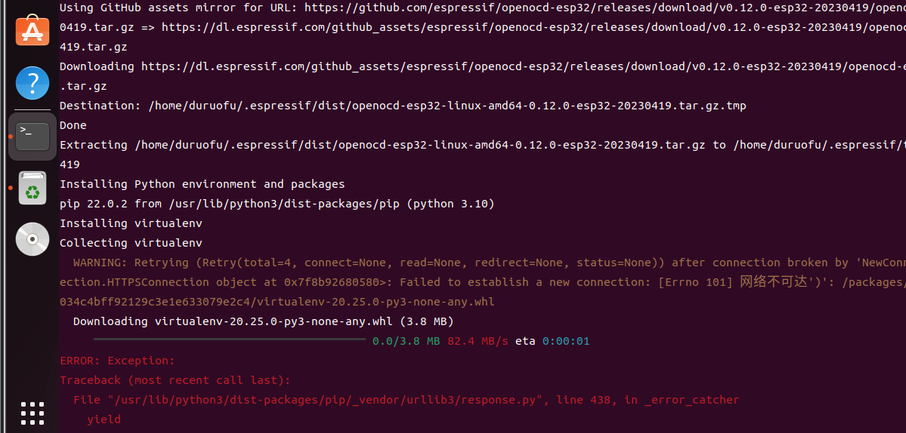

需要修改镜像源：

Linux下，修改 ~/.pip/pip.conf (没有就创建一个文件夹及文件。文件夹要加“.”，表示是隐藏文件夹)
内容如下：

```ini
[global]
index-url = https://pypi.tuna.tsinghua.edu.cn/simple
[install]
trusted-host=mirrors.aliyun.com
```

> 如果还失败就去修改：~/.config/pip/pip.conf 这个配置文件

### 2.2.4  配置快捷指令

在终端执行`. $HOME/esp/esp-idf/export.sh`  这个脚本，就可以在当前终端使用esp-idf工具

但是每次执行都要先使用这个脚本激活环境不太方便，可以为执行 `export.sh` 创建一个别名

打开`.bashrc` 配置文件
```
nano ~/.bashrc
```

写入配置文件：


我这里安装了两个版本，于是写两条命令


要立即启用修改后的 .bashrc 文件，无需重启终端，只需要使用以下命令加载 .bashrc 文件：

```sh
source ~/.bashrc
```
### 2.2.5  测试编译

打开历程目录下的hello_world程序：

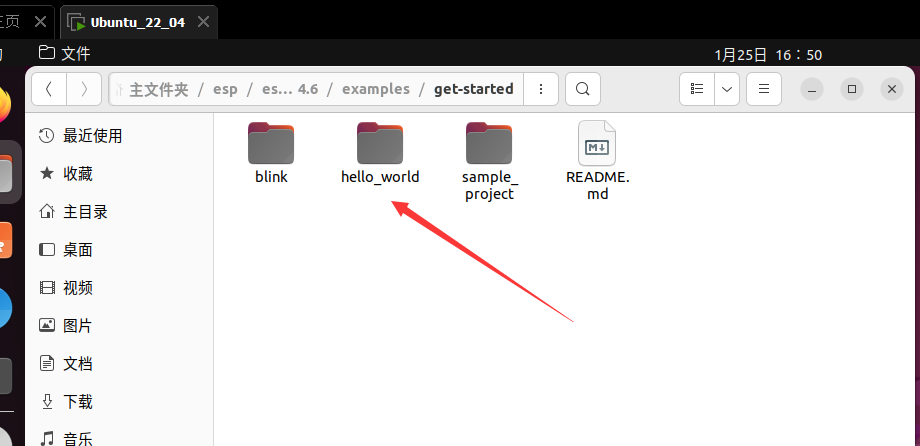

使用`idf.py build  `命令编译代码，显示下面的内容则编译成功

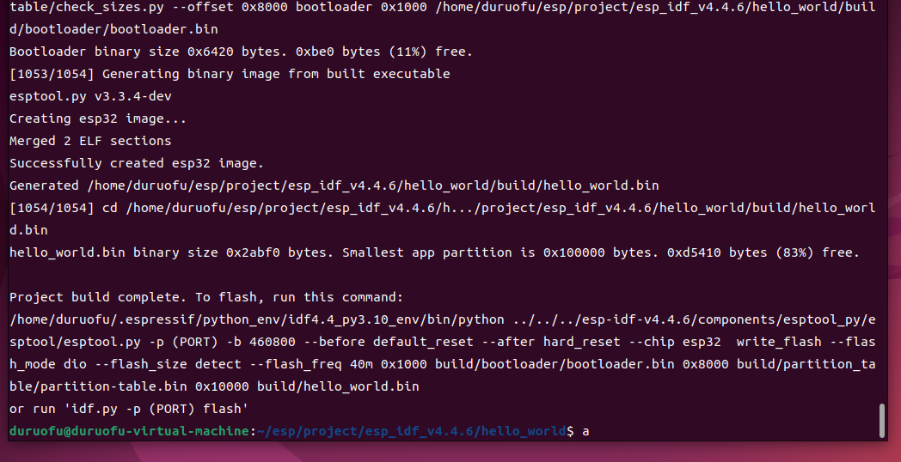

至此Linux下开发环境安装完成。

```
# get_idf_env
alias idf53='. $HOME/esp/v532/esp-idf/export.sh'

```
# 三、(进阶)Windows下使用ssh调用Linux系统下的开发环境


SSH (Secure Shell) 是一种网络协议，用于在不安全的网络上安全地访问远程设备和服务器。它提供了强大的加密功能，可以保护用户和服务器之间的通信免受窃听、篡改和中间人攻击。

使用 ssh 命令登录远程服务器：

``` sh
ssh -p 22 user@host
```

其中 -p：指定端口号 、user：登录的用户名。host：登录的主机、默认的端口号为22，当端口号为22的时候，可以省略，直接使用如下方式:

```sh
ssh user@host
```

在Windows下使用VS Code通过SSH调用Linux系统的开发环境，可以在有效提升编译速度的同时，进一步提升开发体验，下面是详细的步骤：

## 3.1 配置SSH连接，确保可以连接

1. 确保Linux服务器已启动，并记录其IP地址或主机名，在Linux使用`ifconfig`命令查询虚拟机IP（也可以使用`ip a`命令），找不到命令 `ifconfig`，但可以通过以下命令安装它：

```sh
sudo apt install net-tools
```

查看IP：

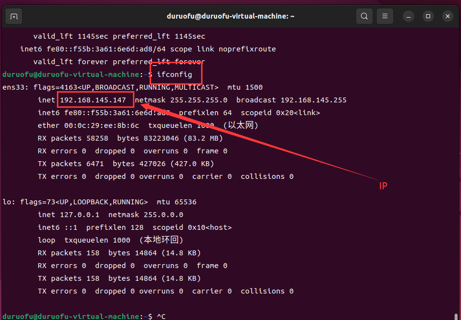


2. 在 Ubuntu 上启用 SSH，打开终端，并且安装openssh-server软件包

```sh
sudo apt install openssh-server
```

一旦安装完成之后，SSH 服务将会被自动启动。可以s输入下面的命令验证 SSH 是否正在运行：

```sh
sudo systemctl status ssh
```

如果防火墙被启用，还需要下面的命令打开了 SSH 端口

```sh
sudo ufw allow ssh
```

3. 在Windows的CMD进行测试连接，ssh 用户名@服务器IP地址


  
  这一步可能需要在Windows上安装OpenSSH客户端（默认Windows 10及以上版本自带）
## 3.2 安装Remote - SSH插件

打开VS Code，点击左侧的扩展市场图标，搜索`Remote - SSH`插件并安装。


## 3.3 通过Remote - SSH连接到Linux服务器

1. 打开VS Code，按下`Ctrl+Shift+P`，输入`Remote-SSH: Add New SSH Host`并选择该项。
2. 输入SSH连接命令，例如：  
   ssh 用户名@服务器IP地址  
   然后选择一个保存SSH配置的路径（默认路径是`~/.ssh/config`）。

## 3.4 在VS Code中打开ESP-IDF工程

1. 使用VS Code的`File -> Open Folder`功能，选择Linux服务器中的ESP-IDF项目目录：
   例如： `~/esp/esp-idf/examples/get-started/hello_world`
2. 打开项目后，VS Code会加载远程的文件结构。

## 3.5 配置密钥，实现免密连接

1. 在Windows下使用`ssh-keygen`生成密钥，按提示操作：
   默认保存路径是 ~/.ssh/id_rsa（直接按回车即可）。可为密钥设置密码，如果不想设置，直接回车跳过。生成完成后，会在默认路径下生成：
	- 公钥：~/.ssh/id_rsa.pub
	- 私钥：~/.ssh/id_rsa
2. 将公钥复制到远程服务器
   在本地机器上，找到你的公钥文件（通常在 ~/.ssh/id_rsa.pub）并查看内容，进行复制。
   使用 SSH 登录到远程服务器，创建 .ssh 目录并设置权限
   
``` sh
mkdir -p ~/.ssh
chmod 700 ~/.ssh
```
   
   添加公钥到 authorized_keys 文件，编辑 ~/.ssh/authorized_keys 文件,将复制的公钥粘贴到文件中并保存.
   
``` sh
nano ~/.ssh/authorized_keys
```

最后，设置 authorized_keys 文件的权限：

``` sh
chmod 600 ~/.ssh/authorized_keys
```

## 3.6 编译和调试项目

1. 在终端窗口中，运行以下命令以编译项目：
  ` idf.py build`

2. 如果需要烧录代码到开发板，确保开发板通过USB连接到Linux服务器，然后运行以下命令：
 `idf.py -p /dev/ttyUSB0 flash`
   （根据实际情况替换正确的串口设备路径。）

3. 编译和烧录完成后，可以通过以下命令监控串口输出：
  ` idf.py -p /dev/ttyUSB0 monitor`


## 参考链接

1. https://www.bilibili.com/video/BV1J14y1n7Ve/?spm_id_from=333.337.search-card.all.click&vd_source=ef5a0ab0106372751602034cdd9ab98e
2. https://blog.csdn.net/ZRongZH/article/details/129237476
3. https://www.bilibili.com/video/BV1Mv4y1U7x9/?spm_id_from=333.999.0.0&vd_source=ef5a0ab0106372751602034cdd9ab98e


