# ESP.py的基本使用

> [!TIP] 🚀 ESP32开发基本流程 | 从编译到烧录，一步步掌握！  
> - 💡 **碎碎念**😎：本节将介绍 ESP32 开发的基本流程，包括代码编译、烧录以及查看串口监视器等常用命令。同时，引导大家学会使用 `idf.py` 工具，让你的开发更高效！  
> - 📺 **视频教程**：[点击观看](https://www.bilibili.com/video/BV1VLrSY3E15)  
> - 📚 **官方文档**：[API 指南 » 工具 » IDF 前端工具 - idf.py](https://docs.espressif.com/projects/esp-idf/zh_CN/v5.2.3/esp32/api-guides/tools/idf-py.html)  

## 一、常用idf.py命令介绍

| 功能       | 命令                                                      | 备注                              |
| -------- | ------------------------------------------------------- | ------------------------------- |
| 创建新工程    | `idf.py create-project <project name>`                  | `<project name>` 为项目名称          |
| 创建新组件    | `idf.py -C components create-component {componentName}` | `{componentName}` 为组件名称         |
| 选择目标芯片   | `idf.py set-target <target>`                            | `<target>` 为芯片型号，不输入参数会列出所有可用型号 |
| 启动图形配置工具 | `idf.py menuconfig`                                     | 配置项目的菜单选项                       |
| 构建工程     | `idf.py build`                                          | 编译生成固件                          |
| 清除构建输出   | `idf.py clean`                                          | 清除中间文件                          |
| 删除所有构建内容 | `idf.py fullclean`                                      | 清除所有生成的文件                       |
| 烧录工程     | `idf.py -p /dev/ttyUSB0 flash`                          | `/dev/ttyUSB0` 为目标串口，根据实际情况修改   |
| 打开串口监视器  | `idf.py -p /dev/ttyUSB0 monitor`                        | `/dev/ttyUSB0` 为目标串口，根据实际情况修改   |
| 构建、烧录并监视 | `idf.py -p /dev/ttyUSB0 flash monitor`                  | `/dev/ttyUSB0` 为目标串口，根据实际情况修改   |
| 打开文档     | `idf.py docs`                                           |                                 |

补充其他可能用到命令：

- Linux下查询可用串口:`ls /dev/ttyUSB*`
- 添加串口权限(需重启)：`sudo usermod -aG dialout username`

**有一点需要说明**：我们使用VS Code+ESP-IDF插件进行开发，所使用的图形界面实际上就是在命令行里运行上述命令。

比如：

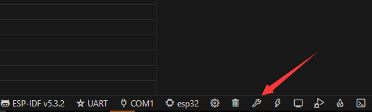

点击小扳手图标构建项目，与在命令行对应目录下使用`idf.py build`命令，具有一模一样的效果，ESP-IDF插件只是为我们提供了一个可视化界面。
当我们使用熟练后，使用可视化界面与直接使用命令没有什么区别，考虑到本教程不仅仅针对使用VS Code+ESP-IDF插件环境的学习者，**所以后续的教程中可能更多的以使用命令行命令为主，望读者周知**，这只是个人习惯，您在开发过程中可以选用您喜欢的操作方式，本质上没有区别。

## 二、尝试编译运行HelloWorld

### 2.1 准备示例代码

接下来我们尝试编译并烧录一个HelloWorld示例工程，IDF-IDF提供了很多例程，它的例程文件位于 IDF 文件夹下的examples 中。

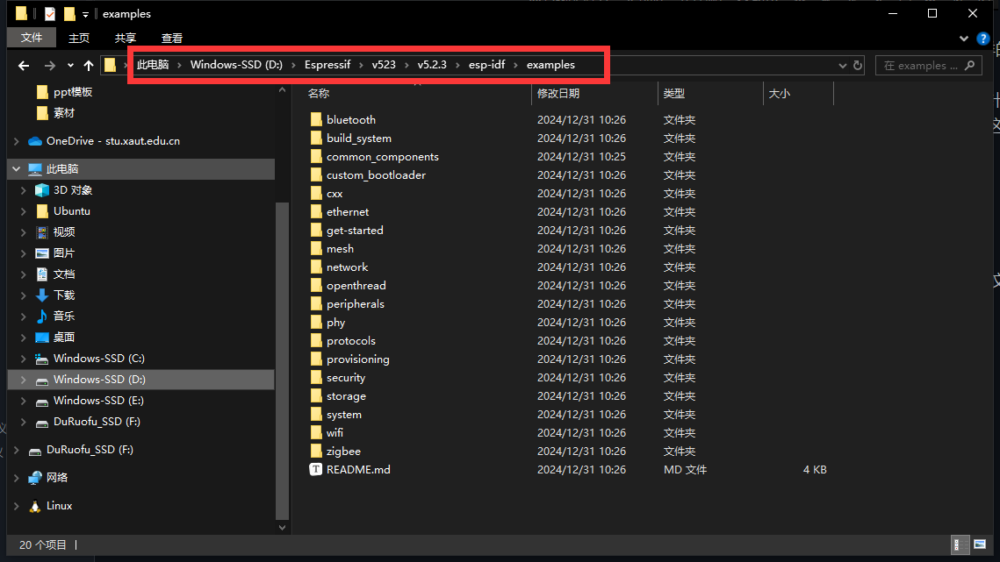

这里我安装ESP-IDF时，选择了`D:\Espressif\v523`文件夹作为根目录，对应examples的路径如上，请读者按照自己安装ESP-IDF的目录寻找示例代码。

本节使用的示例代码位于`examples\get-started`中：

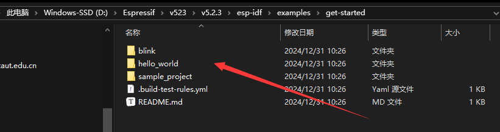

复制 `hello_world`例程文件夹到我们自己存放代码的文件夹（复制，而不是直接使用是为了不改动原本示例代码，毕竟后续可能还会用到），这里我将代码复制到`D:\Code\hello_world`,然后使用VScode打开`hello_world`文件夹(整个`hello_world`文件夹就是一个ESP32工程)。

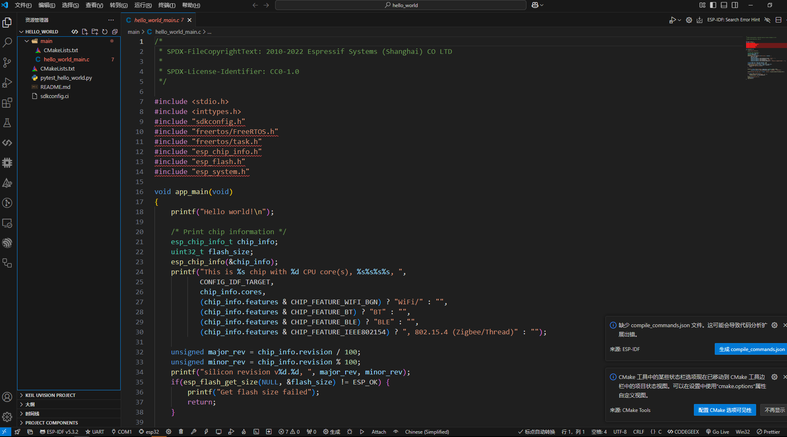

我们可以在main文件夹里看到`hello_world.c`这就是`hello_world`工程的代码，关于工程结构，每个文件都是干什么的我们会在下节详细展开介绍，本节我们只讨论如何编译，烧录，和查看代码运行效果。

### 2.2 设置目标芯片

首先我们要确认芯片型号选择正确：

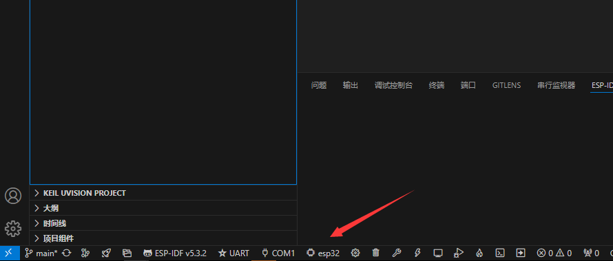

如果不是ESP32，可以点击，并选择ESP32

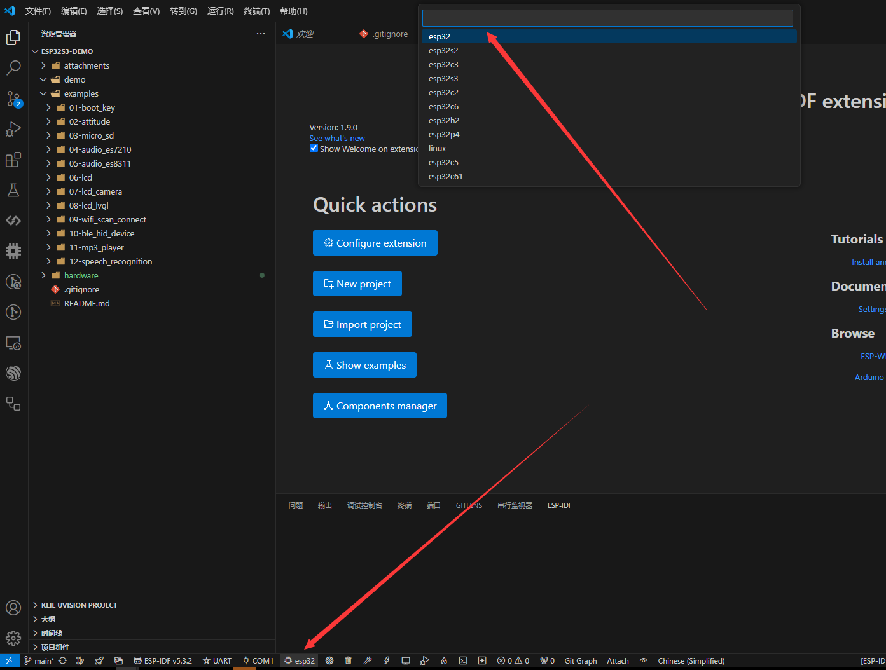

也可以使用命令行设定目标芯片，点击打开ESP-IDF终端

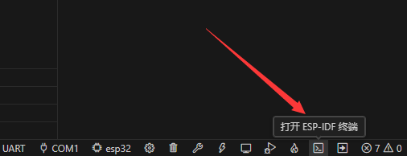

在终端中使用`idf.py set-target esp32`命令设定目标芯片为ESP32.

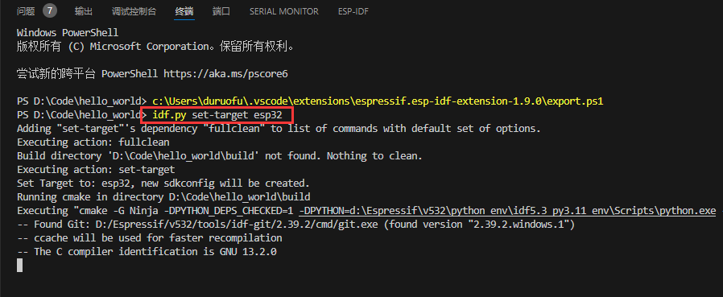

### 2.3 编译代码

点击构建代码按钮，进行代码编译（也可以打开ESP-IDF终端，使用`idf.py bulid`命令）

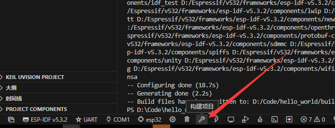

开始编译后，命令行会显示编译进度：

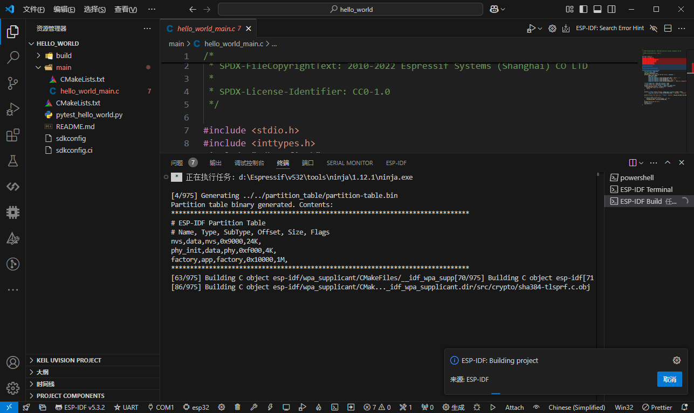

编译完成后，命令行会显示构建固件成功，接下来就可以烧录代码至开发板了。

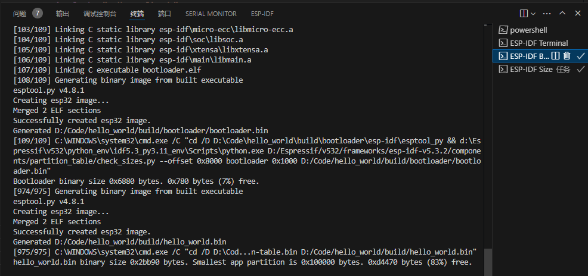

### 2.4 烧录代码

烧录代码前先将开发板连接到电脑，确认开发板的串口号：

windows下打开设备管理器(找不到可以百度一下)，找到`端口（COM和LPT）`就可以看到开发板的串口号，如果显示有多个设备，可以反复插拔开发板来确认具体是哪一个端口。

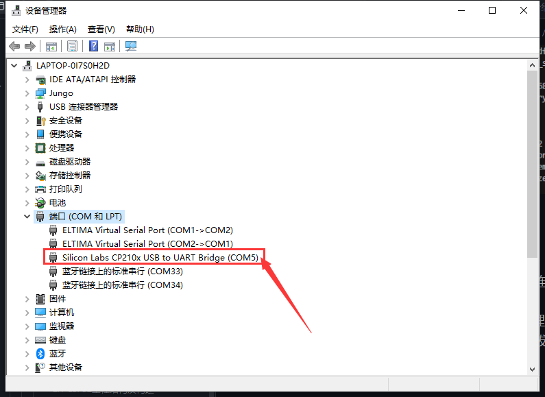

Linux下可以可以使用`ls /dev/ttyUSB*`命令查看可用串口。

如果插上没有串口显示，可能有以下几种情况：

1. **驱动未安装**：部分开发板（尤其是带 CH340 或 CP2102 芯片的开发板）需要安装对应的 USB 转串口驱动。解决方法：根据开发板芯片型号下载并安装对应的驱动程序。
2. **USB 数据线问题**：有些 USB 数据线仅支持充电，不支持数据传输。解决方法：更换支持数据传输的 USB 数据线。
3. **开发板电路故障**：开发板可能存在硬件问题，比如接口松动或电路损坏。解决方法：更换开发板测试，以排除硬件故障。

>出现上面这些问题是很常见的，出现了也不要紧，一条一条排除，善用搜素引擎进行搜素，都是可以解决的。

确认好串口号之后，在可视化界面选择串口烧录，选择好串口号，点击闪电标志即可烧录代码。也可以使用命令`idf.py  -p  /dev/ttyUSB0  flash`   进行烧录 （`/dev/ttyUSB0`  为目标串口参数，根据实际填写）

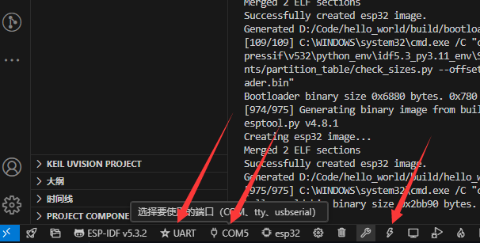

烧录代码时，终端输出如下，为烧录成功：

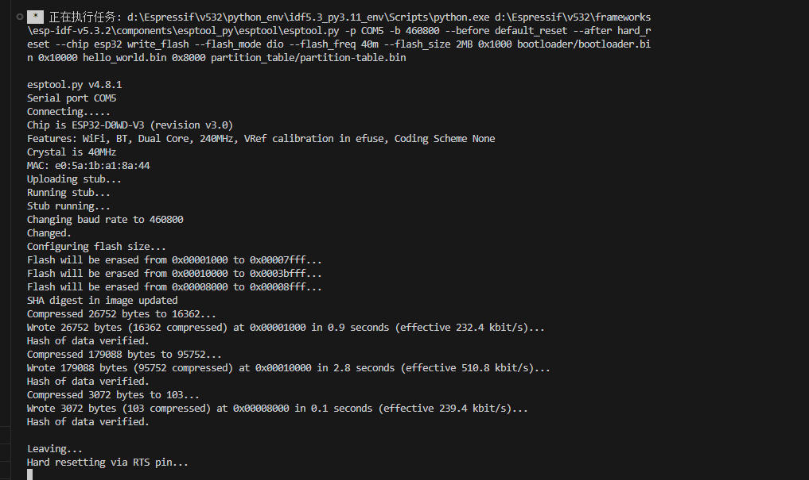

>PS：如果这一步失败，且显示`A fatal error occurred: Timed out waiting for packet header`, 意味着esp32模组（芯片）没有正常进入下载模式,可能是开发板上没有自动下载的电路，需要按住开发板上的BOOT按钮，再按一下复位按钮（一般写Reset或者EN），让ESP32进入下载模式，再点击烧录代码即可。

### 2.4 查看代码运行效果

点击监控设备按钮即可打开串口监视器，查看芯片串口输出（也可以使用其他串口调试工具），但建议使用ESP-IDF自带的这个。

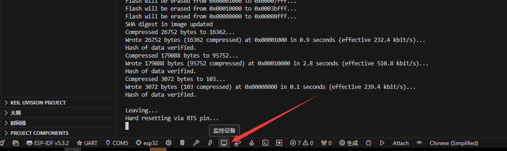

点击后会在终端中打开串口监视器，显示芯片输出。

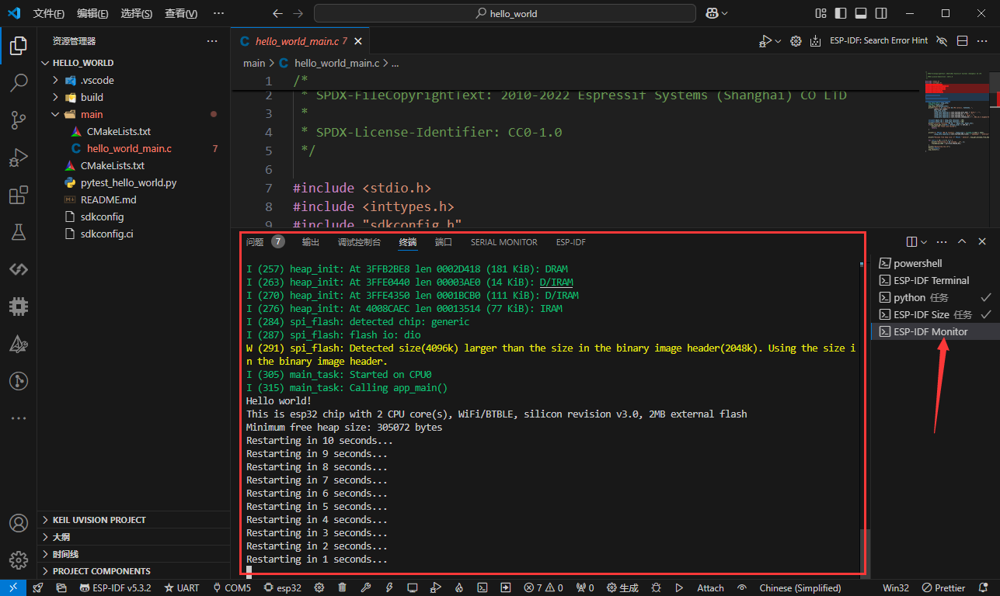

可以看到这个示例程序，先输出 Hello world，然后打印了一些单片机信息，然后进入重启倒计时。

此外，也可以一次性执行所构建、烧录和监视过程，使用火焰按钮一键实现。

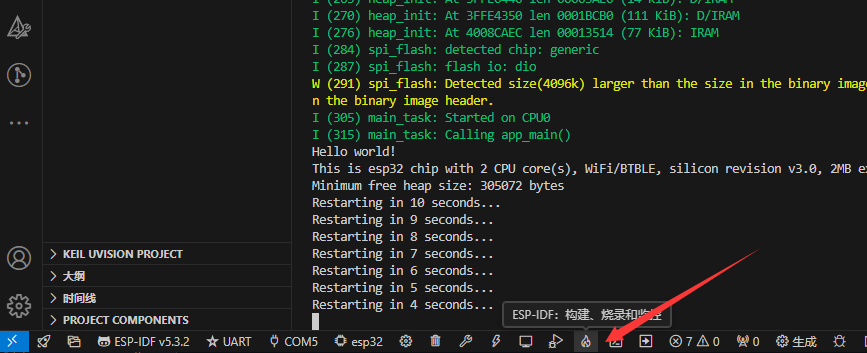

对应，也可以使用命令`idf.py -p /dev/ttyUSB0 flash monitor`，效果相同。

至此我们就借助 Hello world工程，掌握了最基本的ESP32开发流程。第一章认识ESP32到此结束，下一章将进一步熟悉ESP-IDF的架构与开发流程，掌握工程结构和常用开发工具及调试方法，建立高效开发基础。

## 三、其他高级命令

下面列出一些其他高级命令：

| 命令                                      | 描述                                                   |
|-------------------------------------------|--------------------------------------------------------|
| `idf.py size`                             | 显示应用程序的总大小                                     |
| `idf.py size-components`                  | 显示各组件的大小                                         |
| `idf.py size-files`                       | 显示各文件的大小                                         |
| `idf.py reconfigure`                      | 重新配置工程                                             |
| `idf.py python-clean`                     | 清除 Python 字节码                                       |
| `idf.py merge-bin [-o output-file] [-f format] [<format-specific-options>]` | 合并二进制文件，支持指定输出文件和格式选项               |
| `idf.py uf2`                              | 生成 UF2 二进制文件                                      |
| `idf.py read-otadata`                     | 读取 Otadata 分区                                       |

idf.py 还有很多其他有用的命令，只是我们入门阶段可能暂时用不到，更多内容可以参考官方文档：[IDF 前端工具 - idf.py](https://docs.espressif.com/projects/esp-idf/zh_CN/stable/esp32/api-guides/tools/idf-py.html)

