# ESP32项目配置

> [!TIP] 🚀 ESP32 项目配置 | 一步步掌握 Menuconfig 和 Kconfig 文件  
> - 💡 **碎碎念**😎：本节将通过一个具体例子，详细讲解如何使用 `menuconfig` 命令，以及 `Kconfig` 文件在项目配置中的作用，帮助你更好地掌控项目配置。  
> - 📺 **视频教程**：[点击观看](https://www.bilibili.com/video/BV15xwbeiEnD)  
> - 💾 **示例代码**：[ESP32-Guide/code/02.idf_basic/config](https://github.com/DuRuofu/ESP32-Guide/tree/main/code/02.idf_basic/config)  
> - 📚 **官方文档**：[ API 参考 » 项目配置](https://docs.espressif.com/projects/esp-idf/zh_CN/v5.3.2/esp32/api-reference/kconfig.html)

首先我们先借助一个具体的例子来解释Menuconfig命令的使用和Kconfig文件的作用。
## 一、Menuconfig的使用

打开示例工程：`esp-idf/examples/get-started/blink`

这个历程是用来实现LED闪烁的程序，这个工程使用了一个叫`led_strip`的组件，所以代码稍显复杂，但这并不重要，我们的重点不再这里，只要知道这个项目可以点亮开发板上的一颗LED灯即可。

编译代码，烧录，发现并没有LED灯亮起（如果使用本教程推荐的开发板的话）。哈哈，这是由于我们并没有配置LED的引脚，示例程序里指定的LED引脚编号与我们实际开发板的引脚不一致。

那么该如何修改代码里对应控制LED的GPIO引脚号呢，不妨回到代码看看：

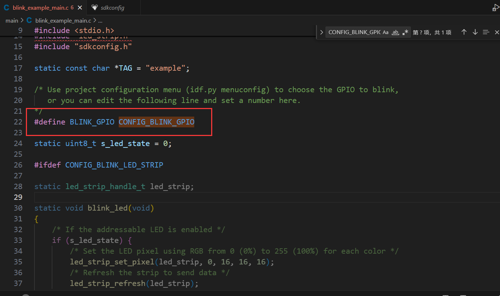

可以看到代码里LED对应的GPIO引脚的编号是由`BLINK_GPIO`这个宏充当的，而`BLINK_GPIO`这个宏又指向`CONFIG_BLINK_GPIO`这个宏，我们当然可以直接把`CONFIG_BLINK_GPIO`替换为我们实际的引脚号，来达到我们要点亮LED灯的目的，但这不是本节教程的主要矛盾。本节的关键是搞明白`CONFIG_BLINK_GPIO`这个宏是哪来的，为什么要用它，怎末用它，怎末修改它的值来点亮LED。

我们右键跳转到`CONFIG_BLINK_GPIO`宏定义的位置，可以发现：

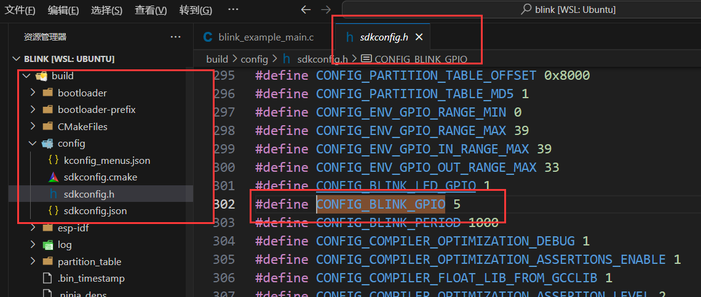

`CONFIG_BLINK_GPIO`宏定义在` sdkconfig.h` 文件里，而` sdkconfig.h` 文件又位于`build`目录下，那我们可以直接修改这里的宏定义值吗，答案是不可以，`build`目录是构建编译项目产生的，每次编译项目里面的文件就会重新生成，修改了也会被覆盖掉。那` sdkconfig.h`里的宏定义又是从何而来的呢？官方文档是这样描述的：

>[文档-->项目配置-->项目配置菜单](https://docs.espressif.com/projects/esp-idf/zh_CN/v5.3.2/esp32/api-reference/kconfig.html#project-configuration-menu)
>借助 `sdkconfig`，应用程序构建目标将在构建目录中生成 `sdkconfig.h` 文件，并使得 `sdkconfig` 选项可用于项目构建系统和源文件。

所以`sdkconfig.h`里的宏定义源自于`sdkconfig`文件，在`sdkconfig`文件中搜索`CONFIG_BLINK_GPIO`宏定义：

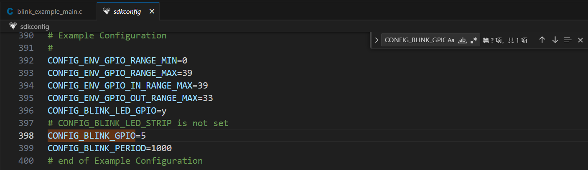

的确可以找到，那么可以通过修改这里的值来修改程序里的引脚定义吗，的确可以，但是不推荐，ESP-IDF框架为我们提供了更加优雅的配置方式，那就是`Menuconfig`配置菜单（终于引入正题）：

下面使用`idf.py  menuconfig `  命令打开 `Menuconfig` (配置菜单)：

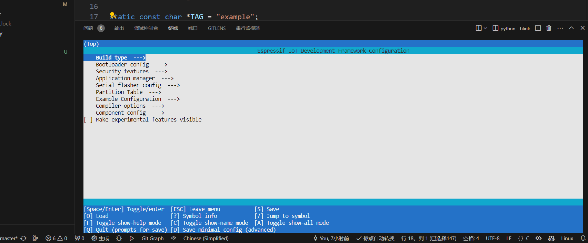

运行命令后，我们得到了一个位于终端的可视化配置菜单。下面显示了很多快捷键，也都有对应的文字说明，我这里就不详细解释了，看不明白文字就按着快捷键试试也就明白了。

这里我们选择 `Example Configuration` 选项：

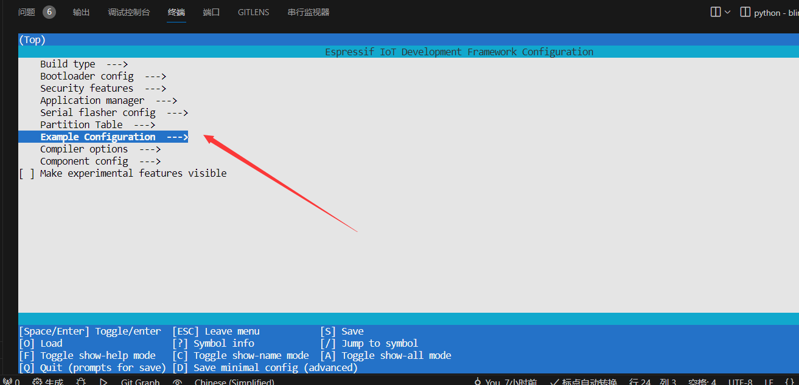

会看到两个选项，修改Blink GPIO为自己开发板上的引脚，我这里是2号。

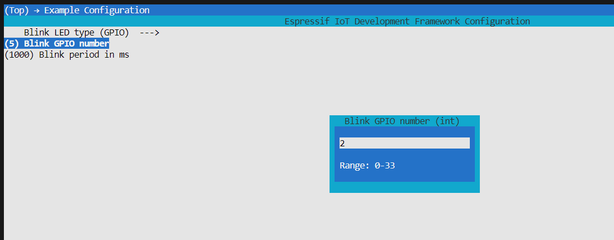

重新编译工程，烧录代码。

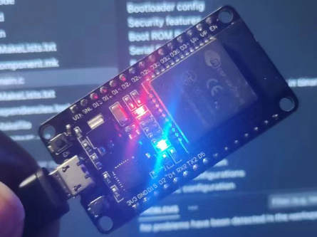

成功点亮LED(😊)，相信通过这一番操作，我们对`menuconfig`有了基本的认识，说人话就是这玩意可以方便的帮助我们修改程序里的参数，在不修改代码的情况下。

-----
补充：如果使用esp-idf插件打开`menuconfig`,只需要点击对应的快捷键（小齿轮）

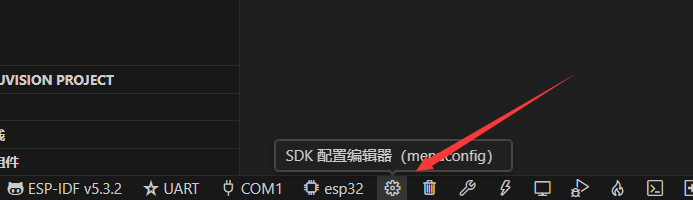

也可以加载出`menuconfig`菜单，如下：

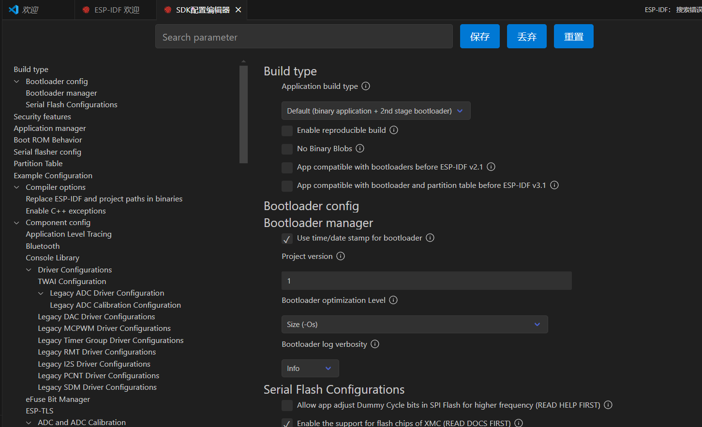


只是形式与命令行略有不同，但配置项内容都是一样的，特在此补充说明。


## 二、组件配置文件

那么我们刚才在`menuconfig`菜单里看到的关于LED配置的内容是那来的呢，通过官方文档，我们可以知道它来源于main组件下的 `Kconfig.projbuild` 文件。

查看main组件文件夹，我们可以发现这个工程里的 `Kconfig.projbuild` 文件：

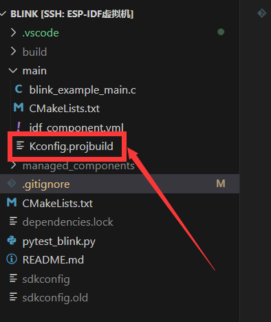


文件内容如下：

```
menu "Example Configuration"

    orsource "$IDF_PATH/examples/common_components/env_caps/$IDF_TARGET/Kconfig.env_caps"

    choice BLINK_LED
        prompt "Blink LED type"
        default BLINK_LED_GPIO
        help
            Select the LED type. A normal level controlled LED or an addressable LED strip.
            The default selection is based on the Espressif DevKit boards.
            You can change the default selection according to your board.

        config BLINK_LED_GPIO
            bool "GPIO"
        config BLINK_LED_STRIP
            bool "LED strip"
    endchoice

    choice BLINK_LED_STRIP_BACKEND
        depends on BLINK_LED_STRIP
        prompt "LED strip backend peripheral"
        default BLINK_LED_STRIP_BACKEND_RMT if SOC_RMT_SUPPORTED
        default BLINK_LED_STRIP_BACKEND_SPI
        help
            Select the backend peripheral to drive the LED strip.

        config BLINK_LED_STRIP_BACKEND_RMT
            depends on SOC_RMT_SUPPORTED
            bool "RMT"
        config BLINK_LED_STRIP_BACKEND_SPI
            bool "SPI"
    endchoice

    config BLINK_GPIO
        int "Blink GPIO number"
        range ENV_GPIO_RANGE_MIN ENV_GPIO_OUT_RANGE_MAX
        default 8
        help
            GPIO number (IOxx) to blink on and off the LED.
            Some GPIOs are used for other purposes (flash connections, etc.) and cannot be used to blink.

    config BLINK_PERIOD
        int "Blink period in ms"
        range 10 3600000
        default 1000
        help
            Define the blinking period in milliseconds.

endmenu
```

不难发现，下面这部分就和我们刚才见到的配置项有关：

``` 
    config BLINK_GPIO
        int "Blink GPIO number"
        range ENV_GPIO_RANGE_MIN ENV_GPIO_OUT_RANGE_MAX
        default 5 if IDF_TARGET_ESP32
        default 18 if IDF_TARGET_ESP32S2
        default 48 if IDF_TARGET_ESP32S3
        default 8
        help
            GPIO number (IOxx) to blink on and off or the RMT signal for the addressable LED.
            Some GPIOs are used for other purposes (flash connections, etc.) and cannot be used to blink.

    config BLINK_PERIOD
        int "Blink period in ms"
        range 10 3600000
        default 1000
        help
            Define the blinking period in milliseconds.

```

即使不了解 Kconfig 的具体语法，我们也能猜出这几行代码干了啥： 定义了两个配置项，`BLINK_GPIO` 和 `BLINK_PERIOD` ,  然后添加默认值，添加说明等,具体每行都是什么意思可以请教强大的AI，AI可以解释的很清楚，我这里就不作解释了。

通过官方文档我们可以知道：

>[文档-->项目配置](https://docs.espressif.com/projects/esp-idf/zh_CN/v5.3.2/esp32/api-reference/kconfig.html#project-configuration-menu)
>ESP-IDF 使用基于 kconfiglib 的 esp-idf-kconfig 包，而 kconfiglib 是 Kconfig 系统的 Python 扩展。Kconfig 提供了编译时的项目配置机制，以及多种类型的配置选项（如整数、字符串和布尔值等）。Kconfig 文件指定了选项之间的依赖关系、默认值、组合方式等。

这里我们只需要知道，这个 `Kconfig.projbuild` 文件就是用于灵活定义项目配置的文件，从官方文档里我们可以得知：这种配置文件会有两种格式。分别是`Kconfig` 和 `Kconfig.projbuild` 文件，他们的区别简单来说就是作用域不同，一个用于定于项目全局配置，一个用于定义组件配置，具体的区别后面会讲，这里就不描述了。

这种`Kconfig`文件并不是ESP32独创的，`Kconfig` 文件的格式和配置模式在多个开源项目中都有使用，ESP32 使用的 `Kconfig` 只是其中的一种实现。在 Linux 内核中，`Kconfig` 用于配置内核选项，帮助开发者根据硬件和需求定制编译选项。

总结一下：ESP32 采用类似的配置方式来简化其开发者在配置固件时的工作。我们通过 `Kconfig`文件，去定义对应的宏，这些宏可以在我们的代码里调用，用于配置参数或者条件编译来启用或禁用各种功能模块，并且可以通过图形界面或命令行去定义修改这些自定义宏的值，避免了复杂的手动修改配置文件。

同时，ESP-IDF默认组件也使用了大量的`Kconfig`配置，通过这些配置，我们可以修改ESP-IDF的很多默认配置项，比如系统分区表、FreeRTOS 配置（任务调度器的行为、栈大小、系统 tick 时间）、驱动程序设置、日志输出级别等。

## 三、为什么要用组件配置（Menuconfig）

1. 组件配置可以将相关配置常量移出代码，增强配置的可复用度。
2. 组件配置生成的宏定义，配合C语言的预处理语句，可以针对不同的配置改变代码解结构。
3. 组件配置变量也可以被CMake访问，可以通过手写逻辑实现根据配置执行不同的构建方案（如某个源文件要不要添加到构建系统）。参考：[预设的组件变量](https://docs.espressif.com/projects/esp-idf/zh_CN/v5.3.2/esp32/api-guides/build-system.html#preset-component-variables)

## 四、创建组件配置


下面我们试着自己写一个组件配置，体验一下全流程，首先复制`blink`历程到自己的目录，重命名为 `blink_menuconfig`

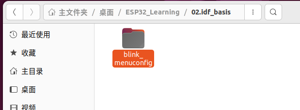

我们删除原有的 `Kconfig.projbuild` 文件，自己重新写一个，原来的`Kconfig.projbuild`里有三个主要的配置项：分别是：

- `BLINK_LED`: 控制LED模式（选项）
- `BLINK_GPIO`：LED连接的引脚
- `BLINK_PERIOD`：LED闪烁的时间

关于`Kconfig`的具体格式要求，这里不展开描述，可以参考文档：[Documentation of esp-idf-kconfig](https://docs.espressif.com/projects/esp-idf-kconfig/en/latest/index.html)
### 创建框架（menu）

我们先创建个框架：

``` Kconfig
menu "点灯配置"

endmenu
```

这里菜单项可以使用中文，打开配置菜单可以看到：

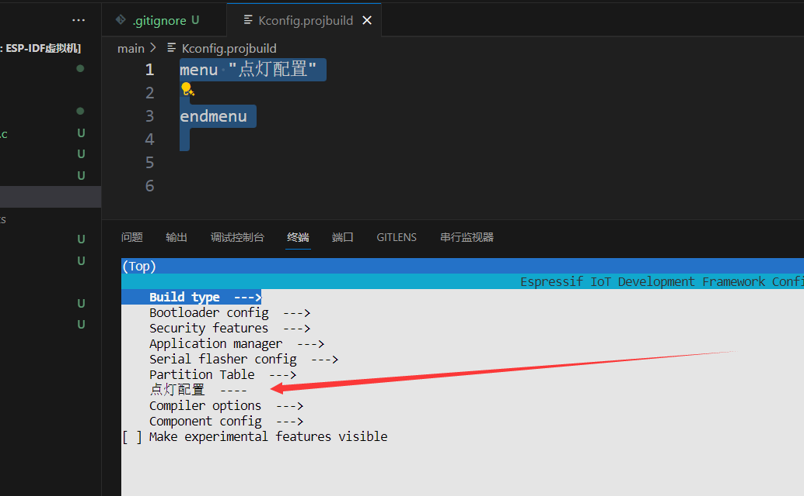

### 创建单选选项（choice）

```
menu "点灯配置"
    choice BLINK_LED
        prompt "LED模式"
        default BLINK_LED_GPIO

        config BLINK_LED_GPIO
            bool "GPIO"
        config BLINK_LED_RMT
            bool "RMT - Addressable LED"
    endchoice
endmenu
```

效果：


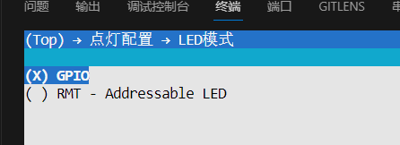
### 创建菜单项目（config）

```
    config BLINK_GPIO
        int "LED引脚"
        default 2
        help
            This is an int BLINK_GPIO.
	
    config BLINK_PERIOD
        int "LED周期"
        default 1000
        help
            This is a int BLINK_GPIO.
```

效果：

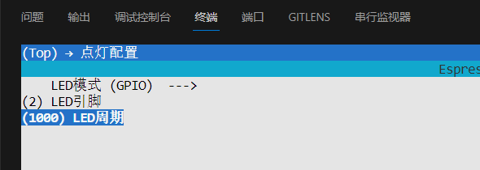

最后我们只需要在对应的c文件里引用`sdkconfig.h`这个头文件，我们就可以使用我们自定义的这些宏，还需要说明的一点是这些宏会被默认加上`CONFIG_`前缀，所以我们定义的`BLINK_GPIO`在实际使用时应该写作：`CONFIG_BLINK_GPIO`

## 五、组件配置相关文件

最后总结一下，并附上一些细碎的知识点，不求大家记住，只要有个印象即可，具体要用到了再回来查。

在 ESP-IDF 构建系统中，有这么几种文件和组件配置相关。它们分别是：

1. Kconfig文件
2. Kconfig.projbuild文件
3. sdkconfig文件
4. sdkconfig.default文件
5. sdkconfig.old文件
6. sdkconfig.ci文件
7. sdkconfig.old文件

其中`Kconfig` 和 `Kconfig.projbuild` 文件用于定义菜单，其余各种`“sdkconfig”`文件用于保存我们配置的值。


先分别概括这几个`“sdkconfig”`文件的作用分别是什么：

| 文件名                                | 位置    | 作用                                                                                           | 概述   |
| ---------------------------------- | ----- | -------------------------------------------------------------------------------------------- | ---- |
| Kconfig                            | 组件目录  | 用于生成 menuconfig 中的组件菜单项                                                                      | 菜单模板 |
| Kconfig.projbuild                  | 组件目录  | 用于生成 menuconfig 中的顶层菜单                                                                       | 菜单模板 |
| sdkconfig                          | 项目根目录 | 用于保存 Kconfig 设置的键值对形式，不建议手动更改                                                                | 保存设置 |
| sdkconfig.default                  | 项目根目录 | 自定义 sdkconfig 的默认值，不会被构建系统更改，格式与 sdkconfig 相同，可以手动创建，也可以使用命令`idf.py save-defconfig`自动生成      | 默认设置 |
| sdkconfig.old                      | 项目根目录 | 当保存旧的 menuconfig 设置时，自动备份原来的 sdkconfig 文件                                                    | 备份   |
| sdkconfig.default. TARGET_NAME<br> | 项目根目录 | 对于 esp32 这个目标芯片，sdkconfig 的默认值会首先  从 sdkconfig.defaults 获取，然后再从 sdkconfig.defaults.esp32 获取。 |      |

关于各种 sdkconfig 的区别和覆盖优先级，可以参考：[文档：自定义 sdkconfig 的默认值](https://docs.espressif.com/projects/esp-idf/zh_CN/v5.3.2/esp32/api-guides/build-system.html#sdkconfig)

最后再讲一下`Kconfig` 和 `Kconfig.projbuild` 文件有什么区别，可以参考官方文档：[KConfig.projbuild](https://docs.espressif.com/projects/esp-idf/zh_CN/v5.3.2/esp32/api-guides/build-system.html?highlight=kconfig%20projbuild#kconfig-projbuild)

## 参考链接

1. https://docs.espressif.com/projects/esp-idf/zh_CN/latest/esp32/api-reference/kconfig.html
2. https://docs.espressif.com/projects/esp-idf/zh_CN/v5.3.2/esp32/api-guides/build-system.html#custom-sdkconfig-defaults