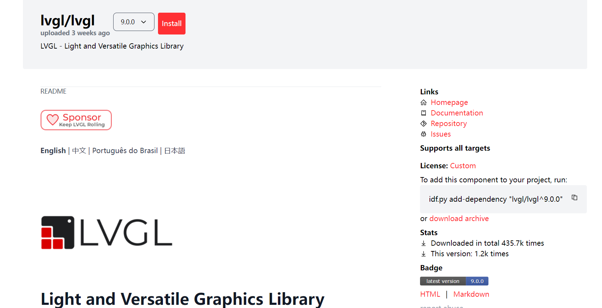
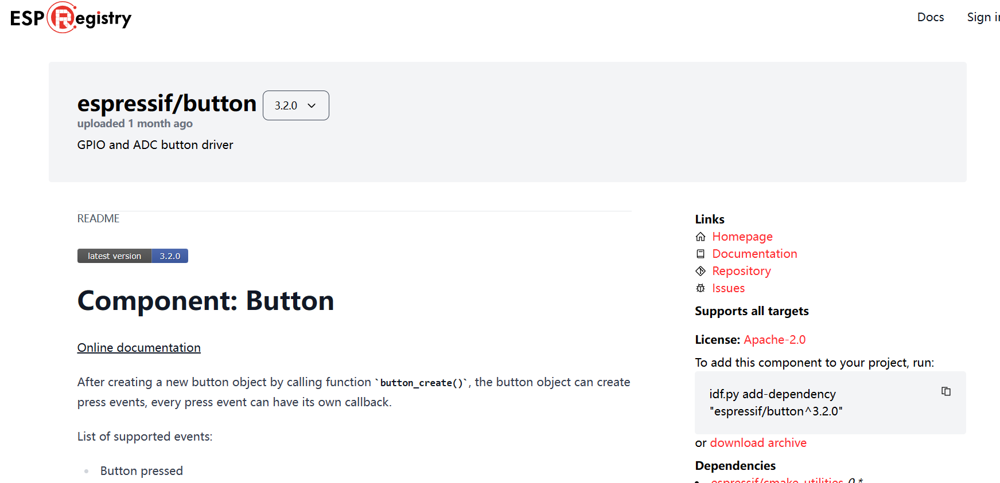
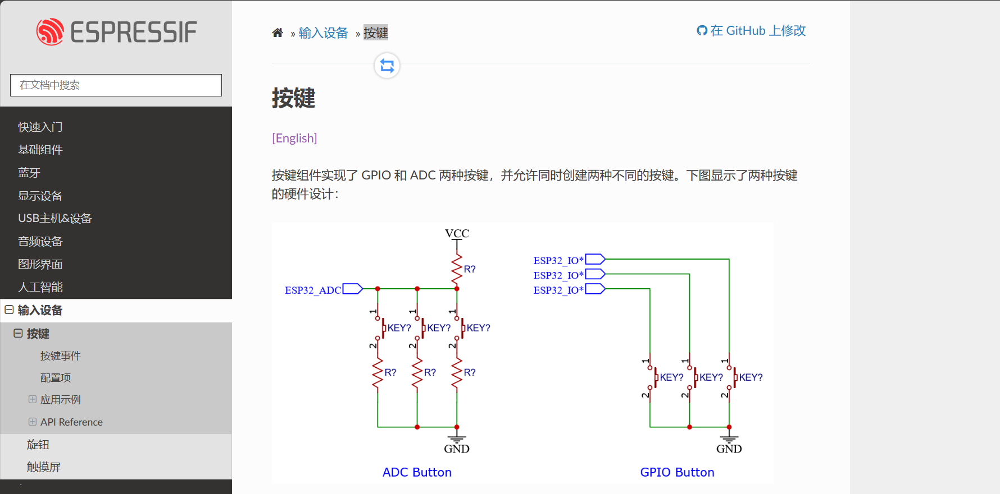
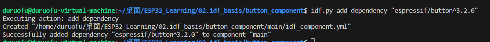
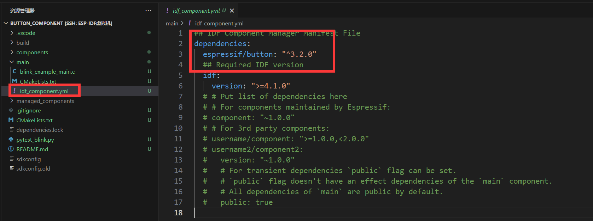
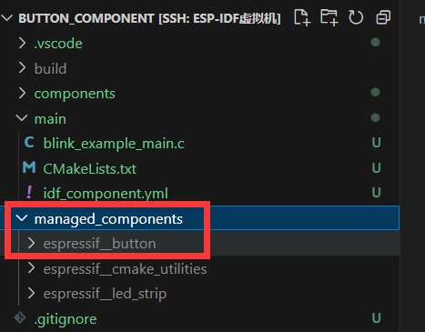

# ESP32组件管理器

> [!TIP] 🚀 **ESP32 组件管理器 | 管理和扩展你的项目组件**  
> - 💡 **碎碎念**😎：本节将带你了解如何使用 ESP32 组件管理器进行项目组件的管理，帮助你更高效地使用和扩展 ESP32 组件。  
> - 📺 **视频教程**：[点击观看](https://www.bilibili.com/video/BV1etfHYgE6M)  
> - 💾 **示例代码**：[ESP32-Guide/code/02.idf_basic/button_blink](https://github.com/DuRuofu/ESP32-Guide/tree/main/code/02.idf_basic/button_blink)  
> - 📚 **官方文档**：[API 指南 » 工具 » IDF 组件管理器](https://docs.espressif.com/projects/esp-idf/zh_CN/stable/esp32/api-guides/tools/idf-component-manager.html)

## 一、啥是组件管理器

ESP-IDF官方对组件管理器的描述是这样的：

> The IDF Component Manager is a tool that allows developers to easily and reliably add components developed by Espressif and the community to the projects developed with the ESP-IDF framework and create their own components for others to use.
>The [ESP Component Registry](https://components.espressif.com/) is a central repository for components that can be used with the ESP-IDF via the IDF Component Manager.
>With the IDF Component Manager, developers can easily install components from the ESP Component Registry, streamlining the process of adding new functionality to their projects.

说人话就是，世上本没有组件管理器，自定义组件多了，就有了组件库，就有了组件管理器。

> 如果用学过node.js，那我们可以把组件管理器比作npm包管理器，把`idf_component.yml`比作`package.js`,真的一模一样。

我们可以在这：[ ESP-IDF components](https://components.espressif.com)  找到乐鑫或者第三方发布的一些他们帮我们写好的”自定义组件“。

使用这些组件我们可以快速的完成一些功能的实现，比如移植还有点难度的LVGL库，现在只要几行命令，加上简单的配置就能移植完成。




## 二、组件管理器使用示例：

下面我们基于[ESP-IDF自定义组件](../2.3-ESP-IDF自定义组件/ESP-IDF自定义组件.md)教程中编写的[blink_component](https://github.com/DuRuofu/ESP32-Guide/tree/main/code/02.idf_basic/03/blink_component)工程来实现使用一下官方的组件管理器，复制工程，重命名为`button_blink`

### 2.1 组件介绍

在这部分，我们学着使用官方提供的组件，这里以[button](https://components.espressif.com/components/espressif/button?language=en)组件为例：



按键组件实现了 GPIO 和 ADC 两种按键，并允许同时创建两种不同的按键。并且提供多种按键事件，包括按下，弹起，按下弹起 1 次，按下弹起 2 次等。

这里是该组件的中文文档：[按键组件使用](https://docs.espressif.com/projects/esp-iot-solution/zh_CN/latest/input_device/button.html)




### 2.2 引入组件

输入命令添加依赖   `idf.py add-dependency "espressif/button^3.2.0"`  ：



添加完成：



main下多出组件依赖文件，里面写上了我们依赖的组件`espressif/button`

编译项目：`idf.py build`

idf会自动下载我们依赖的组件，存放到`managed_components`文件夹中，如下图：



### 2.3 组件的使用

组件的使用各不相同，使用时具体参考对应的组件文档即可:[ESP-IoT-Solution 编程指南](https://docs.espressif.com/projects/esp-iot-solution/zh_CN/latest/index.html)

下面的内容参考文档也能完成，这里不再详细描述：

#### 创建按键

``` c
// create gpio button
button_config_t gpio_btn_cfg = {
    .type = BUTTON_TYPE_GPIO,
    .long_press_time = CONFIG_BUTTON_LONG_PRESS_TIME_MS,
    .short_press_time = CONFIG_BUTTON_SHORT_PRESS_TIME_MS,
    .gpio_button_config = {
        .gpio_num = 0,
        .active_level = 0,
    },
};
button_handle_t gpio_btn = iot_button_create(&gpio_btn_cfg);
if(NULL == gpio_btn) {
    ESP_LOGE(TAG, "Button create failed");
}

```

详解：

1. `button_config_t gpio_btn_cfg`：定义了一个名为 `gpio_btn_cfg` 的结构体变量，用于配置按钮的参数。
2. `.type = BUTTON_TYPE_GPIO`：指定按钮的类型为 GPIO 类型，表示这是一个基于 GPIO 的按钮。
3. `.long_press_ticks = CONFIG_BUTTON_LONG_PRESS_TIME_MS`：设置长按触发的时间阈值，单位为毫秒。
4. `.short_press_ticks = CONFIG_BUTTON_SHORT_PRESS_TIME_MS`：设置短按触发的时间阈值，单位为毫秒。
5. `.gpio_button_config`：GPIO 按钮的具体配置信息。
    - `.gpio_num = 0`：指定了 GPIO 编号为 0，即对应 ESP32 开发板上的某个 GPIO 引脚。
    - `.active_level = 0`：指定了按钮的触发电平为低电平（0），即当 GPIO 引脚为低电平时被认为按钮被按下。
6. `button_handle_t gpio_btn = iot_button_create(&gpio_btn_cfg)`：调用 `iot_button_create` 函数创建一个按钮实例，并将配置信息传递给该函数，返回一个按钮句柄 `gpio_btn`。
7. `if(NULL == gpio_btn)`：检查按钮实例是否成功创建。
    - 如果 `gpio_btn` 为 `NULL`，则打印错误日志，提示按钮创建失败。
      
 
#### 注册回调函数

Button 组件支持为多个事件注册回调函数，每个事件都可以注册一个回调函数，当事件发生时，回调函数将会被调用。

``` c
static void button_single_click_cb(void *arg,void *usr_data)
{
    ESP_LOGI(TAG, "BUTTON_SINGLE_CLICK");
}

iot_button_register_cb(gpio_btn, BUTTON_SINGLE_CLICK, button_single_click_cb,NULL);

```

详解：
1. `static void button_single_click_cb(void *arg, void *usr_data)`：定义了一个静态的回调函数 `button_single_click_cb`，该函数在按钮单击事件发生时被调用。函数接受两个参数，一个是 `arg`，用于传递按钮相关的参数，另一个是 `usr_data`，用于传递用户数据。
    
2. `iot_button_register_cb(gpio_btn, BUTTON_SINGLE_CLICK, button_single_click_cb, NULL)`：调用 `iot_button_register_cb` 函数注册了一个按钮单击事件的回调函数。
    - `gpio_btn`：表示要注册回调函数的按钮实例。
    - `BUTTON_SINGLE_CLICK`：指定注册的是单击事件的回调函数。
    - `button_single_click_cb`：指定要注册的回调函数，即单击事件发生时调用的函数。
    - `NULL`：表示没有用户数据需要传递给回调函数。


结合上一篇教程的LED闪烁的代码，最终代码如下：`blink_example_main.c`

``` c
#include <stdio.h>
#include "freertos/FreeRTOS.h"
#include "freertos/task.h"
#include "esp_log.h"
#include "led_blink.h"
#include "iot_button.h"


static const char *TAG = "example";
uint8_t s_led_state = 0;


// 按键回调函数(单击,led灯状态取反)
static void button_single_click_cb(void *arg,void *usr_data)
{
    ESP_LOGI(TAG, "BUTTON_SINGLE_CLICK");
    ESP_LOGI(TAG, "Turning the LED %s!", s_led_state == true ? "ON" : "OFF");
    s_led_state = !s_led_state;
    blink_led(s_led_state);
}


void app_main(void)
{
    /* Configure the peripheral according to the LED type */
    configure_led();
    // create gpio button
    button_config_t gpio_btn_cfg = {
        .type = BUTTON_TYPE_GPIO,
        .long_press_time = CONFIG_BUTTON_LONG_PRESS_TIME_MS,
        .short_press_time = CONFIG_BUTTON_SHORT_PRESS_TIME_MS,
        .gpio_button_config = {
            .gpio_num = 0,
            .active_level = 0,
        },
    };

    button_handle_t gpio_btn = iot_button_create(&gpio_btn_cfg);
    if(NULL == gpio_btn) {
        ESP_LOGE(TAG, "Button create failed");
    }

    // 注册按键回调
    iot_button_register_cb(gpio_btn, BUTTON_SINGLE_CLICK, button_single_click_cb,NULL);

    while (1) {
        vTaskDelay(CONFIG_BLINK_PERIOD / portTICK_PERIOD_MS);
    }
}


```

实现的效果为：单击开发板上的按键，可以控制LED翻转。

以上就是ESP32组件管理器及第三方组件的使用。
## 参考链接

1. https://docs.espressif.com/projects/esp-idf/zh_CN/latest/esp32/api-guides/tools/idf-component-manager.html
2. https://components.espressif.com/components/espressif/button/versions/3.5.0?language=en