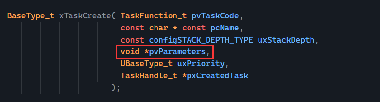
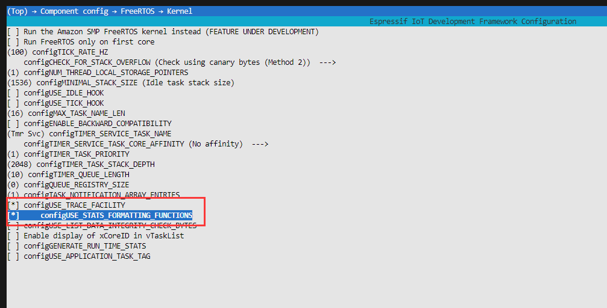
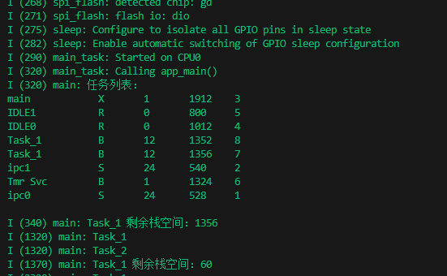

# FreeRTOS多任务管理

> [!TIP] 🚀 FreeRTOS 多任务管理 | 实现任务并行处理
> - 💡 **碎碎念**😎：本节将介绍如何在 FreeRTOS 中实现多任务管理，帮助你更高效地进行任务调度和并行处理。  
> - 📺 **视频教程**：🚧 *开发中*  
> - 💾 **示例代码**：[ESP32-Guide/code/03.freertos_basic/task](https://github.com/DuRuofu/ESP32-Guide/tree/main/code/03.freertos_basic/task)


注意：与原生 FreeRTOS 不同，在 ESP-IDF 中使用 FreeRTOS 的用户 \永远不应调用 `vTaskStartScheduler()` 和 `vTaskEndScheduler()`。相反，ESP-IDF 会自动启动 FreeRTOS。用户必须定义一个 `void app_main(void)` 函数作为用户应用程序的入口点，并在 ESP-IDF 启动时被自动调用。

通常，用户会从 `app_main` 中启动应用程序的其他任务。`app_main` 函数可以在任何时候返回（应用终止前）。`app_main` 函数由 main 任务调用。

## 一、FreeRTOS创建任务

### 1.1 API说明：

创建任务涉及三个API：

| 函数名                           | 功能             | 动态/静态 | 备注  |
| ----------------------------- | -------------- | ----- | --- |
| `xTaskCreate`                 | 动态创建任务         | 动态    |     |
| `xTaskCreateStatic`           | 静态创建任务         | 静态    |     |
| `xTaskCreateRestrictedStatic` | 静态创建受限任务（权限控制） | 静态    | 很少用 |
下面是对各个API的详细解释：
#### 1. xTaskCreate : 动态创建一个任务

当需要在运行时动态分配内存来创建任务时使用，也就是一般的正常情况。

原型：

```c
static inline BaseType_t xTaskCreate(TaskFunction_t pxTaskCode, 
									 const char *const pcName, 
									 const configSTACK_DEPTH_TYPE usStackDepth, 
									 void *const pvParameters, 
									 UBaseType_t uxPriority, 
									 TaskHandle_t *const pxCreatedTask)
```

创建一个新任务并将其添加到准备运行的任务列表中。在 FreeRTOS 实现中，任务使用两块内存。第一个块用于保存任务的数据结构。任务使用第二个块作为其堆栈。如果使用 xTaskCreate () 创建任务，那么这两个内存块将在 xTaskCreate () 函数中自动分配。

参数：

- `pxTaskCode`：指向任务入口函数的指针，任务必须设计为永不返回（即以无限循环形式实现）。
- `pcName`：任务的描述性名称，主要用于调试方便，最大长度由 `configMAX_TASK_NAME_LEN` 定义（默认 16）。
- `usStackDepth`：任务栈大小（以字节为单位）。注意，这与原生 FreeRTOS 的默认单位不同。
- `pvParameters`：传递给任务函数的参数指针（类型为void指针）。
- `uxPriority`：任务的优先级（数字越大优先级越高,最低为1）。支持 MPU 的系统中，通过设置 `portPRIVILEGE_BIT` 位可创建特权任务（例如 `(2 | portPRIVILEGE_BIT)` 表示优先级为 2 的特权任务）。
- `pxCreatedTask`：用于存储任务句柄（可选），通过句柄可以引用创建的任务。

返回值:

- `pdPASS`：任务创建成功。
- `errCOULD_NOT_ALLOCATE_REQUIRED_MEMORY`：任务创建失败（内存不足）

#### 2. xTaskCreateStatic：静态创建一个任务

手动提供任务栈和任务控制块（TCB），避免动态内存分配。

**原型：**

``` c
TaskHandle_t xTaskCreateStatic(
    TaskFunction_t pvTaskCode,
    const char * const pcName,
    const uint32_t ulStackDepth,
    void * const pvParameters,
    UBaseType_t uxPriority,
    StackType_t * const puxStackBuffer,
    StaticTask_t * const pxTaskBuffer
);
```

**参数：**

- `pvTaskCode`：任务函数的入口地址。
- `pcName`：任务名称（用于调试）。
- `usStackDepth`：任务栈大小（以字为单位）。
- `pvParameters`：传递给任务函数的参数。
- `uxPriority`：任务的优先级。
- `puxStackBuffer`：指向任务栈缓冲区的指针（由用户提供）。
- `pxTaskBuffer`：指向任务控制块的缓冲区（由用户提供）。

**返回值:**

- `pdPASS`：任务创建成功。
- `errCOULD_NOT_ALLOCATE_REQUIRED_MEMORY`：任务创建失败（内存不足）

#### 3. xTaskCreateRestrictedStatic：为受限任务（restricted task）创建任务

用于创建特定权限的任务，一般用于内存保护单元（MPU）配置中，限制任务的访问权限。

原型：

``` c
TaskHandle_t xTaskCreateRestrictedStatic(
    const TaskParameters_t * const pxTaskDefinition,
    StackType_t * const puxStackBuffer,
    StaticTask_t * const pxTaskBuffer
);
```

参数说明：

- `pxTaskDefinition`：任务参数定义结构（包含任务入口、名称、栈大小、优先级等）。
- `puxStackBuffer`：栈的静态缓冲区。
- `pxTaskBuffer`：任务控制块的静态缓冲区。

返回值：任务句柄。

### 1.2 创建任务示例代码：

``` c
#include <stdio.h>
#include "esp_log.h"
#include "freertos/FreeRTOS.h"
#include "freertos/task.h"

static const char *TAG = "main";

// 任务函数
void myTask(void *pvParameters)
{
	for (;;)
	{
		vTaskDelay(1000 / portTICK_PERIOD_MS);
		ESP_LOGI(TAG, "myTask");
	}
}

void app_main(void)
{
	// 创建一个 FreeRTOS 任务
	// 参数说明：
	// 1. 任务入口函数：myTask
	// 2. 任务名称："myTask"，用于调试时标识任务
	// 3. 任务堆栈大小：2048 字节（适当分配以避免栈溢出）
	// 4. 任务参数：NULL（未传递参数）
	// 5. 任务优先级：1（优先级较低，空闲任务优先级为 0）
	// 6. 任务句柄：NULL（不需要保存任务句柄）
	xTaskCreate(myTask, "myTask", 2048, NULL, 1, NULL);
}
```


## 二、[FreeRTOS删除任务](https://www.freertos.org/zh-cn-cmn-s/Documentation/02-Kernel/04-API-references/01-Task-creation/00-TaskHandle)

###  2.1 API说明：

删除任务涉及一个API：

| 函数名           | 功能   | 动态/静态 | 备注               |
| ------------- | ---- | ----- | ---------------- |
| `vTaskDelete` | 删除任务 | 动态/静态 | 可以删除别的任务，也可以自我删除 |
下面是对各个API的详细解释：
#### 1. vTaskDelete：删除一个任务

当任务完成其功能后，需要释放资源，或当系统需要动态调整任务时使用
注意：调用后，任务进入删除 状态，但动态分配的内存需要由 FreeRTOS 自动释放。

**原型：**

```c
void vTaskDelete( TaskHandle_t xTask );
```

**参数说明：**

- xTask：要删除的任务句柄。如果传递 NULL，则删除当前任务。

### 2.2 示例代码：

#### 1. 删除别人

```c
#include <stdio.h>
#include "esp_log.h"
#include "freertos/FreeRTOS.h"
#include "freertos/task.h"

static const char *TAG = "main";

// 任务函数
void myTask(void *pvParameters)
{
    for (;;)
    {
        vTaskDelay(500 / portTICK_PERIOD_MS);
        ESP_LOGI(TAG, "myTask");
    }
}

void app_main(void)
{
    // 任务句柄
    TaskHandle_t taskHandle = NULL;
    // 创建一个 FreeRTOS 任务
    xTaskCreate(myTask, "myTask", 2048, NULL, 1, &taskHandle);

    vTaskDelay(2000 / portTICK_PERIOD_MS);

    // 删除任务
    if (taskHandle != NULL)
    {
        vTaskDelete(taskHandle);
    }
}

```

#### 2. 自我删除

```c
#include <stdio.h>
#include "esp_log.h"
#include "freertos/FreeRTOS.h"
#include "freertos/task.h"

static const char *TAG = "main";

// 任务函数
void myTask(void *pvParameters)
{
    vTaskDelay(1000 / portTICK_PERIOD_MS);
    ESP_LOGI(TAG, "myTask:1");
    vTaskDelay(1000 / portTICK_PERIOD_MS);
    ESP_LOGI(TAG, "myTask:2");
    vTaskDelay(1000 / portTICK_PERIOD_MS);
    ESP_LOGI(TAG, "myTask:3");

    // 删除任务(如果传递 NULL，则删除当前任务)
    vTaskDelete(NULL);
}

void app_main(void)
{
    // 任务句柄
    TaskHandle_t taskHandle = NULL;
    // 创建一个 FreeRTOS 任务
    xTaskCreate(myTask, "myTask", 2048, NULL, 1, &taskHandle);
}

```


## 三、任务创建时传递参数

### 2.1 说明：

在 FreeRTOS 中，任务函数的参数通过创建任务时的 pvParameters 指针传递。pvParameters 是一个 void * 类型的指针，可以传递任意类型的数据（整型、数组、结构体或字符串等）。任务接收到参数后，需要将其强制类型转换为对应的数据类型，以便正确使用。


### 2.3.2 示例：

示例为传递四种参数，分别是整型参数，数组参数，结构体参数，字符串参数

```c
#include <stdio.h>
#include "esp_log.h"
#include "freertos/FreeRTOS.h"
#include "freertos/task.h"

static const char *TAG = "main";

typedef struct
{
    int Int;
    int Array[3];
} MyStruct;

// 任务函数1:接收整型参数
void Task_1(void *pvParameters)
{
    int *pInt = (int *)pvParameters;
    ESP_LOGI(TAG, "取得整型参数为：%d", *pInt);
    vTaskDelete(NULL);
}

// 任务函数2:接收数组参数
void Task_2(void *pvParameters)
{
    int *pArray = (int *)pvParameters;
    ESP_LOGI(TAG, "取得数组参数为：%d %d %d", *pArray, *(pArray + 1), *(pArray + 2));
    vTaskDelete(NULL);
}

// 任务函数3:接收结构体参数
void Task_3(void *pvParameters)
{
    MyStruct *pStruct = (MyStruct *)pvParameters;
    ESP_LOGI(TAG, "取得结构体参数为：%d %d %d %d", pStruct->Int, pStruct->Array[0], pStruct->Array[1], pStruct->Array[2]);
    vTaskDelete(NULL);
}

// 任务函数4:接收字符串参数
void Task_4(void *pvParameters)
{
    char *pChar = (char *)pvParameters;
    ESP_LOGI(TAG, "取得字符串参数为：%s", pChar);
    vTaskDelete(NULL);
}

int Parameters_1 = 1;
int Parameters_2[3] = {1, 2, 3};
MyStruct Parameters_3 = {1, {1, 2, 3}};
static const char *Parameters_4 = "Hello World!";

void app_main(void)
{
    // 传递整形参数
    xTaskCreate(Task_1, "Task_1", 2048, (void *)&Parameters_1, 1, NULL);

    // 传递数组参数
    xTaskCreate(Task_2, "Task_2", 2048, (void *)&Parameters_2, 1, NULL);

    // 传递结构体参数
    xTaskCreate(Task_3, "Task_3", 3048, (void *)&Parameters_3, 1, NULL);

    // 传递字符串参数(注意这里没有取地址符号&)
    xTaskCreate(Task_4, "Task_4", 3048, (void *)Parameters_4, 1, NULL);
}
```


## 四、FreeRTOS任务优先级

FreeRTOS 中每个任务都有一个优先级，优先级决定了任务的执行顺序。优先级数值较大的任务具有更高的优先级，会在低优先级任务之前被调度执行。当多个任务具有相同优先级时，调度器会使用时间片轮转机制在这些任务之间分配 CPU 时间。

关于任务优先级可参考文档：[任务优先级](https://www.freertos.org/zh-cn-cmn-s/Documentation/02-Kernel/02-Kernel-features/01-Tasks-and-co-routines/03-Task-priorities)，文档中提到：

>每个任务均被分配了从 0 到 ( configMAX_PRIORITIES - 1 ) 的优先级，其中 configMAX_PRIORITIES 定义为 FreeRTOSConfig.h。

在ESP-IDF中configMAX_PRIORITIES的值为25，所以任务优先级为0-24.

如果我们创建任务时设定优先级为25

```c
xTaskCreate(Task_1, "Task_1", 2048, NULL, 25, &taskHandle);
```

IDF会产生报错如下：


### 4.1 API说明：

任务优先级涉及以下两个API：

| 函数名                 | 功能         | 备注         |
| ------------------- | ---------- | ---------- |
| `uxTaskPriorityGet` | 获取任务的当前优先级 | 返回任务的优先级   |
| `vTaskPrioritySet`  | 设置任务的优先级   | 设置指定任务的优先级 |

#### 1. uxTaskPriorityGet：获取任务的优先级

该函数用于获取指定任务的当前优先级。如果任务句柄为 `NULL`，则返回当前任务的优先级。
**原型：**

```c
UBaseType_t uxTaskPriorityGet( TaskHandle_t xTask );
```

**参数说明：**
- xTask：任务句柄。如果为 NULL，则返回当前任务的优先级。

**返回值**：任务的优先级。

#### 2. vTaskPrioritySet：设置任务的优先级

该函数用于设置指定任务的优先级。如果任务句柄为 NULL，则设置当前任务的优先级.

**原型：**

```c
void vTaskPrioritySet( TaskHandle_t xTask, UBaseType_t uxPriority );
```

**参数说明：**

- xTask：任务句柄。如果为 NULL，则设置当前任务的优先级。
- uxPriority：要设置的优先级值。

### 4.2 示例代码

```c
void app_main(void)
{
    UBaseType_t taskPriority_1 = 0;
    UBaseType_t taskPriority_2 = 0;
    TaskHandle_t taskHandle_1 = NULL;
    TaskHandle_t taskHandle_2 = NULL;
    
    xTaskCreate(Task_1, "Task_1", 2048, NULL, 12, &taskHandle_1);
    taskPriority_1 = uxTaskPriorityGet(taskHandle_1);
    ESP_LOGI(TAG, "Task_1 优先级：%d", taskPriority_1);

    xTaskCreate(Task_2, "Task_1", 2048, NULL, 12, &taskHandle_2);
    taskPriority_2 = uxTaskPriorityGet(taskHandle_2);
    ESP_LOGI(TAG, "Task_1 优先级：%d", taskPriority_2);
}
```

## 五、FreeRTOS任务挂起

FreeRTOS 任务挂起是指暂停任务的执行，直到通过显式恢复操作再次启动任务。挂起操作不会影响任务所占用的资源，仅是暂停任务调度。


任务可以存在于以下状态中：

- **运行**
  当任务实际执行时，它被称为处于运行状态。任务当前正在使用处理器。 如果运行 RTOS 的处理器只有一个内核， 那么在任何给定时间内都只能有一个任务处于运行状态。
- **准备就绪**
  准备就绪任务指那些能够执行（它们不处于阻塞或挂起状态）， 但目前没有执行的任务， 因为同等或更高优先级的不同任务已经处于运行状态。
- **阻塞**
  如果任务当前正在等待时间或外部事件，则该任务被认为处于阻塞状态。 例如，如果一个任务调用vTaskDelay()，它将被阻塞（被置于阻塞状态）， 直到延迟结束——一个时间事件。 任务也可以通过阻塞来等待队列、信号量、事件组、通知或信号量 事件。处于阻塞状态的任务通常有一个"超时"期， 超时后任务将被超时，并被解除阻塞， 即使该任务所等待的事件没有发生。“阻塞”状态下的任务不使用任何处理时间，不能 被选择进入运行状态。
- **挂起**
  与“阻塞”状态下的任务一样， “挂起”状态下的任务不能 被选择进入运行状态，但处于挂起状态的任务 没有超时。相反，任务只有在分别通过 vTaskSuspend() 和 xTaskResume() API 调用明确命令时 才会进入或退出挂起状态。

### 5.1 API说明：

任务挂起涉及以下两个API：

| 函数名            | 功能   | 备注        |
| -------------- | ---- | --------- |
| `vTaskSuspend` | 挂起任务 | 将指定任务挂起   |
| `xTaskResume`  | 恢复任务 | 恢复指定任务的执行 |

#### 1. vTaskSuspend：挂起任务

`vTaskSuspend()` 用于挂起指定任务，任务被挂起后无法再执行，直到通过 `xTaskResume()` 恢复任务。

**原型：**

```c
void vTaskSuspend(TaskHandle_t xTask);
```

**参数说明：**

- xTask：要挂起的任务句柄。如果传递 NULL，则挂起当前任务。

#### 2. xTaskResume：恢复任务

用于恢复一个挂起的任务。恢复任务后，任务重新进入准备就绪状态，等待调度器调度。

**原型：**

```c
BaseType_t xTaskResume(TaskHandle_t xTask);
```

**参数说明：**
- xTask：要恢复的任务句柄。如果传递 NULL，则恢复当前任务。

### 2.5.2 示例代码：

```c
#include <stdio.h>
#include "freertos/FreeRTOS.h"
#include "freertos/task.h"
#include "esp_log.h"

static const char *TAG = "main";

TaskHandle_t taskHandle_1 = NULL;

// 任务1：定时打印日志
void Task_1(void *pvParameters)
{
    while (1)
    {
        ESP_LOGI(TAG, "任务1正在运行...");
        vTaskDelay(pdMS_TO_TICKS(1000)); // 延迟1秒
    }
}

// 任务2：控制任务1的挂起与恢复
void Task_2(void *pvParameters)
{
    while (1)
    {
        ESP_LOGI(TAG, "挂起任务1...");
        vTaskSuspend(taskHandle_1); // 挂起任务1
        vTaskDelay(pdMS_TO_TICKS(5000)); // 延迟5秒

        ESP_LOGI(TAG, "恢复任务1...");
        vTaskResume(taskHandle_1); // 恢复任务1
        vTaskDelay(pdMS_TO_TICKS(5000)); // 再延迟5秒
    }
}

void app_main(void)
{
    // 创建任务1
    xTaskCreate(Task_1, "Task_1", 2048, NULL, 5, &taskHandle_1);
    // 创建任务2
    xTaskCreate(Task_2, "Task_2", 2048, NULL, 5, NULL);
}
```

## 六、 系统任务信息显示

FreeRTOS 提供了多种方法来显示和分析任务信息，帮助开发者了解系统运行状况、优化性能以及定位问题。

系统任务信息显示主要有以下两个API：

| 函数名                           | 功能          | 备注        |
| ----------------------------- | ----------- | --------- |
| `vTaskList`                   | 输出任务列表      | 需开启配置才能使用 |
| `uxTaskGetStackHighWaterMark` | 获取任务最小剩余栈空间 | 需开启配置才能使用 |

### 6.1 API介绍
#### 2. vTaskList: 输出任务列表

可通过 `vTaskList()` 来协助分析操作系统当前 task 状态，以帮助优化内存，帮助定位栈溢出问题，帮助理解和学习操作系统原理相关知识。

**原型：**
```c
void vTaskList( char *pcWriteBuffer );
```

**注意：**`configUSE_TRACE_FACILITY`和`configUSE_STATS_FORMATTING_FUNCTIONS`必须在 FreeRTOSConfig.h 中定义为 1，才可使用此函数。 
对于ESP32来说。使用 vTaskList() 前需使能:

menuconfig -> Component config -> FreeRTOS -> Kernel->`configUSE_TRACE_FACILITY`
menuconfig -> Component config -> FreeRTOS -> Kernel->`configUSE_STATS_FORMATTING_FUNCTIONS`

如下图：




#### 2. uxTaskGetStackHighWaterMark:获取任务最小剩余栈空间

用于获取任务在运行期间的最小剩余栈空间（即栈的高水位标记）。此函数可帮助检测任务是否存在栈溢出的风险。

**原型**：

```c
UBaseType_t uxTaskGetStackHighWaterMark( TaskHandle_t xTask );
```

**参数：**

- xTask：任务句柄。如果传递 NULL，则返回当前任务的栈高水位标记。

**返回值：** 剩余栈空间的字数（单位为字）,(但是在ESP-IDF里为字节)
### 示例：

```c
#include <stdio.h>
#include "esp_log.h"
#include "freertos/FreeRTOS.h"
#include "freertos/task.h"

static const char *TAG = "main";

void Task_1(void *pvParameters)
{
    for (;;)
    {
        vTaskDelay(1000 / portTICK_PERIOD_MS);
        ESP_LOGI(TAG, "Task_1");
    }
    vTaskDelete(NULL);
}

void Task_2(void *pvParameters)
{
    for (;;)
    {
        vTaskDelay(1000 / portTICK_PERIOD_MS);
        ESP_LOGI(TAG, "Task_2");
    }
    vTaskDelete(NULL);
}

void app_main(void)
{
    TaskHandle_t taskHandle_1 = NULL;
    TaskHandle_t taskHandle_2 = NULL;
    
    xTaskCreate(Task_1, "Task_1", 2048, NULL, 12, &taskHandle_1);
    xTaskCreate(Task_2, "Task_1", 2048, NULL, 12, &taskHandle_2);

    
    // 输出任务列表
    static char cBuffer[512]={0};
    vTaskList(cBuffer);
    ESP_LOGI(TAG, "任务列表：\n%s", cBuffer);

    while (1)
    {
        int istack = uxTaskGetStackHighWaterMark(taskHandle_1);
        ESP_LOGI(TAG, "Task_1 剩余栈空间：%d", istack);
        vTaskDelay(1000 / portTICK_PERIOD_MS);
    }
}

```

效果：




# 参考链接

1. https://www.freertos.org/zh-cn-cmn-s
2. https://www.bilibili.com/video/BV1fs4y1G7eu/?spm_id_from=333.999.top_right_bar_window_history.content.click&vd_source=ef5a0ab0106372751602034cdd9ab98e


