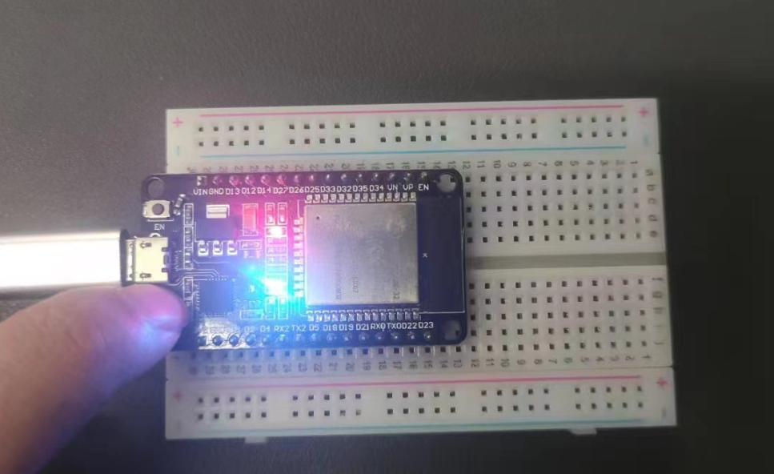

# ESP32外设-GPIO

> [!NOTE]
> 对应视频教程：暂无 <br>
> 对应示例代码：暂无

## 一、GPIO介绍

"通用 IO"或"GPIO"是英文"General-Purpose Input/Output Port"的简写，意为通用输入/输出接 口。当设置为输入模式时，它可以用于感知外部信号；而设置为输出模式时，则可以用于控制 外部设备。在开发过程中，我们经常使用一些简单的外部模块，如 LED、按键和蜂鸣器等。要 使用这些模块，只需将它们与芯片的 GPIO 连接，然后通过控制 GPIO 的输出/读取高低电平即可。

ESP32 芯片具有 34 个物理 GPIO 管脚（GPIO0 ~ GPIO19、GPIO21 ~ GPIO23、GPIO25 ~ GPIO27 和 GPIO32 ~ GPIO39）。每个管脚都可用作一个通用 IO，或连接一个内部的外设信号。通过 IO MUX、RTC IO MUX 和 GPIO 交换矩阵，可配置外设模块的输入信号来源于任何的 IO 管脚，并且外设模块的输出信号也可连接到任意 IO 管脚。这些模块共同组成了芯片的 IO 控制。

## 二、相关函数介绍

> 具体参考：[GPIO & RTC GPIO](https://docs.espressif.com/projects/esp-idf/zh_CN/latest/esp32/api-reference/peripherals/gpio.html)

#### gpio_config 函数:

`esp_err_t gpio_config(const gpio_config_t *pGPIOConfig)`

该函数用来配置指定管脚的实时配置状态，包括上下拉、输入输出使能、管脚映射等

`gpio_config_t`  简介:

| 成员           | 类型              | 意义                           |
| ------------ | --------------- | ---------------------------- |
| pin_bit_mask | uint64_t        | GPIO pin：使用位掩码设置，每个位对应一个GPIO |
| mode         | gpio_mode_t     | GPIO模式：设置输入/输出模式             |
| pull_up_en   | gpio_pullup_t   | GPIO上拉：表示是否启用内部上拉电阻          |
| pull_down_en | gpio_pulldown_t | GPIO下拉：表示是否启用内部下拉电阻          |
| intr_type    | gpio_int_type_t | GPIO中断类型                     |

#### gpio_set_level 函数

`esp_err_t gpio_set_level(gpio_num_t gpio_num, uint32_t level)`

该函数用来设置 gpiod 电平状态。

#### gpio_get_level 函数

`int gpio_get_level(gpio_num_t gpio_num); `

gpio_num 用来指向获取那个 IO 的电平，该函数的返回值就是指定 IO 的电平状态 0 或 1


## 二、GPIO输出/输入配置


引用头文件：`#include "driver/gpio.h"`

### 1、使用结构体配置：

例子：配置GPIO2和4为输出:

``` c
#include "driver/gpio.h"

void app_main(){
	gpio_config_t ioConfig = {
		.pin_bit_mask = (1ull << 2)|(1ull << 4),
		.mode = GPIO_MODE_OUTPUT,
		//	.	....省
		//  .   ....略
		//	.	....号
	};
	//传入gpio_config_t指针
	gpio_config(&ioConfig);
}
```

这里的`pin_bit_mask`是一个`uint64_t`类型的变量，有64个二进制位，其中部分位对应这个配置对哪些 GPIO 生效。

``` c
// 表示此配置对 GPIO2生效，因为这个64位数的第2位（从零开始）为1
pin_bit_mask = 0b0100

// 表示此配置对 GPIO0 和 GPIO5 生效，因为第0位和第5位为1
pin_bit_mask = 0b100001

// 表示此配置对 GPIO16 和 GPIO 18 生效，采用位运算
pin_bit_mask = (1ull << 16) | (1ull << 18)
```


### 2、使用函数单个配置：

使用函数配置，就是把结构体法拆成了函数。

#### 1、设置GPIO方向（**输入** 或者 **输出**）

调用函数`gpio_set_direction(gpio_num_tgpio_num, gpio_mode_tmode)`

``` 
GPIO set direction.
Configure GPIO direction,such as output_only,input_only,output_and_input
参数:
- gpio_num -- Configure GPIO pins number, it should be GPIO number. If you want to set direction of e.g. GPIO16, gpio_num should be GPIO_NUM_16 (16);
- mode -- GPIO direction
返回:
ESP_OK Success
ESP_ERR_INVALID_ARG GPIO error
```

#### 2、配置为`输出`时，设置某个GPIO的 输出电平

调用函数`gpio_set_level(gpio_num_t gpio_num, uint32_t level)`

```
esp_err_t rtc_gpio_set_level(gpio_num_t gpio_num, uint32_t level)
Set the RTC IO output level.
参数
gpio_num -- GPIO number (e.g. GPIO_NUM_12)
level -- output level
返回
ESP_OK Success
ESP_ERR_INVALID_ARG GPIO is not an RTC IO
```

例：GPIO2配置为输出，并输出高电平

``` c
#include "driver/gpio.h"
gpio_set_direction(2, GPIO_MODE_OUTPUT);
gpio_set_level(GPIO_NUM_16, 1);

```

#### 3、在配置为`输入`模式时，检测GPIO的电平。

调用函数`int gpio_get_level(gpio_num_t gpio_num)`

```
GPIO get input level.
警告:
If the pad is not configured for input (or input and output) the returned value is always 0.
参数:
gpio_num -- GPIO number. If you want to get the logic level of e.g. pin GPIO16, gpio_num should be GPIO_NUM_16 (16);
返回:
0 the GPIO input level is 0
1 the GPIO input level is 1

```

例：将GPIO2配置为输入，当GPIO2电平改变时打印

``` c
#include "driver/gpio.h"
#include <stdio.h>

void app_main(){
	int mLevel = 0;
	gpio_set_direction(2, GPIO_MODE_INPUT);
	gpio_get_level(2);
	while (1){
		if (mLevel != (temp = gpio_get_level(2))){
			mLevel = temp;
			if (temp){
				printf("1 Level\n");
			}else {
				printf("0 Level\n");
			}
		}
	}
}

```

#### 4、函数配置GPIO内部上下拉电阻

`gpio_set_pull_mode()`  配置GPIO上拉/下拉电阻器。
`gpio_pullup_en()`         启用GPIO上的上拉。
`gpio_pullup_dis()`       禁用GPIO上的上拉。
`gpio_pulldown_en()`     
`gpio_pulldown_dis()`  

`gpio_set_pull_mode()` :

```
参数
gpio_num -- GPIO number. If you want to set pull up or down mode for e.g. GPIO16, gpio_num should be GPIO_NUM_16 (16);
pull -- GPIO pull up/down mode.
返回
ESP_OK Success
ESP_ERR_INVALID_ARG : Parameter error
```

pull的几种模式：

1. `GPIO_PULLUP_ONLY` —— 仅上拉  
2. `GPIO_PULLDOWN_ONLY` —— 仅下拉  
3. `GPIO_PULLUP_PULLDOWN` —— 全部启用  
4. `GPIO_FLOATING` —— 悬空这个 GPIO

注：只有同时支持输入和输出的引脚集成了上拉和下拉电阻。（仅输入的GPIO 34 至 GPIO 39不需要）

## 二、GPIO输出/输入实例

下面我们使用上面提到的函数，实现按键按下LED灯亮：

``` c
#include <stdio.h>
#include "freertos/FreeRTOS.h"
#include "freertos/task.h"
#include "driver/gpio.h"

#define LED_GPIO GPIO_NUM_2
#define BUTTON_GPIO GPIO_NUM_0

void app_main(void)
{
    // 初始化LED GPIO为输出模式
    gpio_set_direction(LED_GPIO, GPIO_MODE_OUTPUT);

    // 初始化按钮GPIO为输入模式
    gpio_set_direction(BUTTON_GPIO, GPIO_MODE_INPUT);
    gpio_set_pull_mode(BUTTON_GPIO, GPIO_PULLUP_ONLY);

    while (1) {
        // 读取按钮状态
        int button_state = gpio_get_level(BUTTON_GPIO);

        // 如果按钮被按下（逻辑低电平），点亮LED
        if(button_state == 0) {
            gpio_set_level(LED_GPIO, 1);
        } else {
            gpio_set_level(LED_GPIO, 0);
        }

        vTaskDelay(10 / portTICK_PERIOD_MS);
    }
}

```

效果：按下LED亮，代码见：

https://github.com/DuRuofu/ESP32_Learning/tree/master/03.peripheral/gpio




## 二、GPIO中断配置：

通过`gpio_config()`函数传递一个结构体`gpio_config_t`指针，在`gpio_config_t`结构体中声明中断类型。或通过函数`gpio_set_intr_type()`函数

> 必须将GPIO配置为`包含输入`的模式，比如 `GPIO_MODE_INPUT` 或 `GPIO_MODE_INPUT_OUTPUT` 等。

 `gpio_set_intr_type()`函数介绍：

```
GPIO set interrupt trigger type.
参数
gpio_num -- GPIO number. If you want to set the trigger type of e.g. of GPIO16, gpio_num should be GPIO_NUM_16 (16);
intr_type -- Interrupt type, select from gpio_int_type_t
返回
ESP_OK Success
ESP_ERR_INVALID_ARG Parameter error
```

#### 配置中断示例：

使用结构体：
``` c
gpio_config_t ioConfig = {
	//	.	.... = ... ,		//省略
	//	.	.... = ... ,		//省略
	.intr_type = GPIO_INTR_NEGEDGE,	//本例中设置为下降沿触发中断
	.pull_down_en = 1,				//要触发下降沿中断，所以要允许下拉
};
gpio_config(&ioConfig);
```

使用函数：
``` c
gpio_set_intr_type(2, GPIO_INTR_NEGEDGE);
```


#### 响应中断：

抛开原理不谈，我们需要做的是写一个函数，让CPU在对应中断触发时执行这个函数即可。

##### 中断服务函数

首先是中断服务函数，我们需要创建一个静态的，带有`IRAM_ATTR`宏的函数作为`中断服务程序 Handler`

>原因是GPIO的中断在IRAM中工作。这样的好处是在flash禁用的情况下也可以响应中断。且速度更快，对于这种频繁触发的中断是有利的。但是这个中断也因此无法使用`printf`等串口打印工作，需要转入其他Task中执行,参考[中断分配](https://docs.espressif.com/projects/esp-idf/zh_CN/latest/esp32/api-reference/system/intr_alloc.html)

``` c
// 声明一个用于处理GPIO中断的函数
static void IRAM_ATTR gpio_isr_handler(void* arg) {
    // 读取按钮状态并设置LED
    int button_state = gpio_get_level(BUTTON_GPIO);
    gpio_set_level(LED_GPIO, button_state == 0 ? 1 : 0);
}

```

#####  绑定中断服务函数

为某个GPIO口设置`中断服务程序 Handler`

```
gpio_install_isr_service(0); 
gpio_isr_handler_add(18, intrHandler, NULL);
```

函数详解：

`esp_err_t gpio_install_isr_service(int intr_alloc_flags);`

- **功能**：安装GPIO中断服务。这个服务允许你为多个GPIO引脚注册中断处理回调函数。这个函数只需要在第一次设置GPIO中断时被调用一次，用于初始化中断服务。
- **参数**：
    - `intr_alloc_flags`：中断分配标志，用于指定中断的分配行为。对于大多数应用，传递`0`作为参数即可。如果需要更精细的控制（如指定中断的CPU核心），可以使用`ESP_INTR_FLAG_*`系列宏定义。
- **返回值**：执行结果，`ESP_OK`表示成功，其他值表示错误。

`esp_err_t gpio_isr_handler_add(gpio_num_t gpio_num, gpio_isr_t isr_handler, void* args);`
- **功能**：为指定的GPIO引脚添加中断处理函数。当指定的GPIO引脚发生配置的中断事件时（例如电平变化），注册的回调函数将被调用。
- **参数**：
    - `gpio_num`：GPIO引脚号，指定要为其添加中断处理函数的GPIO引脚。
    - `isr_handler`：中断服务例程（ISR），即当GPIO引脚触发中断时要调用的回调函数。
    - `args`：传递给中断处理函数的参数，可以是任意类型的指针。在回调函数中，你可以通过这个参数获取额外的上下文信息。


#### 中断案例：

将刚才的按键点灯修改为中断模式：

``` c
#include <stdio.h>
#include "freertos/FreeRTOS.h"
#include "freertos/task.h"
#include "driver/gpio.h"

#define LED_GPIO GPIO_NUM_2
#define BUTTON_GPIO GPIO_NUM_0

// 声明一个用于处理GPIO中断的函数
static void IRAM_ATTR gpio_isr_handler(void* arg) {
    // 读取按钮状态并设置LED
    int button_state = gpio_get_level(BUTTON_GPIO);
    gpio_set_level(LED_GPIO, button_state == 0 ? 1 : 0);
}

void app_main(void) {
    // 初始化LED GPIO为输出模式
    gpio_set_direction(LED_GPIO, GPIO_MODE_OUTPUT);

    // 初始化按钮GPIO为输入模式，并设置为上拉
    gpio_set_direction(BUTTON_GPIO, GPIO_MODE_INPUT);
    gpio_set_pull_mode(BUTTON_GPIO, GPIO_PULLUP_ONLY);

    // 安装GPIO服务
    gpio_install_isr_service(0);
    // 配置GPIO中断类型，并注册中断服务函数
    gpio_set_intr_type(BUTTON_GPIO, GPIO_INTR_ANYEDGE);
    gpio_isr_handler_add(BUTTON_GPIO, gpio_isr_handler, NULL);

    while (1) {
        // 在中断模式下，主循环可以执行其他任务或进入睡眠状态
        vTaskDelay(portMAX_DELAY); // 使用portMAX_DELAY使任务永久挂起，直到中断唤醒
    }
}

```


>注：中断程序要保持简短，不能执行耗时的工作，所以我们一般将中断服务转入其他Task中执行，这部分涉及FreeRTOS，这里不再展开叙述
# 参考链接

1. https://blog.csdn.net/m0_50064262/article/details/115189865