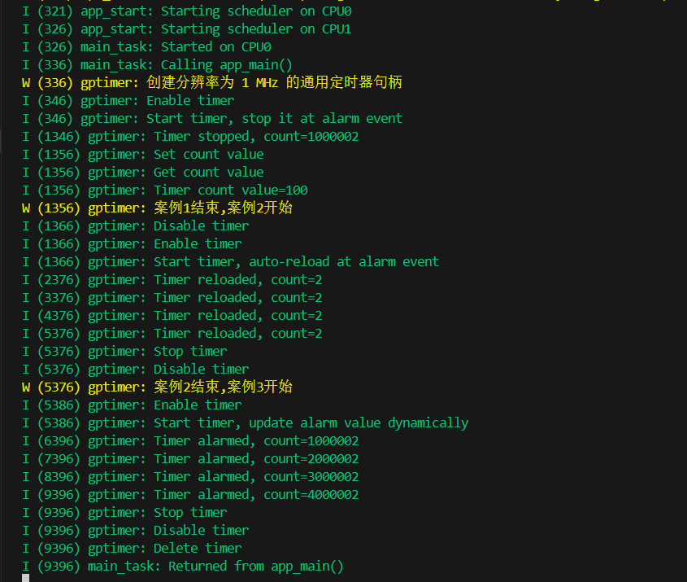

# ESP32外设-硬件定时器入门

> [!TIP] 🚀 ESP32 外设-硬件定时器入门 | 精准定时，控制更灵活  
> - 💡 **碎碎念**😎：本节将介绍 ESP32 的硬件定时器，帮助你实现精准的定时控制，提升系统响应能力。  
> - 📺 **视频教程**：🚧 *开发中*  
> - 💾 **示例代码**：[ESP32-Guide/code/04.peripheral/basics/gptimer](https://github.com/DuRuofu/ESP32-Guide/tree/main/code/04.peripheral/basics/gptimer)


> 若不必使用硬件定时器，则建议使用软件定时器：[ESP 定时器](https://docs.espressif.com/projects/esp-idf/zh_CN/latest/esp32/api-reference/system/esp_timer.html)
## 一、介绍：

通用定时器是 ESP32 定时器组外设的驱动程序。ESP32 硬件定时器分辨率高，具有灵活的报警功能。定时器内部计数器达到特定目标数值的行为被称为定时器报警。定时器报警时将调用用户注册的不同定时器回调函数。

通用定时器通常在以下场景中使用：
- 如同挂钟一般自由运行，随时随地获取高分辨率时间戳；
- 生成周期性警报，定期触发事件；
- 生成一次性警报，在目标时间内响应。

ESP32 内置 4 个 64-bit 通用定时器。每个定时器包含一个 16-bit 预分频器和一个 64-bit 可自动重新加载向上 ／向下计数器。 ESP32 的定时器分为 2 组，每组 2 个。TIMGn_Tx 的 n 代表组别，x 代表定时器编号。

定时器特性： 

• 16-bit 时钟预分频器，分频系数为 2-65536 
• 64-bit 时基计数器 
• 可配置的向上／向下时基计数器：增加或减少 
• 暂停和恢复时基计数器 
• 报警时自动重新加载 
• 当报警值溢出/低于保护值时报警 
• 软件控制的即时重新加载 
• 电平触发中断和边沿触发中断

## 二、使用：

ESP32内置了两个定时器组 `Timer Group`，每个定时器组都有两个64位定时器`Timer`。支持向上、向下两个方向计数。支持设置警报阈值。

#### 1、[定时器初始化](https://docs.espressif.com/projects/esp-idf/zh_CN/latest/esp32/api-reference/peripherals/gptimer.html#gptimer-resource-allocation)

通用定时器实例由 [`gptimer_handle_t`](https://docs.espressif.com/projects/esp-idf/zh_CN/latest/esp32/api-reference/peripherals/gptimer.html#_CPPv416gptimer_handle_t "gptimer_handle_t") 表示。

要初始化一个定时器实例，需要提前提供配置结构体 [`gptimer_config_t`](https://docs.espressif.com/projects/esp-idf/zh_CN/latest/esp32/api-reference/peripherals/gptimer.html#_CPPv416gptimer_config_t "gptimer_config_t")，参数如下：

- [`gptimer_config_t::clk_src`](https://docs.espressif.com/projects/esp-idf/zh_CN/latest/esp32/api-reference/peripherals/gptimer.html#_CPPv4N16gptimer_config_t7clk_srcE "gptimer_config_t::clk_src") 选择定时器的时钟源。[`gptimer_clock_source_t`](https://docs.espressif.com/projects/esp-idf/zh_CN/latest/esp32/api-reference/peripherals/gptimer.html#_CPPv422gptimer_clock_source_t "gptimer_clock_source_t") 中列出多个可用时钟，仅可选择其中一个时钟。
- [`gptimer_config_t::direction`](https://docs.espressif.com/projects/esp-idf/zh_CN/latest/esp32/api-reference/peripherals/gptimer.html#_CPPv4N16gptimer_config_t9directionE "gptimer_config_t::direction") 设置定时器的计数方向，[`gptimer_count_direction_t`](https://docs.espressif.com/projects/esp-idf/zh_CN/latest/esp32/api-reference/peripherals/gptimer.html#_CPPv425gptimer_count_direction_t "gptimer_count_direction_t") 中列出多个支持的方向，仅可选择其中一个方向。
- [`gptimer_config_t::resolution_hz`](https://docs.espressif.com/projects/esp-idf/zh_CN/latest/esp32/api-reference/peripherals/gptimer.html#_CPPv4N16gptimer_config_t13resolution_hzE "gptimer_config_t::resolution_hz") 设置内部计数器的分辨率。计数器每滴答一次相当于 **1 / resolution_hz** 秒。
- `gptimer_config::intr_priority` 设置中断的优先级。如果设置为 `0`，则会分配一个默认优先级的中断，否则会使用指定的优先级。
- 选用 [`gptimer_config_t::intr_shared`](https://docs.espressif.com/projects/esp-idf/zh_CN/latest/esp32/api-reference/peripherals/gptimer.html#_CPPv4N16gptimer_config_t11intr_sharedE "gptimer_config_t::intr_shared") 设置是否将定时器中断源标记为共享源。

配置好结构体，将结构传递给 [`gptimer_new_timer()`](https://docs.espressif.com/projects/esp-idf/zh_CN/latest/esp32/api-reference/peripherals/gptimer.html#_CPPv417gptimer_new_timerPK16gptimer_config_tP16gptimer_handle_t "gptimer_new_timer")，用以实例化定时器实例并返回定时器句柄。

如已不再需要之前创建的通用定时器实例，应通过调用 [`gptimer_del_timer()`](https://docs.espressif.com/projects/esp-idf/zh_CN/latest/esp32/api-reference/peripherals/gptimer.html#_CPPv417gptimer_del_timer16gptimer_handle_t "gptimer_del_timer") 回收定时器（在删除通用定时器句柄之前，请通过 [`gptimer_disable()`](https://docs.espressif.com/projects/esp-idf/zh_CN/latest/esp32/api-reference/peripherals/gptimer.html#_CPPv415gptimer_disable16gptimer_handle_t "gptimer_disable") 禁用定时器，或者通过 [`gptimer_enable()`](https://docs.espressif.com/projects/esp-idf/zh_CN/latest/esp32/api-reference/peripherals/gptimer.html#_CPPv414gptimer_enable16gptimer_handle_t "gptimer_enable") 确认定时器尚未使能。）

初始化示例：**创建分辨率为 1 MHz 的通用定时器句柄**

``` c
gptimer_handle_t gptimer = NULL;
gptimer_config_t timer_config = {
    .clk_src = GPTIMER_CLK_SRC_DEFAULT,
    .direction = GPTIMER_COUNT_UP,
    .resolution_hz = 1 * 1000 * 1000, // 1MHz, 1 tick = 1us
};
ESP_ERROR_CHECK(gptimer_new_timer(&timer_config, &gptimer));
```

#### 2、[定时器设置和获取计数值](https://docs.espressif.com/projects/esp-idf/zh_CN/latest/esp32/api-reference/peripherals/gptimer.html#set-and-get-count-value)

创建通用定时器时，内部计数器将默认重置为零。计数值可以通过 [`gptimer_set_raw_count()`](https://docs.espressif.com/projects/esp-idf/zh_CN/latest/esp32/api-reference/peripherals/gptimer.html#_CPPv421gptimer_set_raw_count16gptimer_handle_t8uint64_t "gptimer_set_raw_count") 异步更新。最大计数值取决于硬件定时器的位宽，这也会在 SOC 宏 [`SOC_TIMER_GROUP_COUNTER_BIT_WIDTH`](https://docs.espressif.com/projects/esp-idf/zh_CN/latest/esp32/api-reference/system/soc_caps.html#c.SOC_TIMER_GROUP_COUNTER_BIT_WIDTH "SOC_TIMER_GROUP_COUNTER_BIT_WIDTH") 中有所反映。当更新活动定时器的原始计数值时，定时器将立即从新值开始计数。

计数值可以随时通过 [`gptimer_get_raw_count()`](https://docs.espressif.com/projects/esp-idf/zh_CN/latest/esp32/api-reference/peripherals/gptimer.html#_CPPv421gptimer_get_raw_count16gptimer_handle_tP8uint64_t "gptimer_get_raw_count") 获取。

#### 3、[设置警报动作](https://docs.espressif.com/projects/esp-idf/zh_CN/latest/esp32/api-reference/peripherals/gptimer.html#set-up-alarm-action)

对于大多数通用定时器使用场景而言，应在启动定时器之前设置警报动作，但不包括简单的挂钟场景，该场景仅需自由运行的定时器。设置警报动作，需要根据如何使用警报事件来配置 [`gptimer_alarm_config_t`](https://docs.espressif.com/projects/esp-idf/zh_CN/latest/esp32/api-reference/peripherals/gptimer.html#_CPPv422gptimer_alarm_config_t "gptimer_alarm_config_t") 的不同参数：

- [`gptimer_alarm_config_t::alarm_count`](https://docs.espressif.com/projects/esp-idf/zh_CN/latest/esp32/api-reference/peripherals/gptimer.html#_CPPv4N22gptimer_alarm_config_t11alarm_countE "gptimer_alarm_config_t::alarm_count") 设置触发警报事件的目标计数值。设置警报值时还需考虑计数方向。尤其是当 [`gptimer_alarm_config_t::auto_reload_on_alarm`](https://docs.espressif.com/projects/esp-idf/zh_CN/latest/esp32/api-reference/peripherals/gptimer.html#_CPPv4N22gptimer_alarm_config_t20auto_reload_on_alarmE "gptimer_alarm_config_t::auto_reload_on_alarm") 为 true 时，[`gptimer_alarm_config_t::alarm_count`](https://docs.espressif.com/projects/esp-idf/zh_CN/latest/esp32/api-reference/peripherals/gptimer.html#_CPPv4N22gptimer_alarm_config_t11alarm_countE "gptimer_alarm_config_t::alarm_count") 和 [`gptimer_alarm_config_t::reload_count`](https://docs.espressif.com/projects/esp-idf/zh_CN/latest/esp32/api-reference/peripherals/gptimer.html#_CPPv4N22gptimer_alarm_config_t12reload_countE "gptimer_alarm_config_t::reload_count") 不能设置为相同的值，因为警报值和重载值相同时没有意义。
- [`gptimer_alarm_config_t::reload_count`](https://docs.espressif.com/projects/esp-idf/zh_CN/latest/esp32/api-reference/peripherals/gptimer.html#_CPPv4N22gptimer_alarm_config_t12reload_countE "gptimer_alarm_config_t::reload_count") 代表警报事件发生时要重载的计数值。此配置仅在 [`gptimer_alarm_config_t::auto_reload_on_alarm`](https://docs.espressif.com/projects/esp-idf/zh_CN/latest/esp32/api-reference/peripherals/gptimer.html#_CPPv4N22gptimer_alarm_config_t20auto_reload_on_alarmE "gptimer_alarm_config_t::auto_reload_on_alarm") 设置为 true 时生效。
- [`gptimer_alarm_config_t::auto_reload_on_alarm`](https://docs.espressif.com/projects/esp-idf/zh_CN/latest/esp32/api-reference/peripherals/gptimer.html#_CPPv4N22gptimer_alarm_config_t20auto_reload_on_alarmE "gptimer_alarm_config_t::auto_reload_on_alarm") 标志设置是否使能自动重载功能。如果使能，硬件定时器将在警报事件发生时立即将 [`gptimer_alarm_config_t::reload_count`](https://docs.espressif.com/projects/esp-idf/zh_CN/latest/esp32/api-reference/peripherals/gptimer.html#_CPPv4N22gptimer_alarm_config_t12reload_countE "gptimer_alarm_config_t::reload_count") 的值重载到计数器中。

要使警报配置生效，需要调用 [`gptimer_set_alarm_action()`](https://docs.espressif.com/projects/esp-idf/zh_CN/latest/esp32/api-reference/peripherals/gptimer.html#_CPPv424gptimer_set_alarm_action16gptimer_handle_tPK22gptimer_alarm_config_t "gptimer_set_alarm_action")。特别是当 [`gptimer_alarm_config_t`](https://docs.espressif.com/projects/esp-idf/zh_CN/latest/esp32/api-reference/peripherals/gptimer.html#_CPPv422gptimer_alarm_config_t "gptimer_alarm_config_t") 设置为 `NULL` 时，报警功能将被禁用。
 

#### 4、[注册事件回调函数](https://docs.espressif.com/projects/esp-idf/zh_CN/latest/esp32/api-reference/peripherals/gptimer.html#gptimer-register-event-callbacks)

定时器启动后，可动态产生特定事件（如“警报事件”）。如需在事件发生时调用某些函数，请通过 [`gptimer_register_event_callbacks()`](https://docs.espressif.com/projects/esp-idf/zh_CN/latest/esp32/api-reference/peripherals/gptimer.html#_CPPv432gptimer_register_event_callbacks16gptimer_handle_tPK25gptimer_event_callbacks_tPv "gptimer_register_event_callbacks") 将函数挂载到中断服务例程 (ISR)。[`gptimer_event_callbacks_t`](https://docs.espressif.com/projects/esp-idf/zh_CN/latest/esp32/api-reference/peripherals/gptimer.html#_CPPv425gptimer_event_callbacks_t "gptimer_event_callbacks_t") 中列出了所有支持的事件回调函数：

- [`gptimer_event_callbacks_t::on_alarm`](https://docs.espressif.com/projects/esp-idf/zh_CN/latest/esp32/api-reference/peripherals/gptimer.html#_CPPv4N25gptimer_event_callbacks_t8on_alarmE "gptimer_event_callbacks_t::on_alarm") 设置警报事件的回调函数。由于此函数在 ISR 上下文中调用，必须确保该函数不会试图阻塞（例如，确保仅从函数内调用具有 `ISR` 后缀的 FreeRTOS API）。函数原型在 [`gptimer_alarm_cb_t`](https://docs.espressif.com/projects/esp-idf/zh_CN/latest/esp32/api-reference/peripherals/gptimer.html#_CPPv418gptimer_alarm_cb_t "gptimer_alarm_cb_t") 中有所声明。

此功能将为定时器延迟安装中断服务，但不使能中断服务。所以，请在 [`gptimer_enable()`](https://docs.espressif.com/projects/esp-idf/zh_CN/latest/esp32/api-reference/peripherals/gptimer.html#_CPPv414gptimer_enable16gptimer_handle_t "gptimer_enable") 之前调用这一函数，否则将返回 [`ESP_ERR_INVALID_STATE`](https://docs.espressif.com/projects/esp-idf/zh_CN/latest/esp32/api-reference/system/esp_err.html#c.ESP_ERR_INVALID_STATE "ESP_ERR_INVALID_STATE") 错误。了解详细信息，请查看章节 [使能和禁用定时器](https://docs.espressif.com/projects/esp-idf/zh_CN/latest/esp32/api-reference/peripherals/gptimer.html#enable-and-disable-timer)。

#### 5、[使能和禁用定时器](https://docs.espressif.com/projects/esp-idf/zh_CN/latest/esp32/api-reference/peripherals/gptimer.html#enable-and-disable-timer)

在对定时器进行 IO 控制之前，需要先调用 [`gptimer_enable()`](https://docs.espressif.com/projects/esp-idf/zh_CN/latest/esp32/api-reference/peripherals/gptimer.html#_CPPv414gptimer_enable16gptimer_handle_t "gptimer_enable") 使能定时器。此函数功能如下：
- 此函数将把定时器驱动程序的状态从 **init** 切换为 **enable**。
- 如果 [`gptimer_register_event_callbacks()`](https://docs.espressif.com/projects/esp-idf/zh_CN/latest/esp32/api-reference/peripherals/gptimer.html#_CPPv432gptimer_register_event_callbacks16gptimer_handle_tPK25gptimer_event_callbacks_tPv "gptimer_register_event_callbacks") 已经延迟安装中断服务，此函数将使能中断服务。

调用 [`gptimer_disable()`](https://docs.espressif.com/projects/esp-idf/zh_CN/latest/esp32/api-reference/peripherals/gptimer.html#_CPPv415gptimer_disable16gptimer_handle_t "gptimer_disable") 会进行相反的操作，即将定时器驱动程序恢复到 **init** 状态，禁用中断服务并释放电源管理锁。

#### 6、启动和停止定时器

启动和停止是定时器的基本 IO 操作。调用 [`gptimer_start()`](https://docs.espressif.com/projects/esp-idf/zh_CN/latest/esp32/api-reference/peripherals/gptimer.html#_CPPv413gptimer_start16gptimer_handle_t "gptimer_start") 可以使内部计数器开始工作，而 [`gptimer_stop()`](https://docs.espressif.com/projects/esp-idf/zh_CN/latest/esp32/api-reference/peripherals/gptimer.html#_CPPv412gptimer_stop16gptimer_handle_t "gptimer_stop") 可以使计数器停止工作。下文说明了如何在存在或不存在警报事件的情况下启动定时器。

调用 [`gptimer_start()`](https://docs.espressif.com/projects/esp-idf/zh_CN/latest/esp32/api-reference/peripherals/gptimer.html#_CPPv413gptimer_start16gptimer_handle_t "gptimer_start") 将使驱动程序状态从 enable 转换为 run, 反之亦然。注意确保 start 和 stop 函数成对使用，否则，函数可能返回 [`ESP_ERR_INVALID_STATE`](https://docs.espressif.com/projects/esp-idf/zh_CN/latest/esp32/api-reference/system/esp_err.html#c.ESP_ERR_INVALID_STATE "ESP_ERR_INVALID_STATE")。

## 三、示例：

>参考：https://github.com/espressif/esp-idf/blob/fdb7a43752633560c73ee079d512c0c13808456f/examples/peripherals/timer_group/gptimer/main/gptimer_example_main.c

``` c

#include <stdio.h>
#include "freertos/FreeRTOS.h"
#include "freertos/task.h"
#include "freertos/queue.h"
#include "driver/gptimer.h"
#include "esp_log.h"

static const char *TAG = "gptimer";

typedef struct {
    uint64_t event_count;
} example_queue_element_t;

// 定时器警报事件的回调函数(案例1)
// 三个参数:定时器句柄 timer、事件数据指针 edata 和用户数据指针 user_data。
static bool IRAM_ATTR example_timer_on_alarm_cb_v1(gptimer_handle_t timer, const gptimer_alarm_event_data_t *edata, void *user_data)
{
    BaseType_t high_task_awoken = pdFALSE;
    QueueHandle_t queue = (QueueHandle_t)user_data;
    // 立即停止计时器
    gptimer_stop(timer);
    // 从事件数据中获取计数值，并将其存储在 example_queue_element_t 结构体变量 ele 的 event_count 字段中。
    example_queue_element_t ele = {
        .event_count = edata->count_value
    };
	//使用 xQueueSendFromISR() 函数将 ele 变量发送到队列中
    xQueueSendFromISR(queue, &ele, &high_task_awoken);
    // return whether we need to yield at the end of ISR
    return (high_task_awoken == pdTRUE);
}

// 定时器警报事件的回调函数(案例2)
static bool IRAM_ATTR example_timer_on_alarm_cb_v2(gptimer_handle_t timer, const gptimer_alarm_event_data_t *edata, void *user_data)
{
    BaseType_t high_task_awoken = pdFALSE;
    QueueHandle_t queue = (QueueHandle_t)user_data;
    // Retrieve count value and send to queue
    example_queue_element_t ele = {
        .event_count = edata->count_value
    };
    xQueueSendFromISR(queue, &ele, &high_task_awoken);
    // return whether we need to yield at the end of ISR
    return (high_task_awoken == pdTRUE);
}

// 定时器警报事件的回调函数(案例3:动态更新报警值)
static bool IRAM_ATTR example_timer_on_alarm_cb_v3(gptimer_handle_t timer, const gptimer_alarm_event_data_t *edata, void *user_data)
{
    BaseType_t high_task_awoken = pdFALSE;
    QueueHandle_t queue = (QueueHandle_t)user_data;
    // Retrieve count value and send to queue
    example_queue_element_t ele = {
        .event_count = edata->count_value
    };
    xQueueSendFromISR(queue, &ele, &high_task_awoken);
    // reconfigure alarm value
    gptimer_alarm_config_t alarm_config = {
        .alarm_count = edata->alarm_value + 1000000, // alarm in next 1s
    };
    gptimer_set_alarm_action(timer, &alarm_config);
    // return whether we need to yield at the end of ISR
    return (high_task_awoken == pdTRUE);
}

void app_main(void)
{
	// 定义一个 example_queue_element_t 类型的变量 ele
    example_queue_element_t ele;
	//创建了一个长度为 10，每个元素大小为 example_queue_element_t 类型的队列，并将其赋值给 queue 变量。
    QueueHandle_t queue = xQueueCreate(10, sizeof(example_queue_element_t));
    if (!queue) {
        ESP_LOGE(TAG, "创建队列失败");
        return;
    }

	// 初始化定时器
    ESP_LOGI(TAG, "创建分辨率为 1 MHz 的通用定时器句柄");
    gptimer_handle_t gptimer = NULL;
    gptimer_config_t timer_config = {
        .clk_src = GPTIMER_CLK_SRC_DEFAULT,
        .direction = GPTIMER_COUNT_UP,
        .resolution_hz = 1000000, // 1MHz, 1 tick=1us
    };
    ESP_ERROR_CHECK(gptimer_new_timer(&timer_config, &gptimer));

	// 注册定时器事件回调函数(警报事件的回调函数)
    gptimer_event_callbacks_t cbs = {
        .on_alarm = example_timer_on_alarm_cb_v1,
    };
    ESP_ERROR_CHECK(gptimer_register_event_callbacks(gptimer, &cbs, queue));

    // 使能定时器
    ESP_LOGI(TAG, "Enable timer");
    ESP_ERROR_CHECK(gptimer_enable(gptimer));

 	// 设置定时器的周期为 1s(触发警报事件的目标计数值)
    ESP_LOGI(TAG, "Start timer, stop it at alarm event");
    gptimer_alarm_config_t alarm_config1 = {
        .alarm_count = 1000000, // period = 1s
    };
	// 设置定时器的报警事件
    ESP_ERROR_CHECK(gptimer_set_alarm_action(gptimer, &alarm_config1));
	// 启动定时器
    ESP_ERROR_CHECK(gptimer_start(gptimer));

    // 等待定时器报警事件(从队列中接收数据,接收到的数据将会存储在 &ele 中)
    if (xQueueReceive(queue, &ele, pdMS_TO_TICKS(2000))) {
        ESP_LOGI(TAG, "Timer stopped, count=%llu", ele.event_count);
    } else {
        ESP_LOGW(TAG, "Missed one count event");
    }

	// 设置定时器的计数值(异步更新)
    ESP_LOGI(TAG, "Set count value");
    ESP_ERROR_CHECK(gptimer_set_raw_count(gptimer, 100));
    ESP_LOGI(TAG, "Get count value");

	// 获取定时器的计数值
    uint64_t count;
    ESP_ERROR_CHECK(gptimer_get_raw_count(gptimer, &count));
    ESP_LOGI(TAG, "Timer count value=%llu", count);

    //--------------------------------------------------------------------//
	ESP_LOGW(TAG, "案例1结束,案例2开始");
	//--------------------------------------------------------------------//

    // 在更新报警回调之前，我们应该确保计时器没有处于启用状态
    ESP_LOGI(TAG, "Disable timer");
    ESP_ERROR_CHECK(gptimer_disable(gptimer));
    // 设置一个新的回调函数
    cbs.on_alarm = example_timer_on_alarm_cb_v2;
    ESP_ERROR_CHECK(gptimer_register_event_callbacks(gptimer, &cbs, queue));
    ESP_LOGI(TAG, "Enable timer");
    ESP_ERROR_CHECK(gptimer_enable(gptimer));

    // 重新设置报警条件
    ESP_LOGI(TAG, "Start timer, auto-reload at alarm event");
    gptimer_alarm_config_t alarm_config2 = {
        .reload_count = 0,
        .alarm_count = 1000000, // period = 1s
        .flags.auto_reload_on_alarm = true, //报警事件发生后立即通过硬件重新加载计数值
    };
	// 设置定时器的报警事件
    ESP_ERROR_CHECK(gptimer_set_alarm_action(gptimer, &alarm_config2));
    ESP_ERROR_CHECK(gptimer_start(gptimer));

 	// 循环次数为4次。在每次循环中，通过 xQueueReceive() 函数从队列中接收数据，并等待最多2秒。如果成功接收到数据，则打印定时器重新加载的消息
    int record = 4;
    while (record) {
        if (xQueueReceive(queue, &ele, pdMS_TO_TICKS(2000))) {
            ESP_LOGI(TAG, "Timer reloaded, count=%llu", ele.event_count);
            record--;
        } else {
            ESP_LOGW(TAG, "Missed one count event");
        }
    }
    ESP_LOGI(TAG, "Stop timer");
    ESP_ERROR_CHECK(gptimer_stop(gptimer));

    ESP_LOGI(TAG, "Disable timer");
    ESP_ERROR_CHECK(gptimer_disable(gptimer));

    //--------------------------------------------------------------------//
	ESP_LOGW(TAG, "案例2结束,案例3开始");
	//--------------------------------------------------------------------//
	// 案例3动态更新报警值
    cbs.on_alarm = example_timer_on_alarm_cb_v3;
    ESP_ERROR_CHECK(gptimer_register_event_callbacks(gptimer, &cbs, queue));
    ESP_LOGI(TAG, "Enable timer");
    ESP_ERROR_CHECK(gptimer_enable(gptimer));

    ESP_LOGI(TAG, "Start timer, update alarm value dynamically");
    gptimer_alarm_config_t alarm_config3 = {
        .alarm_count = 1000000, // period = 1s
    };
    ESP_ERROR_CHECK(gptimer_set_alarm_action(gptimer, &alarm_config3));
    ESP_ERROR_CHECK(gptimer_start(gptimer));
    record = 4;
    while (record) {
        if (xQueueReceive(queue, &ele, pdMS_TO_TICKS(2000))) {
            ESP_LOGI(TAG, "Timer alarmed, count=%llu", ele.event_count);
            record--;
        } else {
            ESP_LOGW(TAG, "Missed one count event");
        }
    }

    ESP_LOGI(TAG, "Stop timer");
    ESP_ERROR_CHECK(gptimer_stop(gptimer));
    ESP_LOGI(TAG, "Disable timer");
    ESP_ERROR_CHECK(gptimer_disable(gptimer));
    ESP_LOGI(TAG, "Delete timer");
    ESP_ERROR_CHECK(gptimer_del_timer(gptimer));

    vQueueDelete(queue);
}

```

上面的示例程序，包含了三个案例：

1. 案例1：定时器触发警报事件后立即停止计时器，并将事件数据发送到队列中。
2. 案例2：定时器触发警报事件后自动重新加载计数值，并将事件数据发送到队列中。
3. 案例3：定时器触发警报事件后动态更新报警值，并将事件数据发送到队列中。

在每个案例中，程序初始化 gptimer，注册相应的定时器事件回调函数，启动定时器并设置报警事件，然后通过队列接收数据并进行相应的处理。

效果：


# 参考链接
1. https://docs.espressif.com/projects/esp-idf/zh_CN/latest/esp32/api-reference/peripherals/gptimer.html#id26