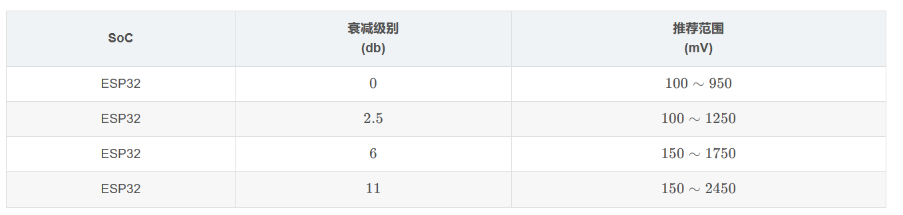
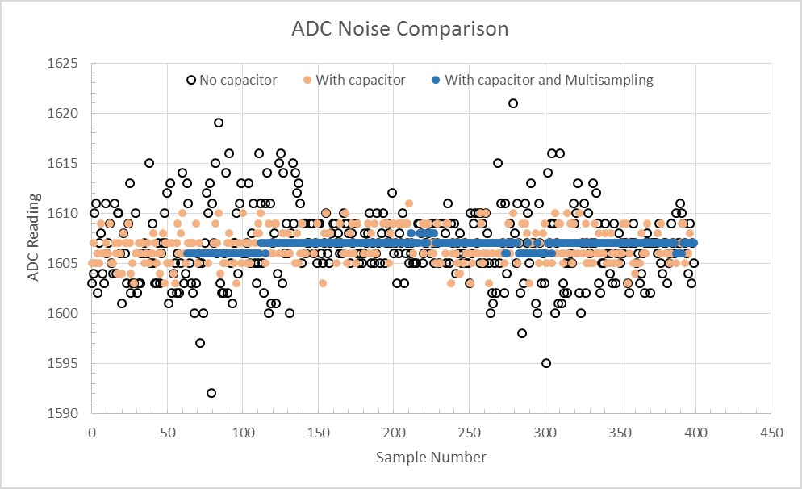
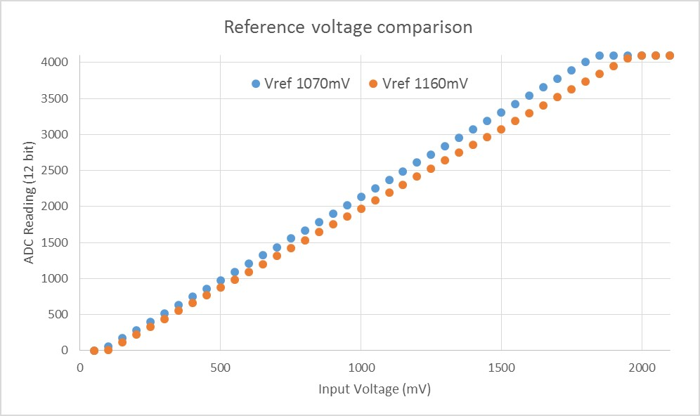
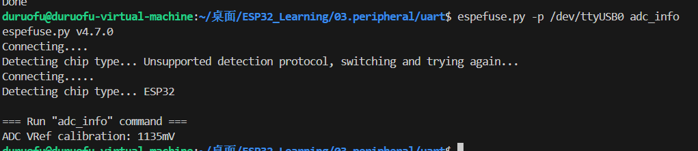
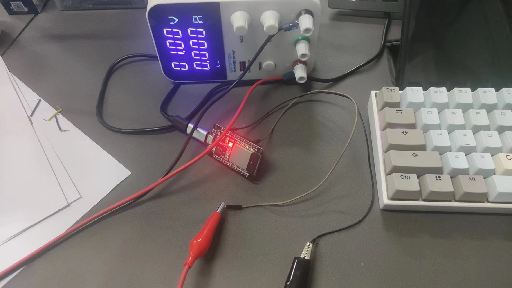
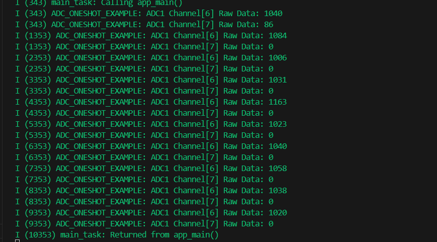
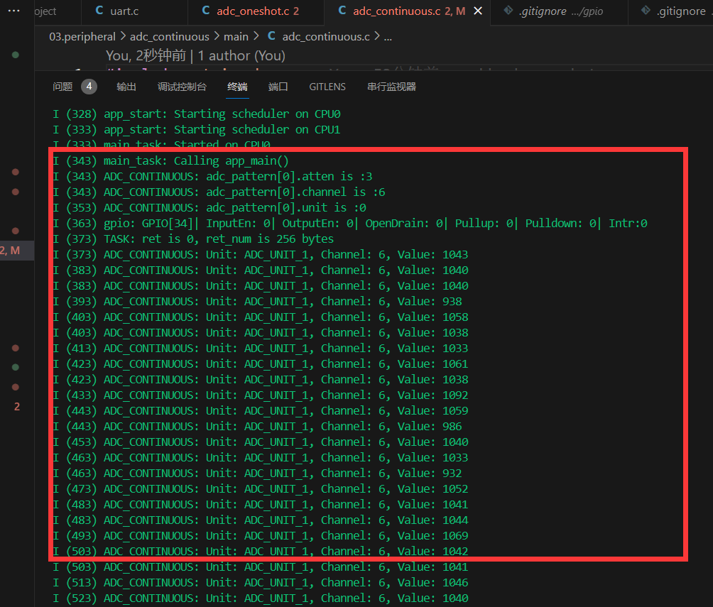

# ESP32外设-ADC入门

> [!TIP] 🚀 ESP32 外设-ADC入门 | 轻松实现模拟信号采集 
> - 💡 **碎碎念**😎：本节将介绍 ESP32 的 ADC 外设，帮助你实现模拟信号采集，进行高精度数据处理。  
> - 📺 **视频教程**：🚧 *开发中*  
> - 💾 **示例代码**：[ESP32-Guide/code/04.peripheral/basics/adc](https://github.com/DuRuofu/ESP32-Guide/tree/main/code/04.peripheral/basics/adc)

>本文档主要转载自[Augtons正(单片机)](https://blog.csdn.net/m0_50064262 "Augtons正(单片机)")的ESP32系列教程（关于ADC部分的梳理甚至比官方教程都清晰）。

## 一、介绍

ESP32(经典版)集成了两个 `12`位SAR(逐次逼近寄存器)adc，共支持18个测量通道。

- 采用 2 个 SAR ADC，可支持同时采样与转换
- 采用 5 个专用 ADC 控制器，可支持不同应用场景（比如，高性能、低功耗，或功率检测和峰值检测）
- 支持 18 个模拟输入管脚
- 可配置 12 位、11 位、10 位、9 位多种分辨率
- 支持 DMA（1 个控制器支持）
- 支持多通道扫描模式（2 个控制器支持）
- 支持 Deep-sleep 模式运行（1 个控制器支持）
- 支持 ULP 协处理器控制（2 个控制器支持）

### 1.1 ADC通道概览

**ADC1：**
- 支持 8 个通道，包括：GPIO32 - GPIO39（并非按顺序）
**ADC2：**

- 支持 10 个通道，包括：GPIO0, GPIO2, GPIO4, GPIO12 - GPIO15, GOIO25 - GPIO27（并非按顺序）

ESP32 内置霍尔传感器，采用 ADC1 的通道0和3（GPIO36 和 GPIO39）。

**注意**：
>1. `ADC2`模块也被`Wi-Fi`使用，当它们一起使用时，只有一个会被抢占，这意味着`adc2_get_raw()`可能会被阻塞，直到`Wi-Fi`停止，反之亦然。**换言之，ADC2 不能与 WIFI 共用！**
>2. 从一个没有连接到任何信号的引脚读取到的 ADC 值是 **随机** 的。

ADC通道对应关系如下(经典模组)：

``` c
ADC1_CHANNEL_0	GPIO 36
ADC1_CHANNEL_1	GPIO 37
ADC1_CHANNEL_2	GPIO 38
ADC1_CHANNEL_3	GPIO 39
ADC1_CHANNEL_4	GPIO 32
ADC1_CHANNEL_5	GPIO 33
ADC1_CHANNEL_6	GPIO 34
ADC1_CHANNEL_7	GPIO 35

ADC2_CHANNEL_0	ESP32:GPIO 4	
ADC2_CHANNEL_1	ESP32:GPIO 0	
ADC2_CHANNEL_2	ESP32:GPIO 2	
ADC2_CHANNEL_3	ESP32:GPIO 15	
ADC2_CHANNEL_4	ESP32:GPIO 13	
ADC2_CHANNEL_5	ESP32:GPIO 12	
ADC2_CHANNEL_6	ESP32:GPIO 14	
ADC2_CHANNEL_7	ESP32:GPIO 27	
ADC2_CHANNEL_8	ESP32:GPIO 25	
ADC2_CHANNEL_9	ESP32:GPIO 26	
```


### 1.2 ADC 衰减

ADC模块 能读取电压的范围（量程）有限，因此我们一般给某个 ADC 通道配置一定的衰减，使其读取更大的电压。但更大的量程会导致更小的精度。因此根据 ADC 的应用场景，选择适当的衰减级别十分必要。

ESP32 的每一个通道都有提供了4个级别的衰减等级，不同的衰减等级对于的量程在下表列出：注意，下表中的 “推荐范围” 并不是量程 ，而是在某衰减等级下测量最精确的推荐测量范围



### 1.2 ADC校准与减小测量误差

#### 减少噪声

ESP32 ADC 对噪声敏感，可能导致 ADC 读数出现较大偏差。根据不同使用场景，要减少噪声影响，你可能需要将旁路电容（如 100 nF 陶瓷电容）连接到 ADC 使用的输入管脚。此外，也可以通过多次采样，进一步减轻噪声的影响。



图中展示了连接电容以及 64 次采样对噪声的抑制效果。其中纵轴(ADC Reading)代表不同方式读取到的ADC值，横轴(Sample Number)是采样次数。

#### ADC 校准

关于ADC校准的库为`esp_adc_cal.h`
``` c
#include "esp_adc/adc_cali.h"
```

个库提供 API 函数用于校正基准ADC 参考电压，ADC参考电压为 1100 m V。
对于不同的参考电压，ADC 值与输入电压值（待测电压）的关系不同。关系如下图：
​

上图列出了参考电压分别在：V r e f = =1070mV(蓝色) 和 V r e f = =1160mV(橙色) 下的 ADC 值和待测电压 Voltage 的关系。

我们把这条拟合曲线称为 ADC 模块(在某参考电压下)的 **ADC-Voltage 特征曲线**。

在实际应用中，我们调用esp_adc_cal.h库提供的 API 函数去求得指定参考电压下的 ADC-Voltage 特征曲线，并利用这一条曲线去将 ADC 测量值转换为欲测量的电压Voltage。开发者可以选择自定义参考电压值，也可以利用ESP32 内部 eFuse（一次性可编程存储器）中储存的出厂参考电压校准值去获取这个曲线。

使用下面的命令：
``` sh
%IDF_PATH%/components/esptool_py/esptool/espefuse.py --port COMx adc_info
```

效果：



除此之外，ESP32 内部的参考电压也可以手动测量，方法是将此电压输出到（路由到）某个GPIO口上，然后手动测量此GPIO口和GND接口之间的电压，就是eFuse内部的参考电压。将参考电压路由到GPIO的方法是调用API函数adc_vref_to_gpio()，参数是想要输出电压的GPIO口编号。必须是ADC2的通道IO口之一，因为ESP32只支持将参考电压路由到 ADC2 上

``` c
/* 将参考电压路由到GPIO25上 */ 
adc_vref_to_gpio(ADC_UNIT_2, GPIO_NUM_25);
```

## 二、使用

### 单次转换模式使用

##### 1、 [资源分配](https://docs.espressif.com/projects/esp-idf/zh_CN/latest/esp32/api-reference/peripherals/adc_oneshot.html#adc-oneshot-resource-allocation) ：获取 ADC 句柄，以及回收资源

需要配置结构体` adc_oneshot_unit_init_cfg_t`

参数为：
- [`adc_oneshot_unit_init_cfg_t::unit_id`](https://docs.espressif.com/projects/esp-idf/zh_CN/latest/esp32/api-reference/peripherals/adc_oneshot.html#_CPPv4N27adc_oneshot_unit_init_cfg_t7unit_idE "adc_oneshot_unit_init_cfg_t::unit_id") 选择 ADC。
- [`adc_oneshot_unit_init_cfg_t::clk_src`](https://docs.espressif.com/projects/esp-idf/zh_CN/latest/esp32/api-reference/peripherals/adc_oneshot.html#_CPPv4N27adc_oneshot_unit_init_cfg_t7clk_srcE "adc_oneshot_unit_init_cfg_t::clk_src") 选择 ADC 的时钟源。设置为 0 时，驱动程序将使用默认时钟源，详情请参阅 [`adc_oneshot_clk_src_t`](https://docs.espressif.com/projects/esp-idf/zh_CN/latest/esp32/api-reference/peripherals/adc_oneshot.html#_CPPv421adc_oneshot_clk_src_t "adc_oneshot_clk_src_t")。
- [`adc_oneshot_unit_init_cfg_t::ulp_mode`](https://docs.espressif.com/projects/esp-idf/zh_CN/latest/esp32/api-reference/peripherals/adc_oneshot.html#_CPPv4N27adc_oneshot_unit_init_cfg_t8ulp_modeE "adc_oneshot_unit_init_cfg_t::ulp_mode") 设置是否支持 ADC 在 ULP 模式下工作。

完成 ADC 初始配置后，使用已设置的初始配置结构体 [`adc_oneshot_unit_init_cfg_t`](https://docs.espressif.com/projects/esp-idf/zh_CN/latest/esp32/api-reference/peripherals/adc_oneshot.html#_CPPv427adc_oneshot_unit_init_cfg_t "adc_oneshot_unit_init_cfg_t") 调用 [`adc_oneshot_new_unit()`](https://docs.espressif.com/projects/esp-idf/zh_CN/latest/esp32/api-reference/peripherals/adc_oneshot.html#_CPPv420adc_oneshot_new_unitPK27adc_oneshot_unit_init_cfg_tP25adc_oneshot_unit_handle_t "adc_oneshot_new_unit")。如果分配成功，该函数将返回 ADC 单元实例句柄。

该函数可能因参数无效、内存不足等原因返回错误代码。比如，当要分配的 ADC 实例已经注册时，该函数会返回 [`ESP_ERR_NOT_FOUND`](https://docs.espressif.com/projects/esp-idf/zh_CN/latest/esp32/api-reference/system/esp_err.html#c.ESP_ERR_NOT_FOUND "ESP_ERR_NOT_FOUND") 错误。可用 ADC 数量可通过 [`SOC_ADC_PERIPH_NUM`](https://docs.espressif.com/projects/esp-idf/zh_CN/latest/esp32/api-reference/system/soc_caps.html#c.SOC_ADC_PERIPH_NUM "SOC_ADC_PERIPH_NUM") 查看

如果不再需要先前创建的 ADC 单元实例，请调用 [`adc_oneshot_del_unit()`](https://docs.espressif.com/projects/esp-idf/zh_CN/latest/esp32/api-reference/peripherals/adc_oneshot.html#_CPPv420adc_oneshot_del_unit25adc_oneshot_unit_handle_t "adc_oneshot_del_unit") 回收该实例，相关的硬件和软件资源也会回收。

创建 ADC 单元实例句柄示例：
``` c
adc_oneshot_unit_handle_t adc1_handle;
adc_oneshot_unit_init_cfg_t init_config1 = {
    .unit_id = ADC_UNIT_1,
    .ulp_mode = ADC_ULP_MODE_DISABLE,
};
ESP_ERROR_CHECK(adc_oneshot_new_unit(&init_config1, &adc1_handle));
```

回收 ADC 单元实例示例

``` c
ESP_ERROR_CHECK(adc_oneshot_del_unit(adc1_handle));
```

##### 2、 [配置 ADC 单元实例](https://docs.espressif.com/projects/esp-idf/zh_CN/latest/esp32/api-reference/peripherals/adc_oneshot.html#adc-oneshot-unit-configuration) 

设置 [`adc_oneshot_chan_cfg_t`](https://docs.espressif.com/projects/esp-idf/zh_CN/latest/esp32/api-reference/peripherals/adc_oneshot.html#_CPPv422adc_oneshot_chan_cfg_t "adc_oneshot_chan_cfg_t") 配置 ADC IO 以测量模拟信号

参数：
- [`adc_oneshot_chan_cfg_t::atten`](https://docs.espressif.com/projects/esp-idf/zh_CN/latest/esp32/api-reference/peripherals/adc_oneshot.html#_CPPv4N22adc_oneshot_chan_cfg_t5attenE "adc_oneshot_chan_cfg_t::atten")，ADC 衰减。
- [`adc_oneshot_chan_cfg_t::bitwidth`](https://docs.espressif.com/projects/esp-idf/zh_CN/latest/esp32/api-reference/peripherals/adc_oneshot.html#_CPPv4N22adc_oneshot_chan_cfg_t8bitwidthE "adc_oneshot_chan_cfg_t::bitwidth")，原始转换结果的位宽。

使用上述配置结构体调用 [`adc_oneshot_config_channel()`](https://docs.espressif.com/projects/esp-idf/zh_CN/latest/esp32/api-reference/peripherals/adc_oneshot.html#_CPPv426adc_oneshot_config_channel25adc_oneshot_unit_handle_t13adc_channel_tPK22adc_oneshot_chan_cfg_t "adc_oneshot_config_channel")，并指定要配置的 ADC 通道。函数 [`adc_oneshot_config_channel()`](https://docs.espressif.com/projects/esp-idf/zh_CN/latest/esp32/api-reference/peripherals/adc_oneshot.html#_CPPv426adc_oneshot_config_channel25adc_oneshot_unit_handle_t13adc_channel_tPK22adc_oneshot_chan_cfg_t "adc_oneshot_config_channel") 支持多次调用，以配置不同的 ADC 通道。驱动程序将在内部保存每个通道的配置。

示例：配置两个 ADC 通道

``` c
adc_oneshot_chan_cfg_t config = {
    .bitwidth = ADC_BITWIDTH_DEFAULT,
    .atten = ADC_ATTEN_DB_12,
};
ESP_ERROR_CHECK(adc_oneshot_config_channel(adc1_handle, EXAMPLE_ADC1_CHAN0, &config));
ESP_ERROR_CHECK(adc_oneshot_config_channel(adc1_handle, EXAMPLE_ADC1_CHAN1, &config));
```

##### 3、 [读取转换结果](https://docs.espressif.com/projects/esp-idf/zh_CN/latest/esp32/api-reference/peripherals/adc_oneshot.html#adc-oneshot-read-conversion-result) 

调用 [`adc_oneshot_read()`](https://docs.espressif.com/projects/esp-idf/zh_CN/latest/esp32/api-reference/peripherals/adc_oneshot.html#_CPPv416adc_oneshot_read25adc_oneshot_unit_handle_t13adc_channel_tPi "adc_oneshot_read") 可以获取 ADC 通道的原始转换结果。

通过该函数获取的 ADC 转换结果为原始数据。可以使用以下公式，根据 ADC 原始结果计算电压：

``` c
Vout = Dout * Vmax / Dmax       
```

|Vout|数字输出结果，代表电压。|
|---|---|
|Dout|ADC 原始数字读取结果。|
|Vmax|可测量的最大模拟输入电压，与 ADC 衰减相关，请参考 [技术参考手册](https://www.espressif.com/sites/default/files/documentation/esp32_technical_reference_manual_cn.pdf) > `片上传感器与模拟信号处理`。|
|Dmax|输出 ADC 原始数字读取结果的最大值，即 2^位宽，位宽即之前配置的 [`adc_digi_pattern_config_t::bit_width`](https://docs.espressif.com/projects/esp-idf/zh_CN/latest/esp32/api-reference/peripherals/adc_oneshot.html#_CPPv4N25adc_digi_pattern_config_t9bit_widthE "adc_digi_pattern_config_t::bit_width")。|
读取原始结果示例：
```c
ESP_ERROR_CHECK(adc_oneshot_read(adc1_handle, EXAMPLE_ADC1_CHAN0, &adc_raw[0][0]));
ESP_LOGI(TAG, "ADC%d Channel[%d] Raw Data: %d", ADC_UNIT_1 + 1, EXAMPLE_ADC1_CHAN0, adc_raw[0][0]);

ESP_ERROR_CHECK(adc_oneshot_read(adc1_handle, EXAMPLE_ADC1_CHAN1, &adc_raw[0][1]));
ESP_LOGI(TAG, "ADC%d Channel[%d] Raw Data: %d", ADC_UNIT_1 + 1, EXAMPLE_ADC1_CHAN1, adc_raw[0][1]);
```

注：

>- 随机数生成器 (RNG) 以 ADC 为输入源。使用 ADC 单次转换模式驱动从 RNG 生成随机数时，随机性会减弱。
>-  一个 ADC 单元每次只能在一种操作模式下运行，可以是连续模式或单次模式。`adc_oneshot_start()` 提供了保护措施。
>-  Wi-Fi 也使用 ADC2，[`adc_oneshot_read()`](https://docs.espressif.com/projects/esp-idf/zh_CN/latest/esp32/api-reference/peripherals/adc_oneshot.html#_CPPv416adc_oneshot_read25adc_oneshot_unit_handle_t13adc_channel_tPi "adc_oneshot_read") 提供了 Wi-Fi 驱动与 ADC 单次转换模式驱动间的保护。
>- ESP32-DevKitC：GPIO0 已用于自动烧录功能，不能用于 ADC 单次转换模式。
>- ESP-WROVER-KIT：GPIO0、GPIO2、GPIO4 和 GPIO15 已有其他用途，不能用于 ADC 单次转换模式。

### 连续转换模式使用

ADC 连续转换模式驱动由多个转换帧组成。
- 转换帧：一个转换帧包含多个转换结果。转换帧大小以字节为单位，在 [`adc_continuous_new_handle()`](https://docs.espressif.com/projects/esp-idf/zh_CN/latest/esp32/api-reference/peripherals/adc_continuous.html#_CPPv425adc_continuous_new_handlePK27adc_continuous_handle_cfg_tP23adc_continuous_handle_t "adc_continuous_new_handle") 中配置。
- 转换结果：一个转换结果包含多个字节，即 [`SOC_ADC_DIGI_RESULT_BYTES`](https://docs.espressif.com/projects/esp-idf/zh_CN/latest/esp32/api-reference/system/soc_caps.html#c.SOC_ADC_DIGI_RESULT_BYTES "SOC_ADC_DIGI_RESULT_BYTES")。转换结果的数据结构由 [`adc_digi_output_data_t`](https://docs.espressif.com/projects/esp-idf/zh_CN/latest/esp32/api-reference/peripherals/adc_oneshot.html#_CPPv422adc_digi_output_data_t "adc_digi_output_data_t") 定义，包括 ADC 单元、ADC 通道以及原始数据。


##### 1、 [资源分配](https://docs.espressif.com/projects/esp-idf/zh_CN/latest/esp32/api-reference/peripherals/adc_continuous.html#adc-continuous-resource-allocation)：

首先设置配置结构体 [`adc_continuous_handle_cfg_t`](https://docs.espressif.com/projects/esp-idf/zh_CN/latest/esp32/api-reference/peripherals/adc_continuous.html#_CPPv427adc_continuous_handle_cfg_t "adc_continuous_handle_cfg_t")，创建 ADC 连续转换模式驱动的句柄，参数如下：
- [`adc_continuous_handle_cfg_t::max_store_buf_size`](https://docs.espressif.com/projects/esp-idf/zh_CN/latest/esp32/api-reference/peripherals/adc_continuous.html#_CPPv4N27adc_continuous_handle_cfg_t18max_store_buf_sizeE "adc_continuous_handle_cfg_t::max_store_buf_size")：以字节为单位设置最大缓冲池的大小，驱动程序将 ADC 转换结果保存到该缓冲池中。缓冲池已满时，新的转换将丢失。
- [`adc_continuous_handle_cfg_t::conv_frame_size`](https://docs.espressif.com/projects/esp-idf/zh_CN/latest/esp32/api-reference/peripherals/adc_continuous.html#_CPPv4N27adc_continuous_handle_cfg_t15conv_frame_sizeE "adc_continuous_handle_cfg_t::conv_frame_size")：以字节为单位设置 ADC 转换帧大小。
- [`adc_continuous_handle_cfg_t::flags`](https://docs.espressif.com/projects/esp-idf/zh_CN/latest/esp32/api-reference/peripherals/adc_continuous.html#_CPPv4N27adc_continuous_handle_cfg_t5flagsE "adc_continuous_handle_cfg_t::flags")：设置可以改变驱动程序行为的标志。（`flush_pool`：缓冲池满时自动清空缓冲池。）

完成以上 ADC 配置后，使用已设置的配置结构体 [`adc_continuous_handle_cfg_t`](https://docs.espressif.com/projects/esp-idf/zh_CN/latest/esp32/api-reference/peripherals/adc_continuous.html#_CPPv427adc_continuous_handle_cfg_t "adc_continuous_handle_cfg_t") 调用 [`adc_continuous_new_handle()`](https://docs.espressif.com/projects/esp-idf/zh_CN/latest/esp32/api-reference/peripherals/adc_continuous.html#_CPPv425adc_continuous_new_handlePK27adc_continuous_handle_cfg_tP23adc_continuous_handle_t "adc_continuous_new_handle")来分配资源。

如果不再使用 ADC 连续转换模式驱动，请调用 [`adc_continuous_deinit()`](https://docs.espressif.com/projects/esp-idf/zh_CN/latest/esp32/api-reference/peripherals/adc_continuous.html#_CPPv421adc_continuous_deinit23adc_continuous_handle_t "adc_continuous_deinit") 将驱动去初始化。

配置示例：

```c
adc_continuous_handle_t handle = NULL;
adc_continuous_handle_cfg_t adc_config = {
    .max_store_buf_size = 1024,
    .conv_frame_size = 100,
};
ESP_ERROR_CHECK(adc_continuous_new_handle(&adc_config));
```


##### 2、 [配置 ADC](https://docs.espressif.com/projects/esp-idf/zh_CN/latest/esp32/api-reference/peripherals/adc_continuous.html#adc-continuous-adc-configurations)：

初始化 ADC 连续转换模式驱动后，设置 [`adc_continuous_config_t`](https://docs.espressif.com/projects/esp-idf/zh_CN/latest/esp32/api-reference/peripherals/adc_continuous.html#_CPPv423adc_continuous_config_t "adc_continuous_config_t") 配置 ADC IO，测量模拟信号：
- [`adc_continuous_config_t::pattern_num`](https://docs.espressif.com/projects/esp-idf/zh_CN/latest/esp32/api-reference/peripherals/adc_continuous.html#_CPPv4N23adc_continuous_config_t11pattern_numE "adc_continuous_config_t::pattern_num")：要使用的 ADC 通道数量。
- [`adc_continuous_config_t::adc_pattern`](https://docs.espressif.com/projects/esp-idf/zh_CN/latest/esp32/api-reference/peripherals/adc_continuous.html#_CPPv4N23adc_continuous_config_t11adc_patternE "adc_continuous_config_t::adc_pattern")：每个要使用的 ADC 通道的配置列表，请参阅下文描述。
- [`adc_continuous_config_t::sample_freq_hz`](https://docs.espressif.com/projects/esp-idf/zh_CN/latest/esp32/api-reference/peripherals/adc_continuous.html#_CPPv4N23adc_continuous_config_t14sample_freq_hzE "adc_continuous_config_t::sample_freq_hz")：期望的 ADC 采样频率，单位为 Hz。
- [`adc_continuous_config_t::conv_mode`](https://docs.espressif.com/projects/esp-idf/zh_CN/latest/esp32/api-reference/peripherals/adc_continuous.html#_CPPv4N23adc_continuous_config_t9conv_modeE "adc_continuous_config_t::conv_mode")：连续转换模式。
- [`adc_continuous_config_t::format`](https://docs.espressif.com/projects/esp-idf/zh_CN/latest/esp32/api-reference/peripherals/adc_continuous.html#_CPPv4N23adc_continuous_config_t6formatE "adc_continuous_config_t::format")：转换模式结果的输出格式。

设置 [`adc_digi_pattern_config_t`](https://docs.espressif.com/projects/esp-idf/zh_CN/latest/esp32/api-reference/peripherals/adc_oneshot.html#_CPPv425adc_digi_pattern_config_t "adc_digi_pattern_config_t")：
- [`adc_digi_pattern_config_t::atten`](https://docs.espressif.com/projects/esp-idf/zh_CN/latest/esp32/api-reference/peripherals/adc_oneshot.html#_CPPv4N25adc_digi_pattern_config_t5attenE "adc_digi_pattern_config_t::atten")：ADC 衰减。请参阅 [技术参考手册](https://www.espressif.com/sites/default/files/documentation/esp32_technical_reference_manual_cn.pdf#sensor) 中的片上传感器与模拟信号处理章节。
- [`adc_digi_pattern_config_t::channel`](https://docs.espressif.com/projects/esp-idf/zh_CN/latest/esp32/api-reference/peripherals/adc_oneshot.html#_CPPv4N25adc_digi_pattern_config_t7channelE "adc_digi_pattern_config_t::channel")：IO 对应的 ADC 通道号，请参阅下文注意事项。
- [`adc_digi_pattern_config_t::unit`](https://docs.espressif.com/projects/esp-idf/zh_CN/latest/esp32/api-reference/peripherals/adc_oneshot.html#_CPPv4N25adc_digi_pattern_config_t4unitE "adc_digi_pattern_config_t::unit")：IO 所属的 ADC 单元。
- [`adc_digi_pattern_config_t::bit_width`](https://docs.espressif.com/projects/esp-idf/zh_CN/latest/esp32/api-reference/peripherals/adc_oneshot.html#_CPPv4N25adc_digi_pattern_config_t9bit_widthE "adc_digi_pattern_config_t::bit_width")：原始转换结果的位宽。

最后，使用上述配置结构体，调用 [`adc_continuous_config()`](https://docs.espressif.com/projects/esp-idf/zh_CN/latest/esp32/api-reference/peripherals/adc_continuous.html#_CPPv421adc_continuous_config23adc_continuous_handle_tPK23adc_continuous_config_t "adc_continuous_config")。

配置示例：

```c
    //  ADC IO
    adc_continuous_config_t dig_cfg = {
        .sample_freq_hz = 20 * 1000,         // 采样频率
        .conv_mode = ADC_CONV_SINGLE_UNIT_1,  // 转换模式
        .format = ADC_DIGI_OUTPUT_FORMAT_TYPE1,    // 输出格式
    };

    adc_digi_pattern_config_t adc_pattern[SOC_ADC_PATT_LEN_MAX] = {0};
    dig_cfg.pattern_num = channel_num;   // 通道数量
    for (int i = 0; i < channel_num; i++) {
        adc_pattern[i].atten = ADC_ATTEN_DB_0;  // ADC 衰减
        adc_pattern[i].channel = channel[i] & 0x7;  // 通道
        adc_pattern[i].unit = ADC_UNIT_1;			// ADC单元
        adc_pattern[i].bit_width = SOC_ADC_DIGI_MAX_BITWIDTH; // 位宽

		// 打印配置信息
        ESP_LOGI(TAG, "adc_pattern[%d].atten is :%"PRIx8, i, adc_pattern[i].atten);
        ESP_LOGI(TAG, "adc_pattern[%d].channel is :%"PRIx8, i, adc_pattern[i].channel);
        ESP_LOGI(TAG, "adc_pattern[%d].unit is :%"PRIx8, i, adc_pattern[i].unit);
    }

	// 要使用的 ADC 通道的配置列表
    dig_cfg.adc_pattern = adc_pattern;

```

##### 3、 [ADC 控制](https://docs.espressif.com/projects/esp-idf/zh_CN/latest/esp32/api-reference/peripherals/adc_continuous.html#adc-continuous-adc-control)：

调用 [`adc_continuous_start()`](https://docs.espressif.com/projects/esp-idf/zh_CN/latest/esp32/api-reference/peripherals/adc_continuous.html#_CPPv420adc_continuous_start23adc_continuous_handle_t "adc_continuous_start")，将使 ADC 开始从配置好的 ADC 通道测量模拟信号，并生成转换结果。

调用 [`adc_continuous_stop()`](https://docs.espressif.com/projects/esp-idf/zh_CN/latest/esp32/api-reference/peripherals/adc_continuous.html#_CPPv419adc_continuous_stop23adc_continuous_handle_t "adc_continuous_stop") 则会停止 ADC 转换。

##### 4、[注册事件回调](https://docs.espressif.com/projects/esp-idf/zh_CN/latest/esp32/api-reference/peripherals/adc_continuous.html#adc-continuous-register-event-callbacks)：

调用 [`adc_continuous_register_event_callbacks()`](https://docs.espressif.com/projects/esp-idf/zh_CN/latest/esp32/api-reference/peripherals/adc_continuous.html#_CPPv439adc_continuous_register_event_callbacks23adc_continuous_handle_tPK24adc_continuous_evt_cbs_tPv "adc_continuous_register_event_callbacks")，可以将自己的函数链接到驱动程序的 ISR 中。通过 [`adc_continuous_evt_cbs_t`](https://docs.espressif.com/projects/esp-idf/zh_CN/latest/esp32/api-reference/peripherals/adc_continuous.html#_CPPv424adc_continuous_evt_cbs_t "adc_continuous_evt_cbs_t") 可查看所有支持的事件回调。
- [`adc_continuous_evt_cbs_t::on_conv_done`](https://docs.espressif.com/projects/esp-idf/zh_CN/latest/esp32/api-reference/peripherals/adc_continuous.html#_CPPv4N24adc_continuous_evt_cbs_t12on_conv_doneE "adc_continuous_evt_cbs_t::on_conv_done")：当一个转换帧完成时，触发此事件。
- [`adc_continuous_evt_cbs_t::on_pool_ovf`](https://docs.espressif.com/projects/esp-idf/zh_CN/latest/esp32/api-reference/peripherals/adc_continuous.html#_CPPv4N24adc_continuous_evt_cbs_t11on_pool_ovfE "adc_continuous_evt_cbs_t::on_pool_ovf")：当内部缓冲池已满时，触发此事件，新的转换结果将丢失。

###### 转换完成事件

当驱动程序完成一次转换后，会触发 [`adc_continuous_evt_cbs_t::on_conv_done`](https://docs.espressif.com/projects/esp-idf/zh_CN/latest/esp32/api-reference/peripherals/adc_continuous.html#_CPPv4N24adc_continuous_evt_cbs_t12on_conv_doneE "adc_continuous_evt_cbs_t::on_conv_done") 事件，并填充事件数据。事件数据包含一个指向转换帧缓冲区的指针，以及转换帧缓冲区大小。要了解事件数据结构，请参阅 [`adc_continuous_evt_data_t`](https://docs.espressif.com/projects/esp-idf/zh_CN/latest/esp32/api-reference/peripherals/adc_continuous.html#_CPPv425adc_continuous_evt_data_t "adc_continuous_evt_data_t")。

##### 5、[读取转换结果](https://docs.espressif.com/projects/esp-idf/zh_CN/latest/esp32/api-reference/peripherals/adc_continuous.html#adc-continuous-read-conversion-result)：

调用 [`adc_continuous_start()`](https://docs.espressif.com/projects/esp-idf/zh_CN/latest/esp32/api-reference/peripherals/adc_continuous.html#_CPPv420adc_continuous_start23adc_continuous_handle_t "adc_continuous_start") 启动 ADC 连续转换，调用 [`adc_continuous_read()`](https://docs.espressif.com/projects/esp-idf/zh_CN/latest/esp32/api-reference/peripherals/adc_continuous.html#_CPPv419adc_continuous_read23adc_continuous_handle_tP7uint8_t8uint32_tP8uint32_t8uint32_t "adc_continuous_read") 可以获取 ADC 通道的转换结果。注意提供缓冲区，获取原始结果。

函数 [`adc_continuous_read()`](https://docs.espressif.com/projects/esp-idf/zh_CN/latest/esp32/api-reference/peripherals/adc_continuous.html#_CPPv419adc_continuous_read23adc_continuous_handle_tP7uint8_t8uint32_tP8uint32_t8uint32_t "adc_continuous_read") 每次都会尝试以期望长度读取转换结果。
参数：
- **handle** -- **[in]** ADC连续模式驱动句柄
- **buf** -- **[out]**要从ADC读取的转换结果缓冲区。
- **length_max** -- **[in]** 从ADC读取的转换结果的预期长度（以字节为单位）。
- **out_length** -- **[out]** 通过此API从ADC读取的转换结果的实际长度（以字节为单位）。
- **timeout_ms** -- **[in]** 通过此API等待数据的时间（以毫秒为单位）。


## 六、ADC 示例

#### 单次转换示例程序：

``` c
#include <stdio.h>
#include "freertos/FreeRTOS.h"
#include "freertos/task.h"
#include "esp_system.h"
#include "esp_log.h"
#include "esp_adc/adc_oneshot.h"

#define EXAMPLE_ADC1_CHAN0 ADC_CHANNEL_6  // 根据您的硬件配置选择合适的通道
#define EXAMPLE_ADC1_CHAN1 ADC_CHANNEL_7  // 根据您的硬件配置选择合适的通道

static const char* TAG = "ADC_ONESHOT_EXAMPLE";

void app_main(void)
{
    adc_oneshot_unit_handle_t adc1_handle;
    adc_oneshot_unit_init_cfg_t init_config1 = {
        .unit_id = ADC_UNIT_1,
        .ulp_mode = ADC_ULP_MODE_DISABLE,
    };
    ESP_ERROR_CHECK(adc_oneshot_new_unit(&init_config1, &adc1_handle));

    adc_oneshot_chan_cfg_t config = {
        .bitwidth = ADC_BITWIDTH_DEFAULT,
        .atten = ADC_ATTEN_DB_11,  // 设置适当的衰减以匹配您的输入电压范围
    };

    // 配置两个通道
    ESP_ERROR_CHECK(adc_oneshot_config_channel(adc1_handle, EXAMPLE_ADC1_CHAN0, &config));
    ESP_ERROR_CHECK(adc_oneshot_config_channel(adc1_handle, EXAMPLE_ADC1_CHAN1, &config));

    int adc_raw[2];

    // 对每个通道进行单次转换并读取结果
    for (int i = 0; i < 10; i++) {
        ESP_ERROR_CHECK(adc_oneshot_read(adc1_handle, EXAMPLE_ADC1_CHAN0, &adc_raw[0]));
        ESP_LOGI(TAG, "ADC1 Channel[%d] Raw Data: %d", EXAMPLE_ADC1_CHAN0, adc_raw[0]);

        ESP_ERROR_CHECK(adc_oneshot_read(adc1_handle, EXAMPLE_ADC1_CHAN1, &adc_raw[1]));
        ESP_LOGI(TAG, "ADC1 Channel[%d] Raw Data: %d", EXAMPLE_ADC1_CHAN1, adc_raw[1]);

        vTaskDelay(pdMS_TO_TICKS(1000));  // 等待1秒再次读取
    }

    // 回收资源
    ESP_ERROR_CHECK(adc_oneshot_del_unit(adc1_handle));
}

```


为通道6接上1V电压：



串口输出结果：



#### 连续转换示例程序：

>参考:https://github.com/espressif/esp-idf/blob/fdb7a43752633560c73ee079d512c0c13808456f/examples/peripherals/adc/continuous_read/main/continuous_read_main.c

``` c

#include <string.h>
#include <stdio.h>
#include "sdkconfig.h"
#include "esp_log.h"
#include "freertos/FreeRTOS.h"
#include "freertos/task.h"
#include "freertos/semphr.h"
#include "esp_adc/adc_continuous.h"

#define _EXAMPLE_ADC_UNIT_STR(unit)         #unit   
// C预处理器的字符串化操作符 #，它可以将宏参数转换为字符串常量。如果传递 ADC_UNIT 给 _EXAMPLE_ADC_UNIT_STR，它会生成字符串 "ADC_UNIT"。
#define EXAMPLE_ADC_UNIT_STR(unit)          _EXAMPLE_ADC_UNIT_STR(unit)
// 宏嵌套

// 用于从 adc_digi_output_data_t 结构体中提取通道号和数据值。
#define EXAMPLE_ADC_GET_CHANNEL(p_data)     ((p_data)->type1.channel)
#define EXAMPLE_ADC_GET_DATA(p_data)        ((p_data)->type1.data)


#define ADC_UNIT                    ADC_UNIT_1


// ADC通道
//static adc_channel_t channel[2] = {ADC_CHANNEL_6, ADC_CHANNEL_7};
static adc_channel_t channel[1] = {ADC_CHANNEL_6};


static TaskHandle_t s_task_handle;
static const char *TAG = "ADC_CONTINUOUS";

// ADC连续模式的事件回调(一个转换帧完成时)
static bool IRAM_ATTR s_conv_done_cb(adc_continuous_handle_t handle, const adc_continuous_evt_data_t *edata, void *user_data)
{
    BaseType_t mustYield = pdFALSE;
    //Notify that ADC continuous driver has done enough number of conversions
	//vTaskNotifyGiveFromISR 是 FreeRTOS 提供的一个函数，它允许从中断服务例程（ISR）安全地向任务发送通知
    vTaskNotifyGiveFromISR(s_task_handle, &mustYield);

    return (mustYield == pdTRUE);
}

// adc初始化
static void continuous_adc_init(adc_channel_t *channel, uint8_t channel_num, adc_continuous_handle_t *out_handle)
{
	// 创建一个ADC连续模式的句柄
    adc_continuous_handle_t handle = NULL;

	// 配置ADC连续模式的参数
    adc_continuous_handle_cfg_t adc_config = {
        .max_store_buf_size = 1024,  			// 最大存储缓冲区大小
        .conv_frame_size = 256,	// 转换帧大小
    };
    ESP_ERROR_CHECK(adc_continuous_new_handle(&adc_config, &handle));

    //  ADC IO
    adc_continuous_config_t dig_cfg = {
        .sample_freq_hz = 20 * 1000,         // 采样频率
        .conv_mode = ADC_CONV_SINGLE_UNIT_1,  // 转换模式
        .format = ADC_DIGI_OUTPUT_FORMAT_TYPE1,    // 输出格式
    };

    adc_digi_pattern_config_t adc_pattern[SOC_ADC_PATT_LEN_MAX] = {0};
    dig_cfg.pattern_num = channel_num;   // 通道数量
    for (int i = 0; i < channel_num; i++) {
        adc_pattern[i].atten = ADC_ATTEN_DB_11;  // ADC 衰减
        adc_pattern[i].channel = channel[i] & 0x7;  // 通道
        adc_pattern[i].unit = ADC_UNIT;			// ADC单元
        adc_pattern[i].bit_width = SOC_ADC_DIGI_MAX_BITWIDTH; // 位宽

		// 打印配置信息
		// - PRIx8 是一个预处理宏，定义在 C 语言的标准库头文件 <inttypes.h> 中。它用于以可移植的方式格式化输出 uint8_t 类型的数据为十六进制形式。
        ESP_LOGI(TAG, "adc_pattern[%d].atten is :%"PRIx8, i, adc_pattern[i].atten);
        ESP_LOGI(TAG, "adc_pattern[%d].channel is :%"PRIx8, i, adc_pattern[i].channel);
        ESP_LOGI(TAG, "adc_pattern[%d].unit is :%"PRIx8, i, adc_pattern[i].unit);
    }

	// 要使用的 ADC 通道的配置列表
    dig_cfg.adc_pattern = adc_pattern;
    ESP_ERROR_CHECK(adc_continuous_config(handle, &dig_cfg));

    *out_handle = handle;
}

void app_main(void)
{
    esp_err_t ret; // 返回状态
    uint32_t ret_num = 0;  // 转换完成的数据数量
	// 定义接收数组
    uint8_t result[256] = {0};
	// 初始化数组,填充为0xcc
    memset(result, 0xcc, 256);

	//获取app_mian任务的句柄。
    s_task_handle = xTaskGetCurrentTaskHandle();

	// 初始化ADC
    adc_continuous_handle_t handle = NULL;
    continuous_adc_init(channel, sizeof(channel) / sizeof(adc_channel_t), &handle);

	// 事件回调
    adc_continuous_evt_cbs_t cbs = {
		// 当一个转换帧完成时，触发此事件:s_conv_done_cb
        .on_conv_done = s_conv_done_cb,
    };

	// 注册事件回调
    ESP_ERROR_CHECK(adc_continuous_register_event_callbacks(handle, &cbs, NULL));
	// 启动ADC连续模式
    ESP_ERROR_CHECK(adc_continuous_start(handle));

    while (1) {

        /**
         * This is to show you the way to use the ADC continuous mode driver event callback.
         * This `ulTaskNotifyTake` will block when the data processing in the task is fast.
         * However in this example, the data processing (print) is slow, so you barely block here.
         *
         * Without using this event callback (to notify this task), you can still just call
         * `adc_continuous_read()` here in a loop, with/without a certain block timeout.
         */
		//  ulTaskNotifyTake() 等待通知
        ulTaskNotifyTake(pdTRUE, portMAX_DELAY);

		//	生成字符串
        char unit[] = EXAMPLE_ADC_UNIT_STR(ADC_UNIT);

        while (1) {
			// 读取ADC数据
            ret = adc_continuous_read(handle, result, 256, &ret_num, 0);
			// 读取成功
            if (ret == ESP_OK) {
				// 显示读取操作的返回状态和实际读取到的数据字节数
                ESP_LOGI("TASK", "ret is %x, ret_num is %"PRIu32" bytes", ret, ret_num);
				// 循环遍历读取到的数据，解析每个ADC数据项，并打印出来
				// - 循环以 SOC_ADC_DIGI_RESULT_BYTES 为步长迭代，这个常量定义了每个ADC数据项的字节大小。
				// - adc_digi_output_data_t 是一个结构体类型，用于解析ADC数据项。
				// - EXAMPLE_ADC_GET_CHANNEL(p) 和 EXAMPLE_ADC_GET_DATA(p) 是宏，用于从 adc_digi_output_data_t 结构体中提取通道号和数据值。
                for (int i = 0; i < ret_num; i += SOC_ADC_DIGI_RESULT_BYTES) {
                    adc_digi_output_data_t *p = (adc_digi_output_data_t*)&result[i];
                    uint32_t chan_num = EXAMPLE_ADC_GET_CHANNEL(p);
                    uint32_t data = EXAMPLE_ADC_GET_DATA(p);
                    /*检查通道编号验证，如果通道编号超过最大通道，则数据无效 */
					// - PRIu32 是 C 语言标准库中的宏，它用于以可移植的方式格式化输出 uint32_t 类型的数据。
                    if (chan_num < SOC_ADC_CHANNEL_NUM(ADC_UNIT)) {
                        ESP_LOGI(TAG, "Unit: %s, Channel: %"PRIu32", Value: %"PRIu32, unit, chan_num, data);
                    } else {
                        ESP_LOGW(TAG, "Invalid data [%s_%"PRIu32"_%"PRIu32"]", unit, chan_num, data);
                    }
                }
                /**
                 * Because printing is slow, so every time you call `ulTaskNotifyTake`, it will immediately return.
                 * To avoid a task watchdog timeout, add a delay here. When you replace the way you process the data,
                 * usually you don't need this delay (as this task will block for a while).
                 */
                vTaskDelay(1);
            } else if (ret == ESP_ERR_TIMEOUT) {
                //We try to read `EXAMPLE_READ_LEN` until API returns timeout, which means there's no available data
                break;
            }
        }
    }
	// 停止ADC连续模式
    ESP_ERROR_CHECK(adc_continuous_stop(handle));
    ESP_ERROR_CHECK(adc_continuous_deinit(handle));
}


```


接线：


效果：




# 参考链接

1. https://blog.csdn.net/m0_50064262/article/details/118817032
2. https://docs.espressif.com/projects/esp-idf/zh_CN/latest/esp32/api-reference/peripherals/adc_oneshot.html#_CPPv427adc_oneshot_unit_init_cfg_t
3. extension://bfdogplmndidlpjfhoijckpakkdjkkil/pdf/viewer.html?file=https%3A%2F%2Fwww.espressif.com%2Fsites%2Fdefault%2Ffiles%2Fdocumentation%2Fesp32_technical_reference_manual_cn.pdf
4. https://github.com/espressif/esp-idf/tree/fdb7a43/examples/peripherals/adc/oneshot_read
