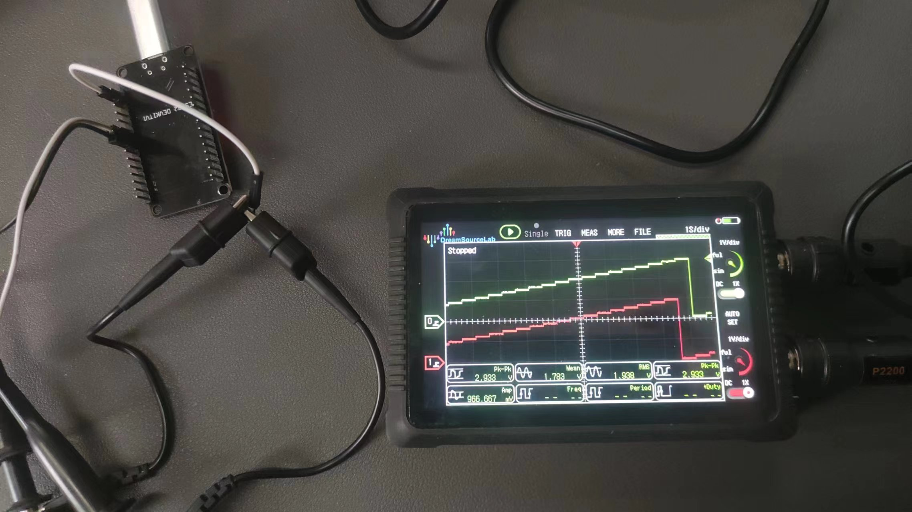
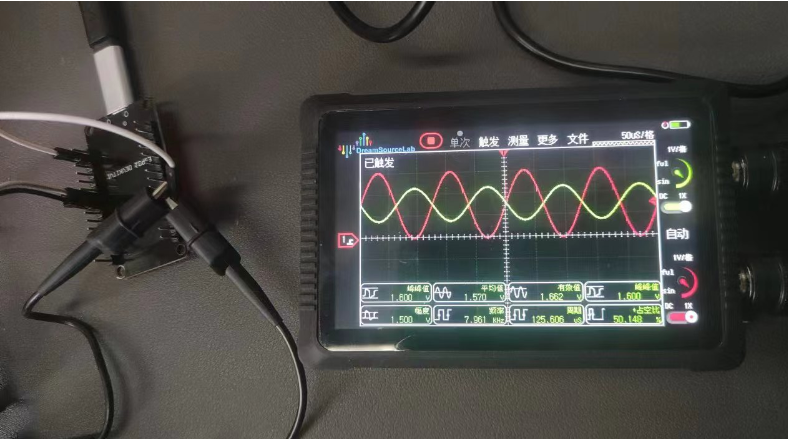

# ESP32外设-DAC

> [!TIP] 🚀 ESP32 外设-DAC | 精准数字模拟转换 
> - 💡 **碎碎念**😎：本节将介绍 ESP32 的 DAC 外设，帮助你实现数字信号到模拟信号的转换，支持多种应用场景。  
> - 📺 **视频教程**：🚧 *开发中*  
> - 💾 **示例代码**：[ESP32-Guide/code/04.peripheral/basics/dac](https://github.com/DuRuofu/ESP32-Guide/tree/main/code/04.peripheral/basics/dac)

## 一、介绍

ESP32 有两个 8 位数模转换器 (DAC) 通道，分别连接到 GPIO25（通道 1）和 GPIO26（通道 2）。每个 DAC 通道可以将数字值 0 ~ 255 转换成模拟电压 0 ~ Vref（此处的 Vref 为 VDD3P3_RTC 引脚输入的参考电压，一般来说其输入的电压值应等于电源电压 VDD）。输出电压可按以下方式计算:

``` c
out_voltage = Vref * digi_val / 255
```

| 通道序号            | GPIO（ESP32） |
| --------------- | ----------- |
| `DAC_CHANNEL_1` | GPIO`25`    |
| `DAC_CHANNEL_2` | GPIO`26`    |

头文件有：

- `dac.h`：原有 DAC 驱动的最上层头文件，只包含在使用原有驱动 API 的应用程序中。
    
- `dac_oneshot.h`：新 DAC 驱动的最上层头文件，应包含在使用新驱动 API（单次模式）的应用程序中。
    
- `dac_cosine.h`：新 DAC 驱动的最上层头文件，应包含在使用新驱动 API（余弦模式）的应用程序中。
    
- `dac_continuous.h`：新 DAC 驱动的最上层头文件，应包含在使用新驱动 API（连续模式）的应用程序中。
  
> 原有驱动程序与新驱动程序无法共存。使用原有驱动需包含 `dac.h`，使用新驱动需包含 `dac_oneshot.h`、 `dac_cosine.h` 和 `dac_continuous.h`。后续更新或将移除原有驱动程序。

## 二、使用

ESP32 有两个 DAC 通道。通道的软件资源互相独立，用户可以根据具体情况调用 [`dac_oneshot_handle_t`](https://docs.espressif.com/projects/esp-idf/zh_CN/latest/esp32/api-reference/peripherals/dac.html#_CPPv420dac_oneshot_handle_t "dac_oneshot_handle_t")、 [`dac_cosine_handle_t`](https://docs.espressif.com/projects/esp-idf/zh_CN/latest/esp32/api-reference/peripherals/dac.html#_CPPv419dac_cosine_handle_t "dac_cosine_handle_t") 或 [`dac_continuous_handle_t`](https://docs.espressif.com/projects/esp-idf/zh_CN/latest/esp32/api-reference/peripherals/dac.html#_CPPv423dac_continuous_handle_t "dac_continuous_handle_t") 来管理不同通道，但不支持在同一个通道上注册不同模式。
#### 2.1 电压直接输出（单次/直接模式）

DAC 通道每次调用 [`dac_oneshot_output_voltage()`](https://docs.espressif.com/projects/esp-idf/zh_CN/latest/esp32/api-reference/peripherals/dac.html#_CPPv426dac_oneshot_output_voltage20dac_oneshot_handle_t7uint8_t "dac_oneshot_output_voltage") （可在 ISR 中调用）时都可以将一个 8 位数字转换为模拟值。直至下一次转换开始前，DAC 通道上都将维持该模拟电压。开始转换电压前，需要首先调用 [`dac_oneshot_new_channel()`](https://docs.espressif.com/projects/esp-idf/zh_CN/latest/esp32/api-reference/peripherals/dac.html#_CPPv423dac_oneshot_new_channelPK20dac_oneshot_config_tP20dac_oneshot_handle_t "dac_oneshot_new_channel") 来启用该 DAC 通道。

#### 2.2 连续波输出（连续/DMA 模式）

DAC 通道可以通过 DMA 连续转换数字信号，这种模式下有三种写入 DAC 数据的方法：

1. 常规写入（同步）：一次性传输所有数据并在所有数据均已载入 DMA 缓冲区前保持阻塞状态。如果不再继续输入数据，电压将维持在最后的转换值。该模式通常用于传输音频等长信号。
2. 循环写入：在数据载入 DMA 缓冲区后，缓冲区中的数据将以非阻塞的方式被循环转换。但要注意，输入的缓冲区大小受 DMA 描述符数量和 DMA 缓冲区大小的限制。该模式通常用于传输如正弦波等需要重复的短信号。为了启用循环写入，需要在启用 DAC 连续模式后调用 [`dac_continuous_write_cyclically()`](https://docs.espressif.com/projects/esp-idf/zh_CN/latest/esp32/api-reference/peripherals/dac.html#_CPPv431dac_continuous_write_cyclically23dac_continuous_handle_tP7uint8_t6size_tP6size_t "dac_continuous_write_cyclically")。
3. 异步写入。可根据事件回调异步传输数据。需要调用 [`dac_event_callbacks_t::on_convert_done`](https://docs.espressif.com/projects/esp-idf/zh_CN/latest/esp32/api-reference/peripherals/dac.html#_CPPv4N21dac_event_callbacks_t15on_convert_doneE "dac_event_callbacks_t::on_convert_done") 以启用异步模式。用户在回调中可得到 [`dac_event_data_t`](https://docs.espressif.com/projects/esp-idf/zh_CN/latest/esp32/api-reference/peripherals/dac.html#_CPPv416dac_event_data_t "dac_event_data_t")，其中包含 DMA 缓冲区的地址和长度，即允许用户直接将数据载入 DMA 缓冲区。启用异步写入前需要调用 [`dac_continuous_register_event_callback()`](https://docs.espressif.com/projects/esp-idf/zh_CN/latest/esp32/api-reference/peripherals/dac.html#_CPPv438dac_continuous_register_event_callback23dac_continuous_handle_tPK21dac_event_callbacks_tPv "dac_continuous_register_event_callback")、 [`dac_event_callbacks_t::on_convert_done`](https://docs.espressif.com/projects/esp-idf/zh_CN/latest/esp32/api-reference/peripherals/dac.html#_CPPv4N21dac_event_callbacks_t15on_convert_doneE "dac_event_callbacks_t::on_convert_done") 和 [`dac_continuous_start_async_writing()`](https://docs.espressif.com/projects/esp-idf/zh_CN/latest/esp32/api-reference/peripherals/dac.html#_CPPv434dac_continuous_start_async_writing23dac_continuous_handle_t "dac_continuous_start_async_writing")。注意，异步写入一旦开始，回调函数将被持续触发。调用 [`dac_continuous_write_asynchronously()`](https://docs.espressif.com/projects/esp-idf/zh_CN/latest/esp32/api-reference/peripherals/dac.html#_CPPv435dac_continuous_write_asynchronously23dac_continuous_handle_tP7uint8_t6size_tPK7uint8_t6size_tP6size_t "dac_continuous_write_asynchronously") 可以在某个单独任务中或直接在回调函数中载入数据。

#### 2.3 余弦波输出（余弦模式）

DAC 外设中包含一个余弦波发生器，可以在通道上产生余弦波。用户可以通过`struct dac_cosine_config_t` 结构体配置余弦波的频率、振幅和相位。启用该模式需要先调用 [`dac_cosine_new_channel()`](https://docs.espressif.com/projects/esp-idf/zh_CN/latest/esp32/api-reference/peripherals/dac.html#_CPPv422dac_cosine_new_channelPK19dac_cosine_config_tP19dac_cosine_handle_t "dac_cosine_new_channel") 将 DAC 转换成余弦模式，然后调用 [`dac_cosine_start()`](https://docs.espressif.com/projects/esp-idf/zh_CN/latest/esp32/api-reference/peripherals/dac.html#_CPPv416dac_cosine_start19dac_cosine_handle_t "dac_cosine_start") 启动余弦波发生器。

目前，余弦波发生器仅有 `RTC_FAST` 一个时钟源，可通过选择 `dac_cosine_clk_src_t::DAC_COSINE_CLK_SRC_RTC_FAST` 来启用该时钟源。该时钟源为默认时钟源，与 `dac_cosine_clk_src_t::DAC_COSINE_CLK_SRC_RTC_DEFAULT` 相同。


`struct dac_cosine_config_t` 结构体用于配置DAC（数字到模拟转换器）的余弦波通道。以下是其成员变量的参数说明：

- `dac_channel_t chan_id`：余弦波通道ID，指定哪个DAC通道将产生余弦波。
- `uint32_t freq_hz`：余弦波频率，单位为Hz。该频率由RTC_FAST时钟驱动，RTC_FAST时钟是从RC_FAST时钟分频得到的。默认RTC时钟下，余弦波最小频率约为130Hz。理论上虽然可以支持高达数MHz的频率，但由于硬件限制，在高频下波形会失真。通常不建议设置超过200kHz的频率。
- `dac_cosine_clk_src_t clk_src`：余弦波生成器的时钟源，目前只支持`DAC_COSINE_CLK_SRC_DEFAULT`。
- `dac_cosine_atten_t atten`：余弦波幅度的衰减。
- `dac_cosine_phase_t phase`：余弦波的相位，仅支持`DAC_COSINE_PHASE_0`或`DAC_COSINE_PHASE_180`，设置不支持的相位时，默认为0。
- `int8_t offset`：余弦波的直流偏移量。
- `bool force_set_freq`：强制设置余弦波频率。
- `struct dac_cosine_config_t::[anonymous] flags`：余弦模式的标志位。

## 三、案例

#### 3.1 电压直接输出（单次/直接模式）

```c
#include "freertos/FreeRTOS.h"
#include "freertos/task.h"
#include "driver/dac_oneshot.h"
//#include "esp_check.h"

static void dac_output_task(void *args)
{
    dac_oneshot_handle_t handle = (dac_oneshot_handle_t)args;
    uint32_t val = 0;
    while (1) {
        /* Set the voltage every 100 ms */
        ESP_ERROR_CHECK(dac_oneshot_output_voltage(handle, val));
        val += 10;
        val %= 250;
        vTaskDelay(pdMS_TO_TICKS(500));
    }
}

void app_main(void)
{
    /* DAC oneshot init */
    dac_oneshot_handle_t chan0_handle;
    dac_oneshot_config_t chan0_cfg = {
        .chan_id = DAC_CHAN_0,
    };
    ESP_ERROR_CHECK(dac_oneshot_new_channel(&chan0_cfg, &chan0_handle));

    dac_oneshot_handle_t chan1_handle;
    dac_oneshot_config_t chan1_cfg = {
        .chan_id = DAC_CHAN_1,
    };
    ESP_ERROR_CHECK(dac_oneshot_new_channel(&chan1_cfg, &chan1_handle));

    /* DAC oneshot outputting threads */
    xTaskCreate(dac_output_task, "dac_chan0_output_task", 4096, chan0_handle, 5, NULL);
    vTaskDelay(pdMS_TO_TICKS(500)); // To differential the output of two channels
    xTaskCreate(dac_output_task, "dac_chan1_output_task", 4096, chan1_handle, 5, NULL);
}
```

效果：每500ms电压跳变一次


#### 3.2 连续波输出（连续/DMA 模式）

##### 1、常规写入（同步）

参考： [peripherals/dac/dac_continuous/dac_audio](https://github.com/espressif/esp-idf/tree/e4f167d/examples/peripherals/dac/dac_continuous/dac_audio)

##### 2、循环写入

参考： [peripherals/dac/dac_continuous/signal_generator](https://github.com/espressif/esp-idf/tree/e4f167d/examples/peripherals/dac/dac_continuous/signal_generator)
##### 3、异步写入

参考： [peripherals/dac/dac_continuous/dac_audio](https://github.com/espressif/esp-idf/tree/e4f167d/examples/peripherals/dac/dac_continuous/dac_audio)

#### 3.3 余弦波输出（余弦模式）

```c
#include "freertos/FreeRTOS.h"
#include "freertos/task.h"
#include "driver/dac_cosine.h"

void app_main(void)
{
    dac_cosine_handle_t chan0_handle;
    dac_cosine_handle_t chan1_handle;
    /* Normally two channels can only be configured to one frequency
     * But we can set force_set_freq bit to force update the frequency
     * The example here will produce cosine wave at 8 KHz on both channels */
    dac_cosine_config_t cos0_cfg = {
        .chan_id = DAC_CHAN_0,
        .freq_hz = 1000, // It will be covered by 8000 in the latter configuration
        .clk_src = DAC_COSINE_CLK_SRC_DEFAULT,
        .offset = 0,
        .phase = DAC_COSINE_PHASE_0,
        .atten = DAC_COSINE_ATTEN_DEFAULT,
        .flags.force_set_freq = false,
    };
    dac_cosine_config_t cos1_cfg = {
        .chan_id = DAC_CHAN_1,
        .freq_hz = 8000,
        .clk_src = DAC_COSINE_CLK_SRC_DEFAULT,
        .offset = 0,
        .phase = DAC_COSINE_PHASE_180,
        .atten = DAC_COSINE_ATTEN_DB_6,
        .flags.force_set_freq = true, // set true will allow to overwrite the frequency that set before
    };
    ESP_ERROR_CHECK(dac_cosine_new_channel(&cos0_cfg, &chan0_handle));
    ESP_ERROR_CHECK(dac_cosine_new_channel(&cos1_cfg, &chan1_handle));
    ESP_ERROR_CHECK(dac_cosine_start(chan0_handle));
    ESP_ERROR_CHECK(dac_cosine_start(chan1_handle));

}
```


效果：



## 我们得到了两路余弦信号，其中一路还设置了180度的相位偏移和6dB的衰减。
# 参考链接

1. https://docs.espressif.com/projects/esp-idf/zh_CN/latest/esp32/api-reference/peripherals/dac.html
2. https://blog.csdn.net/m0_50064262/article/details/115189865