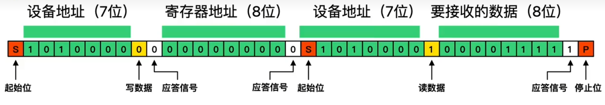
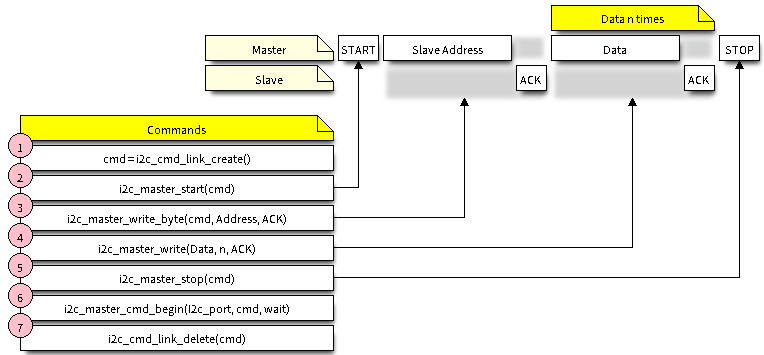
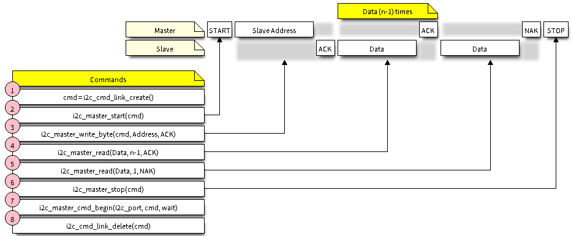
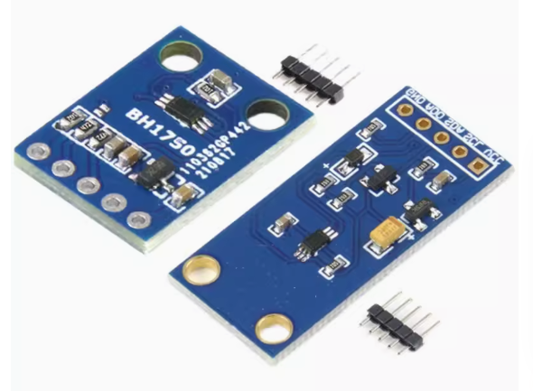
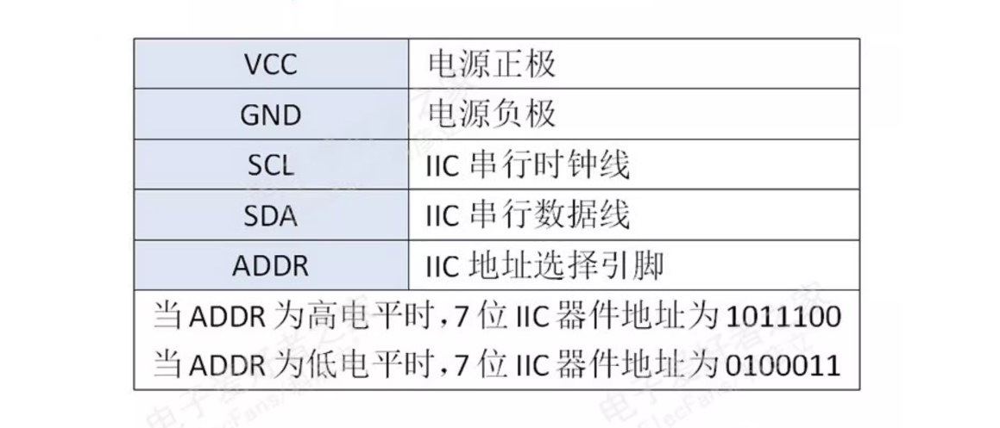
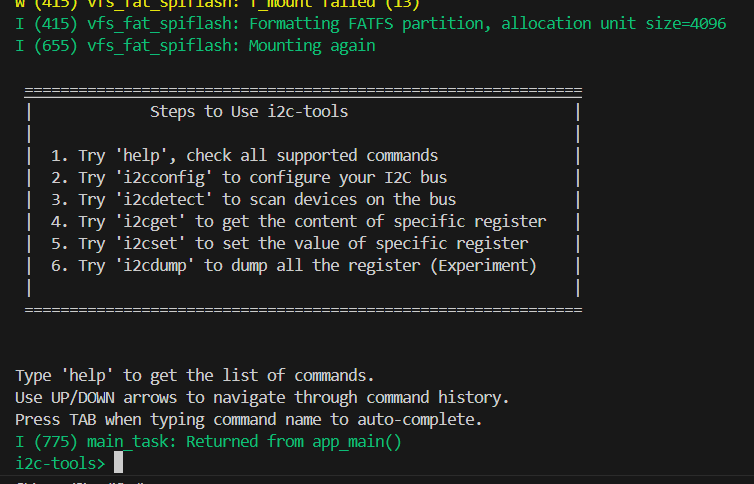
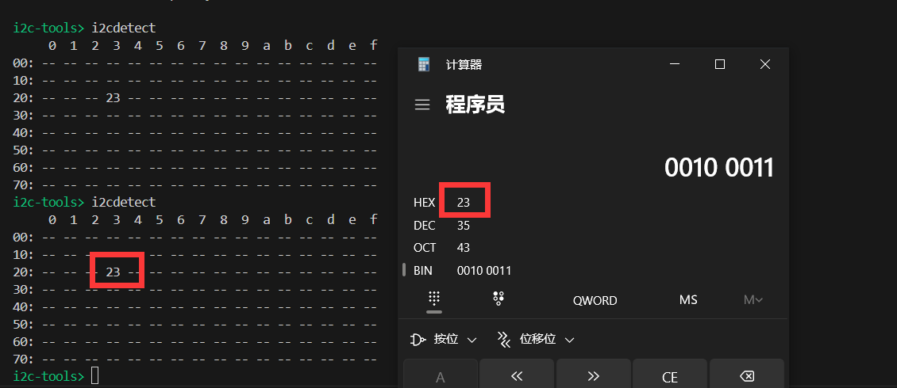
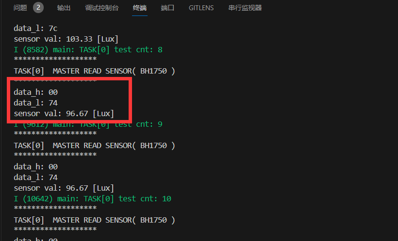

# ESP32外设-I2C入门

> [!TIP] 🚀 ESP32 外设-I2C入门 | 快速实现设备通信  
> - 💡 **碎碎念**😎：本节将介绍 ESP32 的 I2C 外设，帮助你实现多个设备之间的高效通信。  
> - 📺 **视频教程**：🚧 *开发中*  
> - 💾 **示例代码**：[ESP32-Guide/code/04.peripheral/basics/i2c](https://github.com/DuRuofu/ESP32-Guide/tree/main/code/04.peripheral/basics/i2c)


## 一、介绍

I2C 是一种串行同步半双工通信协议，总线上可以同时挂载多个主机和从机。I2C 总线由串行数据线 (SDA) 和串行时钟线 (SCL) 线构成。这些线都需要上拉电阻。


I2C 具有简单且制造成本低廉等优点，主要用于低速外围设备的短距离通信（一英尺以内）。

ESP32 有2个 I2C 控制器（也称为端口），负责处理在 I2C 总线上的通信。每个控制器都可以设置为主机或从机。

关于I2C的详细介绍可以查看我之前写的一篇博客：[IIC协议解析-DuRuofu](https://www.duruofu.top/2024/02/05/4.%E7%A1%AC%E4%BB%B6%E7%9B%B8%E5%85%B3/%E9%80%9A%E8%AE%AF%E5%8D%8F%E8%AE%AE/IIC%E5%8D%8F%E8%AE%AE%E8%A7%A3%E6%9E%90/)和相关科普视频:[4分钟看懂！I2C通讯协议 最简单的总线通讯！](https://www.bilibili.com/video/BV1dg4y1H773/?spm_id_from=333.337.search-card.all.click),这里默认大家了解基本的I2C知识,仅介绍在ESP-IDF环境下如何使用。

我们只需要了解基本的I2C帧结构：

写数据：


读数据：




## 二、使用（主机模式）

### 一、初始化参数配置

#### 1.1 设置参数

包括设置初始化参数（如主机模式或从机模式，SDA 和 SCL 使用的 GPIO 管脚，时钟速度等）

使用`i2c_param_config()`来配置驱动程序，他需要两个参数：

- 参数一：欲配置的I2C通道（`I2C_NUM_0`或`I2C_NUM_1`）
- 参数二：配置参数结构体的指针[`i2c_config_t`](https://docs.espressif.com/projects/esp-idf/zh_CN/release-v5.1/esp32/api-reference/peripherals/i2c.html#_CPPv412i2c_config_t "i2c_config_t") 

[`i2c_config_t`](https://docs.espressif.com/projects/esp-idf/zh_CN/release-v5.1/esp32/api-reference/peripherals/i2c.html#_CPPv412i2c_config_t "i2c_config_t") 结构体中的几个参数如下：

-  设置 I2C **工作模式** - 从 [`i2c_mode_t`](https://docs.espressif.com/projects/esp-idf/zh_CN/release-v5.1/esp32/api-reference/peripherals/i2c.html#_CPPv410i2c_mode_t "i2c_mode_t") 中选择主机模式或从机模式
-  设置 **通信管脚**
	 - 指定 SDA 和 SCL 信号使用的 GPIO 管脚
	 -  是否启用 ESP32 的内部上拉电阻
- （仅限主机模式）设置 I2C **时钟速度**
- （仅限从机模式）设置以下内容：
	- 是否应启用 **10 位寻址模式**
	- 定义 **从机地址**

配置示例（主机）：

```c
int i2c_master_port = 0;
i2c_config_t conf = {
    .mode = I2C_MODE_MASTER,
    .sda_io_num = I2C_MASTER_SDA_IO,         // 配置 SDA 的 GPIO
    .sda_pullup_en = GPIO_PULLUP_ENABLE,
    .scl_io_num = I2C_MASTER_SCL_IO,         // 配置 SCL 的 GPIO
    .scl_pullup_en = GPIO_PULLUP_ENABLE,
    .master.clk_speed = I2C_MASTER_FREQ_HZ,  // 为项目选择频率
    .clk_flags = 0,          // 可选项，可以使用 I2C_SCLK_SRC_FLAG_* 标志来选择 I2C 源时钟
};
```

在此阶段，[`i2c_param_config()`](https://docs.espressif.com/projects/esp-idf/zh_CN/release-v5.1/esp32/api-reference/peripherals/i2c.html#_CPPv416i2c_param_config10i2c_port_tPK12i2c_config_t "i2c_param_config") 还将其他 I2C 配置参数设置为 I2C 总线协议规范中定义的默认值。有关默认值及修改默认值的详细信息，请参考 [用户自定义配置](https://docs.espressif.com/projects/esp-idf/zh_CN/release-v5.1/esp32/api-reference/peripherals/i2c.html#i2c-api-customized-configuration)。

时钟源(`clk_flags`)：

| 参数                            | 值   | 含义                                            |
| ----------------------------- | --- | --------------------------------------------- |
| I2C_SCLK_SRC_FLAG_FOR_NOMA    | 0   | **仅根据所需频率**进行**自动**选择时钟。（**不支持特殊功能**，如 APB 等） |
| I2C_SCLK_SRC_FLAG_AWARE_DFS   | 1   | 当 APB 时钟改变时，时钟的波特率不会改变。                       |
| I2C_SCLK_SRC_FLAG_LIGHT_SLEEP | 2   | 用于轻度睡眠模式                                      |
一般配置为0即可。

#### 1.2 安装驱动程序

配置好 I2C 驱动程序后，使用以下参数调用函数 [`i2c_driver_install()`](https://docs.espressif.com/projects/esp-idf/zh_CN/release-v5.1/esp32/api-reference/peripherals/i2c.html#_CPPv418i2c_driver_install10i2c_port_t10i2c_mode_t6size_t6size_ti "i2c_driver_install") 安装驱动程序：

| 参数名                | 含义                                                                                                                                                                      | 类型           |
| ------------------ | ----------------------------------------------------------------------------------------------------------------------------------------------------------------------- | ------------ |
| "i2c_num"          | 端口号，从 [`i2c_port_t`](https://docs.espressif.com/projects/esp-idf/zh_CN/release-v5.1/esp32/api-reference/peripherals/i2c.html#_CPPv410i2c_port_t "i2c_port_t") 中二选一      | [i2c_port_t] |
| "mode"             | - 主机或从机模式，从 [`i2c_mode_t`](https://docs.espressif.com/projects/esp-idf/zh_CN/release-v5.1/esp32/api-reference/peripherals/i2c.html#_CPPv410i2c_mode_t "i2c_mode_t") 中选择 | [i2c_mode_t] |
| "slv_rx_buf_len"   | （仅限从机模式），忽略                                                                                                                                                             | [size_t]     |
| "slv_tx_buf_len"   | （仅限从机模式），忽略                                                                                                                                                             | [size_t]     |
| "intr_alloc_flags" | 用于分配中断的标志，忽略中断填0                                                                                                                                                        | [int]        |

安装 I2C 驱动程序后， ESP32 即可与其他 I2C 设备通信。ESP32 的 I2C 控制器在主机模式下负责与 I2C 从机设备建立通信，并发送命令让从机响应，如进行测量并将结果发给主机。

ESP-IDF将数据帧以一个数据容器的格式包装，驱动程序提供一个名为 “命令链接” 的容器，该容器应填充一系列命令，然后传递给 I2C 控制器执行。

我们只需要创建一个空的 `I2C 命令` 对象，然后添加各种子数据帧，例如起始信号，从机地址，读写位，数据，终止信号等。
### 二、写数据



上图展示了我们发送一个命令需要使用的几个函数，通过这几个函数的配合就可以组成一个I2C写数据数据帧。

看一个示例：

```c
i2c_cmd_handle_t cmd = i2c_cmd_link_create();//创建i2c_cmd_handle_t对象
//下面添加各种子数据帧
i2c_master_start(cmd);					        //起始信号
i2c_master_write_byte(cmd, 0x78, true);	        //从机地址及读写位
i2c_master_write(cmd, bytes, datalen, true);	//数据位(数组)
i2c_master_stop(cmd);					        //终止信号
i2c_master_cmd_begin(0, cmd, 1000 / portTICK_PERIOD_MS);//向I2C_NUM_0 发送这个数据帧，timeout设置为1000毫秒
i2c_cmd_link_delete(cmd);//删除i2c_cmd_handle_t对象，释放资源

```

1. 使用 [`i2c_cmd_link_create()`](https://docs.espressif.com/projects/esp-idf/zh_CN/release-v5.1/esp32/api-reference/peripherals/i2c.html#_CPPv419i2c_cmd_link_createv "i2c_cmd_link_create") 创建一个命令链接。
2. **启动位** - [`i2c_master_start()`](https://docs.espressif.com/projects/esp-idf/zh_CN/release-v5.1/esp32/api-reference/peripherals/i2c.html#_CPPv416i2c_master_start16i2c_cmd_handle_t "i2c_master_start")
3. **从机地址** - [`i2c_master_write_byte()`](https://docs.espressif.com/projects/esp-idf/zh_CN/release-v5.1/esp32/api-reference/peripherals/i2c.html#_CPPv421i2c_master_write_byte16i2c_cmd_handle_t7uint8_tb "i2c_master_write_byte")。提供单字节地址作为调用此函数的实参。
4. **数据** - 一个或多个字节的数据作为 [`i2c_master_write()`](https://docs.espressif.com/projects/esp-idf/zh_CN/release-v5.1/esp32/api-reference/peripherals/i2c.html#_CPPv416i2c_master_write16i2c_cmd_handle_tPK7uint8_t6size_tb "i2c_master_write") 的实参。
5. **停止位** - [`i2c_master_stop()`](https://docs.espressif.com/projects/esp-idf/zh_CN/release-v5.1/esp32/api-reference/peripherals/i2c.html#_CPPv415i2c_master_stop16i2c_cmd_handle_t "i2c_master_stop")
6. 调用 [`i2c_master_cmd_begin()`](https://docs.espressif.com/projects/esp-idf/zh_CN/release-v5.1/esp32/api-reference/peripherals/i2c.html#_CPPv420i2c_master_cmd_begin10i2c_port_t16i2c_cmd_handle_t10TickType_t "i2c_master_cmd_begin") 来触发 I2C 控制器执行命令链接。一旦开始执行，就不能再修改命令链接。
7. 命令发送后，通过调用 [`i2c_cmd_link_delete()`](https://docs.espressif.com/projects/esp-idf/zh_CN/release-v5.1/esp32/api-reference/peripherals/i2c.html#_CPPv419i2c_cmd_link_delete16i2c_cmd_handle_t "i2c_cmd_link_delete") 释放命令链接使用的资源。

### 三、读数据



上图展示了我们发送一个命令需要使用的几个函数，通过这几个函数的配合就可以组成一个I2C读数据数据帧。

在读取数据时，在上图的步骤 4 中，不是用 `i2c_master_write...`，而是用 [`i2c_master_read_byte()`](https://docs.espressif.com/projects/esp-idf/zh_CN/release-v5.1/esp32/api-reference/peripherals/i2c.html#_CPPv420i2c_master_read_byte16i2c_cmd_handle_tP7uint8_t14i2c_ack_type_t "i2c_master_read_byte") 和/或 [`i2c_master_read()`](https://docs.espressif.com/projects/esp-idf/zh_CN/release-v5.1/esp32/api-reference/peripherals/i2c.html#_CPPv415i2c_master_read16i2c_cmd_handle_tP7uint8_t6size_t14i2c_ack_type_t "i2c_master_read") 填充命令链接。

`i2c_master_read()`，它的第二个参数`data `的含义变为用于接收数据的缓冲区地址（`uint8_t`数组指针即可），第三个参数`datalen`变为所需要接受数据的长度。第四个参数`ack`为主机是否发送应答信号。发送则为` I2C_MASTER_ACK`  ，若每个byte都非应答则为`I2C_MASTER_NACK`。若只有最后一个字节（接收到数据大于`datalen`之后）才非应答，则为`I2C_MASTER_LAST_NACK`

`i2c_master_read_byte()`，第二个参数`data`也变成了用于接受数据的缓冲区地址，类型为`uint8_t`的变量指针即可。


### 四、其他配置

#### 4.1 自定义时序

配置环节函数 [`i2c_param_config()`](https://docs.espressif.com/projects/esp-idf/zh_CN/release-v5.1/esp32/api-reference/peripherals/i2c.html#_CPPv416i2c_param_config10i2c_port_tPK12i2c_config_t "i2c_param_config") 在初始化 I2C 端口的驱动程序配置时，也会将几个 I2C 通信参数设置为 I2C 总线协议规范规定的默认值。其他一些相关参数已在 I2C 控制器的寄存器中预先配置。

通过调用下表中提供的专用函数，可以将所有这些参数更改为用户自定义值。请注意，时序值是在 APB 时钟周期中定义。

| 要更改的参数                                                                                                                                                                                                                | 函数                                                                                                                                                                                                                             |
| --------------------------------------------------------------------------------------------------------------------------------------------------------------------------------------------------------------------- | ------------------------------------------------------------------------------------------------------------------------------------------------------------------------------------------------------------------------------ |
| SCL 脉冲周期的高电平和低电平                                                                                                                                                                                                      | [`i2c_set_period()`](https://docs.espressif.com/projects/esp-idf/zh_CN/release-v5.1/esp32/api-reference/peripherals/i2c.html#_CPPv414i2c_set_period10i2c_port_tii "i2c_set_period")                                            |
| 在产生 **启动** 信号期间使用的 SCL 和 SDA 信号时序                                                                                                                                                                                     | [`i2c_set_start_timing()`](https://docs.espressif.com/projects/esp-idf/zh_CN/release-v5.1/esp32/api-reference/peripherals/i2c.html#_CPPv420i2c_set_start_timing10i2c_port_tii "i2c_set_start_timing")                          |
| 在产生 **停止** 信号期间使用的 SCL 和 SDA 信号时序                                                                                                                                                                                     | [`i2c_set_stop_timing()`](https://docs.espressif.com/projects/esp-idf/zh_CN/release-v5.1/esp32/api-reference/peripherals/i2c.html#_CPPv419i2c_set_stop_timing10i2c_port_tii "i2c_set_stop_timing")                             |
| 从机采样以及主机切换时，SCL 和 SDA 信号之间的时序关系                                                                                                                                                                                       | [`i2c_set_data_timing()`](https://docs.espressif.com/projects/esp-idf/zh_CN/release-v5.1/esp32/api-reference/peripherals/i2c.html#_CPPv419i2c_set_data_timing10i2c_port_tii "i2c_set_data_timing")                             |
| I2C 超时                                                                                                                                                                                                                | [`i2c_set_timeout()`](https://docs.espressif.com/projects/esp-idf/zh_CN/release-v5.1/esp32/api-reference/peripherals/i2c.html#_CPPv415i2c_set_timeout10i2c_port_ti "i2c_set_timeout")                                          |
| 优先发送/接收最高有效位 (LSB) 或最低有效位 (MSB），可在 [`i2c_trans_mode_t`](https://docs.espressif.com/projects/esp-idf/zh_CN/release-v5.1/esp32/api-reference/peripherals/i2c.html#_CPPv416i2c_trans_mode_t "i2c_trans_mode_t") 定义的模式中选择 | [`i2c_set_data_mode()`](https://docs.espressif.com/projects/esp-idf/zh_CN/release-v5.1/esp32/api-reference/peripherals/i2c.html#_CPPv417i2c_set_data_mode10i2c_port_t16i2c_trans_mode_t16i2c_trans_mode_t "i2c_set_data_mode") |
上述每个函数都有一个 __get__ 对应项来检查当前设置的值。例如，调用 [`i2c_get_timeout()`](https://docs.espressif.com/projects/esp-idf/zh_CN/release-v5.1/esp32/api-reference/peripherals/i2c.html#_CPPv415i2c_get_timeout10i2c_port_tPi "i2c_get_timeout") 来检查 I2C 超时值。

通过函数 [`i2c_set_pin()`](https://docs.espressif.com/projects/esp-idf/zh_CN/release-v5.1/esp32/api-reference/peripherals/i2c.html#_CPPv411i2c_set_pin10i2c_port_tiibb10i2c_mode_t "i2c_set_pin") 可以为 SDA 和 SCL 信号选择不同的管脚并改变上拉配置。如果要修改已经输入的值，请使用函数 [`i2c_param_config()`](https://docs.espressif.com/projects/esp-idf/zh_CN/release-v5.1/esp32/api-reference/peripherals/i2c.html#_CPPv416i2c_param_config10i2c_port_tPK12i2c_config_t "i2c_param_config")。

> ESP32 的内部上拉电阻范围为几万欧姆，因此在大多数情况下，它们本身不足以用作 I2C 上拉电阻。建议用户使用阻值在 I2C 总线协议规范规定范围内的上拉电阻。计算阻值的具体方法，可参考 [TI 应用说明](https://www.ti.com/lit/an/slva689/slva689.pdf)

#### 4.2 删除驱动程序

当使用 [`i2c_driver_install()`](https://docs.espressif.com/projects/esp-idf/zh_CN/release-v5.1/esp32/api-reference/peripherals/i2c.html#_CPPv418i2c_driver_install10i2c_port_t10i2c_mode_t6size_t6size_ti "i2c_driver_install") 建立 I2C 通信，一段时间后不再需要 I2C 通信时，可以通过调用 [`i2c_driver_delete()`](https://docs.espressif.com/projects/esp-idf/zh_CN/release-v5.1/esp32/api-reference/peripherals/i2c.html#_CPPv417i2c_driver_delete10i2c_port_t "i2c_driver_delete") 来移除驱动程序以释放分配的资源。

由于函数 [`i2c_driver_delete()`](https://docs.espressif.com/projects/esp-idf/zh_CN/release-v5.1/esp32/api-reference/peripherals/i2c.html#_CPPv417i2c_driver_delete10i2c_port_t "i2c_driver_delete") 无法保证线程安全性，请在调用该函数移除驱动程序前务必确保所有的线程都已停止使用驱动程序。

#### 4.3 I2C中断

I2C 工作过程会产生多种中断，安装驱动程序时会安装默认中断处理程序。

当然，您可以通过调用函数 i2c_isr_register() 来注册自己的而不是默认的中断处理程序。无论何时，中断服务程序（ISR）都应保持简短！

在运行自己的中断处理程序时，可以参考 ESP32 技术参考手册 > I2C 控制器 (I2C) > 中断 ，以获取有关 I2C 控制器触发的中断描述。

这个入门教程就不再详述。

## 三、案例

下面我们尝试使用I2C来读取一个 BH1750 环境光传感器（GY-30 模块）






这里我将地址引脚拉低，将地址配置为：0100011
### 3.1 i2c_tools使用

在IDF示例目录下有一个`i2c_tools`工具：

```
/esp/esp-idf/examples/peripherals/i2c/i2c_tools
```

成功运行这个工程之后我们看到会：



[I2C Tools](https://i2c.wiki.kernel.org/index.php/I2C_Tools) 是一个简单但非常有用的工具，用于开发 I2C 相关应用程序，在 Linux 平台中也很有名。这个例子只是实现了基于 [esp32 控制台组件](https://docs.espressif.com/projects/esp-idf/en/latest/esp32/api-reference/system/console.html)的 [I2C 工具](https://i2c.wiki.kernel.org/index.php/I2C_Tools)的一些基本功能。如下所示，此示例支持五个命令行工具：

1. `i2cconfig`：它将使用特定的 GPIO 编号、端口号和频率配置 I2C 总线。
2. `i2cdetect`：它将扫描 I2C 总线中的设备，并输出一个表格，其中包含总线上检测到的设备列表。
3. `i2cget`：它将读取通过 I2C 总线可见的寄存器。
4. `i2cset`：它将设置通过 I2C 总线可见的寄存器。
5. `i2cdump`：它将检查通过 I2C 总线可见的寄存器。

i2c-tools默认使用gpio18 和gpio19.可以使用i2cconfig 修改i2c配置。这里我们就将i2c的两个数据线接到gpio18 和gpio19.

使用i2cdetect，我们成功找到了 BH1750的芯片地址，说明硬件连接无误。




### 3.1 使用I2C读取BH1750数据

```c
#include <stdio.h>
#include "esp_log.h"
#include "driver/i2c.h"
#include "sdkconfig.h"

static const char *TAG = "main";


// I2C Master 配置
#define I2C_MASTER_SCL_IO  19              /*!< gpio number for I2C master clock */
#define I2C_MASTER_SDA_IO  18              /*!< gpio number for I2C master data  */
#define I2C_MASTER_NUM  I2C_NUM_0          /*!< I2C port number for master dev */
#define I2C_MASTER_FREQ_HZ 100000          /*!< I2C master clock frequency */
#define I2C_MASTER_TX_BUF_DISABLE 0        /*!< I2C master doesn't need buffer */
#define I2C_MASTER_RX_BUF_DISABLE 0        /*!< I2C master doesn't need buffer */

// BH1750 Sensor 配置
#define BH1750_SENSOR_ADDR 0x23  //0010_0011    // 传感器地址
#define BH1750_CMD_START   0x23  //0010_0011	// 传感器模式:单次采集模式
#define WRITE_BIT I2C_MASTER_WRITE              // I2C 读取位 :1
#define READ_BIT I2C_MASTER_READ                // I2C 写入位 :0
#define ACK_CHECK_EN 0x1                        // 检测从机应答
#define ACK_CHECK_DIS 0x0                       // 不检测从机应答
#define ACK_VAL 0x0                             // 响应值
#define NACK_VAL 0x1                            // 无响应值

/**
 * @brief test code to operate on BH1750 sensor
 *
 * 1. set operation mode(e.g One time L-resolution mode)
 * _________________________________________________________________
 * | start | slave_addr + wr_bit + ack | write 1 byte + ack  | stop |
 * --------|---------------------------|---------------------|------|
 * 2. wait more than 24 ms
 * 3. read data
 * ______________________________________________________________________________________
 * | start | slave_addr + rd_bit + ack | read 1 byte + ack  | read 1 byte + nack | stop |
 * --------|---------------------------|--------------------|--------------------|------|
 */
static esp_err_t i2c_master_sensor_test(i2c_port_t i2c_num, uint8_t *data_h, uint8_t *data_l)
{
    int ret;
    i2c_cmd_handle_t cmd = i2c_cmd_link_create();     // 创建I2C命令
    i2c_master_start(cmd);						      // 起始信号
    i2c_master_write_byte(cmd, BH1750_SENSOR_ADDR << 1 | WRITE_BIT, ACK_CHECK_EN); //从机地址及读写位
    i2c_master_write_byte(cmd, BH1750_CMD_START, ACK_CHECK_EN);					   //数据位(数组)	
    i2c_master_stop(cmd);														   //终止信号
    ret = i2c_master_cmd_begin(i2c_num, cmd, 1000 / portTICK_PERIOD_MS);		   //i2c_num 发送这个数据帧，timeout设置为1000毫秒
    i2c_cmd_link_delete(cmd);					     //删除i2c_cmd_handle_t对象，释放资源
    if (ret != ESP_OK) {
        return ret;
    }
    vTaskDelay(30 / portTICK_PERIOD_MS);
    cmd = i2c_cmd_link_create();
    i2c_master_start(cmd);
    i2c_master_write_byte(cmd, BH1750_SENSOR_ADDR << 1 | READ_BIT, ACK_CHECK_EN);   //从机地址及读写位
    i2c_master_read_byte(cmd, data_h, ACK_VAL);										//读取数据(高位)
    i2c_master_read_byte(cmd, data_l, NACK_VAL);									//读取数据(低位)
    i2c_master_stop(cmd);
    ret = i2c_master_cmd_begin(i2c_num, cmd, 1000 / portTICK_PERIOD_MS);
    i2c_cmd_link_delete(cmd);
    return ret;
}

/**
 * @brief I2C master initialization
 */
static esp_err_t i2c_master_init(void)
{
	// 配置I2C
    int i2c_master_port = I2C_MASTER_NUM;
    i2c_config_t conf = {
        .mode = I2C_MODE_MASTER,
        .sda_io_num = I2C_MASTER_SDA_IO,
        .sda_pullup_en = GPIO_PULLUP_ENABLE,
        .scl_io_num = I2C_MASTER_SCL_IO,
        .scl_pullup_en = GPIO_PULLUP_ENABLE,
        .master.clk_speed = I2C_MASTER_FREQ_HZ,
        // .clk_flags = 0,          /*!< Optional, you can use I2C_SCLK_SRC_FLAG_* flags to choose i2c source clock here. */
    };
    esp_err_t err = i2c_param_config(i2c_master_port, &conf);
    if (err != ESP_OK) {
        return err;
    }
	// 安装I2C驱动
    return i2c_driver_install(i2c_master_port, conf.mode, I2C_MASTER_RX_BUF_DISABLE, I2C_MASTER_TX_BUF_DISABLE, 0);
}


static void i2c_task(void *arg)
{
    int ret;				// Return value
    int task_idx = (int)arg;
    uint8_t sensor_data_h, sensor_data_l;
    int cnt = 0;

    while (1) {
		// 读取数据
        ESP_LOGI(TAG, "TASK[%d] test cnt: %d", task_idx, cnt++);
        ret = i2c_master_sensor_test(I2C_MASTER_NUM, &sensor_data_h, &sensor_data_l);
        if (ret == ESP_ERR_TIMEOUT) {
            ESP_LOGE(TAG, "I2C Timeout");
        } else if (ret == ESP_OK) {
            printf("*******************\n");
            printf("TASK[%d]  MASTER READ SENSOR( BH1750 )\n", task_idx);
            printf("*******************\n");
            printf("data_h: %02x\n", sensor_data_h);
            printf("data_l: %02x\n", sensor_data_l);
            printf("sensor val: %.02f [Lux]\n", (sensor_data_h << 8 | sensor_data_l) / 1.2);
        } else {
            ESP_LOGW(TAG, "%s: No ack, sensor not connected...skip...", esp_err_to_name(ret));
        }
		vTaskDelay(1000 / portTICK_PERIOD_MS);
    }

}

void app_main(void)
{
	// 初始化I2C
    ESP_ERROR_CHECK(i2c_master_init());
	// 创建I2C采集任务
    xTaskCreate(i2c_task, "i2c_task", 1024 * 2, (void *)0, 10, NULL);
}

```

这段程序是一个基于ESP32开发板的示例代码，用于通过I2C总线与BH1750光照传感器通信。程序中首先进行了I2C主设备的初始化配置，然后定义了读取传感器数据的函数`i2c_master_sensor_test`。在任务函数`i2c_task`中，循环读取传感器数据并打印输出，显示光照传感器采集到的数据值。最后，在`app_main`函数中初始化I2C，并创建了一个任务来执行I2C数据采集操作。

细节部分都有注释说明，在此不再详细指出。

效果：



# 参考链接

1. https://docs.espressif.com/projects/esp-idf/zh_CN/release-v5.1/esp32/api-reference/peripherals/i2c.html
2. https://www.bilibili.com/video/BV1dg4y1H773/?spm_id_from=333.337.search-card.all.click
3. https://www.duruofu.top/2024/02/05/4.%E7%A1%AC%E4%BB%B6%E7%9B%B8%E5%85%B3/%E9%80%9A%E8%AE%AF%E5%8D%8F%E8%AE%AE/IIC%E5%8D%8F%E8%AE%AE%E8%A7%A3%E6%9E%90/