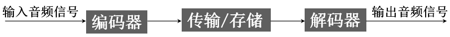
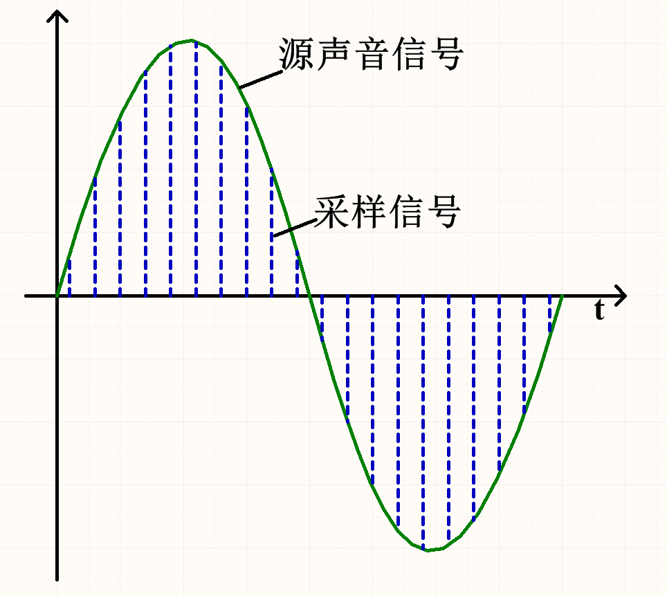

# ESP32外设-I2S入门

## 一、概念

### 1.1 数字音频介绍

现实生活中的声音是通过一定介质传播的连续的波，它可以由周期和振幅两个重要指标描述。正常人可以听到的声音频率范围为20Hz~20KHz。 现实存在的声音是模拟量，这对声音保存和长距离传输造成很大的困难，一般的做法是把模拟量转成对应的数字量保存，在需要还原声音的地方再把数字量的转成模拟量输出

模拟量转成数字量过程，一般可以分为三个过程，分别为采样、量化、编码。 用一个比源声音频率高的采样信号去量化源声音，记录每个采样点的值，最后如果把所有采样点数值连接起来与源声音曲线是互相吻合的， 只是它不是连续的。在图中两条蓝色虚线距离就是采样信号的周期，即对应一个采样频率(FS)， 可以想象得到采样频率越高最后得到的结果就与源声音越吻合，但此时采样数据量越越大，一般使用44.1KHz采样频率即可得到高保真的声音。 每条蓝色虚线长度决定着该时刻源声音的量化值，该量化值有另外一个概念与之挂钩，就是量化位数。量化位数表示每个采样点用多少位表示数据范围， 常用有16bit、24bit或32bit，位数越高最后还原得到的音质越好，数据量也会越大。

>以上关于数字音频部分介绍来自[野火STM32教程](https://doc.embedfire.com/mcu/stm32/f429tiaozhanzhe/std/zh/latest/book/I2S.html)，在此仅作学习记录，如有侵权请联系删除。

### 1.2 I2S介绍

Inter-IC Sount Bus(I2S)是飞利浦半导体公司(现为恩智浦半导体公司)针对数字音频设备之间的音频数据传输而制定的一种总线标准。 在飞利浦公司的I2S标准中，既规定了硬件接口规范，也规定了数字音频数据的格式。

典型一条I²S总线至少由3条传输线组成：

**SCK: (continuous serial clock)  串行时钟**：标准名称为“连续串列主频”

**WS: (word select)  字段（声道）选择：** 也称为“帧同步线”

**SD: (serial data)  串行数据 ：** 也可称为SDATA，SDIN，SDOUT，DACDAT，ADCDAT等

## 二、使用

## 三、示例

# 参考链接