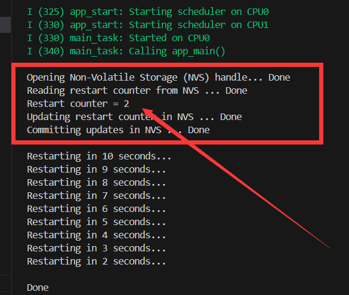

<div STYLE="page-break-after: always;"></div>

# ESP32存储-非易失性存储 (NVS)

> [!TIP] 🚀 **ESP32 存储-非易失性存储 (NVS) | 稳定持久存储解决方案**  
> - 💡 **碎碎念**😎：本节将介绍 ESP32 的非易失性存储 (NVS)，让你轻松保存配置信息及其他数据，即使设备断电也能保持数据。  
> - 📺 **视频教程**：🚧 *开发中*  
> - 💾 **示例代码**：🚧 *开发中*

## 一、介绍

#### 1.1 基本概念

非易失性存储 (NVS) 库主要用于在 flash 中**存储键值格式的数据**。

在分区表一节我们所看到的分区表里都有一个nvs分区，如下（第一条分区）：
```c
# Name,   Type, SubType, Offset,  Size, Flags
nvs,      data, nvs,     0x9000,  0x4000,
otadata,  data, ota,     0xd000,  0x2000,
phy_init, data, phy,     0xf000,  0x1000,
factory,  app,  factory, 0x10000,  1M,
```

NVS 库通过调用 [esp_partition](https://docs.espressif.com/projects/esp-idf/zh_CN/latest/esp32/api-reference/storage/partition.html#flash-partition-apis) API 使用主 flash 的部分空间，即类型为 `data` 且子类型为 `nvs` 的所有分区。这部分空间就是留给我们充当键值对数据存储的。

>NVS 最适合存储一些较小的数据，而非字符串或二进制大对象 (BLOB) 等较大的数据。如需存储较大的 BLOB 或者字符串，请考虑使用基于磨损均衡库的 FAT 文件系统。
>如果NVS分区被截断，比如更改分区表布局的时候，应该擦除分区内容。可以使用 `idf.py erase_flash` 命令擦除flash上全部的内容。

#### 1.2 键值对细节

NVS 的操作对象为键值对，其中键是 ASCII 字符串，当前支持最大键长为 15 个字符，值可以为以下几种类型：
整数型： uint8_t、int8_t、uint16_t、int16_t、uint32_t、int32_t、uint64_t 和 int64_t；
字符型： 以 \0 结尾的字符串；
二进制数据： 可变长度的二进制数据 (BLOB)。

键必须唯一。为现有的键写入新值时，会将旧的值及数据类型更新为写入操作指定的值和数据类型。

读取值时会执行数据类型检查。如果读取操作预期的数据类型与对应键的数据类型不匹配，则返回错误。

#### 1.3 命名空间

为了减少不同组件之间键名的潜在冲突，NVS 将每个键值对分配给一个命名空间。命名空间的命名规则遵循键名的命名规则，例如，最多可占 15 个字符。此外，单个 NVS 分区最多只能容纳 254 个不同的命名空间。命名空间的名称在调用 [`nvs_open()`](https://docs.espressif.com/projects/esp-idf/zh_CN/latest/esp32/api-reference/storage/nvs_flash.html#_CPPv48nvs_openPKc15nvs_open_mode_tP12nvs_handle_t "nvs_open") 或 [`nvs_open_from_partition`](https://docs.espressif.com/projects/esp-idf/zh_CN/latest/esp32/api-reference/storage/nvs_flash.html#_CPPv423nvs_open_from_partitionPKcPKc15nvs_open_mode_tP12nvs_handle_t "nvs_open_from_partition") 中指定，调用后将返回一个不透明句柄，用于后续调用 `nvs_get_*`、`nvs_set_*` 和 `nvs_commit` 函数。这样，一个句柄关联一个命名空间，键名便不会与其他命名空间中相同键名冲突。

## 二、使用

NVS 程序接口位于 `esp-idf/components/nvs_flash/include/nvs_flash.h`

#### 2.1 初始化

使用函数`nvs_flash_init()`，初始化默认NVS分区（无参数）

> `nvs_flash_erase()`擦除默认NVS分区（标签为“NVS”的分区）的所有内容。

示例：
``` c
// Initialize NVS
esp_err_t err = nvs_flash_init();
if (err == ESP_ERR_NVS_NO_FREE_PAGES || err == ESP_ERR_NVS_NEW_VERSION_FOUND) {
	// NVS partition was truncated and needs to be erased
	// Retry nvs_flash_init
	ESP_ERROR_CHECK(nvs_flash_erase());
	err = nvs_flash_init();
}
ESP_ERROR_CHECK( err );
```
#### 2.2 打开存储空间

使用函数`esp_err_t nvs_open(const char *namespace_name, nvs_open_mode_t open_mode, nvs_handle_t *out_handle)`从默认NVS分区打开具有给定命名空间的非易失性存储。

参数：
- [in] name:命名空间名称。最大长度为(NVS_KEY_NAME_MAX_SIZE-1)个字符。不应该是空的。
- [in] open_mode : NVS_READWRITE 或NVS_READONLY。如果是NVS_READONLY，将打开一个只读句柄。此句柄的所有写入请求都将被拒绝。
- [out] out_handle:如果成功(返回码为零)，将在此参数中返回句柄。

示例：
```c
    nvs_handle_t my_handle;
    err = nvs_open("storage", NVS_READWRITE, &my_handle);
```


#### 2.3 读取API

基本类型：

```c
esp_err_t nvs_get_i8  (nvs_handle_t handle, const char* key, int8_t* out_value);
esp_err_t nvs_get_u8  (nvs_handle_t handle, const char* key, uint8_t* out_value);
esp_err_t nvs_get_i16 (nvs_handle_t handle, const char* key, int16_t* out_value);
esp_err_t nvs_get_u16 (nvs_handle_t handle, const char* key, uint16_t* out_value);
esp_err_t nvs_get_i32 (nvs_handle_t handle, const char* key, int32_t* out_value);
esp_err_t nvs_get_u32 (nvs_handle_t handle, const char* key, uint32_t* out_value);
esp_err_t nvs_get_i64 (nvs_handle_t handle, const char* key, int64_t* out_value);
esp_err_t nvs_get_u64 (nvs_handle_t handle, const char* key, uint64_t* out_value);
```

其他类型(多一个长度的参数)：

``` c
esp_err_t nvs_get_str (nvs_handle_t handle, const char* key, char* out_value, size_t* length);
esp_err_t nvs_get_blob(nvs_handle_t handle, const char* key, void* out_value, size_t* length);

```

这部分api，简单明了，不再此详细解释。

#### 2.4 写入API

基本类型：

``` c
esp_err_t nvs_set_i8  (nvs_handle_t handle, const char* key, int8_t value);
esp_err_t nvs_set_u8  (nvs_handle_t handle, const char* key, uint8_t value);
esp_err_t nvs_set_i16 (nvs_handle_t handle, const char* key, int16_t value);
esp_err_t nvs_set_u16 (nvs_handle_t handle, const char* key, uint16_t value);
esp_err_t nvs_set_i32 (nvs_handle_t handle, const char* key, int32_t value);
esp_err_t nvs_set_u32 (nvs_handle_t handle, const char* key, uint32_t value);
esp_err_t nvs_set_i64 (nvs_handle_t handle, const char* key, int64_t value);
esp_err_t nvs_set_u64 (nvs_handle_t handle, const char* key, uint64_t value);
esp_err_t nvs_set_str (nvs_handle_t handle, const char* key, const char* value);
```

其他类型(多一个length的参数)：
``` c
//用来存储大二进制数据的函数（比如说结构体） esp_err_t nvs_set_blob(nvs_handle_t handle, const char* key, const void* value, size_t length);
```

#### 2.5 释放资源

使用函数`void nvs_close(nvs_handle_t handle)`关闭存储句柄并释放所有已分配的资源。
一旦不再使用nvs_open打开的每个句柄，就应该为该句柄调用此函数。关闭句柄可能不会自动将更改写入非易失性存储器。这必须使用`nvs_commit()`函数显式完成。一旦对句柄调用了此函数，就不应再使用该句柄。

## 三、案例

下面的案例用于在ESP32设备上实现一个简单的重启计数器，并将重启次数存储在非易失性存储中。

```c
#include <stdio.h>
#include <inttypes.h>
#include "freertos/FreeRTOS.h"
#include "freertos/task.h"
#include "esp_system.h"
#include "nvs_flash.h"
#include "nvs.h"

void app_main(void)
{
    // Initialize NVS
    esp_err_t err = nvs_flash_init();
    if (err == ESP_ERR_NVS_NO_FREE_PAGES || err == ESP_ERR_NVS_NEW_VERSION_FOUND) {
        // NVS partition was truncated and needs to be erased
        // Retry nvs_flash_init
        ESP_ERROR_CHECK(nvs_flash_erase());
        err = nvs_flash_init();
    }
    ESP_ERROR_CHECK( err );

    // Open
    printf("\n");
    printf("Opening Non-Volatile Storage (NVS) handle... ");
    nvs_handle_t my_handle;
    err = nvs_open("storage", NVS_READWRITE, &my_handle);
    if (err != ESP_OK) {
        printf("Error (%s) opening NVS handle!\n", esp_err_to_name(err));
    } else {
        printf("Done\n");

        // Read
        printf("Reading restart counter from NVS ... ");
        int32_t restart_counter = 0; // value will default to 0, if not set yet in NVS
        err = nvs_get_i32(my_handle, "restart_counter", &restart_counter);
        switch (err) {
            case ESP_OK:
                printf("Done\n");
                printf("Restart counter = %" PRIu32 "\n", restart_counter);
                break;
            case ESP_ERR_NVS_NOT_FOUND:
                printf("The value is not initialized yet!\n");
                break;
            default :
                printf("Error (%s) reading!\n", esp_err_to_name(err));
        }

        // Write
        printf("Updating restart counter in NVS ... ");
        restart_counter++;
        err = nvs_set_i32(my_handle, "restart_counter", restart_counter);
        printf((err != ESP_OK) ? "Failed!\n" : "Done\n");

        // Commit written value.
        // After setting any values, nvs_commit() must be called to ensure changes are written
        // to flash storage. Implementations may write to storage at other times,
        // but this is not guaranteed.
        printf("Committing updates in NVS ... ");
        err = nvs_commit(my_handle);
        printf((err != ESP_OK) ? "Failed!\n" : "Done\n");

        // Close
        nvs_close(my_handle);
    }

    printf("\n");

    // Restart module
    for (int i = 10; i >= 0; i--) {
        printf("Restarting in %d seconds...\n", i);
        vTaskDelay(1000 / portTICK_PERIOD_MS);
    }
    printf("Restarting now.\n");
    fflush(stdout);
    esp_restart();
}

```

效果：可以记录下重启的次数，不随掉电丢失。



# 参考链接

1. https://docs.espressif.com/projects/esp-idf/zh_CN/release-v5.2/esp32/api-reference/storage/nvs_flash.html#_CPPv48nvs_openPKc15nvs_open_mode_tP12nvs_handle_t