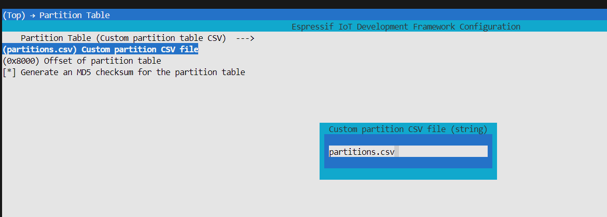
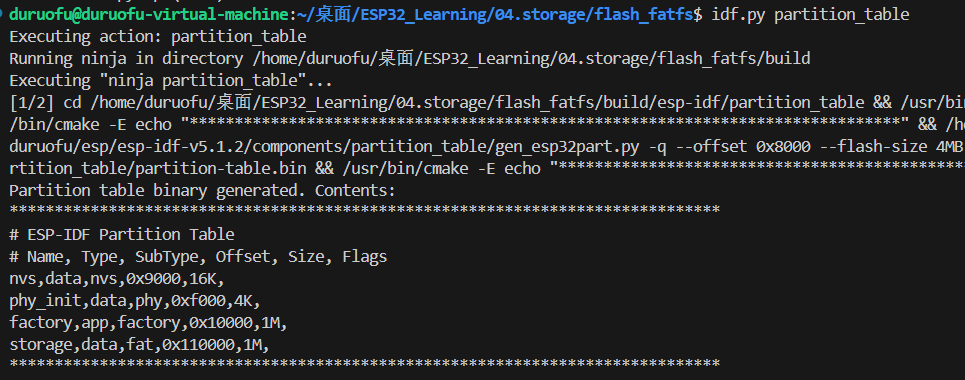
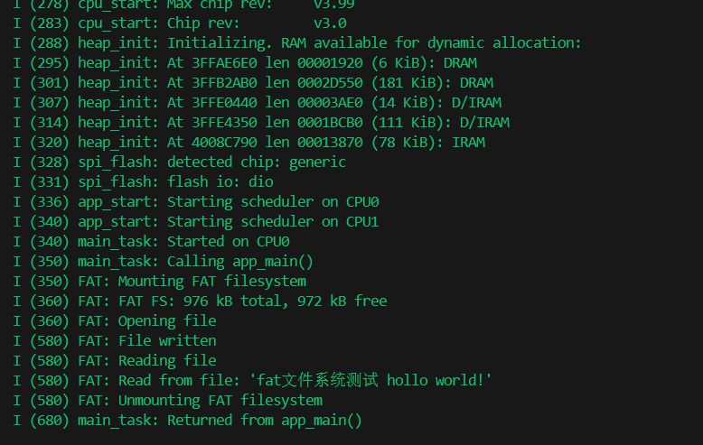
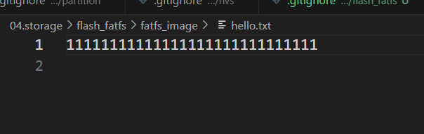

<div STYLE="page-break-after: always;"></div>

# ESP32存储-VFS虚拟文件系统

## 一、介绍

#### 1.1 什么是VFS

虚拟文件系统的作用是：使得计算机上层的软件，能够用单一的方式，来跟底层不同的文件系统沟通（无论是真实的文件系统还是虚拟的文件系统）。在操作系统与之下的各种文件系统之间，虚拟文件系统提供了标准的操作接口，将所有不同种类的文件系统统一起来。

我们常说”Linux下一切皆文件“，指的就是Linux通过VFS把一切设备都抽象成一个统一的文件系统，从设备读取数据视为向“文件”读取数据，向设备发送数据视为写数据到“文件”。并且不同的“文件”之间读写方式相同。

Linux这时候不再需要关注这个设备具体读写方式的区别，而直接使用相同的高层操作完成与外设的数据交互。
#### 1.2 ESP32的VFS

ESP32借助这种概念，设计了虚拟文件系统 (VFS) 组件，为驱动程序提供一个统一接口，可以操作类文件对象。这类驱动程序可以是 FAT、SPIFFS 等真实文件系统，也可以是提供文件类接口的设备驱动程序。

ESP32的VFS支持`fprintf` `fopen`等标准C库函数，调用这个函数本质上就是对VFS的访问。并提供了“路径”“文件描述符”等概念。不同的文件系统通过文件路劲来区分。

如，可以使用 /fat 前缀注册 FAT 文件系统驱动程序，并调用 `fopen(“/fat/file.txt”，“w”)`。然后，VFS 组件将调用 FAT 驱动程序的 `open` 函数并将 `/file.txt` 参数传递给它(以及适当的模式标志)。对返回的 `FILE *` 流的所有后续 C 库函数调用也将被转发到 FAT 驱动程序。

对于VFS，我们可以通过手动实现读与写来挂载文件系统。除此之外，ESP-IDF提供了大量简化API为开发者实现了挂载常用的文件系统，如：

- 挂载ESP32或模组内部`flash`为`Fat`文件系统
- 挂载SD卡为`Fat`文件系统
- ·······

##### 1.2.1 VFS的挂载点和路径
一个标准ESP32 VFS路径如下所示
```
/挂载点/static/index.html
```
上面的示例包含了“挂载点”和“路径”

- **挂载点名称必须以路径分隔符 (`/`) 开头，且分隔符后至少包含一个字符**，一个挂载点被认为成一个文件系统，`/`不是根文件系统。
- VFS允许多层挂载点，可以将 `/storage/sdcard`作为挂载点
  
##### 1.2.2 文件描述符

文件描述符是一组很小的正整数，从 `0` 到 `FD_SETSIZE - 1`，`FD_SETSIZE` 定义在 `sys/select.h`。最大文件描述符由 `CONFIG_LWIP_MAX_SOCKETS` 定义，且为套接字保留。VFS 中包含一个名为 `s_fd_table` 的查找表，用于将全局文件描述符映射至 `s_vfs` 数组中注册的 VFS 驱动索引。

##### 1.2.3 标准IO流: `stdin`、`stdout`、`stderr`

如果 menuconfig 中 `UART for console output` 选项没有设置为 `None`，则 `stdin`、 `stdout` 和 `stderr` 将默认从 UART 读取或写入。UART0 或 UART1 可用作标准 IO。默认情况下，UART0 使用 115200 波特率，TX 管脚为 GPIO1，RX 管脚为 GPIO3。上述参数可以在 menuconfig 中更改。

## 二、使用VFS虚拟文件系统( FatFs)


### 将内部flash挂载为Fat文件系统

##### 2.1 新建工程，准备自定义分区表

在分区表里添加 fat 文件系统的分区

```c
# ESP-IDF Partition Table
# Name,   Type, SubType, Offset,  Size, Flags
nvs,      data, nvs,     0x9000,  0x4000,
phy_init, data, phy,     0xf000,  0x1000,
factory,  app,  factory, 0x10000,  1M,
storage,  data, fat,     0x110000, 1M,

```

选择自定义分区表：



配置好可以使用`idf.py partition_table`生成二进制分区表



##### 2.2 挂载文件系统

使用`esp_vfs_fat_spiflash_mount_rw_wl()`在SPI闪存中初始化FAT文件系统并在VFS中注册。

- **base_path:** FATFS 分区应该挂载的路径（例如 "/spiflash"）。
- **partition_label:** 应该使用的分区标签。
- **mount_config:** 针对挂载 FATFS 的额外参数结构体指针。
- **wl_handle:** [输出] 磨损平衡驱动程序句柄。
**返回值:**
- **ESP_OK:** 成功。
- **ESP_ERR_NOT_FOUND:** 如果分区表中不包含具有给定标签的 FATFS 分区。
- **ESP_ERR_INVALID_STATE:** 如果已经调用了 esp_vfs_fat_spiflash_mount_rw_wl。
- **ESP_ERR_NO_MEM:** 如果无法分配内存。
- **ESP_FAIL:** 如果无法挂载分区。

`mount_config`是一个针对挂载 FATFS 的额外参数配置结构体，原形为`esp_vfs_fat_mount_config_t`,参数如下：

- **format_if_mount_failed:** 如果 FAT 分区无法挂载，且此参数为 true，则创建分区表并格式化文件系统。
- **max_files:** 最大打开文件数。
- **allocation_unit_size:** 如果设置了 format_if_mount_failed 并且挂载失败，使用给定的分配单元大小格式化卡。必须是2的幂，在扇区大小和128*扇区大小之间。对于 SD 卡，扇区大小始终为512字节。对于磨损平衡，扇区大小由 CONFIG_WL_SECTOR_SIZE 选项确定。使用较大的分配单元大小将导致更高的读/写性能和在存储小文件时更高的开销。
- **disk_status_check_enable:** 启用真实的 ff_disk_status 函数实现以用于 SD 卡（ff_sdmmc_status）。可能会降低 IO 性能。如果需要处理 SD 卡未正确卸载就物理移除或者遇到 SD 卡问题的情况，请尝试启用。对于其他存储介质则不起作用。

``` c
// Mount FATFS partition
static bool mount_fatfs(const char* partition_label)
{
    ESP_LOGI(TAG, "Mounting FAT filesystem");
    const esp_vfs_fat_mount_config_t mount_config = {
            .max_files = 4,
            .format_if_mount_failed = true,
            .allocation_unit_size = CONFIG_WL_SECTOR_SIZE
    };
    esp_err_t err = esp_vfs_fat_spiflash_mount_rw_wl(base_path, partition_label, &mount_config, &s_wl_handle);
    if (err != ESP_OK) {
        ESP_LOGE(TAG, "Failed to mount FATFS (%s)", esp_err_to_name(err));
        return false;
    }
    return true;
}

```

### 使用标准C库读写文件

示例：

``` c
    // Create a file in FAT FS
    ESP_LOGI(TAG, "Opening file");
    FILE *f = fopen("/flash/hello.txt", "wb");
    if (f == NULL) {
        ESP_LOGE(TAG, "Failed to open file for writing");
        return;
    }
    fprintf(f, "fat文件系统测试 %s\n", "hollo world!");
    fclose(f);
    ESP_LOGI(TAG, "File written");

    // Open file for reading
    ESP_LOGI(TAG, "Reading file");
    f = fopen("/flash/hello.txt", "rb");
    if (f == NULL) {
        ESP_LOGE(TAG, "Failed to open file for reading");
        return;
    }
    char line[128];
    fgets(line, sizeof(line), f);
    fclose(f);
    // strip newline
    char *pos = strchr(line, '\n');
    if (pos) {
        *pos = '\0';
    }
    ESP_LOGI(TAG, "Read from file: '%s'", line);
```

1. `fopen` 函数：用于打开一个文件，并返回一个指向该文件的文件指针。在这段代码中，它被用于打开 "/flash/hello.txt" 文件，以便进行写入和读取操作。第二个参数 "wb" 表示以写入模式打开文件，"rb" 表示以读取模式打开文件。
    
2. `fprintf` 函数：用于把格式化的数据写入文件中。在这段代码中，它被用于向文件中写入一行格式化的文本内容。
    
3. `fclose` 函数：用于关闭先前通过 `fopen` 打开的文件。在这段代码中，它被用于关闭文件句柄，确保文件被正确地写入到存储介质中。
    
4. `fgets` 函数：用于从文件中读取一行数据。在这段代码中，它被用于读取 "/flash/hello.txt" 文件中的内容。

### 卸载文件系统

``` c
ESP_LOGI(TAG, "Unmounting FAT filesystem");
esp_err_t unmount_err = esp_vfs_fat_spiflash_unmount_rw_wl(base_path, s_wl_handle);
if (unmount_err != ESP_OK) {
	ESP_LOGE(TAG, "Failed to unmount FATFS (%s)", esp_err_to_name(unmount_err));
	return;
}
```

## 三、示例

``` c

#include <stdlib.h>
#include <stdio.h>
#include <string.h>
#include "esp_flash.h"
#include "esp_vfs.h"
#include "esp_vfs_fat.h"
#include "esp_system.h"

static const char *TAG = "FAT";

// Handle of the wear levelling library instance
static wl_handle_t s_wl_handle = WL_INVALID_HANDLE;

// Mount path for the partition
const char *base_path = "/flash";

// Mount FATFS partition
static bool mount_fatfs(const char* partition_label)
{
    ESP_LOGI(TAG, "Mounting FAT filesystem");
    const esp_vfs_fat_mount_config_t mount_config = {
            .max_files = 4,
            .format_if_mount_failed = true,
            .allocation_unit_size = CONFIG_WL_SECTOR_SIZE
    };
    esp_err_t err = esp_vfs_fat_spiflash_mount_rw_wl(base_path, partition_label, &mount_config, &s_wl_handle);
    if (err != ESP_OK) {
        ESP_LOGE(TAG, "Failed to mount FATFS (%s)", esp_err_to_name(err));
        return false;
    }
    return true;
}

void app_main(void)
{
  	const char *partition_label = "storage";
    // Initialize FAT FS in the partition
    if (!mount_fatfs(partition_label)) {
        return;
    }

    // Print FAT FS size information
    uint64_t bytes_total, bytes_free;
    esp_vfs_fat_info(base_path, &bytes_total, &bytes_free);
    ESP_LOGI(TAG, "FAT FS: %" PRIu64 " kB total, %" PRIu64 " kB free", bytes_total / 1024, bytes_free / 1024);

    // Create a file in FAT FS
    ESP_LOGI(TAG, "Opening file");
    FILE *f = fopen("/flash/hello.txt", "wb");
    if (f == NULL) {
        ESP_LOGE(TAG, "Failed to open file for writing");
        return;
    }
    fprintf(f, "fat文件系统测试 %s\n", "hollo world!");
    fclose(f);
    ESP_LOGI(TAG, "File written");

    // Open file for reading
    ESP_LOGI(TAG, "Reading file");
    f = fopen("/flash/hello.txt", "rb");
    if (f == NULL) {
        ESP_LOGE(TAG, "Failed to open file for reading");
        return;
    }
    char line[128];
    fgets(line, sizeof(line), f);
    fclose(f);
    // strip newline
    char *pos = strchr(line, '\n');
    if (pos) {
        *pos = '\0';
    }
    ESP_LOGI(TAG, "Read from file: '%s'", line);
	// Unmount FAT FS
	ESP_LOGI(TAG, "Unmounting FAT filesystem");
	esp_err_t unmount_err = esp_vfs_fat_spiflash_unmount_rw_wl(base_path, s_wl_handle);
	if (unmount_err != ESP_OK) {
		ESP_LOGE(TAG, "Failed to unmount FATFS (%s)", esp_err_to_name(unmount_err));
		return;
	}
}
```

效果：




## 四、补充：从本地文件创建 FATFS 文件系统映像

可以使用FatFs 分区生成器工具：

通过调用 `fatfs_create_partition_image` 可以直接从 CMake 构建系统中调用 FatFs 分区生成器:

``` c
fatfs_create_spiflash_image(<partition> <base_dir> [FLASH_IN_PROJECT])
```

参考：
1. https://docs.espressif.com/projects/esp-idf/zh_CN/stable/esp32/api-reference/storage/fatfs.html
2. https://github.com/espressif/esp-idf/tree/v5.2.1/examples/storage/fatfsgen

根目录新建一个`fatfs_image`目录存放我们的文件镜像，



新建hello.txt 写上内容

然后在下面main组件的`CMakeLists`文件添加：

``` c
idf_component_register(SRCS "flash_fatfs.c"
                    INCLUDE_DIRS ".")

set(image ../fatfs_image)
fatfs_create_spiflash_image(storage ${image} FLASH_IN_PROJECT)
```

然后修改主程序：

尝试读取刚才烧录的文件：
``` c
#include <stdlib.h>
#include <stdio.h>
#include <string.h>
#include "esp_flash.h"
#include "esp_vfs.h"
#include "esp_vfs_fat.h"
#include "esp_system.h"

static const char *TAG = "FAT";

// Handle of the wear levelling library instance
static wl_handle_t s_wl_handle = WL_INVALID_HANDLE;

// Mount path for the partition
const char *base_path = "/fatfs_image";

// Mount FATFS partition
static bool mount_fatfs(const char* partition_label)
{
    ESP_LOGI(TAG, "Mounting FAT filesystem");
    const esp_vfs_fat_mount_config_t mount_config = {
            .max_files = 4,
            .format_if_mount_failed = true,
            .allocation_unit_size = CONFIG_WL_SECTOR_SIZE
    };
    esp_err_t err = esp_vfs_fat_spiflash_mount_rw_wl(base_path, partition_label, &mount_config, &s_wl_handle);
    if (err != ESP_OK) {
        ESP_LOGE(TAG, "Failed to mount FATFS (%s)", esp_err_to_name(err));
        return false;
    }
    return true;
}

void app_main(void)
{
  	const char *partition_label = "storage";
    // Initialize FAT FS in the partition
    if (!mount_fatfs(partition_label)) {
        return;
    }

    // Print FAT FS size information
    uint64_t bytes_total, bytes_free;
    esp_vfs_fat_info(base_path, &bytes_total, &bytes_free);
    ESP_LOGI(TAG, "FAT FS: %" PRIu64 " kB total, %" PRIu64 " kB free", bytes_total / 1024, bytes_free / 1024);

	// 读取写入的镜像文件
    // Open file for reading
    ESP_LOGI(TAG, "Reading file");
    FILE *f = fopen("/fatfs_image/hello.txt", "rb");
    if (f == NULL) {
        ESP_LOGE(TAG, "Failed to open file for reading");
        return;
    }
    char line[128];
    fgets(line, sizeof(line), f);
    fclose(f);
    // strip newline
    char *pos = strchr(line, '\n');
    if (pos) {
        *pos = '\0';
    }
    ESP_LOGI(TAG, "Read from file: '%s'", line);
	// Unmount FAT FS
	ESP_LOGI(TAG, "Unmounting FAT filesystem");
	esp_err_t unmount_err = esp_vfs_fat_spiflash_unmount_rw_wl(base_path, s_wl_handle);
	if (unmount_err != ESP_OK) {
		ESP_LOGE(TAG, "Failed to unmount FATFS (%s)", esp_err_to_name(unmount_err));
		return;
	}
}

```

# 参考链接

1. https://docs.espressif.com/projects/esp-idf/zh_CN/release-v5.2/esp32/api-reference/storage/vfs.html
2. https://blog.csdn.net/m0_51518255/article/details/112253634
3. https://github.com/espressif/esp-idf/tree/v5.2.1/examples/storage/fatfsgen