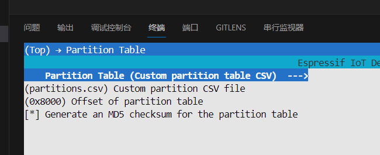
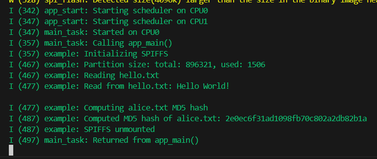

### 说明：

1. 本文档由DuRuofu撰写，由DuRuofu负责解释及执行。
2.  本文档主要介绍，ESP32 flash SPIFFS文件系统的使用.

### 修订历史：

| 文档名称               | 版本     | 作者      | 时间         | 备注   |
| ------------------ | ------ | ------- | ---------- | ---- |
| ESP32存储-SPIFFS文件系统 | v1.0.0 | DuRuofu | 2024-03-06 | 首次建立 |

<div STYLE="page-break-after: always;"></div>

# ESP32存储-SPIFFS文件系统

## 一、介绍

关于[esp32](https://so.csdn.net/so/search?q=esp32&spm=1001.2101.3001.7020)的spiffs文件系统的详细内容，请看esp32官网的介绍：[espidf编程指南-spiffs](https://docs.espressif.com/projects/esp-idf/zh_CN/release-v4.1/api-reference/storage/spiffs.html)

- SPIFFS是一种专门为像ESP32/8266这种嵌入式设备而开发的微型文件系统，SPIFFS是设置在Flash中的一块空间，可以用来存放如网页、图片等体积小的静态资源，而无需采用存储于外部SD卡的方式。
- SPIFFS中的数据不会因为断电而丢失

对于spiffs，乐鑫提供了很好的支持，专门提供了工具（spiffsgen.py，mkspiffs）用于对实现spiffs 在esp32 上的创建、格式化等操作。

注意：

>1. 目前，SPIFFS 尚不支持目录，但可以生成扁平结构。如果 SPIFFS 挂载在 `/spiffs` 下，在 `/spiffs/tmp/myfile.txt` 路径下创建一个文件则会在 SPIFFS 中生成一个名为 `/tmp/myfile.txt` 的文件，而不是在 `/spiffs/tmp` 下生成名为 `myfile.txt` 的文件；
>2.  SPIFFS 并非实时栈，每次写操作耗时不等；
>3. 目前，SPIFFS 尚不支持检测或处理已损坏的块。
>4. SPIFFS 只能稳定地使用约 75% 的指定分区容量。
>5. 当文件系统空间不足时，垃圾收集器会尝试多次扫描文件系统来寻找可用空间。根据所需空间的不同，写操作会被调用多次，每次函数调用将花费几秒
>6. 被删除文件通常不会被完全清除，会在文件系统中遗留下无法使用的部分
>7. 如果 ESP32 在文件系统操作期间断电，可能会导致 SPIFFS 损坏。但是仍可通过 `esp_spiffs_check` 函数恢复文件系统。

## 二、SPIFFS文件系统使用

##### 2.1 新建工程，准备自定义分区表

在分区表里添加 soiffs 文件系统的分区

```c
# ESP-IDF Partition Table
# Name,   Type, SubType, Offset,  Size, Flags
nvs,      data, nvs,     0x9000,  0x4000,
phy_init, data, phy,     0xf000,  0x1000,
factory,  app,  factory, 0x10000,  1M,
storage,  data, spiffs,  ,        0xF0000,
```

选择自定义分区表：



##### 2.2 建立soiffs镜像

在项目根目录建立soiffs镜像文件夹`spiffs_image`

在项目mian组件cmarklist文件添加镜像构建工具相关代码：
`spiffs_create_partition_image(my_spiffs_partition my_folder FLASH_IN_PROJECT)`

``` c
idf_component_register(SRCS "flash_spiffs.c"
                    INCLUDE_DIRS ".")

# Create a SPIFFS image from the contents of the 'spiffs_image' directory

# that fits the partition named 'storage'. FLASH_IN_PROJECT indicates that

# the generated image should be flashed when the entire project is flashed to

# the target with 'idf.py -p PORT flash'.

spiffs_create_partition_image(storage ../spiffs_image FLASH_IN_PROJECT)
```

##### 2.3 码里挂载文件系统
然后在代码里挂载文件系统即可：

``` c
ESP_LOGI(TAG, "Initializing SPIFFS");

esp_vfs_spiffs_conf_t conf = {
  .base_path = "/spiffs",
  .partition_label = NULL,
  .max_files = 5,
  .format_if_mount_failed = false
};

// Use settings defined above to initialize and mount SPIFFS filesystem.
// Note: esp_vfs_spiffs_register is an all-in-one convenience function.
esp_err_t ret = esp_vfs_spiffs_register(&conf);

if (ret != ESP_OK) {
	if (ret == ESP_FAIL) {
		ESP_LOGE(TAG, "Failed to mount or format filesystem");
	} else if (ret == ESP_ERR_NOT_FOUND) {
		ESP_LOGE(TAG, "Failed to find SPIFFS partition");
	} else {
		ESP_LOGE(TAG, "Failed to initialize SPIFFS (%s)", esp_err_to_name(ret));
	}
	return;
}
```

`esp_vfs_spiffs_register`用于将SPIFFS注册并挂载到虚拟文件系统（VFS）中，并指定路径前缀。

函数参数中的conf是一个指向`esp_vfs_spiffs_conf_t`配置结构体的指针。

`esp_vfs_spiffs_conf_t`参数：

- **base_path:** 文件系统关联的文件路径前缀。
- **partition_label:** 可选项，要使用的 SPIFFS 分区的标签。如果设置为 NULL，则将使用 subtype=spiffs 的第一个分区。
- **max_files:** 可同时打开的最大文件数。
- **format_if_mount_failed:** 如果为 true，在挂载失败时将格式化文件系统。
## 三、案例

下面的示例程序来自：https://github.com/espressif/esp-idf/tree/v5.2.1/examples/storage/spiffsgen

主要功能包括初始化 SPIFFS、读取文件内容以及计算文件的 MD5 哈希值。

在 `app_main` 函数中，首先初始化 SPIFFS 文件系统，然后获取文件系统的信息，接着依次调用 `read_hello_txt` 和 `compute_alice_txt_md5` 函数来读取 `hello.txt` 文件的内容和计算 `alice.txt` 文件的 MD5 哈希值。最后，取消挂载 SPIFFS 文件系统并结束程序。
``` c

#include <stdio.h>
#include <string.h>
#include <sys/unistd.h>
#include <sys/stat.h>
#include "esp_err.h"
#include "esp_log.h"
#include "esp_spiffs.h"
#include "mbedtls/md5.h"

static const char *TAG = "example";

static void read_hello_txt(void)
{
    ESP_LOGI(TAG, "Reading hello.txt");

    // Open for reading hello.txt
    FILE* f = fopen("/spiffs/hello.txt", "r");
    if (f == NULL) {
        ESP_LOGE(TAG, "Failed to open hello.txt");
        return;
    }

    char buf[64];
    memset(buf, 0, sizeof(buf));
    fread(buf, 1, sizeof(buf), f);
    fclose(f);

    // Display the read contents from the file
    ESP_LOGI(TAG, "Read from hello.txt: %s", buf);
}

static void compute_alice_txt_md5(void)
{
    ESP_LOGI(TAG, "Computing alice.txt MD5 hash");

    // The file alice.txt lives under a subdirectory, though SPIFFS itself is flat
    FILE* f = fopen("/spiffs/sub/alice.txt", "r");
    if (f == NULL) {
        ESP_LOGE(TAG, "Failed to open alice.txt");
        return;
    }

    // Read file and compute the digest chunk by chunk
    #define MD5_MAX_LEN 16

    char buf[64];
    mbedtls_md5_context ctx;
    unsigned char digest[MD5_MAX_LEN];

    mbedtls_md5_init(&ctx);
    mbedtls_md5_starts(&ctx);

    size_t read;

    do {
        read = fread((void*) buf, 1, sizeof(buf), f);
        mbedtls_md5_update(&ctx, (unsigned const char*) buf, read);
    } while(read == sizeof(buf));

    mbedtls_md5_finish(&ctx, digest);

    // Create a string of the digest
    char digest_str[MD5_MAX_LEN * 2];

    for (int i = 0; i < MD5_MAX_LEN; i++) {
        sprintf(&digest_str[i * 2], "%02x", (unsigned int)digest[i]);
    }

    // For reference, MD5 should be deeb71f585cbb3ae5f7976d5127faf2a
    ESP_LOGI(TAG, "Computed MD5 hash of alice.txt: %s", digest_str);

    fclose(f);
}

void app_main(void)
{
    ESP_LOGI(TAG, "Initializing SPIFFS");

    esp_vfs_spiffs_conf_t conf = {
      .base_path = "/spiffs",
      .partition_label = NULL,
      .max_files = 5,
      .format_if_mount_failed = false
    };

    // Use settings defined above to initialize and mount SPIFFS filesystem.
    // Note: esp_vfs_spiffs_register is an all-in-one convenience function.
    esp_err_t ret = esp_vfs_spiffs_register(&conf);

    if (ret != ESP_OK) {
        if (ret == ESP_FAIL) {
            ESP_LOGE(TAG, "Failed to mount or format filesystem");
        } else if (ret == ESP_ERR_NOT_FOUND) {
            ESP_LOGE(TAG, "Failed to find SPIFFS partition");
        } else {
            ESP_LOGE(TAG, "Failed to initialize SPIFFS (%s)", esp_err_to_name(ret));
        }
        return;
    }

    size_t total = 0, used = 0;
    ret = esp_spiffs_info(NULL, &total, &used);
    if (ret != ESP_OK) {
        ESP_LOGE(TAG, "Failed to get SPIFFS partition information (%s)", esp_err_to_name(ret));
    } else {
        ESP_LOGI(TAG, "Partition size: total: %d, used: %d", total, used);
    }

    /* The following calls demonstrate reading files from the generated SPIFFS
     * image. The images should contain the same files and contents as the spiffs_image directory.
     */

    // Read and display the contents of a small text file (hello.txt)
    read_hello_txt();

    // Compute and display the MD5 hash of a large text file (alice.txt)
    compute_alice_txt_md5();

    // All done, unmount partition and disable SPIFFS
    esp_vfs_spiffs_unregister(NULL);
    ESP_LOGI(TAG, "SPIFFS unmounted");
}

```

效果：




# 参考链接

1. https://docs.espressif.com/projects/esp-idf/zh_CN/release-v5.2/esp32/api-reference/storage/spiffs.html