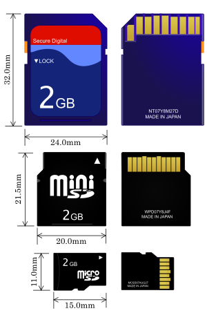
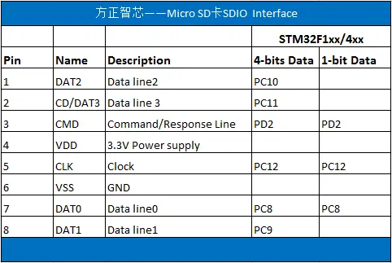
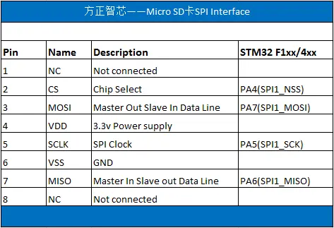
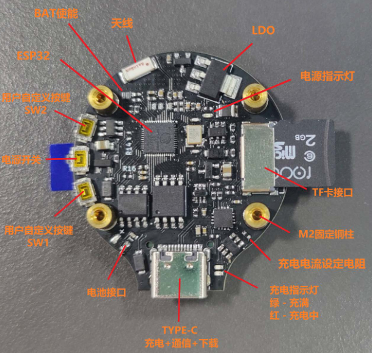
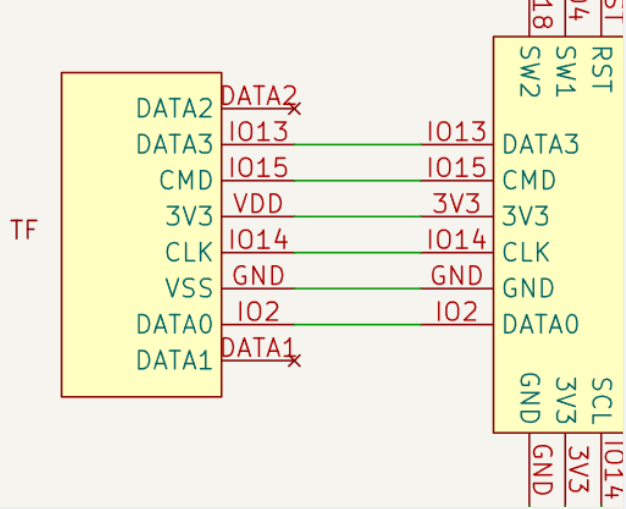
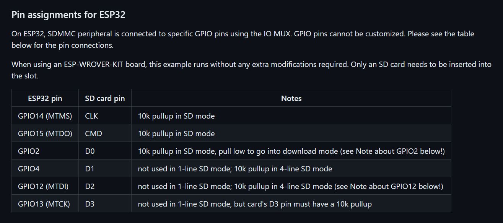
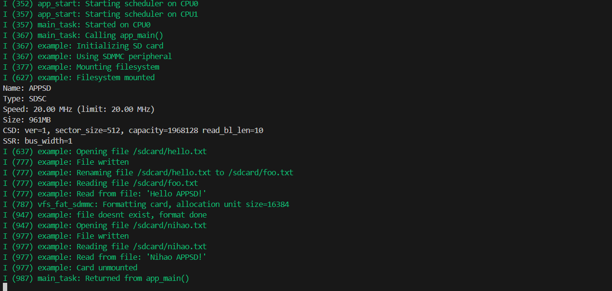
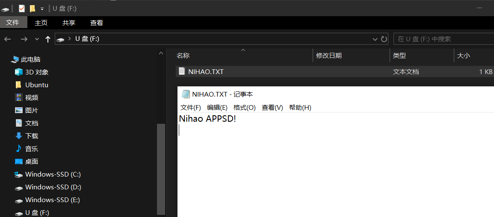

# ESP32存储-SD、SDIO、MMC 驱动

## 一、基本概念

### 1.1 SD卡科普

SD卡是Secure Digital Card，直译就是“安全数字卡”，最早由松下（Panasonic）闪迪（SanDisk）东芝（Toshiba）三家公司发起。后形成SD卡协会。

SDIO 全称是安全数字输入/输出接口，多媒体卡(MMC)、SD 卡、SD I/O 卡都有 SDIO 接口。  MMC 卡可以说是 SD 卡的前身，现阶段已经用得很少。

按照当前市面上的物理规格来划分，常见的SD卡可以分为三种。

1、 标准的SD卡，这种卡比较大，尺寸为32X24X2.1mm。相当于邮票大小，多用于数码相机、笔记本电脑等存储。

2、 Mini SD卡，这个卡很少用，尺寸为20X21.5X1.4mm。这里不做过多累述。

3、 Micro SD卡，这个卡原名为TF卡（Trans-flash Card），最早由闪迪（SanDisk）发明，后被SD协会采用，2004年改名为Micro SD。尺寸为15X11X1mm。

**下图由上至下分别为标准SD、miniSD、microSD卡：**


>下面的内容来自：[知乎(北岛李工): 详谈SD卡/微型SD卡的引脚定义与连接](https://zhuanlan.zhihu.com/p/31949463)

SD卡有两种模式：SD模式（也称为SDIO模式）和SPI（Serial Peripheral Interface）模式，这两种模式的引脚定义是不同的。

在SD模式下，通常可以使用四根数据线进行传输（4-bits Data），传输速度非常快。四位数据传输要使用引脚1、7、8和9（DAT0~DAT3）；在某些不支持四线数据的场合，也可以使用单根线进行数据传输（1-bit Data），此时使用引脚7（DAT0）。

是SD卡在SD模式（SDIO）下的引脚定义，右边的两栏是STM32F1xx/4xx系列单片机的引脚，“4-bits Data”表示“四位数据传输”，“1-bit”表示“一位数据传输”：




SPI通信则需要四根线：两条数据线（SPI_MISO、SPI_MOSI），一条时钟线（SPI_SCK）和一条片选（Chip Select）信号线。




### 1.2 ESP32访问SD卡

对应的ESP32有两种使用SD卡的方法，一种是使用SPI接口访问SD卡，另一种是使用SDMMC接口访问SD卡(对应SD模式通信) 。SPI方式占用4个IO口，SDMMC方式占用6个IO口，一般来说SDMMC方式速度要比SPI方式快。

#### 1.2.1 SDMMC 主机驱动

ESP32-S3 的 SDMMC 主机外设共有两个卡槽，用于插入 SD 卡、连接 SDIO 设备或连接 eMMC 芯片，每个卡槽均可单独使用。
卡槽 `SDMMC_HOST_SLOT_0` 和 `SDMMC_HOST_SLOT_1` 都支持 1、4、8 线的 SD 接口，这些卡槽通过 GPIO 交换矩阵连接到 ESP32-S3 的 GPIO，即每个 SD 卡信号都可以使用任意 GPIO 连接。

#### 1.2.2  SD SPI 主机驱动程序

SD SPI 主机驱动程序支持使用 SPI 主控驱动程序与一或多张 SD 卡通信，SPI 主控驱动程序则利用 SPI 主机实现功能。每张 SD 卡都通过一个 SD SPI 设备访问，相应设备以 SD SPI 设备句柄 [`sdspi_dev_handle_t`](https://docs.espressif.com/projects/esp-idf/zh_CN/v5.2-beta2/esp32s3/api-reference/peripherals/sdspi_host.html#_CPPv418sdspi_dev_handle_t "sdspi_dev_handle_t") 表示。调用 [`sdspi_host_init_device()`](https://docs.espressif.com/projects/esp-idf/zh_CN/v5.2-beta2/esp32s3/api-reference/peripherals/sdspi_host.html#_CPPv422sdspi_host_init_devicePK21sdspi_device_config_tP18sdspi_dev_handle_t "sdspi_host_init_device") 将设备连接到 SPI 总线上时会返回所需 SPI 设备句柄。注意，在使用 SPI 总线前，需要先通过 [`spi_bus_initialize()`](https://docs.espressif.com/projects/esp-idf/zh_CN/v5.2-beta2/esp32s3/api-reference/peripherals/spi_master.html#_CPPv418spi_bus_initialize17spi_host_device_tPK16spi_bus_config_t14spi_dma_chan_t "spi_bus_initialize") 初始化总线。

SD SPI 主机驱动程序基于 [SPI 主机驱动程序](https://docs.espressif.com/projects/esp-idf/zh_CN/v5.2-beta2/esp32s3/api-reference/peripherals/spi_master.html) 实现。借助 SPI 主控驱动程序，SD 卡及其他 SPI 设备可以共享同一 SPI 总线。SPI 主机驱动程序将处理来自不同任务的独占访问。

## 二、使用

> 下面以SDMMC 接口说明SD卡程序如何编写：
> 主要参考：[SDMMC 主机驱动](https://docs.espressif.com/projects/esp-idf/zh_CN/v5.2-beta2/esp32s3/api-reference/peripherals/sdmmc_host.html#sdmmc "永久链接至标题")和 [SD/SDIO/MMC 驱动程序](https://docs.espressif.com/projects/esp-idf/zh_CN/v5.2-beta2/esp32s3/api-reference/storage/sdmmc.html#sd-sdio-mmc "永久链接至标题")
> 示例代码：[SD Card example (SDMMC)](https://github.com/espressif/esp-idf/tree/v5.2-beta2/examples/storage/sd_card)

使用的硬件如下：



对应SD卡的接线如下图：




可以看到D2和D1没有连接，所以这里我们使用1线模式（值得注意的是，即使使用单线模式，SD卡的D3引脚也必须连接上拉电阻器。否则，SD卡可能会进入SPI模式）


#### 2.1 创建SD卡句柄`card`

```c
  sdmmc_card_t *card;
  const char mount_point[] = MOUNT_POINT;
  ESP_LOGI(TAG, "Initializing SD card");
```

#### 2.2 初始化卡槽和默认配置

```c
  sdmmc_host_t host = SDMMC_HOST_DEFAULT();
```

默认情况下，SD卡频率初始化为SDMMC_FREQ_default（20MHz）
要设置特定频率，请使用host.max_freq_khz（SDMMC的范围为400kHz-40MHz）
示例：对于10MHz的固定频率，使用host.max_freq_khz=10000；

```c
  sdmmc_slot_config_t slot_config = SDMMC_SLOT_CONFIG_DEFAULT();
```

这里使用默认初始化配置，不对卡检测信号和写保护信号做处理。

#### 2.3 配置引脚

```c
	// Set bus width to use:
#ifdef CONFIG_EXAMPLE_SDMMC_BUS_WIDTH_4
	slot_config.width = 4;
#else
	slot_config.width = 1;
#endif
```

这里通过`CONFIG_EXAMPLE_SDMMC_BUS_WIDTH_4`宏来区分1线和四线模式

```c
#ifdef CONFIG_SOC_SDMMC_USE_GPIO_MATRIX
	slot_config.clk = CONFIG_EXAMPLE_PIN_CLK;
	slot_config.cmd = CONFIG_EXAMPLE_PIN_CMD;
	slot_config.d0 = CONFIG_EXAMPLE_PIN_D0;
#ifdef CONFIG_EXAMPLE_SDMMC_BUS_WIDTH_4
	slot_config.d1 = CONFIG_EXAMPLE_PIN_D1;
	slot_config.d2 = CONFIG_EXAMPLE_PIN_D2;
	slot_config.d3 = CONFIG_EXAMPLE_PIN_D3;
#endif // CONFIG_EXAMPLE_SDMMC_BUS_WIDTH_4
#endif // CONFIG_SOC_SDMMC_USE_GPIO_MATRIX
```

这里配置具体引脚

```c
slot_config.flags |= SDMMC_SLOT_FLAG_INTERNAL_PULLUP;
```

对引脚做上拉处理，但是还是建议外部上拉，以提高稳定性。

2.4 SD卡初始化

这里使用函数`esp_vfs_fat_sdmmc_mount(mount_point, &host, &slot_config, &mount_config, &card);`这个函数是一个方便的功能，用于在 VFS 中注册 SD 卡上的 FAT 文件系统。它主要干下面几件事：

1. 使用 `host_config` 初始化 SDMMC 驱动程序或 SPI 驱动程序。
2. 使用 `slot_config` 初始化 SD 卡。
3. 使用 `mount_config` 挂载 SD 卡上的 FAT 分区。
4. 使用 `base_path` 指定的路径在 VFS 中注册 FATFS 库。
   
关于这个函数的有关内容，之前的文章也有提到：[ESP32存储-3.VFS虚拟文件系统](https://www.duruofu.top/2024/03/06/4.%E7%A1%AC%E4%BB%B6%E7%9B%B8%E5%85%B3/MCU/ESP32/04.ESP32%E5%AD%98%E5%82%A8%E5%99%A8%E5%85%A5%E9%97%A8/4.3-ESP32%E5%AD%98%E5%82%A8-VFS%E6%96%87%E4%BB%B6%E7%B3%BB%E7%BB%9F/ESP32%E5%AD%98%E5%82%A8-VFS%E8%99%9A%E6%8B%9F%E6%96%87%E4%BB%B6%E7%B3%BB%E7%BB%9F%E5%85%A5%E9%97%A8/)

```c
	esp_vfs_fat_sdmmc_mount_config_t mount_config = {
		// 此选项用于开关SD卡挂载失败后是否格式化
#ifdef CONFIG_EXAMPLE_FORMAT_IF_MOUNT_FAILED
			.format_if_mount_failed = true,
#else
			.format_if_mount_failed = false,
#endif // EXAMPLE_FORMAT_IF_MOUNT_FAILED
			.max_files = 5, 
			.allocation_unit_size = 16 * 1024};

	ESP_LOGI(TAG, "Mounting filesystem");
	ret = esp_vfs_fat_sdmmc_mount(mount_point, &host, &slot_config, &mount_config, &card);

	if (ret != ESP_OK)
	{
		if (ret == ESP_FAIL)
		{
			ESP_LOGE(TAG, "Failed to mount filesystem. "
										"If you want the card to be formatted, set the EXAMPLE_FORMAT_IF_MOUNT_FAILED menuconfig option.");
		}
		else
		{
			ESP_LOGE(TAG, "Failed to initialize the card (%s). "
										"Make sure SD card lines have pull-up resistors in place.",
							 esp_err_to_name(ret));
		}
		return;
	}
	ESP_LOGI(TAG, "Filesystem mounted");
```


#### 2.4 文件读写

到这里本节的内容就算完成了，后续就是使用POSIX和C标准库函数处理文件即可，例如：

1. `fopen` 函数：用于打开一个文件，并返回一个指向该文件的文件指针。第二个参数 "wb" 表示以写入模式打开文件，"rb" 表示以读取模式打开文件。
2. `fprintf` 函数：用于把格式化的数据写入文件中。
3. `fclose` 函数：用于关闭先前通过 `fopen` 打开的文件。
4. `fgets` 函数：用于从文件中读取一行数据。


#### 2.5 其他注意事项：




在 ESP32 上，SDMMC 外设使用 IO MUX 连接到特定的 GPIO 引脚。GPIO引脚无法自定义，只能按照上述接线。
## 三、示例

下面的示例程序来自于esp-idf官方示例代码：[SD Card example (SDMMC)](https://github.com/espressif/esp-idf/tree/v5.2-beta2/examples/storage/sd_card)
这个示例程序展示了如何使用 ESP-IDF 来操作 SD 卡上的文件系统，包括挂载、读写、重命名、格式化等操作。

``` c

// This example uses SDMMC peripheral to communicate with SD card.
#include <string.h>
#include <sys/unistd.h>
#include <sys/stat.h>
#include "esp_vfs_fat.h"
#include "sdmmc_cmd.h"
#include "driver/sdmmc_host.h"

#define EXAMPLE_MAX_CHAR_SIZE 64

static const char *TAG = "example";

#define MOUNT_POINT "/sdcard"

static esp_err_t s_example_write_file(const char *path, char *data)
{
	ESP_LOGI(TAG, "Opening file %s", path);
	FILE *f = fopen(path, "w");
	if (f == NULL)
	{
		ESP_LOGE(TAG, "Failed to open file for writing");
		return ESP_FAIL;
	}
	fprintf(f, data);
	fclose(f);
	ESP_LOGI(TAG, "File written");

	return ESP_OK;
}

static esp_err_t s_example_read_file(const char *path)
{
	ESP_LOGI(TAG, "Reading file %s", path);
	FILE *f = fopen(path, "r");
	if (f == NULL)
	{
		ESP_LOGE(TAG, "Failed to open file for reading");
		return ESP_FAIL;
	}
	char line[EXAMPLE_MAX_CHAR_SIZE];
	fgets(line, sizeof(line), f);
	fclose(f);

	// strip newline
	char *pos = strchr(line, '\n');
	if (pos)
	{
		*pos = '\0';
	}
	ESP_LOGI(TAG, "Read from file: '%s'", line);

	return ESP_OK;
}

void app_main(void)
{
	esp_err_t ret;

	// Options for mounting the filesystem.
	// If format_if_mount_failed is set to true, SD card will be partitioned and
	// formatted in case when mounting fails.
	esp_vfs_fat_sdmmc_mount_config_t mount_config = {
		// 此选项用于开关SD卡挂载失败后是否格式化
#ifdef CONFIG_EXAMPLE_FORMAT_IF_MOUNT_FAILED
			.format_if_mount_failed = true,
#else
			.format_if_mount_failed = false,
#endif // EXAMPLE_FORMAT_IF_MOUNT_FAILED
			.max_files = 5, 
			.allocation_unit_size = 16 * 1024};

	sdmmc_card_t *card;
	const char mount_point[] = MOUNT_POINT;
	ESP_LOGI(TAG, "Initializing SD card");

	// Use settings defined above to initialize SD card and mount FAT filesystem.
	// Note: esp_vfs_fat_sdmmc/sdspi_mount is all-in-one convenience functions.
	// Please check its source code and implement error recovery when developing
	// production applications.

	ESP_LOGI(TAG, "Using SDMMC peripheral");

	// By default, SD card frequency is initialized to SDMMC_FREQ_DEFAULT (20MHz)
	// For setting a specific frequency, use host.max_freq_khz (range 400kHz - 40MHz for SDMMC)
	// Example: for fixed frequency of 10MHz, use host.max_freq_khz = 10000;
	sdmmc_host_t host = SDMMC_HOST_DEFAULT();

	// This initializes the slot without card detect (CD) and write protect (WP) signals.
	// Modify slot_config.gpio_cd and slot_config.gpio_wp if your board has these signals.
	sdmmc_slot_config_t slot_config = SDMMC_SLOT_CONFIG_DEFAULT();

	// Set bus width to use:
#ifdef CONFIG_EXAMPLE_SDMMC_BUS_WIDTH_4
	slot_config.width = 4;
#else
	slot_config.width = 1;
#endif

	// On chips where the GPIOs used for SD card can be configured, set them in
	// the slot_config structure:
#ifdef CONFIG_SOC_SDMMC_USE_GPIO_MATRIX
	slot_config.clk = CONFIG_EXAMPLE_PIN_CLK;
	slot_config.cmd = CONFIG_EXAMPLE_PIN_CMD;
	slot_config.d0 = CONFIG_EXAMPLE_PIN_D0;
#ifdef CONFIG_EXAMPLE_SDMMC_BUS_WIDTH_4
	slot_config.d1 = CONFIG_EXAMPLE_PIN_D1;
	slot_config.d2 = CONFIG_EXAMPLE_PIN_D2;
	slot_config.d3 = CONFIG_EXAMPLE_PIN_D3;
#endif // CONFIG_EXAMPLE_SDMMC_BUS_WIDTH_4
#endif // CONFIG_SOC_SDMMC_USE_GPIO_MATRIX

	// Enable internal pullups on enabled pins. The internal pullups
	// are insufficient however, please make sure 10k external pullups are
	// connected on the bus. This is for debug / example purpose only.
	slot_config.flags |= SDMMC_SLOT_FLAG_INTERNAL_PULLUP;

	ESP_LOGI(TAG, "Mounting filesystem");
	ret = esp_vfs_fat_sdmmc_mount(mount_point, &host, &slot_config, &mount_config, &card);

	if (ret != ESP_OK)
	{
		if (ret == ESP_FAIL)
		{
			ESP_LOGE(TAG, "Failed to mount filesystem. "
										"If you want the card to be formatted, set the EXAMPLE_FORMAT_IF_MOUNT_FAILED menuconfig option.");
		}
		else
		{
			ESP_LOGE(TAG, "Failed to initialize the card (%s). "
										"Make sure SD card lines have pull-up resistors in place.",
							 esp_err_to_name(ret));
		}
		return;
	}
	ESP_LOGI(TAG, "Filesystem mounted");

	// Card has been initialized, print its properties
	sdmmc_card_print_info(stdout, card);

	// Use POSIX and C standard library functions to work with files:

	// First create a file.
	const char *file_hello = MOUNT_POINT "/hello.txt";
	char data[EXAMPLE_MAX_CHAR_SIZE];
	snprintf(data, EXAMPLE_MAX_CHAR_SIZE, "%s %s!\n", "Hello", card->cid.name);
	ret = s_example_write_file(file_hello, data);
	if (ret != ESP_OK)
	{
		return;
	}

	const char *file_foo = MOUNT_POINT "/foo.txt";
	// Check if destination file exists before renaming
	struct stat st;
	if (stat(file_foo, &st) == 0)
	{
		// Delete it if it exists
		unlink(file_foo);
	}

	// Rename original file
	ESP_LOGI(TAG, "Renaming file %s to %s", file_hello, file_foo);
	if (rename(file_hello, file_foo) != 0)
	{
		ESP_LOGE(TAG, "Rename failed");
		return;
	}

	ret = s_example_read_file(file_foo);
	if (ret != ESP_OK)
	{
		return;
	}

	// Format FATFS
	ret = esp_vfs_fat_sdcard_format(mount_point, card);
	if (ret != ESP_OK)
	{
		ESP_LOGE(TAG, "Failed to format FATFS (%s)", esp_err_to_name(ret));
		return;
	}

	if (stat(file_foo, &st) == 0)
	{
		ESP_LOGI(TAG, "file still exists");
		return;
	}
	else
	{
		ESP_LOGI(TAG, "file doesnt exist, format done");
	}

	const char *file_nihao = MOUNT_POINT "/nihao.txt";
	memset(data, 0, EXAMPLE_MAX_CHAR_SIZE);
	snprintf(data, EXAMPLE_MAX_CHAR_SIZE, "%s %s!\n", "Nihao", card->cid.name);
	ret = s_example_write_file(file_nihao, data);
	if (ret != ESP_OK)
	{
		return;
	}

	// Open file for reading
	ret = s_example_read_file(file_nihao);
	if (ret != ESP_OK)
	{
		return;
	}

	// All done, unmount partition and disable SDMMC peripheral
	esp_vfs_fat_sdcard_unmount(mount_point, card);
	ESP_LOGI(TAG, "Card unmounted");
}


```

1. 包含了必要的头文件，例如 `<string.h>`、`<sys/unistd.h>`、`<sys/stat.h>`，以及 ESP-IDF 提供的文件系统相关头文件 `esp_vfs_fat.h` 和 SD 卡命令头文件 `sdmmc_cmd.h`。
2. 定义了一些常量和全局变量，例如日志标签 `TAG`、挂载点 `MOUNT_POINT`、最大字符大小 `EXAMPLE_MAX_CHAR_SIZE` 等。
3. 定义了两个静态函数 `s_example_write_file` 和 `s_example_read_file`，用于分别写入文件和读取文件。这些函数利用标准 C 库中的文件操作函数，例如 `fopen`、`fclose`、`fprintf`、`fgets` 等。
4. 在 `app_main` 函数中，首先初始化了 SD 卡的挂载配置 `mount_config`，然后初始化了 SDMMC 主机结构体 `host` 和 SDMMC 槽配置结构体 `slot_config`，用于配置 SD 卡的参数。接着调用 `esp_vfs_fat_sdmmc_mount` 函数挂载 FAT 文件系统，并检查挂载操作的返回值。
5. 如果挂载成功，则打印 SD 卡的信息，并执行一系列文件操作，包括创建文件、重命名文件、读取文件内容等。
6. 演示了格式化 FAT 文件系统的操作。
7. 最后，执行了卸载 SD 卡的操作，释放相关资源


执行结果如下：







使用读卡器打开sd卡，文件的确被创建，并写入了内容。

# 参考链接

1. https://zhuanlan.zhihu.com/p/689459798
2. https://zhuanlan.zhihu.com/p/31949463