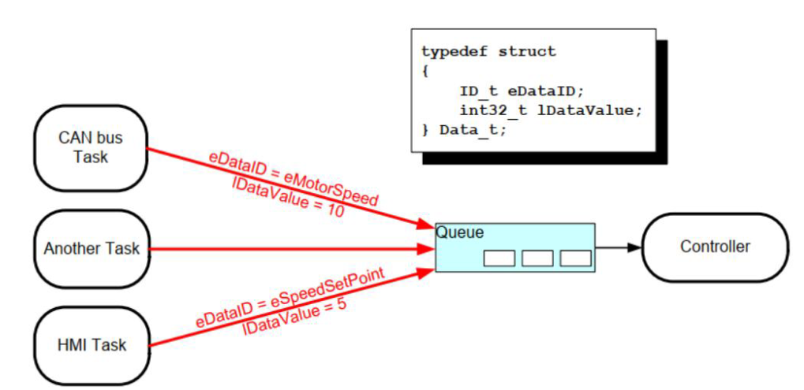

# FreeRTOS进阶—队列

> [!TIP] 🚀 FreeRTOS 进阶—队列 | 高效的任务间数据传输  
> - 💡 **碎碎念**😎：本节将深入介绍 FreeRTOS 中的队列机制，帮助你在任务间高效传输数据，保证系统的响应性和稳定性。  
> - 📺 **视频教程**：🚧 *开发中*  
> - 💾 **示例代码**：[ESP32-Guide/code/05.freertos_advanced/queue](https://github.com/DuRuofu/ESP32-Guide/tree/main/code/05.freertos_advanced/queue)

## 1. 队列创建与传参

队列是任务间通信的主要形式。它们可以用于在任务之间 以及中断和任务之间发送消息。在大多数情况下，队列用作线程安全的 FIFO（先进先出）缓冲区， 新数据被发送到队列的后面，但也可以发送到前面。
### 1.1  API说明：

队列操作主要涉及以下几个API：

| 函数名                    | 功能             | 备注                     |
| ---------------------- | -------------- | ---------------------- |
| xQueueCreate           | 创建一个队列         | 创建指定长度和大小的队列           |
| xQueueSend             | 向队列中发送数据       | 如果队列已满，任务可选择阻塞或立即返回    |
| xQueueReceive          | 从队列中接收数据       | 如果队列为空，任务可选择阻塞或立即返回    |
| xQueueSendToFront      | 将数据发送到队列的队头位置  | 与 xQueueSend 类似，但优先级更高 |
| xQueueSendToBack       | 将数据发送到队列的队尾位置  | 默认行为，等效于 xQueueSend    |
| uxQueueMessagesWaiting | 查询队列中当前等待的消息数量 | 返回队列中尚未读取的消息数          |
####  xQueueCreate：创建队列

**原型：**

```c
QueueHandle_t xQueueCreate(UBaseType_t uxQueueLength, UBaseType_t uxItemSize);
```

**参数说明：**
- uxQueueLength：队列的长度（可以容纳的元素数量）。
- uxItemSize：队列中每个元素的大小（以字节为单位）。
**返回值：** 成功时返回队列句柄；失败时返回 NULL。
**示例：**

```c
QueueHandle_t xQueue;
xQueue = xQueueCreate(10, sizeof(int)); // 创建一个可以存储 10 个整数的队列
if (xQueue == NULL) {
    // 队列创建失败，处理错误
}
```

#### xQueueSend：向队列发送数据

**原型：**

```c
BaseType_t xQueueSend(QueueHandle_t xQueue, const void *pvItemToQueue, TickType_t xTicksToWait);

```

**参数说明：**

- xQueue：队列的句柄。
- pvItemToQueue：指向要发送到队列的数据的指针。
- xTicksToWait：当队列已满时，任务等待的时间（以 tick 为单位）。设置为 0 表示不等待。

**返回值：**
- pdPASS：数据成功发送到队列。
- errQUEUE_FULL：队列已满，数据发送失败。
示例：

```c
int data = 42;
if (xQueueSend(xQueue, &data, 0) != pdPASS) {
    // 数据发送失败，处理错误
}
```

#### xQueueReceive：从队列接收数据

**原型：**

```c
BaseType_t xQueueReceive(QueueHandle_t xQueue, void *pvBuffer, TickType_t xTicksToWait);
```

**参数说明：**
- xQueue：队列的句柄。
- pvBuffer：指向接收数据的缓冲区的指针。
- xTicksToWait：当队列为空时，任务等待的时间（以 tick 为单位）。设置为 0 表示不等待。
**返回值：**
- pdPASS：数据成功接收。
- pdFALSE：队列为空，接收失败。
**示例：**
```c
int receivedData;
if (xQueueReceive(xQueue, &receivedData, portMAX_DELAY) == pdPASS) {
    // 成功接收数据，进行处理
}
```

### 1.2  队列传参示例：

#### 1.队列传参-常量

```c
#include <stdio.h>
#include "esp_log.h"
#include "freertos/FreeRTOS.h"
#include "freertos/task.h"
#include "freertos/queue.h"

static const char *TAG = "main";

void Task_1(void *pvParameters)
{
    // 取得队列句柄
    QueueHandle_t xQueue = (QueueHandle_t)pvParameters;
    int i = 0;

    for (;;)
    {
        // 发送数据到队列
        if (xQueueSend(xQueue, &i, 0)!= pdPASS) {
            ESP_LOGI(TAG, "数据发送失败");
        }
        else
        {
            ESP_LOGI(TAG, "数据发送成功");
            i++;
        }

        if(i == 10)
        {
            i = 0;
        }
        vTaskDelay(1000 / portTICK_PERIOD_MS);
    }
    vTaskDelete(NULL);
}

void Task_2(void *pvParameters)
{
    // 取得队列句柄
    QueueHandle_t xQueue = (QueueHandle_t)pvParameters;
    for (;;)
    {
        int receivedData;
        if (xQueueReceive(xQueue, &receivedData, 0) != pdPASS)
        {
            ESP_LOGI(TAG, "数据接收失败");
        }
        else
        {
            ESP_LOGI(TAG, "数据接收成功，数据为：%d", receivedData);
        }
        vTaskDelay(1000 / portTICK_PERIOD_MS);
        
    }
    vTaskDelete(NULL);
}

void app_main(void)
{
    TaskHandle_t taskHandle_1 = NULL;
    TaskHandle_t taskHandle_2 = NULL;
    QueueHandle_t xQueue;

    // 创建队列
    xQueue = xQueueCreate(10, sizeof(int));

    if (xQueue != NULL)
    {
        ESP_LOGI(TAG, "队列创建成功");
        // 发送数据任务
        xTaskCreate(Task_1, "Task_1", 1024 * 4, (void *)xQueue, 12, &taskHandle_1);
        // 接收数据任务
        xTaskCreate(Task_2, "Task_1", 1024 * 4, (void *)xQueue, 12, &taskHandle_2);
    }
    else
    {
        ESP_LOGI(TAG, "队列创建失败");
    }
}
```

#### 2.队列传参-结构体

```c
#include <stdio.h>
#include "esp_log.h"
#include "freertos/FreeRTOS.h"
#include "freertos/task.h"
#include "freertos/queue.h"

static const char *TAG = "main";

// 定义结构体
typedef struct
{
    int id;
    int data[3];
} MyStruct;

void Task_1(void *pvParameters)
{
    // 取得队列句柄
    QueueHandle_t xQueue = (QueueHandle_t)pvParameters;
    MyStruct shendData = {1, {1, 2, 3}};

    for (;;)
    {
        // 发送数据到队列
        if (xQueueSend(xQueue, &shendData, 0) != pdPASS)
        {
            ESP_LOGI(TAG, "数据发送失败");
        }
        else
        {
            ESP_LOGI(TAG, "数据发送成功");
            shendData.id++;
        }

        if (shendData.id == 10)
        {
            shendData.id = 0;
        }
        vTaskDelay(1000 / portTICK_PERIOD_MS);
    }
    vTaskDelete(NULL);
}

void Task_2(void *pvParameters)
{
    // 取得队列句柄
    QueueHandle_t xQueue = (QueueHandle_t)pvParameters;
    for (;;)
    {
        MyStruct receivedData;
        if (xQueueReceive(xQueue, &receivedData, 0) != pdPASS)
        {
            ESP_LOGI(TAG, "数据接收失败");
        }
        else
        {
            ESP_LOGI(TAG, "数据接收成功，数据为：%d-[%d,%d,%d]", receivedData.id, receivedData.data[0], receivedData.data[1], receivedData.data[2]);
        }
        vTaskDelay(1000 / portTICK_PERIOD_MS);
        
    }
    vTaskDelete(NULL);
}

void app_main(void)
{
    TaskHandle_t taskHandle_1 = NULL;
    TaskHandle_t taskHandle_2 = NULL;
    QueueHandle_t xQueue;

    // 创建队列
    xQueue = xQueueCreate(10, sizeof(MyStruct));

    if (xQueue != NULL)
    {
        ESP_LOGI(TAG, "队列创建成功");
        // 发送数据任务
        xTaskCreate(Task_1, "Task_1", 1024 * 4, (void *)xQueue, 12, &taskHandle_1);
        // 接收数据任务
        xTaskCreate(Task_2, "Task_1", 1024 * 4, (void *)xQueue, 12, &taskHandle_2);
    }
    else
    {
        ESP_LOGI(TAG, "队列创建失败");
    }
}

```
#### 3.队列传参-指针

```c
// 队列传参_指针: 一般用于传递占用内存较大的数据. 传递指针, 可以避免拷贝数据, 提高效率.
#include <stdio.h>
#include "esp_log.h"
#include "freertos/FreeRTOS.h"
#include "freertos/task.h"
#include "freertos/queue.h"

static const char *TAG = "main";

void Task_1(void *pvParameters)
{
    // 取得队列句柄
    QueueHandle_t xQueue = (QueueHandle_t)pvParameters;
    int i = 0;

    for (;;)
    {
        char *pCharSend = (char *)malloc(50); // 申请内存
        snprintf(pCharSend, 50, "Hello World! - %d", i);
        i++;
        // 发送数据到队列
        if (xQueueSend(xQueue, &pCharSend, 0) != pdPASS)
        {
            ESP_LOGI(TAG, "数据发送失败");
        }
        else
        {
            ESP_LOGI(TAG, "数据发送成功");
            
        }

        if (i == 10)
        {
            i = 0;
        }
        vTaskDelay(1000 / portTICK_PERIOD_MS);
    }
    vTaskDelete(NULL);
}

void Task_2(void *pvParameters)
{
    // 取得队列句柄
    QueueHandle_t xQueue = (QueueHandle_t)pvParameters;

    char *pCharReceived = NULL; // 接收数据
    for (;;)
    {
        if (xQueueReceive(xQueue, &pCharReceived, 0) != pdPASS)
        {
            ESP_LOGI(TAG, "数据接收失败");
        }
        else
        {
            ESP_LOGI(TAG, "数据接收成功，数据为：%s", pCharReceived);
            free(pCharReceived); // 释放内存
        }
        vTaskDelay(1000 / portTICK_PERIOD_MS);
        
    }
    vTaskDelete(NULL);
}

void app_main(void)
{
    TaskHandle_t taskHandle_1 = NULL;
    TaskHandle_t taskHandle_2 = NULL;
    QueueHandle_t xQueue;

    // 创建队列
    xQueue = xQueueCreate(10, sizeof(char *));

    if (xQueue != NULL)
    {
        ESP_LOGI(TAG, "队列创建成功");
        // 发送数据任务
        xTaskCreate(Task_1, "Task_1", 1024 * 4, (void *)xQueue, 12, &taskHandle_1);
        // 接收数据任务
        xTaskCreate(Task_2, "Task_1", 1024 * 4, (void *)xQueue, 12, &taskHandle_2);
    }
    else
    {
        ESP_LOGI(TAG, "队列创建失败");
    }
}

```
## 2.队列多进单出模型



示例代码：

```c
// 队列多进单出: 任务1和任务2发送数据到队列，任务3接收数据  任务3的优先级高于任务1和任务2,已达到数据监听的目的
// 参考:https://www.bilibili.com/video/BV1R44y177VS/?spm_id_from=333.788.top_right_bar_window_history.content.click&vd_source=ef5a0ab0106372751602034cdd9ab98e

#include <stdio.h>
#include "esp_log.h"
#include "freertos/FreeRTOS.h"
#include "freertos/task.h"
#include "freertos/queue.h"

static const char *TAG = "main";

void Task_1(void *pvParameters)
{
    // 取得队列句柄
    QueueHandle_t xQueue = (QueueHandle_t)pvParameters;
    int i = 111;

    for (;;)
    {
        // 发送数据到队列
        if (xQueueSend(xQueue, &i, 0) != pdPASS)
        {
            ESP_LOGI(TAG, "任务1数据发送失败");
        }
        else
        {
            ESP_LOGI(TAG, "任务1数据发送成功");
        }
        vTaskDelay(1000 / portTICK_PERIOD_MS);
    }
    vTaskDelete(NULL);
}

void Task_2(void *pvParameters)
{
    // 取得队列句柄
    QueueHandle_t xQueue = (QueueHandle_t)pvParameters;
    int i = 222;

    for (;;)
    {
        // 发送数据到队列
        if (xQueueSend(xQueue, &i, 0) != pdPASS)
        {
            ESP_LOGI(TAG, "任务2数据发送失败");
        }
        else
        {
            ESP_LOGI(TAG, "任务2数据发送成功");
        }
        vTaskDelay(1000 / portTICK_PERIOD_MS);
    }
    vTaskDelete(NULL);
}

void Task_3(void *pvParameters)
{
    // 取得队列句柄
    QueueHandle_t xQueue = (QueueHandle_t)pvParameters;
    for (;;)
    {
        int receivedData;
        // 使用portMAX_DELAY阻塞等待数据
        if (xQueueReceive(xQueue, &receivedData, portMAX_DELAY) != pdPASS)
        {
            ESP_LOGI(TAG, "任务3数据接收失败");
        }
        else
        {
            ESP_LOGI(TAG, "任务3数据接收成功，数据为：%d", receivedData);
        }
    }
    vTaskDelete(NULL);
}

void app_main(void)
{

    QueueHandle_t xQueue;

    // 创建队列
    xQueue = xQueueCreate(10, sizeof(int));

    if (xQueue != NULL)
    {
        ESP_LOGI(TAG, "队列创建成功");
        // 发送数据任务
        xTaskCreate(Task_1, "Task_1", 1024 * 4, (void *)xQueue, 1, NULL);
        xTaskCreate(Task_2, "Task_1", 1024 * 4, (void *)xQueue, 1, NULL);
        // 接收数据任务
        xTaskCreate(Task_3, "Task_1", 1024 * 4, (void *)xQueue, 2, NULL);
    }
    else
    {
        ESP_LOGI(TAG, "队列创建失败");
    }
}

```


## 3 队列集合

FreeRTOS 队列集合（Queue Sets）是一种机制，用于同时监听多个队列和信号量，以实现任务间的高效通信。
### 3.1 API说明：

| 函数名                 | 功能                     | 备注                |
| ------------------- | ---------------------- | ----------------- |
| xQueueCreateSet     | 创建一个队列集合               | 队列集合必须与队列或信号量配合使用 |
| xQueueAddToSet      | 将队列或信号量添加到队列集合         | 被添加的队列或信号量必须为空    |
| xQueueRemoveFromSet | 从队列集合中移除队列或信号量         |                   |
| xQueueSelectFromSet | 从队列集合中选择一个有数据可用的队列或信号量 | 返回非空的队列或信号量       |
### 3.2 示例代码：

```c
// 队列集合:
// https : // www.bilibili.com/video/BV1zq4y1m7UK?spm_id_from=333.788.videopod.sections&vd_source=ef5a0ab0106372751602034cdd9ab98e

#include <stdio.h>
#include "esp_log.h"
#include "freertos/FreeRTOS.h"
#include "freertos/task.h"
#include "freertos/queue.h"

static const char *TAG = "main";

void Task_1(void *pvParameters)
{
    // 取得队列句柄
    QueueHandle_t xQueue = (QueueHandle_t)pvParameters;
    int i = 111;

    for (;;)
    {
        // 发送数据到队列
        if (xQueueSend(xQueue, &i, 0) != pdPASS)
        {
            ESP_LOGI(TAG, "任务1数据发送失败");
        }
        else
        {
            ESP_LOGI(TAG, "任务1数据发送成功");
        }
        vTaskDelay(1000 / portTICK_PERIOD_MS);
    }
    vTaskDelete(NULL);
}

void Task_2(void *pvParameters)
{
    // 取得队列句柄
    QueueHandle_t xQueue = (QueueHandle_t)pvParameters;
    int i = 222;

    for (;;)
    {
        // 发送数据到队列
        if (xQueueSend(xQueue, &i, 0) != pdPASS)
        {
            ESP_LOGI(TAG, "任务2数据发送失败");
        }
        else
        {
            ESP_LOGI(TAG, "任务2数据发送成功");
        }
        vTaskDelay(1000 / portTICK_PERIOD_MS);
    }
    vTaskDelete(NULL);
}

void Task_3(void *pvParameters)
{
    // 取得队列集合句柄
    QueueSetHandle_t xQueueSet = (QueueSetHandle_t)pvParameters;
    // 取得有数据队列句柄
    QueueSetMemberHandle_t QueueData;
    for (;;)
    {
        QueueData = xQueueSelectFromSet(xQueueSet, portMAX_DELAY);
        if (QueueData != NULL)
        {
            int i;
            if (xQueueReceive(QueueData, &i, portMAX_DELAY) != pdPASS)
            {
                ESP_LOGI(TAG, "任务3数据接收失败");
            }
            else
            {
                ESP_LOGI(TAG, "任务3数据接收成功，数据为：%d", i);
            }
        }
    }
    vTaskDelete(NULL);
}

void app_main(void)
{
    QueueHandle_t xQueue_1;
    QueueHandle_t xQueue_2;
    // 创建队列
    xQueue_1 = xQueueCreate(10, sizeof(int));
    xQueue_2 = xQueueCreate(10, sizeof(int));

    // 创建队列集合
    QueueSetHandle_t xQueueSet;
    xQueueSet = xQueueCreateSet(20);

    // 将队列添加到队列集合
    xQueueAddToSet(xQueue_1, xQueueSet);
    xQueueAddToSet(xQueue_2, xQueueSet);

    if ((xQueue_1 != NULL )&& (xQueue_2 != NULL) && (xQueueSet != NULL))
    {
        ESP_LOGI(TAG, "队列创建成功");
        // 发送数据任务
        xTaskCreate(Task_1, "Task_1", 1024 * 4, (void *)xQueue_1, 1, NULL);
        xTaskCreate(Task_2, "Task_1", 1024 * 4, (void *)xQueue_2, 1, NULL);
        // 接收数据任务
        xTaskCreate(Task_3, "Task_1", 1024 * 4, (void *)xQueueSet, 2, NULL);
    }
    else
    {
        ESP_LOGI(TAG, "队列创建失败");
    }
}
```

## 4.队列邮箱

FreeRTOS的邮箱概念跟别的RTOS不一样,它是一个队列，队列长度只有1.写邮箱：新数据覆盖旧数据,读邮箱：读数据时，数据不会被移除；这意味着，第一次调用时会因为无数据而阻塞，一旦曾经写入数据，以后读邮箱时总能成功。

```c
// 队列邮箱: FreeRTOS的邮箱概念跟别的RTOS不一样,它是一个队列，队列长度只有1.
// 写邮箱：新数据覆盖旧数据,读邮箱：读数据时，数据不会被移除；
// 这意味着，第一次调用时会因为无数据而阻塞，一旦曾经写入数据，以后读邮箱时总能成功。
// https : // www.bilibili.com/video/BV1zq4y1m7UK?spm_id_from=333.788.videopod.sections&vd_source=ef5a0ab0106372751602034cdd9ab98e

#include <stdio.h>
#include "esp_log.h"
#include "freertos/FreeRTOS.h"
#include "freertos/task.h"
#include "freertos/queue.h"

static const char *TAG = "main";

// 写数据队列
void Task_1(void *pvParameters)
{
    // 取得队列句柄
    QueueHandle_t Mailbox = (QueueHandle_t)pvParameters;
    int i = 0;

    for (;;)
    {
        // 发送数据到队列
        if (xQueueOverwrite(Mailbox, &i) != pdPASS)
        {
            ESP_LOGI(TAG, "任务1数据发送失败");
        }
        else
        {
            ESP_LOGI(TAG, "任务1数据发送成功");
        }
        i++;
        vTaskDelay(1000 / portTICK_PERIOD_MS);
    }
    vTaskDelete(NULL);
}


// 读数据队列
void Task_2(void *pvParameters)
{
    // 取得队列句柄
    QueueHandle_t Mailbox = (QueueHandle_t)pvParameters;

    int i = 0;

    for (;;)
    {
        // 读取数据
        if (xQueuePeek(Mailbox, &i, portMAX_DELAY) == pdPASS)
        {
            ESP_LOGI(TAG, "任务2数据读取成功，数据为：%d", i);
        }
        else
        {
            ESP_LOGI(TAG, "任务2数据读取失败");
        }
        vTaskDelay(1000 / portTICK_PERIOD_MS);
    }
    vTaskDelete(NULL);
}

void Task_3(void *pvParameters)
{
    // 取得队列句柄
    QueueHandle_t Mailbox = (QueueHandle_t)pvParameters;
    int i = 0;

    for (;;)
    {
        // 读取数据
        if (xQueuePeek(Mailbox, &i, portMAX_DELAY) == pdPASS)
        {
            ESP_LOGI(TAG, "任务3数据读取成功，数据为：%d", i);
        }
        else
        {
            ESP_LOGI(TAG, "任务3数据读取失败");
        }
        vTaskDelay(1000 / portTICK_PERIOD_MS);
    }
    vTaskDelete(NULL);
}

void Task_4(void *pvParameters)
{
    // 取得队列句柄
    QueueHandle_t Mailbox = (QueueHandle_t)pvParameters;
    int i = 0;

    for (;;)
    {
        // 读取数据
        if (xQueuePeek(Mailbox, &i, portMAX_DELAY) == pdPASS)
        {
            ESP_LOGI(TAG, "任务4数据读取成功，数据为：%d", i);
        }
        else
        {
            ESP_LOGI(TAG, "任务4数据读取失败");
        }
        vTaskDelay(1000 / portTICK_PERIOD_MS);
    }
    vTaskDelete(NULL);
}

void app_main(void)
{
    QueueHandle_t Mailbox; // 创建邮箱

    // 创建队列(注意：队列长度只有1)
    Mailbox = xQueueCreate(1, sizeof(int));

    if ((Mailbox != NULL) )
    {
        ESP_LOGI(TAG, "队列创建成功");
        // 写数据任务
        xTaskCreate(Task_1, "Task_1", 1024 * 4, (void *)Mailbox, 2, NULL);
        xTaskCreate(Task_2, "Task_2", 1024 * 4, (void *)Mailbox, 1, NULL);
        xTaskCreate(Task_3, "Task_3", 1024 * 4, (void *)Mailbox, 1, NULL);
        xTaskCreate(Task_4, "Task_4", 1024 * 4, (void *)Mailbox, 1, NULL);
    }
    else
    {
        ESP_LOGI(TAG, "队列创建失败");
    }
}

```

