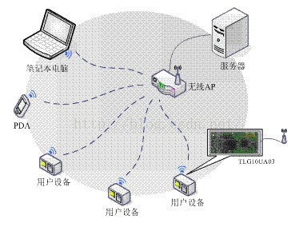
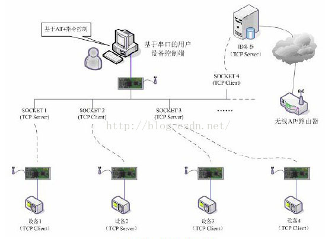
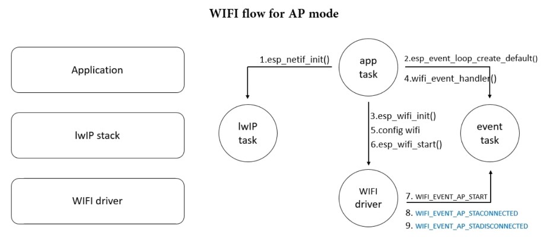
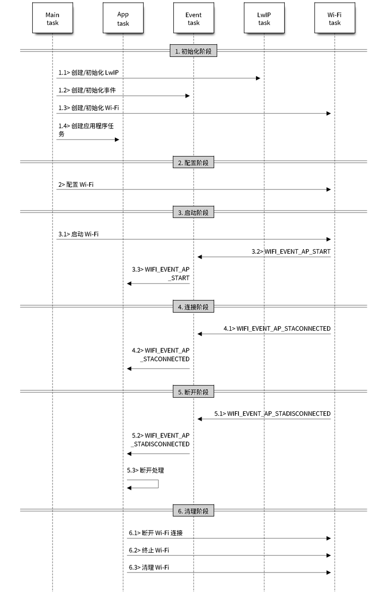
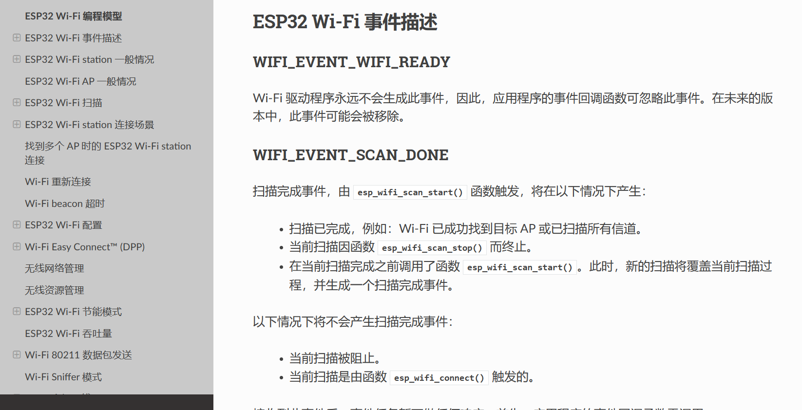
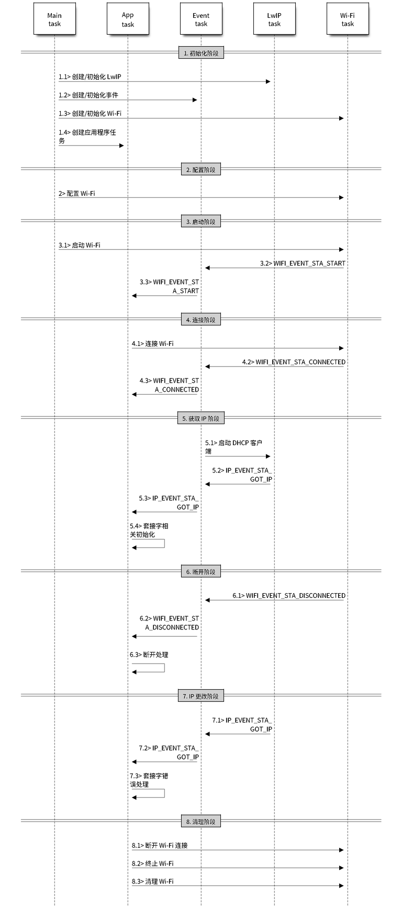
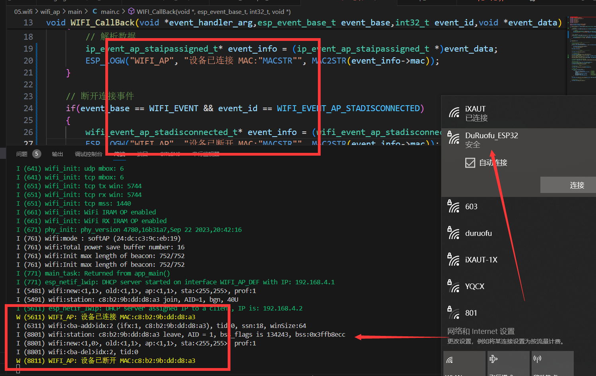

# ESP32网络入门 - WIFI基本使用

> [!TIP] 🚀 WiFi基础使用 | 让你的ESP32连接互联网  
> - 💡 **碎碎念**😎：本节将介绍如何在 ESP32 上使用 WiFi 功能，包括WIFI AP 和WIFI STA。  
> - 📺 **视频教程**：🚧 *开发中*  
> - 💾 **示例代码**：[ESP32-Guide/code/05.wifi/wifi_basic](https://github.com/DuRuofu/ESP32-Guide/tree/main/code/05.wifi/wifi_basic)
## 一、介绍

在开始使用WIFI之前，我们需要掌握一些基本的概念和前置知识：

>最基本的一点：Wi-Fi是物理层和数据链路层的东西,Wi-Fi取代的是以太网的网线和交换机上的口，通过无线电波来收发信息。换句话说，这里说的WIFI暂时不涉及网络层协议。

### 1.1 ESP32事件机制

> 如果对FreeRTOS的多线程没有任何了解，请先了解一下，可以参考：[线程是什么](https://www.bilibili.com/video/BV1au411E7K1?p=7)

关于事件循环可以参考下面的链接、大致了解即可。

1. [ESP32事件循环](https://docs.espressif.com/projects/esp-idf/zh_CN/latest/esp32/api-reference/system/esp_event.html)
2. [Event Loop 大白话版](https://www.bilibili.com/video/BV1FD4y1j79J/?spm_id_from=333.788&vd_source=ef5a0ab0106372751602034cdd9ab98e)

### 1.2 ESP32 WIFI的STA和AP模式

#### 1.2.1 AP

AP(Access Point)也就是无线接入点，是一个无线网络的创建者,是网络的中心节点。一般家庭或办公室使用的无线路由器就是一个AP。



#### 1.2.2 STA

站点(STA，Station)就是每一个连接到无线网络中的终端(如笔记本电脑、PDA及其它可以联网的用户设备)都可称为一个站点。




## 二、使用

>参考：[ESP-IDF:Wi-Fi 驱动程序](https://docs.espressif.com/projects/esp-idf/zh_CN/latest/esp32/api-guides/wifi.html)

ESP-IDFWiFi库提供的功能如下：

- 支持仅 station 模式、仅 AP 模式、station/AP 共存模式
- 支持使用 IEEE 802.11b、IEEE 802.11g、IEEE 802.11n 和 API 配置协议模式
- 支持 WPA/WPA2/WPA3/WPA2-企业版/WPA3-企业版/WAPI/WPS 和 DPP
- 支持 AMSDU、AMPDU、HT40、QoS 以及其它主要功能
- 支持乐鑫专属协议，可实现 **1 km** 数据通信量
- 空中数据传输最高可达 20 MBit/s TCP 吞吐量和 30 MBit/s UDP 吞吐量
- 支持快速扫描和全信道扫描
- 支持获取信道状态信息

### 2.1 WIFI AP模式

>官方示例程序位于：
>
`Espressif\frameworks\esp-idf-v4.4.3\examples\wifi\getting_started\softAP`

配置流程如下：

- `nvs_flash_init`，初始化默认 NVS 分区。
- `esp_netif_init`，初始化底层TCP/IP堆栈（创建一个 LwIP 核心任务，并初始化 LwIP 相关工作。）
- `esp_event_loop_create_default`，创建默认事件循环。
- `esp_netif_create_default_wifi_ap`，使用默认WiFi AP配置创建esp_netif对象，将netif连接到WiFi并注册默认WiFi处理程序。
- `esp_wifi_init`，为 WiFi 驱动初始化 WiFi 分配资源，如 WiFi 控制结构、RX/TX 缓冲区、WiFi NVS 结构等，这个 WiFi 也启动 WiFi 任务。必须先调用此API，然后才能调用所有其他WiFi API
- `esp_event_handler_instance_register`，监听WIFI_EVENTWiFi 任意事件，触发事件后，进入回调函数
- `esp_wifi_set_mode`，设置WiFi工作模式为station、soft-AP或station+soft-AP，默认模式为soft-AP模式。本程序设置为AP
- `esp_wifi_set_config`，设置 ESP32 STA 或 AP 的配置
- `esp_wifi_start`，根据配置，启动WiFi

工作流程如下图所示：(看不懂可以忽略，毕竟先用起来慢慢就学会了，也可以看[Michael_ee](https://space.bilibili.com/1338335828)老师的教程:[WIFI热点工作流程](https://www.bilibili.com/video/BV1ye4y1r7XK/?spm_id_from=333.788&vd_source=ef5a0ab0106372751602034cdd9ab98e))



主要的流程分为下面几个部分（图来自官方教程）：



#### 2.1.1 Wi-Fi准备阶段（图上没有）

这个阶段我们需要初始化NVS,因为WiFi库内部是依赖这个东西的，NVS的相关知识可以看这篇博客：[ESP32存储-3.VFS虚拟文件系统](https://www.duruofu.top/2024/03/06/4.%E7%A1%AC%E4%BB%B6%E7%9B%B8%E5%85%B3/MCU/ESP32/04.ESP32%E5%AD%98%E5%82%A8%E5%99%A8%E5%85%A5%E9%97%A8/4.3-ESP32%E5%AD%98%E5%82%A8-VFS%E6%96%87%E4%BB%B6%E7%B3%BB%E7%BB%9F/ESP32%E5%AD%98%E5%82%A8-VFS%E8%99%9A%E6%8B%9F%E6%96%87%E4%BB%B6%E7%B3%BB%E7%BB%9F%E5%85%A5%E9%97%A8/)

下面直接贴出代码：
```c
// Initialize NVS
esp_err_t ret = nvs_flash_init();
if (ret == ESP_ERR_NVS_NO_FREE_PAGES || ret == ESP_ERR_NVS_NEW_VERSION_FOUND) {
	ESP_ERROR_CHECK(nvs_flash_erase());
	ret = nvs_flash_init();
}
ESP_ERROR_CHECK( ret );
```

#### 2.1.2 Wi-Fi 初始化阶段

这个阶段主要有下面几个步骤：

- 主任务通过调用函数 [`esp_netif_init()`](https://docs.espressif.com/projects/esp-idf/zh_CN/latest/esp32/api-reference/network/esp_netif.html#_CPPv414esp_netif_initv "esp_netif_init") 创建一个 LwIP 核心任务，并初始化 LwIP 相关工作。
- 主任务通过调用函数 [`esp_event_loop_create()`](https://docs.espressif.com/projects/esp-idf/zh_CN/latest/esp32/api-reference/system/esp_event.html#_CPPv421esp_event_loop_createPK21esp_event_loop_args_tP23esp_event_loop_handle_t "esp_event_loop_create") 创建一个系统事件任务，并初始化应用程序事件的回调函数。在此情况下，该回调函数唯一的动作就是将事件中继到应用程序任务中。
- 主任务通过调用函数 [`esp_netif_create_default_wifi_ap()`](https://docs.espressif.com/projects/esp-idf/zh_CN/latest/esp32/api-reference/network/esp_netif.html#_CPPv432esp_netif_create_default_wifi_apv "esp_netif_create_default_wifi_ap") 或 [`esp_netif_create_default_wifi_sta()`](https://docs.espressif.com/projects/esp-idf/zh_CN/latest/esp32/api-reference/network/esp_netif.html#_CPPv433esp_netif_create_default_wifi_stav "esp_netif_create_default_wifi_sta") 创建有 TCP/IP 堆栈的默认网络接口实例绑定 station 或 AP。
- 主任务通过调用函数 [`esp_wifi_init()`](https://docs.espressif.com/projects/esp-idf/zh_CN/latest/esp32/api-reference/network/esp_wifi.html#_CPPv413esp_wifi_initPK18wifi_init_config_t "esp_wifi_init") 创建 Wi-Fi 驱动程序任务，并初始化 Wi-Fi 驱动程序。
- 主任务通过调用 OS API 创建应用程序任务。

代码：

```c
ESP_ERROR_CHECK(esp_netif_init());

ESP_ERROR_CHECK(esp_event_loop_create_default());

// *esp_netif_ap 可以用来修改AP设置
esp_netif_t *esp_netif_ap = esp_netif_create_default_wifi_ap();

/*Initialize WiFi */ 
wifi_init_config_t cfg = WIFI_INIT_CONFIG_DEFAULT();
// WIFI_INIT_CONFIG_DEFAULT 是一个默认配置的宏

ESP_ERROR_CHECK(esp_wifi_init(&cfg));
```

到这里就完成了wifi初始化。

#### 2.1.3 Wi-Fi 配置阶段

Wi-Fi 驱动程序初始化成功后，可以进入到配置阶段。

通过函数`esp_wifi_set_mode`可以设置WiFi工作模式为station、soft-AP或station+soft-AP。

通过函数`esp_wifi_set_config`，设置 ESP32 STA 或 AP 的具体配置（参数很多，可以去官方文档仔细看看，下面只配置几个基本参数）。

```c
// 设置为AP模式
 ESP_ERROR_CHECK(esp_wifi_set_mode(WIFI_MODE_AP));
 
// AP详细配置
wifi_config_t wifi_ap_config = {
	.ap = {
		.ssid = ESP_WIFI_AP_SSID,			  // WIFI名称
		.ssid_len = strlen(ESP_WIFI_AP_SSID), // 名称长度
		.channel = 1,						  // WIFI信道
		.password = ESP_WIFI_AP_PASSWD,		  // WiFi密码
		.max_connection = 5,				  // 最大连接数，默认值是 10
		.authmode = WIFI_AUTH_WPA2_PSK,		  // WiFi认证方式
	},
};
ESP_ERROR_CHECK(esp_wifi_set_config(WIFI_IF_AP, &wifi_ap_config));
```

这里只配配置了基本参数。
#### 2.1.4 Wi-Fi 启动阶段

 使用`esp_wifi_start`，根据配置，启动WiFi

```c
/* Start WiFi */
ESP_ERROR_CHECK(esp_wifi_start());
```

这样就完成了一个基本的WIFI AP。

但是这样仅仅是最基本的程序，当有外部STA设备接入和断开我们如何在程序里得知呢？这就需要使用之前创建的默认事件循环，

#### 2.1.5 事件循环

调用 [`esp_event_handler_instance_register`](https://docs.espressif.com/projects/esp-idf/zh_CN/latest/esp32/api-reference/system/esp_event.html#_CPPv431esp_event_handler_register_with23esp_event_loop_handle_t16esp_event_base_t7int32_t19esp_event_handler_tPv "esp_event_handler_register_with") 将事件处理函数注册到默认的事件循环中。它与 `esp_event_handler_instance_register_with `函数的功能相同，唯一的区别是将处理器注册到默认事件循环中。

```c

esp_err_t esp_event_handler_instance_register(esp_event_base_t event_base,
                                             int32_t event_id,
                                             esp_event_handler_t event_handler,
                                             void *event_handler_arg,
                                             esp_event_handler_instance_t *instance);
```

参数如下：
-  参数 event_base 是要为其注册处理程序的事件的基本ID。
- 参数 event_id 是要注册处理程序的事件的ID。
- 参数 event_handler 是当事件被分发时调用的处理函数。
- 参数 event_handler_arg 是传递给处理函数的除事件数据以外的数据。
- 参数 instance 是与注册的事件处理器和数据相关的事件处理器实例对象

可以在espidf文件里看到相关事件描述：




我们可以在默认事件循环创建后，添加事件处理：

```c
void WIFI_CallBack(void *event_handler_arg,esp_event_base_t event_base,int32_t event_id,void *event_data)
{
	// 连接事件
	if(event_base == IP_EVENT && event_id == IP_EVENT_AP_STAIPASSIGNED)
	{
		// 解析数据
		ip_event_ap_staipassigned_t* event_info = (ip_event_ap_staipassigned_t *)event_data;
		ESP_LOGW("WIFI_AP", "设备已连接 MAC:"MACSTR"", MAC2STR(event_info->mac));
	}

	// 断开连接事件
	if(event_base == WIFI_EVENT && event_id == WIFI_EVENT_AP_STADISCONNECTED)
	{
		wifi_event_ap_stadisconnected_t* event_info = (wifi_event_ap_stadisconnected_t*)event_data;
		ESP_LOGW("WIFI_AP", "设备已断开 MAC:"MACSTR"", MAC2STR(event_info->mac));
	}
}

void app_main(void)
{
	// ......
	
	// 初始化默认事件循环
	ESP_ERROR_CHECK(esp_event_loop_create_default());
	// 注册设备连接事件回调
	esp_event_handler_instance_register(IP_EVENT, IP_EVENT_AP_STAIPASSIGNED, WIFI_CallBack, NULL, NULL);
	// 注册设备断开连接设备回调
	esp_event_handler_instance_register(WIFI_EVENT, WIFI_EVENT_AP_STADISCONNECTED, WIFI_CallBack, NULL, NULL);

	
	// ......
}

```

我们在这里注册了IP_EVENT_AP_STAIPASSIGNED事件，当STA设备连接和断开后就会调用WIFI_CallBack回调函数,打印连接设备的MAC信息。

### 2.2 WIFI  STA

>官方示例代码位于（与热点流程相似，但是细节有所不同）:
`Espressif\frameworks\esp-idf-v4.4.3\examples\wifi\getting_started\station

前面几步配配置方式基本相同

下面是官方的程序宏观流程：



#### 2.2.1 Wi-Fi准备阶段（与上文AP相同）

初始化NVS：

```c
// Initialize NVS
esp_err_t ret = nvs_flash_init();
if (ret == ESP_ERR_NVS_NO_FREE_PAGES || ret == ESP_ERR_NVS_NEW_VERSION_FOUND) {
	ESP_ERROR_CHECK(nvs_flash_erase());
	ret = nvs_flash_init();
}
ESP_ERROR_CHECK( ret );
```

#### 2.2.2 Wi-Fi初始化阶段

这里与AP的配置不同了，我们需要配置设备为STA模式，

这里唯一的区别是把`esp_netif_create_default_wifi_ap()`修改为` esp_netif_create_default_wifi_sta()`配置为STA模式

```c
ESP_ERROR_CHECK(esp_netif_init());

ESP_ERROR_CHECK(esp_event_loop_create_default());

// *esp_netif_ap 可以用来修改AP设置
esp_netif_t *esp_netif_sta = esp_netif_create_default_wifi_sta();

/*Initialize WiFi */ 
wifi_init_config_t cfg = WIFI_INIT_CONFIG_DEFAULT();
// WIFI_INIT_CONFIG_DEFAULT 是一个默认配置的宏

ESP_ERROR_CHECK(esp_wifi_init(&cfg));
```

#### 2.2.3 Wi-Fi配置阶段

这里与AP模式类似，但是配置结构体里的内容有差异

``` c
...............
#define ESP_WIFI_STA_SSID "duruofu_win10"
#define ESP_WIFI_STA_PASSWD "1234567890"

.................

// 设置为STA模式
ESP_ERROR_CHECK(esp_wifi_set_mode(WIFI_MODE_STA));

// STA详细配置
wifi_config_t sta_config = {
	.sta = {
		.ssid = ESP_WIFI_STA_SSID,
		.password = ESP_WIFI_STA_PASSWD,
		.bssid_set = false,
	},
} ESP_ERROR_CHECK(esp_wifi_set_config(WIFI_IF_STA, &sta_config));

```

这里的配置信息顾名思义就是要连接的wifi名称和密码（当然还有更多参数，可以参考ESP-IDF参数说明）。

#### 2.2.4 Wi-Fi 启动阶段

和AP模式不同，这里多了一个`esp_wifi_connect()`用于连接wifi。

```c
//----------------启动阶段-------------------
ESP_ERROR_CHECK(esp_wifi_start());
ESP_ERROR_CHECK(esp_wifi_connect());
```

#### 2.2.5 事件循环

同样的，我们可以像前面一样添加事件回调函数

这里监听了启动事件，连接失败事件，连接成功事件，代码很简单就不展开解释了。

```c

void WIFI_CallBack(void *event_handler_arg,esp_event_base_t event_base,int32_t event_id,void *event_data)
{
	static uint8_t connect_count = 0;
	// WIFI 启动成功
	if (event_base == WIFI_EVENT && event_id == WIFI_EVENT_STA_START)
	{
		ESP_LOGI("WIFI_EVENT", "WIFI_EVENT_STA_START");
		ESP_ERROR_CHECK(esp_wifi_connect());
	}
	// WIFI 连接失败
	if (event_base == WIFI_EVENT && event_id == WIFI_EVENT_STA_DISCONNECTED)
	{
		ESP_LOGI("WIFI_EVENT", "WIFI_EVENT_STA_DISCONNECTED");
		connect_count++;
		if (connect_count < 6)
		{
			ESP_ERROR_CHECK(esp_wifi_connect());
		}
		else{
			ESP_LOGI("WIFI_EVENT", "WIFI_EVENT_STA_DISCONNECTED 10 times");
		}
	}
	// WIFI 连接成功(获取到了IP)
	if (event_base == IP_EVENT && event_id == IP_EVENT_STA_GOT_IP)
	{
		ESP_LOGI("WIFI_EVENT", "WIFI_EVENT_STA_GOT_IP");
		ip_event_got_ip_t *info = (ip_event_got_ip_t *)event_data;
		ESP_LOGI("WIFI_EVENT", "got ip:" IPSTR "", IP2STR(&info->ip_info.ip));
	}
}

void app_main(void)
{
	// ......
	
	// 初始化默认事件循环
	ESP_ERROR_CHECK(esp_event_loop_create_default());
	// 注册事件(wifi启动成功)
	ESP_ERROR_CHECK(esp_event_handler_instance_register(WIFI_EVENT, WIFI_EVENT_STA_START, WIFI_CallBack, NULL, NULL))
	// 注册事件(wifi连接失败)
	ESP_ERROR_CHECK(esp_event_handler_instance_register(WIFI_EVENT, WIFI_EVENT_STA_DISCONNECTED, WIFI_CallBack, NULL, NULL))
	// 注册事件(wifi连接失败)
	ESP_ERROR_CHECK(esp_event_handler_instance_register(IP_EVENT, IP_EVENT_STA_GOT_IP, WIFI_CallBack, NULL, NULL))

	// ......
}

```

### 2.3 补充

#### 2.3.1 WIFI的省电模式


可以使用`esp_wifi_set_ps()`函数来配置WIFI的省电模式。

这个函数可以有三个参数可选：
``` c
typedef enum {
    WIFI_PS_NONE,        /**< No power save */
    WIFI_PS_MIN_MODEM,   /**< Minimum modem power saving. In this mode, station wakes up to receive beacon every DTIM period */
    WIFI_PS_MAX_MODEM,   /**< Maximum modem power saving. In this mode, interval to receive beacons is determined by the listen_interval parameter in wifi_sta_config_t */
} wifi_ps_type_t;

```

关于省电模式可以参考：[Wi-Fi场景如何选择低功耗模式](https://docs.espressif.com/projects/esp-idf/zh_CN/latest/esp32/api-guides/low-power-mode.html#id8 "永久链接至标题")

#### 2.3.2 静态IP配置

在`esp_netif_create_default_wifi_sta()`创建好DHCP客户端后使用函数`esp_err_t esp_netif_dhcpc_stop(esp_netif_t *esp_netif)`停止DHCP客户端。

使用`esp_netif_set_ip_info()`配置我们想要的静态IP,如下：

```c
// 初始化STA设备
esp_netif_t *esp_netif = esp_netif_create_default_wifi_sta();

// ↓↓↓↓↓↓↓↓↓↓↓↓↓↓↓↓↓↓↓↓↓↓↓↓↓↓↓↓↓↓↓↓↓↓↓↓↓↓↓↓↓↓↓↓↓↓↓↓↓↓↓↓↓
//*******************配置静态IP*************************
esp_netif_dhcpc_stop(esp_netif);
esp_netif_ip_info_t ipInfo;
ipInfo.ip.addr = inet_addr("192.168.138.2");
ipInfo.netmask = inet_addr("255.255.255.0");
ipInfo.gw = inet_addr("192.168.138.2");

esp_netif_set_ip_info(esp_netif, &ipInfo);
esp_netif_dhcpc_start(esp_netif);
//*******************配置静态IP*************************
// ↑↑↑↑↑↑↑↑↑↑↑↑↑↑↑↑↑↑↑↑↑↑↑↑↑↑↑↑↑↑↑↑↑↑↑↑↑↑↑↑↑↑↑↑↑↑↑↑↑↑↑↑↑
```

### 2.3.1 WIFI Scan

我们使用`esp_wifi_start`后，会根据配置，启动WiFI。如果不立即连接到设定的WIFI热点，我们也可以使用WIFI Scan来寻找可连接的设备。

`esp_wifi_scan_start`，扫描所有有效的AP
`esp_wifi_scan_get_ap_records`，获取上次扫描中找到的AP列表 `esp_wifi_scan_get_ap_num`，获取上次扫描中找到的AP数

这里也没什么复杂的，建议直接参考IDF官方文档：[ESP32 Wi-Fi 扫描](https://docs.espressif.com/projects/esp-idf/zh_CN/latest/esp32/api-guides/wifi.html#id17 "永久链接至标题")
## 三、实例

### 3.1 WIFI AP模式

下面基于第二部分的教程实现了WIFI AP模式
代码链接：

> https://github.com/DuRuofu/ESP32_Learning/tree/master/05.wifi/wifi_ap

```c
#include <string.h>
#include "freertos/FreeRTOS.h"
#include "freertos/event_groups.h"
#include "esp_wifi.h"
#include "esp_log.h"
#include "esp_event.h"
#include "nvs_flash.h"
#include "esp_mac.h"

#define ESP_WIFI_AP_SSID "DuRuofu_ESP32"
#define ESP_WIFI_AP_PASSWD "3.1415926"

void WIFI_CallBack(void *event_handler_arg,esp_event_base_t event_base,int32_t event_id,void *event_data)
{
	// 连接事件
	if(event_base == IP_EVENT && event_id == IP_EVENT_AP_STAIPASSIGNED)
	{
		// 解析数据
		ip_event_ap_staipassigned_t* event_info = (ip_event_ap_staipassigned_t *)event_data;
		ESP_LOGW("WIFI_AP", "设备已连接 MAC:"MACSTR"", MAC2STR(event_info->mac));
	}

	// 断开连接事件
	if(event_base == WIFI_EVENT && event_id == WIFI_EVENT_AP_STADISCONNECTED)
	{
		wifi_event_ap_stadisconnected_t* event_info = (wifi_event_ap_stadisconnected_t*)event_data;
		ESP_LOGW("WIFI_AP", "设备已断开 MAC:"MACSTR"", MAC2STR(event_info->mac));
	}
}

void app_main(void)
{
	//----------------准备阶段-------------------
	// Initialize NVS
	esp_err_t ret = nvs_flash_init();
	if (ret == ESP_ERR_NVS_NO_FREE_PAGES || ret == ESP_ERR_NVS_NEW_VERSION_FOUND)
	{
		ESP_ERROR_CHECK(nvs_flash_erase());
		ret = nvs_flash_init();
	}
	ESP_ERROR_CHECK(ret);

	//---------------初始化阶段------------------

	ESP_ERROR_CHECK(esp_netif_init());

	// 初始化默认事件循环
	ESP_ERROR_CHECK(esp_event_loop_create_default());
	// 注册设备连接事件回调
	esp_event_handler_instance_register(IP_EVENT, IP_EVENT_AP_STAIPASSIGNED, WIFI_CallBack, NULL, NULL);
	// 注册设备断开连接设备回调
	esp_event_handler_instance_register(WIFI_EVENT, WIFI_EVENT_AP_STADISCONNECTED, WIFI_CallBack, NULL, NULL);

	// *esp_netif_ap 可以用来修改AP设置
	esp_netif_t *esp_netif_ap = esp_netif_create_default_wifi_ap();

	/*Initialize WiFi */
	wifi_init_config_t cfg = WIFI_INIT_CONFIG_DEFAULT();
	// WIFI_INIT_CONFIG_DEFAULT 是一个默认配置的宏
	ESP_ERROR_CHECK(esp_wifi_init(&cfg));

	//---------------配置阶段--------------------
	// 设置为AP模式
	ESP_ERROR_CHECK(esp_wifi_set_mode(WIFI_MODE_AP));

	// AP详细配置
	wifi_config_t wifi_ap_config = {
		.ap = {
			.ssid = ESP_WIFI_AP_SSID,			  // WIFI名称
			.ssid_len = strlen(ESP_WIFI_AP_SSID), // 名称长度
			.channel = 1,						  // WIFI信道
			.password = ESP_WIFI_AP_PASSWD,		  // WiFi密码
			.max_connection = 5,				  // 最大连接数，默认值是 10
			.authmode = WIFI_AUTH_WPA2_PSK,		  // WiFi认证方式
		},
	};
	ESP_ERROR_CHECK(esp_wifi_set_config(WIFI_IF_AP, &wifi_ap_config));

	//---------------启动阶段--------------------
	/* Start WiFi */
	ESP_ERROR_CHECK(esp_wifi_start());
}
```

效果展示：



连接wifi会打印连接设备的信息。

### 3.2 WIFI STA模式

下面基于第二部分的教程实现了WIFI STA模式
代码链接：

> https://github.com/DuRuofu/ESP32_Learning/tree/master/05.wifi/wifi_sta

```c

#include <stdio.h>
#include <string.h>
#include "freertos/FreeRTOS.h"
#include "freertos/event_groups.h"
#include "esp_wifi.h"
#include "esp_log.h"
#include "esp_event.h"
#include "nvs_flash.h"
#include "esp_mac.h"

#define ESP_WIFI_STA_SSID "duruofu_win10"
#define ESP_WIFI_STA_PASSWD "1234567890"

void WIFI_CallBack(void *event_handler_arg, esp_event_base_t event_base, int32_t event_id, void *event_data)
{
	static uint8_t connect_count = 0;
	// WIFI 启动成功
	if (event_base == WIFI_EVENT && event_id == WIFI_EVENT_STA_START)
	{
		ESP_LOGI("WIFI_EVENT", "WIFI_EVENT_STA_START");
		ESP_ERROR_CHECK(esp_wifi_connect());
	}
	// WIFI 连接失败
	if (event_base == WIFI_EVENT && event_id == WIFI_EVENT_STA_DISCONNECTED)
	{
		ESP_LOGI("WIFI_EVENT", "WIFI_EVENT_STA_DISCONNECTED");
		connect_count++;
		if (connect_count < 6)
		{
			ESP_ERROR_CHECK(esp_wifi_connect());
		}
		else{
			ESP_LOGI("WIFI_EVENT", "WIFI_EVENT_STA_DISCONNECTED 10 times");
		}
	}
	// WIFI 连接成功(获取到了IP)
	if (event_base == IP_EVENT && event_id == IP_EVENT_STA_GOT_IP)
	{
		ESP_LOGI("WIFI_EVENT", "WIFI_EVENT_STA_GOT_IP");
		ip_event_got_ip_t *info = (ip_event_got_ip_t *)event_data;
		ESP_LOGI("WIFI_EVENT", "got ip:" IPSTR "", IP2STR(&info->ip_info.ip));
	}
}

void app_main(void)
{
	//----------------准备阶段-------------------
	// Initialize NVS
	esp_err_t ret = nvs_flash_init();
	if (ret == ESP_ERR_NVS_NO_FREE_PAGES || ret == ESP_ERR_NVS_NEW_VERSION_FOUND)
	{
		ESP_ERROR_CHECK(nvs_flash_erase());
		ret = nvs_flash_init();
	}
	ESP_ERROR_CHECK(ret);

	//----------------初始化阶段-------------------
	ESP_ERROR_CHECK(esp_netif_init());

	ESP_ERROR_CHECK(esp_event_loop_create_default());
	// 注册事件(wifi启动成功)
	ESP_ERROR_CHECK(esp_event_handler_instance_register(WIFI_EVENT, WIFI_EVENT_STA_START, WIFI_CallBack, NULL, NULL));
	// 注册事件(wifi连接失败)
	ESP_ERROR_CHECK(esp_event_handler_instance_register(WIFI_EVENT, WIFI_EVENT_STA_DISCONNECTED, WIFI_CallBack, NULL, NULL));
	// 注册事件(wifi连接失败)
	ESP_ERROR_CHECK(esp_event_handler_instance_register(IP_EVENT, IP_EVENT_STA_GOT_IP, WIFI_CallBack, NULL, NULL));

	// 初始化STA设备
	esp_netif_create_default_wifi_sta();

	/*Initialize WiFi */
	wifi_init_config_t cfg = WIFI_INIT_CONFIG_DEFAULT();
	// WIFI_INIT_CONFIG_DEFAULT 是一个默认配置的宏

	ESP_ERROR_CHECK(esp_wifi_init(&cfg));

	//----------------配置阶段-------------------
	// 设置为STA模式
	ESP_ERROR_CHECK(esp_wifi_set_mode(WIFI_MODE_STA));

	// STA详细配置
	wifi_config_t sta_config = {
		.sta = {
			.ssid = ESP_WIFI_STA_SSID,
			.password = ESP_WIFI_STA_PASSWD,
			.bssid_set = false,
		},
	};
	ESP_ERROR_CHECK(esp_wifi_set_config(WIFI_IF_STA, &sta_config));

	//----------------启动阶段-------------------
	ESP_ERROR_CHECK(esp_wifi_start());

}

```

效果如下：


### 3.2 WIFI配置静态IP

代码链接：

> https://github.com/DuRuofu/ESP32_Learning/tree/master/05.wifi/wifi_sta_static_ip

### 3.3 WIFI Scan

代码链接：

> https://github.com/DuRuofu/ESP32_Learning/tree/master/05.wifi/wifi_scan

效果：


# 参考链接

1. https://www.bilibili.com/video/BV1au411E7K1?p=7&vd_source=ef5a0ab0106372751602034cdd9ab98e
2. https://www.bilibili.com/video/BV1au411E7K1?p=8&vd_source=ef5a0ab0106372751602034cdd9ab98e
3. https://docs.espressif.com/projects/esp-idf/zh_CN/latest/esp32/api-guides/wifi.html