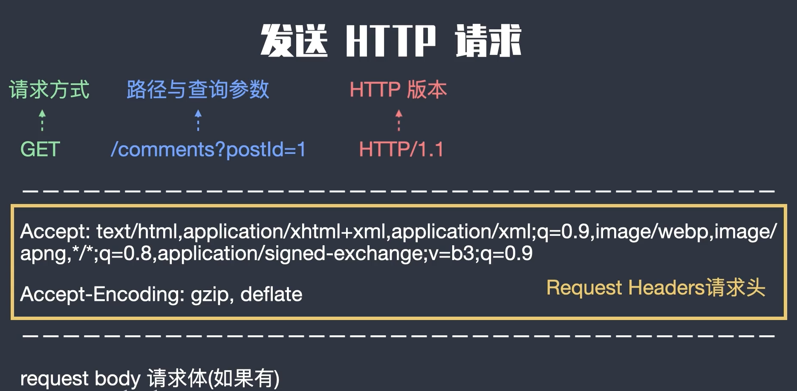
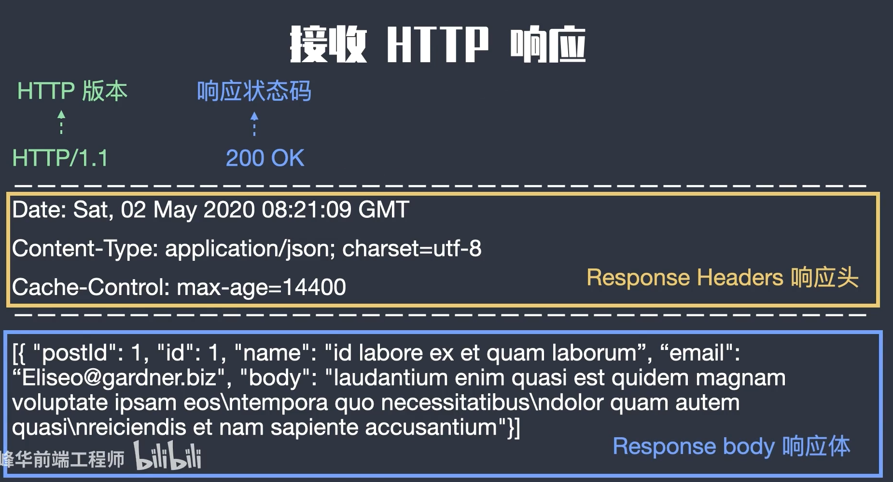
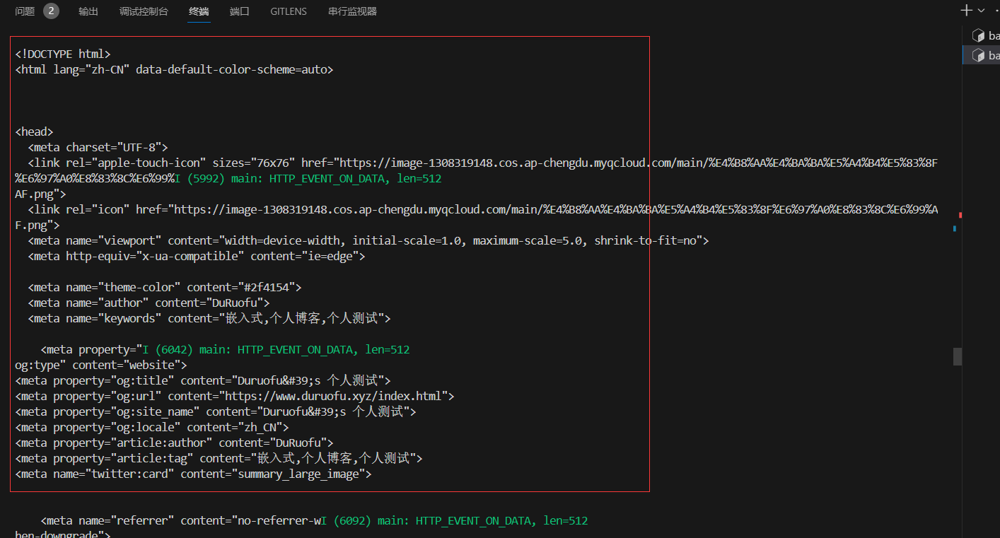
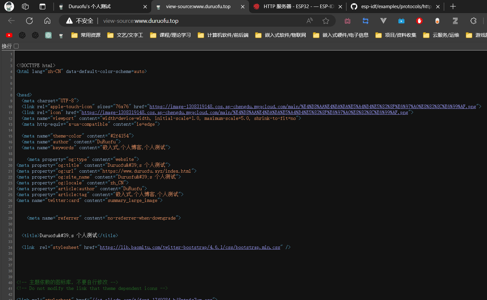

# ESP32网络入门 - HTTP协议 - 客户端

> [!TIP] 🚀 HTTP客户端 | 让ESP32和服务器轻松对话  
> - 💡 **碎碎念**😎：本节将介绍如何在 ESP32 上使用 HTTP 协议作为客户端，向远程服务器发送请求并获取响应。你将学习如何配置请求参数和处理响应内容。  
> - 📺 **视频教程**：暂无  
> - 💾 **示例代码**：[ESP32-Guide/code/05.wifi/http](https://github.com/DuRuofu/ESP32-Guide/tree/main/code/05.wifi/http)


### 一、概述

#### 1.1 HTTP协议介绍

`HTTP`协议(超文本传输协议HyperText Transfer Protocol)，它是基于TCP协议的应用层传输协议，简单来说就是客户端和服务端进行数据传输的一种规则。

特点：

- 支持客户/服务器模式
- 简单快速：客户向服务器请求服务时，只需传送请求方法和路径，请求方法常用GET,HEAD,POST。每种方法规定了客户与服务器联系的类型不同，由于HTTP协议简单，是的HTTP服务器的程序规模小，因而通信速度很快。
- 灵活：HTTP允许传输任意类型的数据对象，正在传输的类型有Content-Type加以标记。
- 无连接：无连接的含义是限制每次连接只处理一个请求，服务器处理完客户的请求，并受到客户的应答后，即断开连接，采用这种方式可以节省传输时间。
- 无状态：HTTP协议是无状态协议。无状态是指协议对于事务处理没有记忆能力。缺少状态意味着如果后续处理需要前面的信息，则它必须重传，这样可以导致每次连接传送的数据量增大。另一方面，在服务器不需要先前信息时它的应答就较快。


#### 1.2 HTTP内容

>关于HTTP内容比较简单，这里建议直接阅读计算机网络有关部分，在此不再赘述。


HTTP协议使用客户端/服务器模型。客户端向服务器发送HTTP请求，服务器接收到请求后，根据请求的内容进行一定的处理，并将处理结果封装在HTTP响应中返回给客户端。HTTP请求和响应都有一定的结构，通常包含三部分：起始行、首部和主体。

可以参考：

>[前后端交互之 HTTP 协议](https://www.bilibili.com/video/BV1KV411o7u5/?spm_id_from=333.1007.0.0&vd_source=ef5a0ab0106372751602034cdd9ab98e)


我们在本节只需要知道发送HTTP请求的格式和接收的格式即可：

##### 发送格式：




HTTP的起始行包含了请求方法或响应状态码等信息，如GET、POST等请求方法，200 OK、404 Not Found等响应状态码。HTTP的首部包含了请求或响应的各项属性，如Accept、Content-Type、Set-Cookie等。HTTP的主体则包含了请求或响应的具体内容，如HTML、JSON等文本数据或二进制数据。


##### 接收格式：



##### URL格式：
URL（Uniform Resource Locator）是用于定位互联网上资源的地址，常见的资源包括网页、图片、视频等。URL由多个部分组成，包括协议、主机名、端口号、路径和查询字符串等。

一个标准的URL格式如下：

复制代码

```
<协议>://<主机名>:<端口>/<路径>?<查询字符串>
```

其中，协议表示访问资源所采用的协议，如HTTP、HTTPS、FTP等；主机名表示资源所在的主机名或IP地址；端口号表示与主机通信的端口号，默认情况下使用协议默认的端口；路径表示请求的资源路径，可以是一个具体的文件路径，也可以是一个文件夹路径；查询字符串表示请求参数，以问号（?）开头，多个参数之间用&符号分隔。

例如，以下是一个标准的URL格式：

复制代码

```
https://www.example.com:80/index.html?id=123&name=test
```

其中，协议为HTTPS，[主机名为www.example.com](http://xn--www-c88de450g138a.example.com/)，端口号为80（默认端口号可省略），路径为/index.html，查询字符串为id=123&name=test。

> 请确保明白上面的内容，再开始学习ESP32的HTTP协议使用。

### 二、使用

下面我们使用ESP32充当浏览器，向HTTP服务器发送Request请求。

#### 2.1 整体介绍

`esp_http_client` 提供了一组 API，用于从 ESP-IDF 应用程序中发起 HTTP/S 请求，具体的使用步骤如下：

- 首先调用 [`esp_http_client_init()`](https://docs.espressif.com/projects/esp-idf/zh_CN/latest/esp32/api-reference/protocols/esp_http_client.html#_CPPv420esp_http_client_initPK24esp_http_client_config_t "esp_http_client_init")，创建一个 [`esp_http_client_handle_t`](https://docs.espressif.com/projects/esp-idf/zh_CN/latest/esp32/api-reference/protocols/esp_http_client.html#_CPPv424esp_http_client_handle_t "esp_http_client_handle_t") 实例，即基于给定的 [`esp_http_client_config_t`](https://docs.espressif.com/projects/esp-idf/zh_CN/latest/esp32/api-reference/protocols/esp_http_client.html#_CPPv424esp_http_client_config_t "esp_http_client_config_t") 配置创建 HTTP 客户端句柄。此函数必须第一个被调用。若用户未明确定义参数的配置值，则使用默认值。
    
- 其次调用 [`esp_http_client_perform()`](https://docs.espressif.com/projects/esp-idf/zh_CN/latest/esp32/api-reference/protocols/esp_http_client.html#_CPPv423esp_http_client_perform24esp_http_client_handle_t "esp_http_client_perform")，执行 `esp_http_client` 的所有操作，包括打开连接、交换数据、关闭连接（如需要），同时在当前任务完成前阻塞该任务。所有相关的事件（在 [`esp_http_client_config_t`](https://docs.espressif.com/projects/esp-idf/zh_CN/latest/esp32/api-reference/protocols/esp_http_client.html#_CPPv424esp_http_client_config_t "esp_http_client_config_t") 中指定）将通过事件处理程序被调用。
    
- 最后调用 [`esp_http_client_cleanup()`](https://docs.espressif.com/projects/esp-idf/zh_CN/latest/esp32/api-reference/protocols/esp_http_client.html#_CPPv423esp_http_client_cleanup24esp_http_client_handle_t "esp_http_client_cleanup") 来关闭连接（如有），并释放所有分配给 HTTP 客户端实例的内存。此函数必须在操作完成后最后一个被调用。

#### 2.2 详细步骤

首先我们要初始化WIFI，连接WIFI，这是编写HTTP程序的基础，连接WIFI在此不再赘述。

>后面的部分，默认已经连接好网络.

##### 2.2.1 创建`esp_http_client` 实例

这里要使用[`esp_http_client_init()`](https://docs.espressif.com/projects/esp-idf/zh_CN/latest/esp32/api-reference/protocols/esp_http_client.html#_CPPv420esp_http_client_initPK24esp_http_client_config_t "esp_http_client_init")创建HTTP客户端句柄实例，这个函数是 ESP32/ESP-IDF 中用于初始化 HTTP 客户端会话的函数。它接受一个指向 `esp_http_client_config_t` 结构的指针作为参数，该结构包含了 HTTP 客户端的配置信息。函数返回一个 esp_http_client_handle_t 类型的句柄，需要将这个句柄作为其他接口函数的输入参数来使用。在调用这个函数之后，必须在操作完成后调用 esp_http_client_cleanup 函数来清理资源。

关于`esp_http_client_config_t` 结构的参数如下：

| 成员                          | 描述                                                                         |
| --------------------------- | -------------------------------------------------------------------------- |
| url                         | HTTP URL，如果设置了该字段，则会覆盖其他字段                                                 |
| host                        | 域名或 IP 地址，以字符串表示                                                           |
| port                        | 连接的端口，默认取决于 `esp_http_client_transport_t`（80 或 443）                        |
| username                    | HTTP 身份验证的用户名                                                              |
| password                    | HTTP 身份验证的密码                                                               |
| auth_type                   | HTTP 身份验证类型，参见 `esp_http_client_auth_type_t`                               |
| path                        | HTTP 路径，默认为 `/` 如果未设置                                                      |
| query                       | HTTP 查询参数                                                                  |
| cert_pem                    | SSL 服务器证书，PEM 格式的字符串，如果客户端需要验证服务器                                          |
| cert_len                    | `cert_pem` 缓冲区的长度。对于以 null 结尾的 PEM，可能为 0                                   |
| client_cert_pem             | SSL 客户端证书，PEM 格式的字符串，如果服务器需要验证客户端                                          |
| client_cert_len             | `client_cert_pem` 缓冲区的长度。对于以 null 结尾的 PEM，可能为 0                            |
| client_key_pem              | SSL 客户端私钥，PEM 格式的字符串，如果服务器需要验证客户端                                          |
| client_key_len              | `client_key_pem` 缓冲区的长度。对于以 null 结尾的 PEM，可能为 0                             |
| client_key_password         | 客户端密钥解密密码字符串                                                               |
| client_key_password_len     | `client_key_password` 字符串的长度                                               |
| tls_version                 | 连接的 TLS 协议版本，例如 TLS 1.2、TLS 1.3（默认 - 无偏好）                                  |
| user_agent                  | 发送 HTTP 请求时的用户代理字符串                                                        |
| method                      | HTTP 方法                                                                    |
| timeout_ms                  | 网络超时时间（毫秒）                                                                 |
| disable_auto_redirect       | 禁用 HTTP 自动重定向                                                              |
| max_redirection_count       | 在接收到 HTTP 重定向状态码时的最大重定向次数，如果为零，则使用默认值                                      |
| max_authorization_retries   | 在接收到 HTTP 未经授权状态码时的最大连接重试次数，如果为零，则使用默认值。如果为 -1，则禁用授权重试                     |
| event_handler               | HTTP 事件处理器                                                                 |
| transport_type              | HTTP 传输类型，参见 `esp_http_client_transport_t`                                 |
| buffer_size                 | HTTP 接收缓冲区大小                                                               |
| buffer_size_tx              | HTTP 发送缓冲区大小                                                               |
| user_data                   | HTTP 用户数据上下文                                                               |
| is_async                    | 设置异步模式，目前仅支持 HTTPS                                                         |
| use_global_ca_store         | 使用全局 CA 存储                                                                 |
| skip_cert_common_name_check | 跳过对服务器证书 CN 字段的验证                                                          |
| common_name                 | 指向包含服务器证书公共名称的字符串的指针。如果非 NULL，则服务器证书 CN 必须匹配此名称；如果为 NULL，则服务器证书 CN 必须匹配主机名 |
| crt_bundle_attach           | 指向 esp_crt_bundle_attach 函数的函数指针。启用证书包以进行服务器验证，必须在 menuconfig 中启用          |
| keep_alive_enable           | 启用 keep-alive 超时                                                           |
| keep_alive_idle             | keep-alive 空闲时间，默认为 5 秒                                                    |
| keep_alive_interval         | keep-alive 间隔时间，默认为 5 秒                                                    |
| keep_alive_count            | keep-alive 数据包重试发送计数，默认为 3 次                                               |
| if_name                     | 数据通过的接口名称。如果不设置，则使用默认接口                                                    |

示例代码：

```c
// 初始化HTTP客户端
char local_response_buffer[MAX_HTTP_OUTPUT_BUFFER + 1] = {0};
esp_http_client_config_t config = {
		.host = CONFIG_EXAMPLE_HTTP_ENDPOINT,
		.path = "/get",
		.query = "esp",
		.event_handler = _http_event_handler,
		.user_data = local_response_buffer, // Pass address of local buffer to get response
		.disable_auto_redirect = true,
};
esp_http_client_handle_t client = esp_http_client_init(&config);
```

解释：

1. `char local_response_buffer[MAX_HTTP_OUTPUT_BUFFER + 1] = {0};`：这一行定义了一个字符数组 `local_response_buffer`，用来存储 HTTP 响应内容。`MAX_HTTP_OUTPUT_BUFFER` 是预先定义的常量，表示了 buffer 的最大大小。
    
2. `esp_http_client_config_t config = { ... };`：这里创建了一个 `esp_http_client_config_t` 结构体变量 `config`，并使用大括号内的初始化列表对其进行初始化。初始化列表中的字段包括：
    - `host`：设置为宏 `CONFIG_EXAMPLE_HTTP_ENDPOINT`，表示 HTTP 请求的目标主机。
    - `path`：设置为 `"/get"`，表示 HTTP 请求的路径。
    - `query`：设置为 `"esp"`，表示 HTTP 请求的查询参数。
    - `event_handler`：设置为 `_http_event_handler`，这是一个处理 HTTP 事件的回调函数。
    - `user_data`：设置为 `local_response_buffer` 的地址，以便在 HTTP 请求完成后将响应内容存储到 `local_response_buffer` 中。
    - `disable_auto_redirect`：设置为 `true`，禁用 HTTP 的自动重定向功能。
3. `esp_http_client_handle_t client = esp_http_client_init(&config);`：这一行调用了 `esp_http_client_init` 函数来初始化一个 HTTP 客户端，并将上述配置传递给该函数。函数返回一个 `esp_http_client_handle_t` 类型的客户端句柄，以供后续的 HTTP 请求使用。

##### 2.2.2 执行HTTP客户端的各种操作

>具体使用就很简单了：

###### GET请求
esp_http_client_perform()：esp_http_client需要使用init函数创建的参数。此函数执行esp_http_client的所有操作，从打开连接，发送数据，下载数据和关闭连接（如有必要）。所有相关事件都将在event_handle（由定义esp_http_client_config_t）中调用。此功能执行其工作并阻止当前任务，直到完成

```c
esp_err_t err = esp_http_client_perform(client);
if (err == ESP_OK)
{
	ESP_LOGI(TAG, "HTTP GET Status = %d, content_length = %" PRId64,
					 esp_http_client_get_status_code(client),
					 esp_http_client_get_content_length(client));
}
else
{
	ESP_LOGE(TAG, "HTTP GET request failed: %s", esp_err_to_name(err));
}
ESP_LOG_BUFFER_HEX(TAG, local_response_buffer, strlen(local_response_buffer));

```

上面这段代码执行了一个HTTP GET请求，并根据执行结果打印相应的日志信息。
###### POST请求

```c
// POST
const char *post_data = "{\"field1\":\"value1\"}";
esp_http_client_set_url(client, "http://" CONFIG_EXAMPLE_HTTP_ENDPOINT "/post");
esp_http_client_set_method(client, HTTP_METHOD_POST);
esp_http_client_set_header(client, "Content-Type", "application/json");
esp_http_client_set_post_field(client, post_data, strlen(post_data));
err = esp_http_client_perform(client);
if (err == ESP_OK)
{
	ESP_LOGI(TAG, "HTTP POST Status = %d, content_length = %" PRId64,
					 esp_http_client_get_status_code(client),
					 esp_http_client_get_content_length(client));
}
else
{
	ESP_LOGE(TAG, "HTTP POST request failed: %s", esp_err_to_name(err));
}
```


##### 2.2.3 关闭链接，并释放系统资源

```c
esp_http_client_cleanup(client);
```

完成**esp_http_client的**任务后，这是最后一个要调用的函数。它将关闭连接（如果有）并释放分配给HTTP客户端的所有内存


### 三、案例

> 使用HTTP get请求获取我的博客首页

```c

#include <string.h>
#include <sys/param.h>
#include <stdlib.h>
#include <ctype.h>
#include "esp_log.h"
#include "nvs_flash.h"
#include "esp_event.h"
#include "esp_netif.h"
#include "esp_tls.h"
#include "freertos/FreeRTOS.h"
#include "freertos/task.h"
#include "esp_system.h"
#include "esp_wifi.h"
#include "esp_mac.h"
#include <sys/socket.h>
#include "esp_http_client.h"

// 要连接的WIFI
#define ESP_WIFI_STA_SSID "duruofu_win10"
#define ESP_WIFI_STA_PASSWD "1234567890"
static const char *TAG = "main";

// 最大http输出缓冲区
#define MAX_HTTP_OUTPUT_BUFFER 2048

// WIFI事件回调
void WIFI_CallBack(void *event_handler_arg, esp_event_base_t event_base, int32_t event_id, void *event_data)
{
	static uint8_t connect_count = 0;
	// WIFI 启动成功
	if (event_base == WIFI_EVENT && event_id == WIFI_EVENT_STA_START)
	{
		ESP_LOGI("WIFI_EVENT", "WIFI_EVENT_STA_START");
		ESP_ERROR_CHECK(esp_wifi_connect());
	}
	// WIFI 连接失败
	if (event_base == WIFI_EVENT && event_id == WIFI_EVENT_STA_DISCONNECTED)
	{
		ESP_LOGI("WIFI_EVENT", "WIFI_EVENT_STA_DISCONNECTED");
		connect_count++;
		if (connect_count < 6)
		{
			vTaskDelay(1000 / portTICK_PERIOD_MS);
			ESP_ERROR_CHECK(esp_wifi_connect());
		}
		else
		{
			ESP_LOGI("WIFI_EVENT", "WIFI_EVENT_STA_DISCONNECTED 10 times");
		}
	}
	// WIFI 连接成功(获取到了IP)
	if (event_base == IP_EVENT && event_id == IP_EVENT_STA_GOT_IP)
	{
		ESP_LOGI("WIFI_EVENT", "WIFI_EVENT_STA_GOT_IP");
		ip_event_got_ip_t *info = (ip_event_got_ip_t *)event_data;
		ESP_LOGI("WIFI_EVENT", "got ip:" IPSTR "", IP2STR(&info->ip_info.ip));
	}
}

// 连接WIFI
static void wifi_sta_init(void)
{
	ESP_ERROR_CHECK(esp_netif_init());

	// 注册事件(wifi启动成功)
	ESP_ERROR_CHECK(esp_event_handler_instance_register(WIFI_EVENT, WIFI_EVENT_STA_START, WIFI_CallBack, NULL, NULL));
	// 注册事件(wifi连接失败)
	ESP_ERROR_CHECK(esp_event_handler_instance_register(WIFI_EVENT, WIFI_EVENT_STA_DISCONNECTED, WIFI_CallBack, NULL, NULL));
	// 注册事件(wifi连接失败)
	ESP_ERROR_CHECK(esp_event_handler_instance_register(IP_EVENT, IP_EVENT_STA_GOT_IP, WIFI_CallBack, NULL, NULL));

	// 初始化STA设备
	esp_netif_create_default_wifi_sta();

	/*Initialize WiFi */
	wifi_init_config_t cfg = WIFI_INIT_CONFIG_DEFAULT();
	// WIFI_INIT_CONFIG_DEFAULT 是一个默认配置的宏

	ESP_ERROR_CHECK(esp_wifi_init(&cfg));

	//----------------配置阶段-------------------
	// 初始化WIFI设备( 为 WiFi 驱动初始化 WiFi 分配资源，如 WiFi 控制结构、RX/TX 缓冲区、WiFi NVS 结构等，这个 WiFi 也启动 WiFi 任务。必须先调用此API，然后才能调用所有其他WiFi API)
	ESP_ERROR_CHECK(esp_wifi_set_mode(WIFI_MODE_STA));

	// STA详细配置
	wifi_config_t sta_config = {
			.sta = {
					.ssid = ESP_WIFI_STA_SSID,
					.password = ESP_WIFI_STA_PASSWD,
					.bssid_set = false,
			},
	};
	ESP_ERROR_CHECK(esp_wifi_set_config(WIFI_IF_STA, &sta_config));

	//----------------启动阶段-------------------
	ESP_ERROR_CHECK(esp_wifi_start());

	//----------------配置省电模式-------------------
	// 不省电(数据传输会更快)
	ESP_ERROR_CHECK(esp_wifi_set_ps(WIFI_PS_NONE));
}


// HTTP事件回调
esp_err_t _http_event_handler(esp_http_client_event_t *evt)
{
	switch (evt->event_id)
	{
	case HTTP_EVENT_ERROR: // 错误事件
		ESP_LOGI(TAG, "HTTP_EVENT_ERROR");
		break;
	case HTTP_EVENT_ON_CONNECTED: // 连接成功事件
		ESP_LOGI(TAG, "HTTP_EVENT_ON_CONNECTED");
		break;
	case HTTP_EVENT_HEADER_SENT: // 发送头事件
		ESP_LOGI(TAG, "HTTP_EVENT_HEADER_SENT");
		break;
	case HTTP_EVENT_ON_HEADER: // 接收头事件
		ESP_LOGI(TAG, "HTTP_EVENT_ON_HEADER");
		printf("%.*s", evt->data_len, (char *)evt->data);
		break;
	case HTTP_EVENT_ON_DATA: // 接收数据事件
		ESP_LOGI(TAG, "HTTP_EVENT_ON_DATA, len=%d", evt->data_len);
		if (!esp_http_client_is_chunked_response(evt->client))
		{
			printf("%.*s", evt->data_len, (char *)evt->data);
		}
		break;
	case HTTP_EVENT_ON_FINISH: // 会话完成事件
		ESP_LOGI(TAG, "HTTP_EVENT_ON_FINISH");
		break;
	case HTTP_EVENT_DISCONNECTED: // 断开事件
		ESP_LOGI(TAG, "HTTP_EVENT_DISCONNECTED");
		break;
	case HTTP_EVENT_REDIRECT:
		ESP_LOGD(TAG, "HTTP_EVENT_REDIRECT");
	}
	return ESP_OK;
}


// HTTP客户端任务
static void http_client_task(void)
{
	// 等待wifi连接成功(暂时这样处理)
	vTaskDelay(5000 / portTICK_PERIOD_MS);
	ESP_LOGI("http_client_task", "http_client_task start");

	// 初始化HTTP客户端
	char local_response_buffer[MAX_HTTP_OUTPUT_BUFFER + 1] = {0};

	// 配置HTTP客户端目标
	esp_http_client_config_t config = {
			//.method = HTTP_METHOD_GET,						// get请求
			.url = "http://www.duruofu.top",			// 请求url
			.event_handler = _http_event_handler, // 事件回调
			.user_data = local_response_buffer,		// Pass address of local buffer to get response
	};
	esp_http_client_handle_t client = esp_http_client_init(&config);

	// GET
	esp_http_client_set_method(client, HTTP_METHOD_GET);
	esp_err_t err = esp_http_client_perform(client);
	if (err == ESP_OK)
	{
		ESP_LOGI(TAG, "HTTP GET Status = %d, content_length = %" PRId64,
						 esp_http_client_get_status_code(client),
						 esp_http_client_get_content_length(client));
	}
	else
	{
		ESP_LOGE(TAG, "HTTP GET request failed: %s", esp_err_to_name(err));
	}
	ESP_LOG_BUFFER_HEX(TAG, local_response_buffer, strlen(local_response_buffer));

	esp_http_client_cleanup(client);

	vTaskDelete(NULL);
}

void app_main(void)
{
	// Initialize NVS
	esp_err_t ret = nvs_flash_init();
	if (ret == ESP_ERR_NVS_NO_FREE_PAGES || ret == ESP_ERR_NVS_NEW_VERSION_FOUND)
	{
		ESP_ERROR_CHECK(nvs_flash_erase());
		ret = nvs_flash_init();
	}
	ESP_ERROR_CHECK(ret);

	// 创建默认事件循环
	ESP_ERROR_CHECK(esp_event_loop_create_default());

	// 配置启动WIFI
	wifi_sta_init();

	// 创建HTTP客户端任务
	xTaskCreate(http_client_task, "http_client_task", 1024*8, NULL, 5, NULL);
}


```

效果：
成功获取到了博客网站的内容：




内容一致：



# 参考链接

1. https://docs.espressif.com/projects/esp-idf/zh_CN/latest/esp32/api-reference/protocols/esp_http_client.html#_CPPv424esp_http_client_config_t
2. 
