# ESP32网络入门 - HTTP协议（服务端）

> [!TIP] 🚀 HTTP服务端 | 在ESP32上搭建你的Web服务器  
> - 💡 **碎碎念**😎：本节将介绍如何在 ESP32 上实现 HTTP 服务端，处理来自客户端的请求，并返回相应的内容。你将学习如何搭建简单的 Web 服务器，并处理常见的 HTTP 请求。  
> - 📺 **视频教程**：暂无  
> - 💾 **示例代码**：[ESP32-Guide/code/06.wifi/http](https://github.com/DuRuofu/ESP32-Guide/tree/main/code/06.wifi/http)


## 一、介绍

>关于HTTP协议的内容在上一节教程里提过,在此不再赘述。

ESP-IDF的HTTP Server 组件提供了在 ESP32 上运行轻量级 Web 服务器的功能，下面介绍使用 HTTP Server 组件 API 的详细步骤：

> - [`httpd_start()`](https://docs.espressif.com/projects/esp-idf/zh_CN/latest/esp32/api-reference/protocols/esp_http_server.html#_CPPv411httpd_startP14httpd_handle_tPK14httpd_config_t "httpd_start")： 创建 HTTP 服务器的实例，根据具体的配置为其分配内存和资源，并返回该服务器实例的句柄。服务器使用了两个套接字，一个用来监听 HTTP 流量（TCP 类型），另一个用来处理控制信号（UDP 类型），它们在服务器的任务循环中轮流使用。通过向 `httpd_start()` 传递 `httpd_config_t` 结构体，可以在创建服务器实例时配置任务的优先级和堆栈的大小。TCP 流量被解析为 HTTP 请求，根据请求的 URI 来调用用户注册的处理程序，在处理程序中需要发送回 HTTP 响应数据包。
>     
> - [`httpd_stop()`](https://docs.espressif.com/projects/esp-idf/zh_CN/latest/esp32/api-reference/protocols/esp_http_server.html#_CPPv410httpd_stop14httpd_handle_t "httpd_stop")： 根据传入的句柄停止服务器，并释放相关联的内存和资源。这是一个阻塞函数，首先给服务器任务发送停止信号，然后等待其终止。期间服务器任务会关闭所有已打开的连接，删除已注册的 URI 处理程序，并将所有会话的上下文数据重置为空。
>     
> - [`httpd_register_uri_handler()`](https://docs.espressif.com/projects/esp-idf/zh_CN/latest/esp32/api-reference/protocols/esp_http_server.html#_CPPv426httpd_register_uri_handler14httpd_handle_tPK11httpd_uri_t "httpd_register_uri_handler")： 通过传入 `httpd_uri_t` 结构体类型的对象来注册 URI 处理程序。该结构体包含如下成员：`uri` 名字，`method` 类型（比如 `HTTPD_GET/HTTPD_POST/HTTPD_PUT` 等等）， `esp_err_t *handler (httpd_req_t *req)` 类型的函数指针，指向用户上下文数据的 `user_ctx` 指针。
>
## 二、使用

首先我们要初始化WIFI，连接WIFI，这是编写HTTP程序的基础，连接WIFI在此不再赘述。

>后面的部分，默认已经连接好网络.

### 一、创建 HTTP 服务器的实例

```c
/* 启动 Web 服务器的函数 */
httpd_handle_t start_webserver(void)
{
    /* 生成默认的配置参数 */
    httpd_config_t config = HTTPD_DEFAULT_CONFIG();

    /* 置空 esp_http_server 的实例句柄 */
    httpd_handle_t server = NULL;

    /* 启动 httpd server */
    if (httpd_start(&server, &config) == ESP_OK) {
        /* 注册 URI 处理程序 */
        httpd_register_uri_handler(server, &uri_get);
        httpd_register_uri_handler(server, &uri_post);
    }
    /* 如果服务器启动失败，返回的句柄是 NULL */
    return server;
}

```

这段代码是一个基于ESP32的HTTP服务器程序，通过调用httpd_start()函数启动HTTP服务器，并注册URI处理函数，来实现Web服务的功能。主要包括以下几个步骤：

1.  初始化HTTPD配置，使用HTTPD_DEFAULT_CONFIG()函数可以获得默认的HTTPD配置对象，这里设置了LRU清理使能；
    
2.  启动HTTPD服务器，通过调用httpd_start()函数启动HTTPD服务器，参数server指向创建后的HTTPD句柄，config包含HTTPD的配置信息；
    
3.  注册URI处理函数，通过调用httpd_register_uri_handler()函数将URI处理函数添加到HTTP服务器的URI处理列表中，可以实现不同URI地址的访问和处理；
    
4.  注册基本认证机制，如果开启了CONFIG_EXAMPLE_BASIC_AUTH宏定义，则通过httpd_register_basic_auth()函数在HTTPD服务器上注册基本的用户名密码验证机制。
    

这里的uri_get、uri_post、都是处理URI请求的处理函数，分别对应不同的URI地址。httpd_handle_t类型是HTTPD服务器的句柄类型，可以用于维护HTTPD服务器的状态等信息.

### 二、注册 URI 处理程序

下面对上面提到的路由处理函数进行分析：

#### get方法

注册get路由：

```c
/* 注册路由 */
static const httpd_uri_t hello = {
		.uri = "/hello",
		.method = HTTP_GET,
		.handler = hello_get_handler,
		/* Let's pass response string in user
		 * context to demonstrate it's usage */
		.user_ctx = "Hello World!"};
```

这段代码是一个基于ESP32的HTTP服务器程序中的URI处理函数，对应的URI地址为/hello。具体来说：

1.  .uri表示了要处理的URI地址，即当客户端请求该地址时，调用相应的处理函数进行处理；
2.  .method表示了该URI地址所支持的HTTP请求方法，本例中为HTTP_GET，即只支持GET请求；
3.  .handler表示了处理函数，当客户端发起请求时，调用该处理函数进行响应；
4.  .user_ctx是一个指向用户数据的指针，允许在处理函数中使用该指针来存储一些用户自定义的数据，这里将"Hello World!"传递给处理函数作为响应内容。
   
在这个例子中，当客户端通过GET方法请求URI地址/hello时，会调用hello_get_handler函数进行处理，函数的实现可以根据需求自行编写。

```c
/* URI 处理函数，在客户端发起 GET /hello 请求时被调用 */

/* An HTTP GET handler */
static esp_err_t hello_get_handler(httpd_req_t *req)
{
	char *buf;
	size_t buf_len;

	/* Get header value string length and allocate memory for length + 1,
	 * extra byte for null termination */
	buf_len = httpd_req_get_hdr_value_len(req, "Host") + 1;
	if (buf_len > 1)
	{
		buf = malloc(buf_len);
		ESP_RETURN_ON_FALSE(buf, ESP_ERR_NO_MEM, TAG, "buffer alloc failed");
		/* Copy null terminated value string into buffer */
		if (httpd_req_get_hdr_value_str(req, "Host", buf, buf_len) == ESP_OK)
		{
			ESP_LOGI(TAG, "Found header => Host: %s", buf);
		}
		free(buf);
	}

	buf_len = httpd_req_get_hdr_value_len(req, "Test-Header-2") + 1;
	if (buf_len > 1)
	{
		buf = malloc(buf_len);
		ESP_RETURN_ON_FALSE(buf, ESP_ERR_NO_MEM, TAG, "buffer alloc failed");
		if (httpd_req_get_hdr_value_str(req, "Test-Header-2", buf, buf_len) == ESP_OK)
		{
			ESP_LOGI(TAG, "Found header => Test-Header-2: %s", buf);
		}
		free(buf);
	}

	buf_len = httpd_req_get_hdr_value_len(req, "Test-Header-1") + 1;
	if (buf_len > 1)
	{
		buf = malloc(buf_len);
		ESP_RETURN_ON_FALSE(buf, ESP_ERR_NO_MEM, TAG, "buffer alloc failed");
		if (httpd_req_get_hdr_value_str(req, "Test-Header-1", buf, buf_len) == ESP_OK)
		{
			ESP_LOGI(TAG, "Found header => Test-Header-1: %s", buf);
		}
		free(buf);
	}

	/* Read URL query string length and allocate memory for length + 1,
	 * extra byte for null termination */
	buf_len = httpd_req_get_url_query_len(req) + 1;
	if (buf_len > 1)
	{
		buf = malloc(buf_len);
		ESP_RETURN_ON_FALSE(buf, ESP_ERR_NO_MEM, TAG, "buffer alloc failed");
		if (httpd_req_get_url_query_str(req, buf, buf_len) == ESP_OK)
		{
			ESP_LOGI(TAG, "Found URL query => %s", buf);
			char param[EXAMPLE_HTTP_QUERY_KEY_MAX_LEN], dec_param[EXAMPLE_HTTP_QUERY_KEY_MAX_LEN] = {0};
			/* Get value of expected key from query string */
			if (httpd_query_key_value(buf, "query1", param, sizeof(param)) == ESP_OK)
			{
				ESP_LOGI(TAG, "Found URL query parameter => query1=%s", param);
				example_uri_decode(dec_param, param, strnlen(param, EXAMPLE_HTTP_QUERY_KEY_MAX_LEN));
				ESP_LOGI(TAG, "Decoded query parameter => %s", dec_param);
			}
			if (httpd_query_key_value(buf, "query3", param, sizeof(param)) == ESP_OK)
			{
				ESP_LOGI(TAG, "Found URL query parameter => query3=%s", param);
				example_uri_decode(dec_param, param, strnlen(param, EXAMPLE_HTTP_QUERY_KEY_MAX_LEN));
				ESP_LOGI(TAG, "Decoded query parameter => %s", dec_param);
			}
			if (httpd_query_key_value(buf, "query2", param, sizeof(param)) == ESP_OK)
			{
				ESP_LOGI(TAG, "Found URL query parameter => query2=%s", param);
				example_uri_decode(dec_param, param, strnlen(param, EXAMPLE_HTTP_QUERY_KEY_MAX_LEN));
				ESP_LOGI(TAG, "Decoded query parameter => %s", dec_param);
			}
		}
		free(buf);
	}

	/* Set some custom headers */
	httpd_resp_set_hdr(req, "Custom-Header-1", "Custom-Value-1");
	httpd_resp_set_hdr(req, "Custom-Header-2", "Custom-Value-2");

	/* Send response with custom headers and body set as the
	 * string passed in user context*/
	const char *resp_str = (const char *)req->user_ctx;
	httpd_resp_send(req, resp_str, HTTPD_RESP_USE_STRLEN);

	/* After sending the HTTP response the old HTTP request
	 * headers are lost. Check if HTTP request headers can be read now. */
	if (httpd_req_get_hdr_value_len(req, "Host") == 0)
	{
		ESP_LOGI(TAG, "Request headers lost");
	}
	return ESP_OK;
}


```
上面这段代码是ESP32的HTTP服务器程序中的处理GET请求的函数，对应的URI地址为/hello。具体来说：

1.  首先定义了一个名为hello_get_handler的函数，该函数接收一个指向httpd_req_t类型的指针参数req，表示HTTP请求的结构体实例；
2.  函数中通过httpd_req_get_hdr_value_len和httpd_req_get_hdr_value_str等函数获取HTTP请求头中特定字段的值，比如Host、Test-Header-1、Test-Header-2等；
3.  接着通过httpd_req_get_url_query_len和httpd_req_get_url_query_str等函数获取URL查询字符串，并从中解析出特定键值对的值，比如query1、query2、query3等；
4.  通过httpd_resp_set_hdr设置一些自定义的响应头；
5.  最后调用httpd_resp_send发送HTTP响应，响应内容为req->user_ctx所指向的字符串，即在URI处理函数中传入的"Hello World!"。

>代码很多，但实际并不复杂运行效果如下：

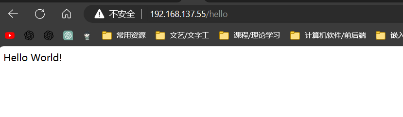


get参数解析：


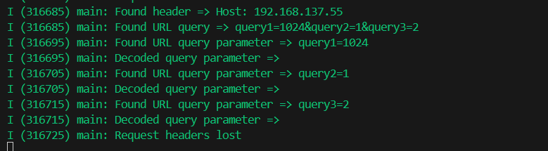


我们还可以使用get返回一个网页，用于数据交互：

新增一个HTML网页的GET路由：

```c
const httpd_uri_t html = {
		.uri = "/html",
		.method = HTTP_GET,
		.handler = html_get_handler,
		.user_ctx = NULL};
```

注册：
```c
    httpd_register_uri_handler(server, &html);
```

`html_get_handler`函数:

```c
//定义HTML页面
char form_html[] = R"(
<!DOCTYPE html>
<html>
<head>
<title>ESP32 Web Server</title>
</head>
<body>
<h1>ESP32 Web Server</h1>
<form action="http://192.168.137.55/echo" method="post">
	<label for="fname">Username:</label><br>
	<input type="text" id="fname" name="username" value="John"><br>
	<label for="lname">Age:</label><br>
	<input type="text" id="lname" name="age" value="Doe"><br><br>
	<input type="submit" value="Submit">
</form>
</body>
</html>
)";

static esp_err_t html_get_handler(httpd_req_t *req)
{
	// 指向 HTML 页面字符串的指针
	const char *html_content = form_html;

	// 设置 Content-Type 头
	httpd_resp_set_type(req, "text/html");

	// 发送 HTML 页面作为 HTTP 响应的正文部分
	httpd_resp_send(req, html_content, strlen(html_content));

	return ESP_OK;
}

```

访问效果如图所示：

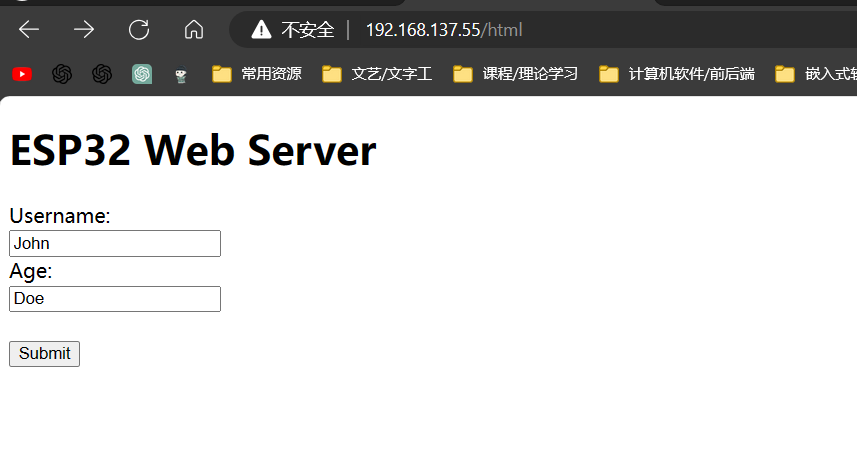

#### POST方法

我们接着刚才写好的表单，发起一个psot请求
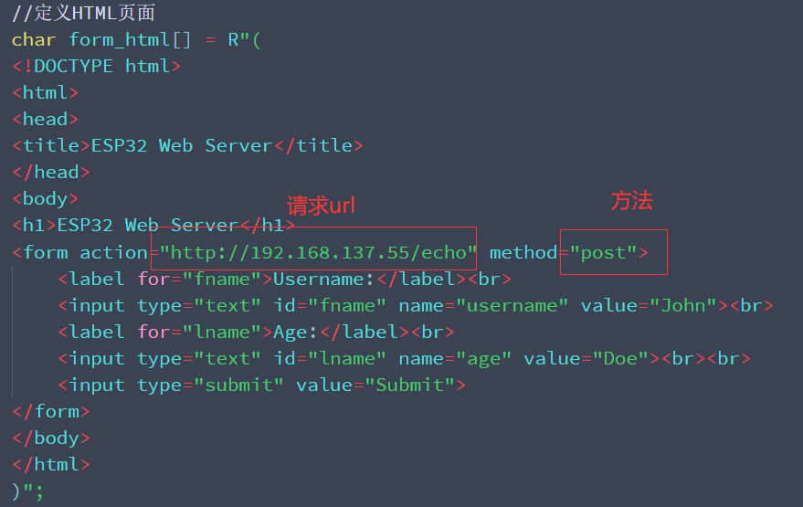

这里的URL的IP需要填写自己ESP32联网分配到的IP。这样我们点击提交表单就可以直接发起POST请求。

注册post路由：

```c
const httpd_uri_t echo = {
		.uri = "/echo",
		.method = HTTP_POST,
		.handler = echo_post_handler,
		.user_ctx = NULL};
```

post处理方法：

```c
/* An HTTP POST handler */
static esp_err_t echo_post_handler(httpd_req_t *req)
{
	/* 定义 HTTP POST 请求数据的目标缓存区
	 * httpd_req_recv() 只接收 char* 数据，但也可以是
	 * 任意二进制数据（需要类型转换）
	 * 对于字符串数据，null 终止符会被省略，
	 * content_len 会给出字符串的长度 */
	char buf[100];
	int ret, remaining = req->content_len;

	while (remaining > 0)
	{
		/* Read the data for the request */
		if ((ret = httpd_req_recv(req, buf,
															MIN(remaining, sizeof(buf)))) <= 0)
		{
			if (ret == HTTPD_SOCK_ERR_TIMEOUT)
			{
				/* Retry receiving if timeout occurred */
				continue;
			}
			/* 如果发生了错误，返回 ESP_FAIL 可以确保
			 * 底层套接字被关闭 */
			return ESP_FAIL;
		}

		/* Send back the same data */
		httpd_resp_send_chunk(req, buf, ret);
		remaining -= ret;

		/* Log data received */
		ESP_LOGI(TAG, "=========== RECEIVED DATA ==========");
		ESP_LOGI(TAG, "%.*s", ret, buf);
		ESP_LOGI(TAG, "====================================");
	}

	// End response
	httpd_resp_send_chunk(req, NULL, 0);
	return ESP_OK;
}
```

效果如下：

在表单填写内容：

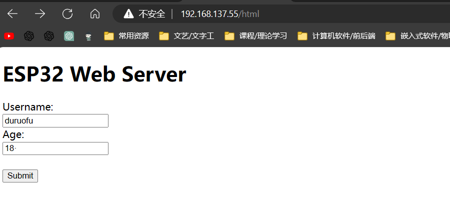

提交：

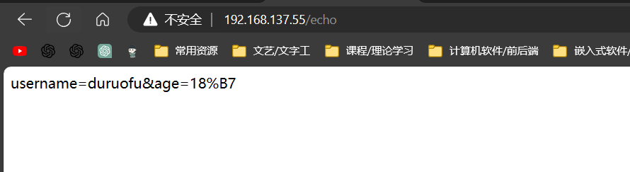

数据回显，POST请求验证完成。

>PS：如果出现下面的报错：Header fields are too long
>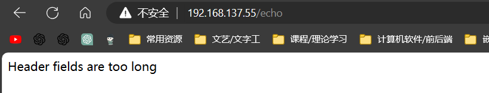
>需要在配置文件里修改：
>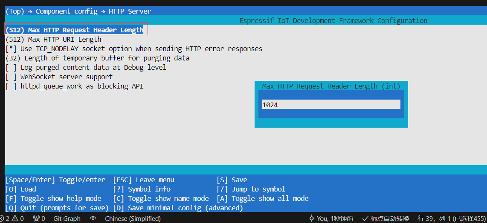

#### PUT方法

>put用于修改数据

注册路由：

```c
const httpd_uri_t ctrl = {
		.uri = "/ctrl",
		.method = HTTP_PUT,
		.handler = ctrl_put_handler,
		.user_ctx = NULL};

```

路由处理：

```c
esp_err_t ctrl_put_handler(httpd_req_t *req)
{
	char buf;
	int ret;

	if ((ret = httpd_req_recv(req, &buf, 1)) <= 0)
	{
		if (ret == HTTPD_SOCK_ERR_TIMEOUT)
		{
			httpd_resp_send_408(req);
		}
		return ESP_FAIL;
	}

	if (buf == '0')
	{
		/* URI handlers can be unregistered using the uri string */
		ESP_LOGI(TAG, "Unregistering /hello and /echo URIs");
		httpd_unregister_uri(req->handle, "/hello");
		httpd_unregister_uri(req->handle, "/echo");
		/* Register the custom error handler */
		httpd_register_err_handler(req->handle, HTTPD_404_NOT_FOUND, http_404_error_handler);
	}
	else
	{
		ESP_LOGI(TAG, "Registering /hello and /echo URIs");
		httpd_register_uri_handler(req->handle, &hello);
		httpd_register_uri_handler(req->handle, &echo);
		/* Unregister custom error handler */
		httpd_register_err_handler(req->handle, HTTPD_404_NOT_FOUND, NULL);
	}

	/* Respond with empty body */
	httpd_resp_send(req, NULL, 0);
	return ESP_OK;
}


```

1. 从请求中接收一个字节的数据到 `buf` 中。
2. 如果接收失败或超时，则返回 HTTP 408 请求超时错误。
3. 如果接收成功且接收的数据为 '0'，则取消注册 "/hello" 和 "/echo" 的 URI 处理器，并注册自定义的 404 错误处理函数 `http_404_error_handler`。
4. 如果接收的数据不为 '0'，则注册 "/hello" 和 "/echo" 的 URI 处理器，并取消注册自定义的 404 错误处理函数。
5. 最后，回复空的 HTTP 响应体并返回 ESP_OK。


测试效果：

使用下面的js代码在浏览器控制台发送PUT请求：
```js
var xhr = new XMLHttpRequest();
xhr.open("PUT","http://192.168.137.55/ctrl"，true);
xhr.send("0");
```

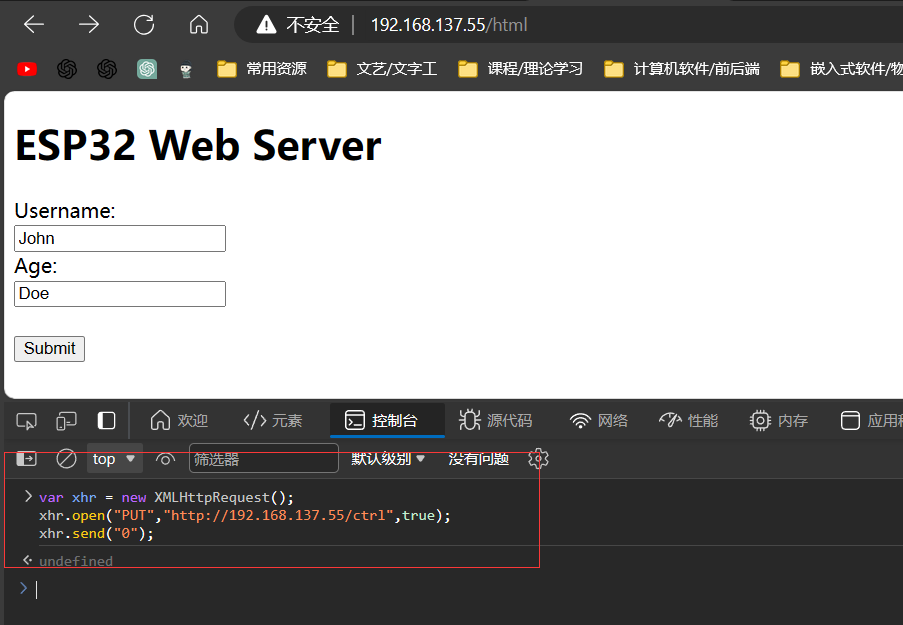

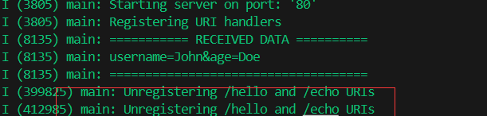


这时hello路由就被取消注册了：

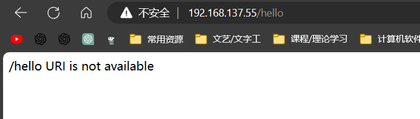


发送1，hello被重新注册：
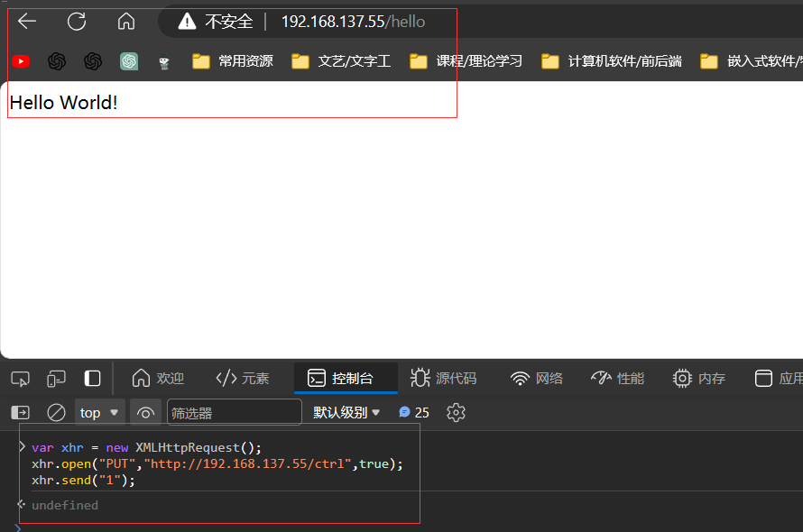


### 三、停止服务器，释放资源

```c
/* 停止 Web 服务器的函数 */
void stop_webserver(httpd_handle_t server)
{
    if (server) {
        /* 停止 httpd server */
        httpd_stop(server);
    }
}
```

## 三、示例


>下面是本节全部代码，效果上面展示过，就不再演示

```c
#include <stdio.h>
#include <string.h>
#include "freertos/FreeRTOS.h"
#include "freertos/event_groups.h"
#include "esp_wifi.h"
#include "esp_log.h"
#include "esp_event.h"
#include <sys/param.h>
#include "nvs_flash.h"
#include "esp_mac.h"
#include "esp_netif.h"
#include <sys/socket.h>
#include "esp_tls_crypto.h"
#include <esp_http_server.h>
#include "esp_tls.h"
#include "esp_check.h"
#include <string.h>
#include <stdlib.h>
#include <unistd.h>
#include <esp_log.h>
#include <nvs_flash.h>
#include <sys/param.h>
#include "esp_netif.h"
#include "esp_tls_crypto.h"
#include <esp_http_server.h>
#include "esp_event.h"
#include "esp_netif.h"
#include "esp_tls.h"
#include "esp_check.h"

// 要连接的WIFI
#define ESP_WIFI_STA_SSID "duruofu_win10"
#define ESP_WIFI_STA_PASSWD "1234567890"

static const char *TAG = "main";

#define EXAMPLE_HTTP_QUERY_KEY_MAX_LEN (64)

char form_html[] = R"(
<!DOCTYPE html>
<html>
<head>
<title>ESP32 Web Server</title>
</head>
<body>
<h1>ESP32 Web Server</h1>
<form action="http://192.168.137.55/echo" method="post">
	<label for="fname">Username:</label><br>
	<input type="text" id="fname" name="username" value="John"><br>
	<label for="lname">Age:</label><br>
	<input type="text" id="lname" name="age" value="Doe"><br><br>
	<input type="submit" value="Submit">
</form>
</body>
</html>)";

// WIFI回调
void WIFI_CallBack(void *event_handler_arg, esp_event_base_t event_base, int32_t event_id, void *event_data)
{
	static uint8_t connect_count = 0;
	// WIFI 启动成功
	if (event_base == WIFI_EVENT && event_id == WIFI_EVENT_STA_START)
	{
		ESP_LOGI("WIFI_EVENT", "WIFI_EVENT_STA_START");
		ESP_ERROR_CHECK(esp_wifi_connect());
	}
	// WIFI 连接失败
	if (event_base == WIFI_EVENT && event_id == WIFI_EVENT_STA_DISCONNECTED)
	{
		ESP_LOGI("WIFI_EVENT", "WIFI_EVENT_STA_DISCONNECTED");
		connect_count++;
		if (connect_count < 6)
		{
			vTaskDelay(1000 / portTICK_PERIOD_MS);
			ESP_ERROR_CHECK(esp_wifi_connect());
		}
		else
		{
			ESP_LOGI("WIFI_EVENT", "WIFI_EVENT_STA_DISCONNECTED 10 times");
		}
	}
	// WIFI 连接成功(获取到了IP)
	if (event_base == IP_EVENT && event_id == IP_EVENT_STA_GOT_IP)
	{
		ESP_LOGI("WIFI_EVENT", "WIFI_EVENT_STA_GOT_IP");
		ip_event_got_ip_t *info = (ip_event_got_ip_t *)event_data;
		ESP_LOGI("WIFI_EVENT", "got ip:" IPSTR "", IP2STR(&info->ip_info.ip));
	}
}

// wifi初始化
static void wifi_sta_init(void)
{
	ESP_ERROR_CHECK(esp_netif_init());

	// 注册事件(wifi启动成功)
	ESP_ERROR_CHECK(esp_event_handler_instance_register(WIFI_EVENT, WIFI_EVENT_STA_START, WIFI_CallBack, NULL, NULL));
	// 注册事件(wifi连接失败)
	ESP_ERROR_CHECK(esp_event_handler_instance_register(WIFI_EVENT, WIFI_EVENT_STA_DISCONNECTED, WIFI_CallBack, NULL, NULL));
	// 注册事件(wifi连接失败)
	ESP_ERROR_CHECK(esp_event_handler_instance_register(IP_EVENT, IP_EVENT_STA_GOT_IP, WIFI_CallBack, NULL, NULL));

	// 初始化STA设备
	esp_netif_create_default_wifi_sta();

	/*Initialize WiFi */
	wifi_init_config_t cfg = WIFI_INIT_CONFIG_DEFAULT();
	// WIFI_INIT_CONFIG_DEFAULT 是一个默认配置的宏

	ESP_ERROR_CHECK(esp_wifi_init(&cfg));

	//----------------配置阶段-------------------
	// 初始化WIFI设备( 为 WiFi 驱动初始化 WiFi 分配资源，如 WiFi 控制结构、RX/TX 缓冲区、WiFi NVS 结构等，这个 WiFi 也启动 WiFi 任务。必须先调用此API，然后才能调用所有其他WiFi API)
	ESP_ERROR_CHECK(esp_wifi_set_mode(WIFI_MODE_STA));

	// STA详细配置
	wifi_config_t sta_config = {
			.sta = {
					.ssid = ESP_WIFI_STA_SSID,
					.password = ESP_WIFI_STA_PASSWD,
					.bssid_set = false,
			},
	};
	ESP_ERROR_CHECK(esp_wifi_set_config(WIFI_IF_STA, &sta_config));

	//----------------启动阶段-------------------
	ESP_ERROR_CHECK(esp_wifi_start());

	//----------------配置省电模式-------------------
	// 不省电(数据传输会更快)
	ESP_ERROR_CHECK(esp_wifi_set_ps(WIFI_PS_NONE));
}


/*路由处理程序*/

/* An HTTP GET handler */
static esp_err_t hello_get_handler(httpd_req_t *req)
{
	char *buf;
	size_t buf_len;

	/* Get header value string length and allocate memory for length + 1,
	 * extra byte for null termination */
	buf_len = httpd_req_get_hdr_value_len(req, "Host") + 1;
	if (buf_len > 1)
	{
		buf = malloc(buf_len);
		ESP_RETURN_ON_FALSE(buf, ESP_ERR_NO_MEM, TAG, "buffer alloc failed");
		/* Copy null terminated value string into buffer */
		if (httpd_req_get_hdr_value_str(req, "Host", buf, buf_len) == ESP_OK)
		{
			ESP_LOGI(TAG, "Found header => Host: %s", buf);
		}
		free(buf);
	}

	buf_len = httpd_req_get_hdr_value_len(req, "Test-Header-2") + 1;
	if (buf_len > 1)
	{
		buf = malloc(buf_len);
		ESP_RETURN_ON_FALSE(buf, ESP_ERR_NO_MEM, TAG, "buffer alloc failed");
		if (httpd_req_get_hdr_value_str(req, "Test-Header-2", buf, buf_len) == ESP_OK)
		{
			ESP_LOGI(TAG, "Found header => Test-Header-2: %s", buf);
		}
		free(buf);
	}

	buf_len = httpd_req_get_hdr_value_len(req, "Test-Header-1") + 1;
	if (buf_len > 1)
	{
		buf = malloc(buf_len);
		ESP_RETURN_ON_FALSE(buf, ESP_ERR_NO_MEM, TAG, "buffer alloc failed");
		if (httpd_req_get_hdr_value_str(req, "Test-Header-1", buf, buf_len) == ESP_OK)
		{
			ESP_LOGI(TAG, "Found header => Test-Header-1: %s", buf);
		}
		free(buf);
	}

	/* Read URL query string length and allocate memory for length + 1,
	 * extra byte for null termination */
	buf_len = httpd_req_get_url_query_len(req) + 1;
	if (buf_len > 1)
	{
		buf = malloc(buf_len);
		ESP_RETURN_ON_FALSE(buf, ESP_ERR_NO_MEM, TAG, "buffer alloc failed");
		if (httpd_req_get_url_query_str(req, buf, buf_len) == ESP_OK)
		{
			ESP_LOGI(TAG, "Found URL query => %s", buf);
			char param[EXAMPLE_HTTP_QUERY_KEY_MAX_LEN], dec_param[EXAMPLE_HTTP_QUERY_KEY_MAX_LEN] = {0};
			/* Get value of expected key from query string */
			if (httpd_query_key_value(buf, "query1", param, sizeof(param)) == ESP_OK)
			{
				ESP_LOGI(TAG, "Found URL query parameter => query1=%s", param);
				//example_uri_decode(dec_param, param, strnlen(param, EXAMPLE_HTTP_QUERY_KEY_MAX_LEN));
				ESP_LOGI(TAG, "Decoded query parameter => %s", dec_param);
			}
			if (httpd_query_key_value(buf, "query2", param, sizeof(param)) == ESP_OK)
			{
				ESP_LOGI(TAG, "Found URL query parameter => query2=%s", param);
				//example_uri_decode(dec_param, param, strnlen(param, EXAMPLE_HTTP_QUERY_KEY_MAX_LEN));
				ESP_LOGI(TAG, "Decoded query parameter => %s", dec_param);
			}
			if (httpd_query_key_value(buf, "query3", param, sizeof(param)) == ESP_OK)
			{
				ESP_LOGI(TAG, "Found URL query parameter => query3=%s", param);
				//example_uri_decode(dec_param, param, strnlen(param, EXAMPLE_HTTP_QUERY_KEY_MAX_LEN));
				ESP_LOGI(TAG, "Decoded query parameter => %s", dec_param);
			}
		}
		free(buf);
	}

	/* Set some custom headers */
	httpd_resp_set_hdr(req, "Custom-Header-1", "Custom-Value-1");
	httpd_resp_set_hdr(req, "Custom-Header-2", "Custom-Value-2");

	/* Send response with custom headers and body set as the
	 * string passed in user context*/
	const char *resp_str = (const char *)req->user_ctx;
	httpd_resp_send(req, resp_str, HTTPD_RESP_USE_STRLEN);

	/* After sending the HTTP response the old HTTP request
	 * headers are lost. Check if HTTP request headers can be read now. */
	if (httpd_req_get_hdr_value_len(req, "Host") == 0)
	{
		ESP_LOGI(TAG, "Request headers lost");
	}
	return ESP_OK;
}

static esp_err_t html_get_handler(httpd_req_t *req)
{
	// 指向 HTML 页面字符串的指针
	const char *html_content = form_html;

	// 设置 Content-Type 头
	httpd_resp_set_type(req, "text/html");

	// 发送 HTML 页面作为 HTTP 响应的正文部分
	httpd_resp_send(req, html_content, strlen(html_content));

	return ESP_OK;
}

/* An HTTP POST handler */
static esp_err_t echo_post_handler(httpd_req_t *req)
{
	/* 定义 HTTP POST 请求数据的目标缓存区
	 * httpd_req_recv() 只接收 char* 数据，但也可以是
	 * 任意二进制数据（需要类型转换）
	 * 对于字符串数据，null 终止符会被省略，
	 * content_len 会给出字符串的长度 */
	char buf[100];
	int ret, remaining = req->content_len;

	while (remaining > 0)
	{
		/* Read the data for the request */
		if ((ret = httpd_req_recv(req, buf,
															MIN(remaining, sizeof(buf)))) <= 0)
		{
			if (ret == HTTPD_SOCK_ERR_TIMEOUT)
			{
				/* Retry receiving if timeout occurred */
				continue;
			}
			/* 如果发生了错误，返回 ESP_FAIL 可以确保
			 * 底层套接字被关闭 */
			return ESP_FAIL;
		}

		/* Send back the same data */
		httpd_resp_send_chunk(req, buf, ret);
		remaining -= ret;

		/* Log data received */
		ESP_LOGI(TAG, "=========== RECEIVED DATA ==========");
		ESP_LOGI(TAG, "%.*s", ret, buf);
		ESP_LOGI(TAG, "====================================");
	}

	// End response
	httpd_resp_send_chunk(req, NULL, 0);
	return ESP_OK;
}

/* 注册路由 */
const httpd_uri_t hello = {
		.uri = "/hello",
		.method = HTTP_GET,
		.handler = hello_get_handler,
		.user_ctx = "Hello World!"};

const httpd_uri_t html = {
		.uri = "/html",
		.method = HTTP_GET,
		.handler = html_get_handler,
		.user_ctx = NULL};

const httpd_uri_t echo = {
		.uri = "/echo",
		.method = HTTP_POST,
		.handler = echo_post_handler,
		.user_ctx = NULL};


/* This handler allows the custom error handling functionality to be
 * tested from client side. For that, when a PUT request 0 is sent to
 * URI /ctrl, the /hello and /echo URIs are unregistered and following
 * custom error handler http_404_error_handler() is registered.
 * Afterwards, when /hello or /echo is requested, this custom error
 * handler is invoked which, after sending an error message to client,
 * either closes the underlying socket (when requested URI is /echo)
 * or keeps it open (when requested URI is /hello). This allows the
 * client to infer if the custom error handler is functioning as expected
 * by observing the socket state.
 */
esp_err_t http_404_error_handler(httpd_req_t *req, httpd_err_code_t err)
{
	if (strcmp("/hello", req->uri) == 0)
	{
		httpd_resp_send_err(req, HTTPD_404_NOT_FOUND, "/hello URI is not available");
		/* Return ESP_OK to keep underlying socket open */
		return ESP_OK;
	}
	else if (strcmp("/echo", req->uri) == 0)
	{
		httpd_resp_send_err(req, HTTPD_404_NOT_FOUND, "/echo URI is not available");
		/* Return ESP_FAIL to close underlying socket */
		return ESP_FAIL;
	}
	/* For any other URI send 404 and close socket */
	httpd_resp_send_err(req, HTTPD_404_NOT_FOUND, "Some 404 error message");
	return ESP_FAIL;
}

/* An HTTP PUT handler. This demonstrates realtime
 * registration and deregistration of URI handlers
 */
esp_err_t ctrl_put_handler(httpd_req_t *req)
{
	char buf;
	int ret;

	if ((ret = httpd_req_recv(req, &buf, 1)) <= 0)
	{
		if (ret == HTTPD_SOCK_ERR_TIMEOUT)
		{
			httpd_resp_send_408(req);
		}
		return ESP_FAIL;
	}

	if (buf == '0')
	{
		/* URI handlers can be unregistered using the uri string */
		ESP_LOGI(TAG, "Unregistering /hello and /echo URIs");
		httpd_unregister_uri(req->handle, "/hello");
		httpd_unregister_uri(req->handle, "/echo");
		/* Register the custom error handler */
		httpd_register_err_handler(req->handle, HTTPD_404_NOT_FOUND, http_404_error_handler);
	}
	else
	{
		ESP_LOGI(TAG, "Registering /hello and /echo URIs");
		httpd_register_uri_handler(req->handle, &hello);
		httpd_register_uri_handler(req->handle, &echo);
		/* Unregister custom error handler */
		httpd_register_err_handler(req->handle, HTTPD_404_NOT_FOUND, NULL);
	}

	/* Respond with empty body */
	httpd_resp_send(req, NULL, 0);
	return ESP_OK;
}


static const httpd_uri_t ctrl = {
		.uri = "/ctrl",
		.method = HTTP_PUT,
		.handler = ctrl_put_handler,
		.user_ctx = NULL};

/* 启动 Web 服务器的函数 */
httpd_handle_t start_webserver(void)
{
	/* 生成默认的配置参数 */
	httpd_config_t config = HTTPD_DEFAULT_CONFIG();

	/* 置空 esp_http_server 的实例句柄 */
	httpd_handle_t server = NULL;

	ESP_LOGI(TAG, "Starting server on port: '%d'", config.server_port);
	/* 启动 httpd server */
	if (httpd_start(&server, &config) == ESP_OK)
	{
		/* 注册 URI 处理程序 */
		ESP_LOGI(TAG, "Registering URI handlers");
		httpd_register_uri_handler(server, &hello);
		httpd_register_uri_handler(server, &html);
		httpd_register_uri_handler(server, &echo);
		httpd_register_uri_handler(server, &ctrl);
	}
	/* 如果服务器启动失败，返回的句柄是 NULL */
	return server;
}


void app_main(void)
{
	static httpd_handle_t server = NULL;

	// Initialize NVS
	esp_err_t ret = nvs_flash_init();
	if (ret == ESP_ERR_NVS_NO_FREE_PAGES || ret == ESP_ERR_NVS_NEW_VERSION_FOUND)
	{
		ESP_ERROR_CHECK(nvs_flash_erase());
		ret = nvs_flash_init();
	}
	ESP_ERROR_CHECK(ret);

	// 创建默认事件循环
	ESP_ERROR_CHECK(esp_event_loop_create_default());

	// 配置启动WIFI
	wifi_sta_init();

	vTaskDelay(3000 / portTICK_PERIOD_MS);

	/* Start the server for the first time */
	server = start_webserver();

	while (server)
	{
		sleep(5);
	}
}


```


# 参考链接

1. https://docs.espressif.com/projects/esp-idf/zh_CN/latest/esp32/api-reference/protocols/esp_http_server.html
2. https://space.bilibili.com/1338335828