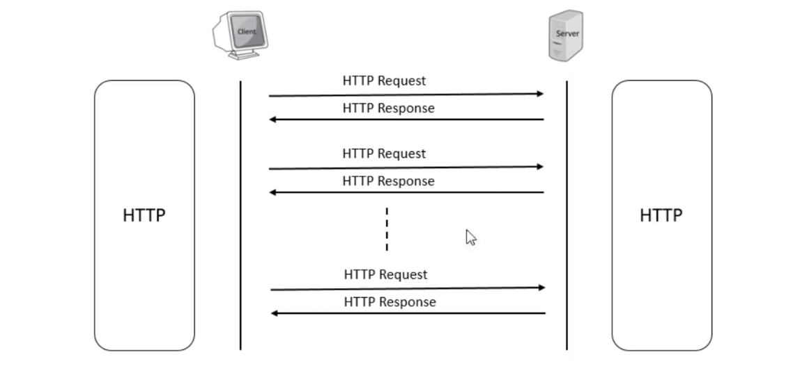
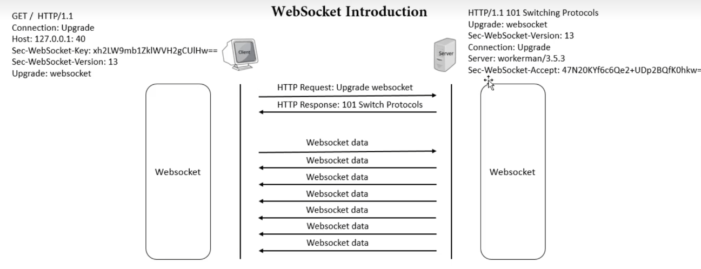
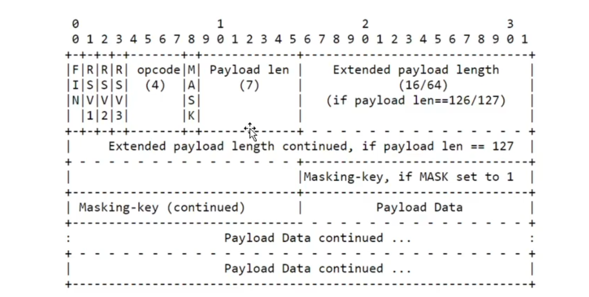
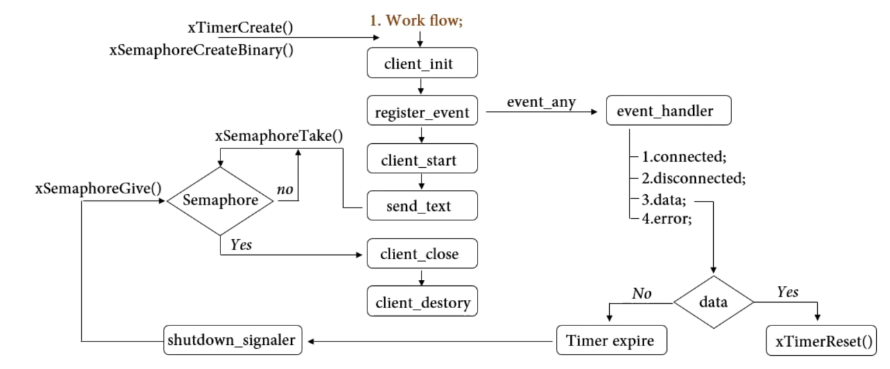
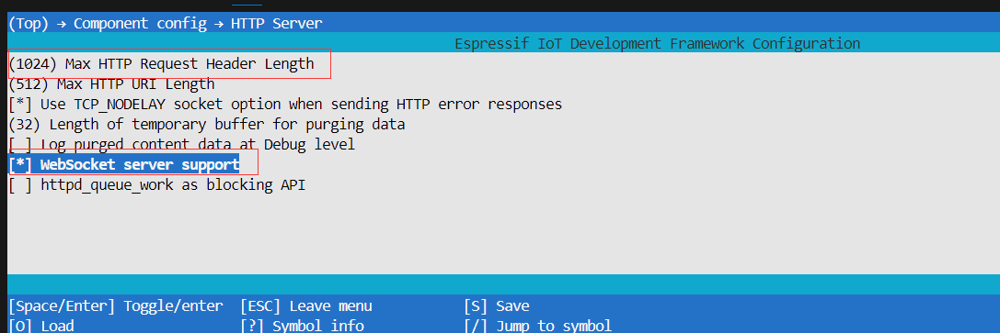
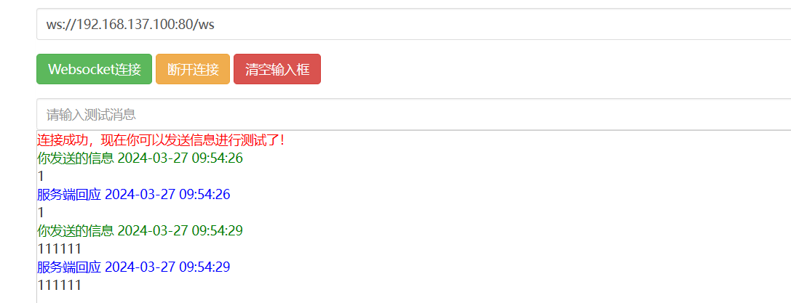
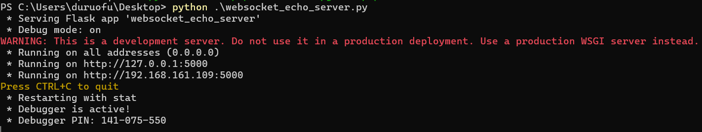
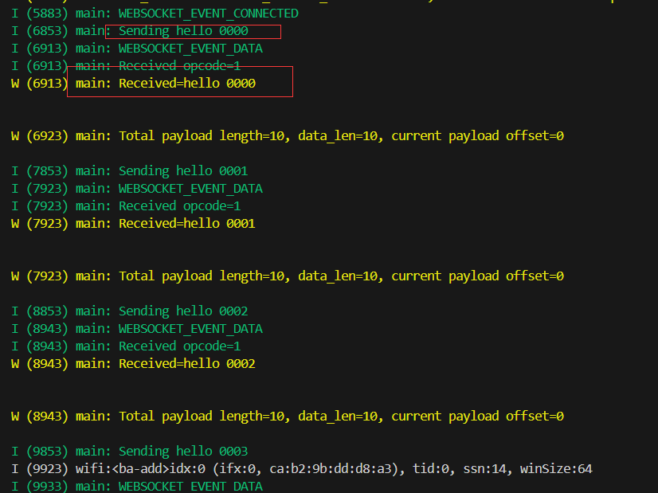

# ESP32网络入门 - WebSocket协议

> [!TIP] 🚀 WebSocket协议 | 实时双向通信  
> - 💡 **碎碎念**😎：本节将介绍如何在 ESP32 上实现 WebSocket 协议，进行实时双向通信。你将学习如何创建 WebSocket 服务器和客户端，支持快速、低延迟的数据传输。  
> - 📺 **视频教程**：暂无  
> - 💾 **示例代码**：[ESP32-Guide/code/05.wifi/websocket](https://github.com/DuRuofu/ESP32-Guide/tree/main/code/05.wifi/websocket)

## 一、介绍

### 1.1 WebSocket介绍

> 详细介绍可以参考: [万字长文，一篇吃透WebSocket：概念、原理、易错常识、动手实践](https://cloud.tencent.com/developer/article/1887095)

WebSocket 是一种在单个 TCP 连接上进行全双工通信的协议。它的主要特点是可以实现实时双向通信，并且可以在客户端和服务器之间传输任意数据，而不受 HTTP 语义限制。



与传统的 HTTP 请求-响应模式不同，WebSocket 采用了类似握手的方法来建立连接。客户端向服务器发送一个 HTTP 请求头，其中包含 Upgrade、Connection、Sec-WebSocket-Key 等字段，通知服务器要进行连接升级。服务器返回一个 HTTP 响应头，其中也包含 Upgrade、Connection 和 Sec-WebSocket-Accept 等字段，表示已同意升级连接。之后，客户端和服务器之间的数据就可以以帧为单位进行传输，每个帧包含一个信息片段，可以是文本也可以是二进制。



WebSocket 协议的优点是支持实时通信，具有较低的延迟，可减少网络传输的开销，有助于提高应用程序的性能。常见的应用场景包括聊天应用、在线游戏、实时数据监控等。

### webSocket数据帧格式

WebSocket 数据帧是 WebSocket 协议中传输数据的基本单位，每个帧可以包含一个或多个信息片段（Message Fragment），可以是文本也可以是二进制，由 Header 和 Payload 两部分组成。



Header 一般包括了以下几个字段：
1.  FIN：1 位，表示当前帧是否为消息的最后一帧，值为 1 表示是，值为 0 表示不是。
2.  RSV1、RSV2、RSV3：各占 1 位，用于扩展协议。通常情况下，这三位都被置为 0。
3.  Opcode：4 位，用于表示消息类型，如 0x1 表示文本消息，0x2 表示二进制消息，0x8 表示关闭连接等。
4.  Mask：1 位，表示负载数据是否被掩码处理过，值为 1 表示被掩码处理，值为 0 表示未被掩码处理。
5.  Payload length：7 位或 7+16 位或 7+64 位，表示负载数据的长度。当值为 0~126 时，表示负载数据的长度就是该值；当值为 127 时，额外有两个字节表示长度，当值大于等于 2^16 时，额外有 4 个字节表示长度。
如果 Mask 位被设置为 1，则 Header 中还要包含一个 4 字节的掩码码值（Masking Key），用于对负载数据进行反掩码操作。
Payload 是实际的数据内容，长度由 Header 中的 Payload length 字段表示，可能是文本也可能是二进制。
在整个 WebSocket 连接过程中，客户端和服务器会相互发送一些数据帧，包括握手请求、握手响应、消息片段等，根据不同的功能要求分别使用不同的 Opcode 来表示。

## 二、使用

### 2.1 服务端

下面我们参考：[ Websocket echo server](https://github.com/espressif/esp-idf/tree/be06a6f5ffe36f9554cfc91fe2036e0fc85fea60/examples/protocols/http_server/ws_echo_server)这个历程来学习WebSocket服务端程序

#### 2.1.1 创建服务实例

```c
static httpd_handle_t start_webserver(void)
{
	httpd_handle_t server = NULL;
	httpd_config_t config = HTTPD_DEFAULT_CONFIG();

	// Start the httpd server
	ESP_LOGI(TAG, "Starting server on port: '%d'", config.server_port);
	if (httpd_start(&server, &config) == ESP_OK)
	{
		// Registering the ws handler
		ESP_LOGI(TAG, "Registering URI handlers");
		httpd_register_uri_handler(server, &ws);
		return server;
	}

	ESP_LOGI(TAG, "Error starting server!");
	return NULL;
}
```

这段代码用于启动 HTTP 服务器。它首先创建一个 HTTP 服务器实例，并使用默认配置进行初始化。然后尝试启动 HTTP 服务器，如果启动成功则打印服务器监听的端口号，并注册 WebSocket 处理器（ws handler）。
#### 2.1.2 注册路由

```c
static const httpd_uri_t ws = {
		.uri = "/ws",
		.method = HTTP_GET,
		.handler = echo_handler,
		.user_ctx = NULL,
		.is_websocket = true};

```
#### 2.1.3 路由处理

```c
/*
 * This handler echos back the received ws data
 * and triggers an async send if certain message received
 */
static esp_err_t echo_handler(httpd_req_t *req)
{
	if (req->method == HTTP_GET)
	{
		ESP_LOGI(TAG, "Handshake done, the new connection was opened");
		return ESP_OK;
	}
	httpd_ws_frame_t ws_pkt;
	uint8_t *buf = NULL;
	memset(&ws_pkt, 0, sizeof(httpd_ws_frame_t));
	ws_pkt.type = HTTPD_WS_TYPE_TEXT;
	/* Set max_len = 0 to get the frame len */
	// 读取数据
	esp_err_t ret = httpd_ws_recv_frame(req, &ws_pkt, 0);
	if (ret != ESP_OK)
	{
		ESP_LOGE(TAG, "httpd_ws_recv_frame failed to get frame len with %d", ret);
		return ret;
	}
	ESP_LOGI(TAG, "frame len is %d", ws_pkt.len);
	if (ws_pkt.len)
	{
		/* ws_pkt.len + 1 is for NULL termination as we are expecting a string */
		buf = calloc(1, ws_pkt.len + 1);
		if (buf == NULL)
		{
			ESP_LOGE(TAG, "Failed to calloc memory for buf");
			return ESP_ERR_NO_MEM;
		}
		ws_pkt.payload = buf;
		/* Set max_len = ws_pkt.len to get the frame payload */
		ret = httpd_ws_recv_frame(req, &ws_pkt, ws_pkt.len);
		if (ret != ESP_OK)
		{
			ESP_LOGE(TAG, "httpd_ws_recv_frame failed with %d", ret);
			free(buf);
			return ret;
		}
		ESP_LOGI(TAG, "Got packet with message: %s", ws_pkt.payload);
	}
	ESP_LOGI(TAG, "Packet type: %d", ws_pkt.type);
	if (ws_pkt.type == HTTPD_WS_TYPE_TEXT &&
			strcmp((char *)ws_pkt.payload, "Trigger async") == 0)
	{
		free(buf);
		return trigger_async_send(req->handle, req);
	}

	ret = httpd_ws_send_frame(req, &ws_pkt);
	if (ret != ESP_OK)
	{
		ESP_LOGE(TAG, "httpd_ws_send_frame failed with %d", ret);
	}
	free(buf);
	return ret;
}
```

这段代码用于处理通过 WebSocket 接收到的数据并作出相应的响应。

1. 当接收到 HTTP GET 请求时，打印日志并返回 ESP_OK，表示握手成功，连接已打开。
2. 当接收到 WebSocket 数据帧时，首先获取帧的长度，并根据长度分配内存。
3. 再次接收 WebSocket 数据帧，获取帧的有效载荷（payload），并将其打印出来。
4. 根据接收到的数据帧类型，如果是文本类型且内容为 "Trigger async"，则调用 `trigger_async_send` 函数进行异步发送处理，并释放内存。
5. 否则，将接收到的数据帧原样返回给客户端，并释放内存。

#### 2.1.4 服务器发送数据


```c
/*
 * Structure holding server handle
 * and internal socket fd in order
 * to use out of request send
 */
struct async_resp_arg
{
	httpd_handle_t hd;
	int fd;
};

/*
 * async send function, which we put into the httpd work queue
 */
static void ws_async_send(void *arg)
{
	static const char *data = "Async data";
	struct async_resp_arg *resp_arg = arg;
	httpd_handle_t hd = resp_arg->hd;
	int fd = resp_arg->fd;
	httpd_ws_frame_t ws_pkt;
	memset(&ws_pkt, 0, sizeof(httpd_ws_frame_t));
	ws_pkt.payload = (uint8_t *)data;
	ws_pkt.len = strlen(data);
	ws_pkt.type = HTTPD_WS_TYPE_TEXT;

	httpd_ws_send_frame_async(hd, fd, &ws_pkt);
	free(resp_arg);
}

static esp_err_t trigger_async_send(httpd_handle_t handle, httpd_req_t *req)
{
	struct async_resp_arg *resp_arg = malloc(sizeof(struct async_resp_arg));
	if (resp_arg == NULL)
	{
		return ESP_ERR_NO_MEM;
	}
	resp_arg->hd = req->handle;
	resp_arg->fd = httpd_req_to_sockfd(req);
	esp_err_t ret = httpd_queue_work(handle, ws_async_send, resp_arg);
	if (ret != ESP_OK)
	{
		free(resp_arg);
	}
	return ret;
}
```

异步发送
```c
trigger_async_send(req->handle, req);
```

同步发送：
```
httpd_ws_send_frame(req, &ws_pkt);
```

这两个函数都调用`esp_err_t httpd_ws_send_frame_async(httpd_handle_t hd, int fd, httpd_ws_frame_t *frame)`

`httpd_ws_send_frame_async`的内容如下：

   >了解即可：

```c
esp_err_t httpd_ws_send_frame_async(httpd_handle_t hd, int fd, httpd_ws_frame_t *frame)
{
    if (!frame) {
        ESP_LOGW(TAG, LOG_FMT("Argument is invalid"));
        return ESP_ERR_INVALID_ARG;
    }
    /* Prepare Tx buffer - maximum length is 14, which includes 2 bytes header, 8 bytes length, 4 bytes mask key */
    uint8_t tx_len = 0;
    uint8_t header_buf[10] = {0 };
    /* Set the `FIN` bit by default if message is not fragmented. Else, set it as per the `final` field */
    header_buf[0] |= (!frame->fragmented) ? HTTPD_WS_FIN_BIT : (frame->final? HTTPD_WS_FIN_BIT: HTTPD_WS_CONTINUE);
    header_buf[0] |= frame->type; /* Type (opcode): 4 bits */
    if (frame->len <= 125) {
        header_buf[1] = frame->len & 0x7fU; /* Length for 7 bits */
        tx_len = 2;
    } else if (frame->len > 125 && frame->len < UINT16_MAX) {
        header_buf[1] = 126;                /* Length for 16 bits */
        header_buf[2] = (frame->len >> 8U) & 0xffU;
        header_buf[3] = frame->len & 0xffU;
        tx_len = 4;
    } else {
        header_buf[1] = 127;                /* Length for 64 bits */
        uint8_t shift_idx = sizeof(uint64_t) - 1; /* Shift index starts at 7 */
        uint64_t len64 = frame->len; /* Raise variable size to make sure we won't shift by more bits
                                      * than the length has (to avoid undefined behaviour) */
        for (int8_t idx = 2; idx <= 9; idx++) {
            /* Now do shifting (be careful of endianness, i.e. when buffer index is 2, frame length shift index is 7) */
            header_buf[idx] = (len64 >> (shift_idx * 8)) & 0xffU;
            shift_idx--;
        }
        tx_len = 10;
    }
    /* WebSocket server does not required to mask response payload, so leave the MASK bit as 0. */
    header_buf[1] &= (~HTTPD_WS_MASK_BIT);
    struct sock_db *sess = httpd_sess_get(hd, fd);
    if (!sess) {
        return ESP_ERR_INVALID_ARG;
    }
    /* Send off header */
    if (sess->send_fn(hd, fd, (const char *)header_buf, tx_len, 0) < 0) {
        ESP_LOGW(TAG, LOG_FMT("Failed to send WS header"));
        return ESP_FAIL;
    }  
    /* Send off payload */
    if(frame->len > 0 && frame->payload != NULL) {
        if (sess->send_fn(hd, fd, (const char *)frame->payload, frame->len, 0) < 0) {
            ESP_LOGW(TAG, LOG_FMT("Failed to send WS payload"));
            return ESP_FAIL;
        }
    }
    return ESP_OK;
}
```


这是一段 ESP32 上通过 WebSocket 发送帧的代码，该函数会向指定的 WebSocket 连接发送加密后的帧数据。主要实现如下：

1.  首先对 frame 参数进行校验，如果为空则返回 ESP_ERR_INVALID_ARG 错误。
2.  根据 WebSocket 数据帧格式，设置 Header 的 FIN、Opcode 以及 Payload length 字段。同时根据负载长度的大小决定 Header 的长度，最多为 10 个字节，包括了 2 个字节的 Header，2 个字节的 Payload length，4 个字节的 Masking key（在此代码中未使用，因为 WebSocket Server 不需要对 Payload 进行掩码处理）。
3.  通过 httpd_sess_get() 函数获取对应 WebSocket 连接的套接字描述符（socket descriptor），若获取失败则返回 ESP_ERR_INVALID_ARG 错误。
4.  调用 socket 的 send_fn() 函数，将 Header 和 Payload 发送给客户端。
5.  函数返回 ESP_OK 表示发送数据成功，返回 ESP_FAIL 表示发送数据失败。

### 2.2 客户端

> 5.0以上的IDF里，客户端程序以扩展组件包的形式存在,需要使用组件管理器

使用下面的命令将客户端组件添加到工程：

```
idf.py add-dependency 'espressif/esp_websocket_client^1.2.2'
```

文档连接：[ ESP WebSocket 客户端](https://docs.espressif.com/projects/esp-protocols/esp_websocket_client/docs/latest/index.html#esp-websocket-client "Permalink to this headline")


```c
static void log_error_if_nonzero(const char *message, int error_code)
{
	if (error_code != 0)
	{
		ESP_LOGE(TAG, "Last error %s: 0x%x", message, error_code);
	}
}

static void shutdown_signaler(TimerHandle_t xTimer)
{
	ESP_LOGI(TAG, "No data received for %d seconds, signaling shutdown", NO_DATA_TIMEOUT_SEC);
	xSemaphoreGive(shutdown_sema);
}

// WebSocket客户端事件处理
static void websocket_event_handler(void *handler_args, esp_event_base_t base, int32_t event_id, void *event_data)
{
	esp_websocket_event_data_t *data = (esp_websocket_event_data_t *)event_data;
	switch (event_id)
	{
	// 连接成功
	case WEBSOCKET_EVENT_CONNECTED:
		ESP_LOGI(TAG, "WEBSOCKET_EVENT_CONNECTED");
		break;
	// 连接断开
	case WEBSOCKET_EVENT_DISCONNECTED:
		ESP_LOGI(TAG, "WEBSOCKET_EVENT_DISCONNECTED");
		log_error_if_nonzero("HTTP status code", data->error_handle.esp_ws_handshake_status_code);
		if (data->error_handle.error_type == WEBSOCKET_ERROR_TYPE_TCP_TRANSPORT)
		{
			log_error_if_nonzero("reported from esp-tls", data->error_handle.esp_tls_last_esp_err);
			log_error_if_nonzero("reported from tls stack", data->error_handle.esp_tls_stack_err);
			log_error_if_nonzero("captured as transport's socket errno", data->error_handle.esp_transport_sock_errno);
		}
		break;
	// 收到数据
	case WEBSOCKET_EVENT_DATA:
		ESP_LOGI(TAG, "WEBSOCKET_EVENT_DATA");
		ESP_LOGI(TAG, "Received opcode=%d", data->op_code);
		if (data->op_code == 0x08 && data->data_len == 2)
		{
			ESP_LOGW(TAG, "Received closed message with code=%d", 256 * data->data_ptr[0] + data->data_ptr[1]);
		}
		else
		{
			ESP_LOGW(TAG, "Received=%.*s\n\n", data->data_len, (char *)data->data_ptr);
		}

		// If received data contains json structure it succeed to parse
		cJSON *root = cJSON_Parse(data->data_ptr);
		if (root)
		{
			for (int i = 0; i < cJSON_GetArraySize(root); i++)
			{
				cJSON *elem = cJSON_GetArrayItem(root, i);
				cJSON *id = cJSON_GetObjectItem(elem, "id");
				cJSON *name = cJSON_GetObjectItem(elem, "name");
				ESP_LOGW(TAG, "Json={'id': '%s', 'name': '%s'}", id->valuestring, name->valuestring);
			}
			cJSON_Delete(root);
		}

		ESP_LOGW(TAG, "Total payload length=%d, data_len=%d, current payload offset=%d\r\n", data->payload_len, data->data_len, data->payload_offset);

	  // 定时器复位
		xTimerReset(shutdown_signal_timer, portMAX_DELAY);
		break;
	// 错误
	case WEBSOCKET_EVENT_ERROR:
		ESP_LOGI(TAG, "WEBSOCKET_EVENT_ERROR");
		log_error_if_nonzero("HTTP status code", data->error_handle.esp_ws_handshake_status_code);
		if (data->error_handle.error_type == WEBSOCKET_ERROR_TYPE_TCP_TRANSPORT)
		{
			log_error_if_nonzero("reported from esp-tls", data->error_handle.esp_tls_last_esp_err);
			log_error_if_nonzero("reported from tls stack", data->error_handle.esp_tls_stack_err);
			log_error_if_nonzero("captured as transport's socket errno", data->error_handle.esp_transport_sock_errno);
		}
		break;
	}
}

// WebSocket客户端
static void websocket_app_start(void)
{
	esp_websocket_client_config_t websocket_cfg = {};

  // 创建定时器
	shutdown_signal_timer = xTimerCreate("Websocket shutdown timer", NO_DATA_TIMEOUT_SEC * 1000 / portTICK_PERIOD_MS,
																			 pdFALSE, NULL, shutdown_signaler);
	// 创建信号量
	shutdown_sema = xSemaphoreCreateBinary();

	// 配置目标服务器
	websocket_cfg.uri = CONFIG_WEBSOCKET_URI;

	ESP_LOGI(TAG, "Connecting to %s...", websocket_cfg.uri);

	// 创建WebSocket客户端
	esp_websocket_client_handle_t client = esp_websocket_client_init(&websocket_cfg);
	// 注册事件
	esp_websocket_register_events(client, WEBSOCKET_EVENT_ANY, websocket_event_handler, (void *)client);
	// 启动WebSocket客户端
	esp_websocket_client_start(client);
	xTimerStart(shutdown_signal_timer, portMAX_DELAY);
	char data[32];
	int i = 0;
	// 发送5次数据
	while (i < 5)
	{
		if (esp_websocket_client_is_connected(client))
		{
			int len = sprintf(data, "hello %04d", i++);
			ESP_LOGI(TAG, "Sending %s", data);
			// 发送文本数据
			esp_websocket_client_send_text(client, data, len, portMAX_DELAY);
		}
		vTaskDelay(1000 / portTICK_PERIOD_MS);
	}

	ESP_LOGI(TAG, "Sending fragmented message");
	vTaskDelay(1000 / portTICK_PERIOD_MS);
	memset(data, 'a', sizeof(data));
	esp_websocket_client_send_text_partial(client, data, sizeof(data), portMAX_DELAY);
	memset(data, 'b', sizeof(data));
	esp_websocket_client_send_cont_msg(client, data, sizeof(data), portMAX_DELAY);
	esp_websocket_client_send_fin(client, portMAX_DELAY);

	// 等待信号量
	xSemaphoreTake(shutdown_sema, portMAX_DELAY);
	// 关闭WebSocket客户端
	esp_websocket_client_close(client, portMAX_DELAY);
	ESP_LOGI(TAG, "Websocket Stopped");
	// 销毁WebSocket客户端
	esp_websocket_client_destroy(client);
}

```

- `websocket_app_start`函数初始化WebSocket客户端配置，并设置要连接的WebSocket服务器的URI。然后使用`esp_websocket_client_init`初始化WebSocket客户端，并使用`esp_websocket_register_events`注册事件处理程序。最后，启动WebSocket客户端。
- `websocket_event_handler`函数处理各种WebSocket事件，如连接、断开连接、接收数据和错误。它为每个事件记录相关信息，并在接收数据时重置一个定时器以防止由于不活动而关闭连接。

程序流程可以总结为下图（图源：Michael_ee）：




## 三、示例

### 3.1 服务端
```c
#include <stdio.h>
#include <string.h>
#include "freertos/FreeRTOS.h"
#include "freertos/event_groups.h"
#include "esp_wifi.h"
#include "esp_log.h"
#include "esp_event.h"
#include "nvs_flash.h"
#include "esp_mac.h"
#include "esp_netif.h"
#include <sys/socket.h>
#include <esp_http_server.h>
#include "esp_eth.h"

// 要连接的WIFI
#define ESP_WIFI_STA_SSID "duruofu_win10"
#define ESP_WIFI_STA_PASSWD "1234567890"

static const char *TAG = "main";

void WIFI_CallBack(void *event_handler_arg, esp_event_base_t event_base, int32_t event_id, void *event_data)
{
	static uint8_t connect_count = 0;
	// WIFI 启动成功
	if (event_base == WIFI_EVENT && event_id == WIFI_EVENT_STA_START)
	{
		ESP_LOGI("WIFI_EVENT", "WIFI_EVENT_STA_START");
		ESP_ERROR_CHECK(esp_wifi_connect());
	}
	// WIFI 连接失败
	if (event_base == WIFI_EVENT && event_id == WIFI_EVENT_STA_DISCONNECTED)
	{
		ESP_LOGI("WIFI_EVENT", "WIFI_EVENT_STA_DISCONNECTED");
		connect_count++;
		if (connect_count < 6)
		{
			vTaskDelay(1000 / portTICK_PERIOD_MS);
			ESP_ERROR_CHECK(esp_wifi_connect());
		}
		else
		{
			ESP_LOGI("WIFI_EVENT", "WIFI_EVENT_STA_DISCONNECTED 10 times");
		}
	}
	// WIFI 连接成功(获取到了IP)
	if (event_base == IP_EVENT && event_id == IP_EVENT_STA_GOT_IP)
	{
		ESP_LOGI("WIFI_EVENT", "WIFI_EVENT_STA_GOT_IP");
		ip_event_got_ip_t *info = (ip_event_got_ip_t *)event_data;
		ESP_LOGI("WIFI_EVENT", "got ip:" IPSTR "", IP2STR(&info->ip_info.ip));
	}
}

// wifi初始化
static void wifi_sta_init(void)
{
	ESP_ERROR_CHECK(esp_netif_init());

	// 注册事件(wifi启动成功)
	ESP_ERROR_CHECK(esp_event_handler_instance_register(WIFI_EVENT, WIFI_EVENT_STA_START, WIFI_CallBack, NULL, NULL));
	// 注册事件(wifi连接失败)
	ESP_ERROR_CHECK(esp_event_handler_instance_register(WIFI_EVENT, WIFI_EVENT_STA_DISCONNECTED, WIFI_CallBack, NULL, NULL));
	// 注册事件(wifi连接失败)
	ESP_ERROR_CHECK(esp_event_handler_instance_register(IP_EVENT, IP_EVENT_STA_GOT_IP, WIFI_CallBack, NULL, NULL));

	// 初始化STA设备
	esp_netif_create_default_wifi_sta();

	/*Initialize WiFi */
	wifi_init_config_t cfg = WIFI_INIT_CONFIG_DEFAULT();
	// WIFI_INIT_CONFIG_DEFAULT 是一个默认配置的宏

	ESP_ERROR_CHECK(esp_wifi_init(&cfg));

	//----------------配置阶段-------------------
	// 初始化WIFI设备( 为 WiFi 驱动初始化 WiFi 分配资源，如 WiFi 控制结构、RX/TX 缓冲区、WiFi NVS 结构等，这个 WiFi 也启动 WiFi 任务。必须先调用此API，然后才能调用所有其他WiFi API)
	ESP_ERROR_CHECK(esp_wifi_set_mode(WIFI_MODE_STA));

	// STA详细配置
	wifi_config_t sta_config = {
			.sta = {
					.ssid = ESP_WIFI_STA_SSID,
					.password = ESP_WIFI_STA_PASSWD,
					.bssid_set = false,
			},
	};
	ESP_ERROR_CHECK(esp_wifi_set_config(WIFI_IF_STA, &sta_config));

	//----------------启动阶段-------------------
	ESP_ERROR_CHECK(esp_wifi_start());

	//----------------配置省电模式-------------------
	// 不省电(数据传输会更快)
	ESP_ERROR_CHECK(esp_wifi_set_ps(WIFI_PS_NONE));
}

/*
 * Structure holding server handle
 * and internal socket fd in order
 * to use out of request send
 */
struct async_resp_arg
{
	httpd_handle_t hd;
	int fd;
};

/*
 * async send function, which we put into the httpd work queue
 */
static void ws_async_send(void *arg)
{
	static const char *data = "Async data";
	struct async_resp_arg *resp_arg = arg;
	httpd_handle_t hd = resp_arg->hd;
	int fd = resp_arg->fd;
	httpd_ws_frame_t ws_pkt;
	memset(&ws_pkt, 0, sizeof(httpd_ws_frame_t));
	ws_pkt.payload = (uint8_t *)data;
	ws_pkt.len = strlen(data);
	ws_pkt.type = HTTPD_WS_TYPE_TEXT;

	httpd_ws_send_frame_async(hd, fd, &ws_pkt);
	free(resp_arg);
}

static esp_err_t trigger_async_send(httpd_handle_t handle, httpd_req_t *req)
{
	struct async_resp_arg *resp_arg = malloc(sizeof(struct async_resp_arg));
	if (resp_arg == NULL)
	{
		return ESP_ERR_NO_MEM;
	}
	resp_arg->hd = req->handle;
	resp_arg->fd = httpd_req_to_sockfd(req);
	esp_err_t ret = httpd_queue_work(handle, ws_async_send, resp_arg);
	if (ret != ESP_OK)
	{
		free(resp_arg);
	}
	return ret;
}

/*
 * This handler echos back the received ws data
 * and triggers an async send if certain message received
 */
static esp_err_t echo_handler(httpd_req_t *req)
{
	if (req->method == HTTP_GET)
	{
		ESP_LOGI(TAG, "Handshake done, the new connection was opened");
		return ESP_OK;
	}
	httpd_ws_frame_t ws_pkt;
	uint8_t *buf = NULL;
	memset(&ws_pkt, 0, sizeof(httpd_ws_frame_t));
	ws_pkt.type = HTTPD_WS_TYPE_TEXT;
	/* Set max_len = 0 to get the frame len */
	// 读取数据
	esp_err_t ret = httpd_ws_recv_frame(req, &ws_pkt, 0);
	if (ret != ESP_OK)
	{
		ESP_LOGE(TAG, "httpd_ws_recv_frame failed to get frame len with %d", ret);
		return ret;
	}
	ESP_LOGI(TAG, "frame len is %d", ws_pkt.len);
	if (ws_pkt.len)
	{
		/* ws_pkt.len + 1 is for NULL termination as we are expecting a string */
		buf = calloc(1, ws_pkt.len + 1);
		if (buf == NULL)
		{
			ESP_LOGE(TAG, "Failed to calloc memory for buf");
			return ESP_ERR_NO_MEM;
		}
		ws_pkt.payload = buf;
		/* Set max_len = ws_pkt.len to get the frame payload */
		ret = httpd_ws_recv_frame(req, &ws_pkt, ws_pkt.len);
		if (ret != ESP_OK)
		{
			ESP_LOGE(TAG, "httpd_ws_recv_frame failed with %d", ret);
			free(buf);
			return ret;
		}
		ESP_LOGI(TAG, "Got packet with message: %s", ws_pkt.payload);
	}
	ESP_LOGI(TAG, "Packet type: %d", ws_pkt.type);
	// 发送数据
	if (ws_pkt.type == HTTPD_WS_TYPE_TEXT &&
			strcmp((char *)ws_pkt.payload, "Trigger async") == 0)
	{
		free(buf);
		return trigger_async_send(req->handle, req);
	}

	ret = httpd_ws_send_frame(req, &ws_pkt);
	if (ret != ESP_OK)
	{
		ESP_LOGE(TAG, "httpd_ws_send_frame failed with %d", ret);
	}
	free(buf);
	return ret;
}

static const httpd_uri_t ws = {
		.uri = "/ws",
		.method = HTTP_GET,
		.handler = echo_handler,
		.user_ctx = NULL,
		.is_websocket = true};
		
static httpd_handle_t start_webserver(void)
{
	httpd_handle_t server = NULL;
	httpd_config_t config = HTTPD_DEFAULT_CONFIG();

	// Start the httpd server
	ESP_LOGI(TAG, "Starting server on port: '%d'", config.server_port);
	if (httpd_start(&server, &config) == ESP_OK)
	{
		// Registering the ws handler
		ESP_LOGI(TAG, "Registering URI handlers");
		httpd_register_uri_handler(server, &ws);
		return server;
	}

	ESP_LOGI(TAG, "Error starting server!");
	return NULL;
}

static esp_err_t stop_webserver(httpd_handle_t server)
{
	// Stop the httpd server
	return httpd_stop(server);
}

void app_main(void)
{
	static httpd_handle_t server = NULL;

	// Initialize NVS
	esp_err_t ret = nvs_flash_init();
	if (ret == ESP_ERR_NVS_NO_FREE_PAGES || ret == ESP_ERR_NVS_NEW_VERSION_FOUND)
	{
		ESP_ERROR_CHECK(nvs_flash_erase());
		ret = nvs_flash_init();
	}
	ESP_ERROR_CHECK(ret);

	// 创建默认事件循环
	ESP_ERROR_CHECK(esp_event_loop_create_default());

	// 配置启动WIFI
	wifi_sta_init();

	// 等待wifi连接成功(暂时这样处理)
	vTaskDelay(5000 / portTICK_PERIOD_MS);

	// 创建WebSocket服务器
	server = start_webserver();
}

```

> 注意需要设置项目HTTP组件的下面两项配置



然后随便打开一个WebSocket测试网站：http://www.jsons.cn/websocket/



服务器程序正常。

### 3.2 客户端


我们使用python编写一个简单的回声服务器程序：

```python
from flask import Flask
from flask_sock import Sock

app = Flask(__name__)
sock = Sock(app)

@sock.route('/')
def echo(ws):
    while True:
        data = ws.receive()
        ws.send(data)

if __name__ == '__main__':
    # To run your Flask + WebSocket server in production you can use Gunicorn:
    # gunicorn -b 0.0.0.0:5000 --workers 4 --threads 100 module:app
    app.run(host="0.0.0.0", debug=True)
```

下载依赖：
```
pip install flask-sock
```

运行程序：



在代码里定义目标服务器（写自己电脑的ip）：

```c
// 目标服务器
#define CONFIG_WEBSOCKET_URI "ws://192.168.137.1:5000"
```

```c
#include <stdio.h>
#include <string.h>
#include "freertos/FreeRTOS.h"
#include "freertos/event_groups.h"
#include "esp_wifi.h"
#include "esp_log.h"
#include "esp_event.h"
#include "nvs_flash.h"
#include "esp_mac.h"
#include "esp_netif.h"
#include <sys/socket.h>
#include "esp_eth.h"
#include "esp_websocket_client.h"
#include <cJSON.h>

// 要连接的WIFI
#define ESP_WIFI_STA_SSID "duruofu_win10"
#define ESP_WIFI_STA_PASSWD "1234567890"

// 目标服务器
#define CONFIG_WEBSOCKET_URI "ws://demo.piesocket.com/v3/channel_123?api_key=VCXCEuvhGcBDP7XhiJJUDvR1e1D3eiVjgZ9VRiaV&notify_self"

#define NO_DATA_TIMEOUT_SEC 5

static const char *TAG = "main";

static TimerHandle_t shutdown_signal_timer;
static SemaphoreHandle_t shutdown_sema;

void WIFI_CallBack(void *event_handler_arg, esp_event_base_t event_base, int32_t event_id, void *event_data)
{
	static uint8_t connect_count = 0;
	// WIFI 启动成功
	if (event_base == WIFI_EVENT && event_id == WIFI_EVENT_STA_START)
	{
		ESP_LOGI("WIFI_EVENT", "WIFI_EVENT_STA_START");
		ESP_ERROR_CHECK(esp_wifi_connect());
	}
	// WIFI 连接失败
	if (event_base == WIFI_EVENT && event_id == WIFI_EVENT_STA_DISCONNECTED)
	{
		ESP_LOGI("WIFI_EVENT", "WIFI_EVENT_STA_DISCONNECTED");
		connect_count++;
		if (connect_count < 6)
		{
			vTaskDelay(1000 / portTICK_PERIOD_MS);
			ESP_ERROR_CHECK(esp_wifi_connect());
		}
		else
		{
			ESP_LOGI("WIFI_EVENT", "WIFI_EVENT_STA_DISCONNECTED 10 times");
		}
	}
	// WIFI 连接成功(获取到了IP)
	if (event_base == IP_EVENT && event_id == IP_EVENT_STA_GOT_IP)
	{
		ESP_LOGI("WIFI_EVENT", "WIFI_EVENT_STA_GOT_IP");
		ip_event_got_ip_t *info = (ip_event_got_ip_t *)event_data;
		ESP_LOGI("WIFI_EVENT", "got ip:" IPSTR "", IP2STR(&info->ip_info.ip));
	}
}

// wifi初始化
static void wifi_sta_init(void)
{
	ESP_ERROR_CHECK(esp_netif_init());

	// 注册事件(wifi启动成功)
	ESP_ERROR_CHECK(esp_event_handler_instance_register(WIFI_EVENT, WIFI_EVENT_STA_START, WIFI_CallBack, NULL, NULL));
	// 注册事件(wifi连接失败)
	ESP_ERROR_CHECK(esp_event_handler_instance_register(WIFI_EVENT, WIFI_EVENT_STA_DISCONNECTED, WIFI_CallBack, NULL, NULL));
	// 注册事件(wifi连接失败)
	ESP_ERROR_CHECK(esp_event_handler_instance_register(IP_EVENT, IP_EVENT_STA_GOT_IP, WIFI_CallBack, NULL, NULL));

	// 初始化STA设备
	esp_netif_create_default_wifi_sta();

	/*Initialize WiFi */
	wifi_init_config_t cfg = WIFI_INIT_CONFIG_DEFAULT();
	// WIFI_INIT_CONFIG_DEFAULT 是一个默认配置的宏

	ESP_ERROR_CHECK(esp_wifi_init(&cfg));

	//----------------配置阶段-------------------
	// 初始化WIFI设备( 为 WiFi 驱动初始化 WiFi 分配资源，如 WiFi 控制结构、RX/TX 缓冲区、WiFi NVS 结构等，这个 WiFi 也启动 WiFi 任务。必须先调用此API，然后才能调用所有其他WiFi API)
	ESP_ERROR_CHECK(esp_wifi_set_mode(WIFI_MODE_STA));

	// STA详细配置
	wifi_config_t sta_config = {
			.sta = {
					.ssid = ESP_WIFI_STA_SSID,
					.password = ESP_WIFI_STA_PASSWD,
					.bssid_set = false,
			},
	};
	ESP_ERROR_CHECK(esp_wifi_set_config(WIFI_IF_STA, &sta_config));

	//----------------启动阶段-------------------
	ESP_ERROR_CHECK(esp_wifi_start());

	//----------------配置省电模式-------------------
	// 不省电(数据传输会更快)
	ESP_ERROR_CHECK(esp_wifi_set_ps(WIFI_PS_NONE));
}

static void log_error_if_nonzero(const char *message, int error_code)
{
	if (error_code != 0)
	{
		ESP_LOGE(TAG, "Last error %s: 0x%x", message, error_code);
	}
}

static void shutdown_signaler(TimerHandle_t xTimer)
{
	ESP_LOGI(TAG, "No data received for %d seconds, signaling shutdown", NO_DATA_TIMEOUT_SEC);
	xSemaphoreGive(shutdown_sema);
}

// WebSocket客户端事件处理
static void websocket_event_handler(void *handler_args, esp_event_base_t base, int32_t event_id, void *event_data)
{
	esp_websocket_event_data_t *data = (esp_websocket_event_data_t *)event_data;
	switch (event_id)
	{
	// 连接成功
	case WEBSOCKET_EVENT_CONNECTED:
		ESP_LOGI(TAG, "WEBSOCKET_EVENT_CONNECTED");
		break;
	// 连接断开
	case WEBSOCKET_EVENT_DISCONNECTED:
		ESP_LOGI(TAG, "WEBSOCKET_EVENT_DISCONNECTED");
		log_error_if_nonzero("HTTP status code", data->error_handle.esp_ws_handshake_status_code);
		if (data->error_handle.error_type == WEBSOCKET_ERROR_TYPE_TCP_TRANSPORT)
		{
			log_error_if_nonzero("reported from esp-tls", data->error_handle.esp_tls_last_esp_err);
			log_error_if_nonzero("reported from tls stack", data->error_handle.esp_tls_stack_err);
			log_error_if_nonzero("captured as transport's socket errno", data->error_handle.esp_transport_sock_errno);
		}
		break;
	// 收到数据
	case WEBSOCKET_EVENT_DATA:
		ESP_LOGI(TAG, "WEBSOCKET_EVENT_DATA");
		ESP_LOGI(TAG, "Received opcode=%d", data->op_code);
		if (data->op_code == 0x08 && data->data_len == 2)
		{
			ESP_LOGW(TAG, "Received closed message with code=%d", 256 * data->data_ptr[0] + data->data_ptr[1]);
		}
		else
		{
			ESP_LOGW(TAG, "Received=%.*s\n\n", data->data_len, (char *)data->data_ptr);
		}

		// If received data contains json structure it succeed to parse
		cJSON *root = cJSON_Parse(data->data_ptr);
		if (root)
		{
			for (int i = 0; i < cJSON_GetArraySize(root); i++)
			{
				cJSON *elem = cJSON_GetArrayItem(root, i);
				cJSON *id = cJSON_GetObjectItem(elem, "id");
				cJSON *name = cJSON_GetObjectItem(elem, "name");
				ESP_LOGW(TAG, "Json={'id': '%s', 'name': '%s'}", id->valuestring, name->valuestring);
			}
			cJSON_Delete(root);
		}

		ESP_LOGW(TAG, "Total payload length=%d, data_len=%d, current payload offset=%d\r\n", data->payload_len, data->data_len, data->payload_offset);

	  // 定时器复位
		xTimerReset(shutdown_signal_timer, portMAX_DELAY);
		break;
	// 错误
	case WEBSOCKET_EVENT_ERROR:
		ESP_LOGI(TAG, "WEBSOCKET_EVENT_ERROR");
		log_error_if_nonzero("HTTP status code", data->error_handle.esp_ws_handshake_status_code);
		if (data->error_handle.error_type == WEBSOCKET_ERROR_TYPE_TCP_TRANSPORT)
		{
			log_error_if_nonzero("reported from esp-tls", data->error_handle.esp_tls_last_esp_err);
			log_error_if_nonzero("reported from tls stack", data->error_handle.esp_tls_stack_err);
			log_error_if_nonzero("captured as transport's socket errno", data->error_handle.esp_transport_sock_errno);
		}
		break;
	}
}

// WebSocket客户端
static void websocket_app_start(void)
{
	esp_websocket_client_config_t websocket_cfg = {};

  // 创建定时器
	shutdown_signal_timer = xTimerCreate("Websocket shutdown timer", NO_DATA_TIMEOUT_SEC * 1000 / portTICK_PERIOD_MS,
																			 pdFALSE, NULL, shutdown_signaler);
	// 创建信号量
	shutdown_sema = xSemaphoreCreateBinary();

	// 配置目标服务器
	websocket_cfg.uri = CONFIG_WEBSOCKET_URI;

	ESP_LOGI(TAG, "Connecting to %s...", websocket_cfg.uri);

	// 创建WebSocket客户端
	esp_websocket_client_handle_t client = esp_websocket_client_init(&websocket_cfg);
	// 注册事件
	esp_websocket_register_events(client, WEBSOCKET_EVENT_ANY, websocket_event_handler, (void *)client);
	// 启动WebSocket客户端
	esp_websocket_client_start(client);
	xTimerStart(shutdown_signal_timer, portMAX_DELAY);
	char data[32];
	int i = 0;
	// 发送5次数据
	while (i < 5)
	{
		if (esp_websocket_client_is_connected(client))
		{
			int len = sprintf(data, "hello %04d", i++);
			ESP_LOGI(TAG, "Sending %s", data);
			// 发送文本数据
			esp_websocket_client_send_text(client, data, len, portMAX_DELAY);
		}
		vTaskDelay(1000 / portTICK_PERIOD_MS);
	}

	ESP_LOGI(TAG, "Sending fragmented message");
	vTaskDelay(1000 / portTICK_PERIOD_MS);
	memset(data, 'a', sizeof(data));
	esp_websocket_client_send_text_partial(client, data, sizeof(data), portMAX_DELAY);
	memset(data, 'b', sizeof(data));
	esp_websocket_client_send_cont_msg(client, data, sizeof(data), portMAX_DELAY);
	esp_websocket_client_send_fin(client, portMAX_DELAY);

	// 等待信号量
	xSemaphoreTake(shutdown_sema, portMAX_DELAY);
	// 关闭WebSocket客户端
	esp_websocket_client_close(client, portMAX_DELAY);
	ESP_LOGI(TAG, "Websocket Stopped");
	// 销毁WebSocket客户端
	esp_websocket_client_destroy(client);
}

void app_main(void)
{

	// Initialize NVS
	esp_err_t ret = nvs_flash_init();
	if (ret == ESP_ERR_NVS_NO_FREE_PAGES || ret == ESP_ERR_NVS_NEW_VERSION_FOUND)
	{
		ESP_ERROR_CHECK(nvs_flash_erase());
		ret = nvs_flash_init();
	}
	ESP_ERROR_CHECK(ret);

	// 创建默认事件循环
	ESP_ERROR_CHECK(esp_event_loop_create_default());

	// 配置启动WIFI
	wifi_sta_init();

	// 等待wifi连接成功(暂时这样处理)
	vTaskDelay(5000 / portTICK_PERIOD_MS);

	// 创建WebSocket客户端
	websocket_app_start();
}

```

效果：



成功收到回显数据，客户端程序测试完成

# 参考链接

1. https://space.bilibili.com/1338335828
2. https://docs.espressif.com/projects/esp-idf/zh_CN/latest/esp32/api-reference/protocols/esp_http_server.html?highlight=websocket
3. https://docs.espressif.com/projects/esp-protocols/esp_websocket_client/docs/latest/index.html#