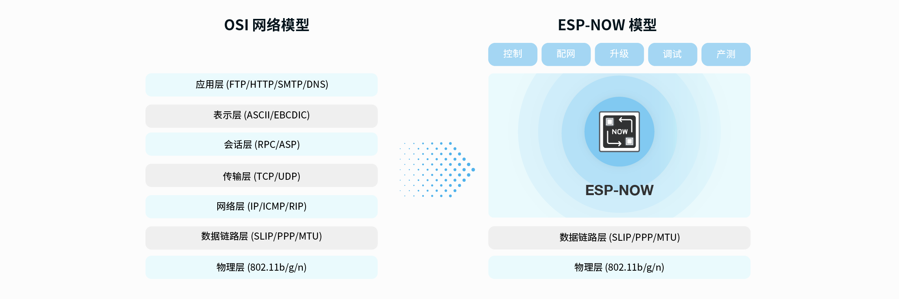
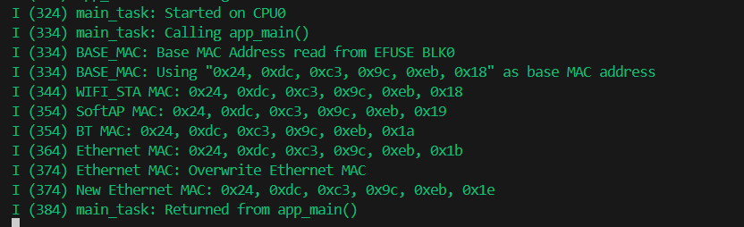
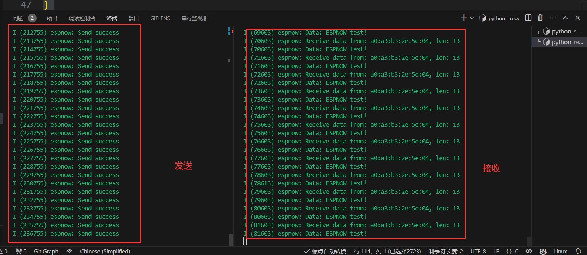

# ESP32网络入门 - ESP-NOW协议

> [!TIP] 🚀 ESP-NOW协议 | ESP32设备间的低功耗无线通信  
> - 💡 **碎碎念**😎：本节将介绍如何在 ESP32 上使用 ESP-NOW 协议，实现低功耗、快速的设备间通信。你将学习如何配置 ESP-NOW，并进行数据传输。  
> - 📺 **视频教程**：暂无  
> - 💾 **示例代码**：[ESP32-Guide/code/05.wifi/espnow](https://github.com/DuRuofu/ESP32-Guide/tree/main/code/05.wifi/espnow)


## 一、概述

### 1.1 ESP-NOW介绍

>视频介绍：https://www.espressif.com/sites/default/files/esp-now-zh.mp4

ESP-NOW 是一种由乐鑫公司定义的无连接 Wi-Fi 通信协议。在 ESP-NOW 中，应用程序数据被封装在各个供应商的动作帧中，然后在无连接的情况下，从一个 Wi-Fi 设备传输到另一个 Wi-Fi 设备。 CTR 与 CBC-MAC 协议 (CCMP) 可用来保护动作帧的安全。ESP-NOW 广泛应用于智能照明、远程控制、传感器等领域。

ESP-NOW 是基于数据链路层的无线通信协议，它将五层 OSI 上层协议精简为一层，数据传输时无需依次经过网络层、传输层、会话层、表示层、应用层等复杂的层级，也无需层层增加包头和解包，大大缓解了网络拥挤时因为丢包而导致的卡顿和延迟，拥有更高的响应速度。




### 1.2 ESP-NOW 数据帧格式

> 搬运自官方教程

ESP-NOW 使用各个供应商的动作帧传输数据，默认比特率为 1 Mbps。各个供应商的动作帧格式为：

| MAC 报头 | 分类代码 | 组织标识符 | 随机值  | 供应商特定内容  | FCS  |
| ------ | ---- | ----- | ---- | -------- | ---- |
| 24 字节  | 1 字节 | 3 字节  | 4 字节 | 7~257 字节 | 4 字节 |

- 分类代码：分类代码字段可用于指示各个供应商的类别（比如 127）。
- 组织标识符：组织标识符包含一个唯一标识符 (比如 0x18fe34)，为乐鑫指定的 MAC 地址的前三个字节。
- 随机值：防止重放攻击。
- 供应商特定内容：供应商特定内容包含供应商特定字段，如下所示：

| 元素 ID | 长度 | 组织标识符 | 类型 | 版本 | 正文 |
| ------- | ---- | ---------- | ---- | ---- | ---- |
|    1 字节        |   1 字节      |     3 字节         | 1 字节     |  1 字节    | 0～250 字节      |

- 元素 ID：元素 ID 字段可用于指示特定于供应商的元素。
- 长度：长度是组织标识符、类型、版本和正文的总长度。
- 组织标识符：组织标识符包含一个唯一标识符 (比如 0x18fe34)，为乐鑫指定的 MAC 地址的前三个字节。
- 类型：类型字段设置为 4，代表 ESP-NOW。
- 版本：版本字段设置为 ESP-NOW 的版本。
- 正文：正文包含 ESP-NOW 数据。

由于 ESP-NOW 是无连接的，因此 MAC 报头与标准帧略有不同。FrameControl 字段的 FromDS 和 ToDS 位均为 0。第一个地址字段用于配置目标地址。第二个地址字段用于配置源地址。第三个地址字段用于配置广播地址 (0xff:0xff:0xff:0xff:0xff:0xff)。

## 二、使用

>使用ESP-NOW的基本条件是要知道ESP32的MAC地址

可以使用[base_mac_address](https://github.com/espressif/esp-idf/tree/v5.1.3/examples/system/base_mac_address)历程获取芯片MAC地址：



### 2.1 初始化

调用 [`esp_now_init()`](https://docs.espressif.com/projects/esp-idf/zh_CN/latest/esp32c3/api-reference/network/esp_now.html#_CPPv412esp_now_initv "esp_now_init") 初始化 ESP-NOW，调用 [`esp_now_deinit()`](https://docs.espressif.com/projects/esp-idf/zh_CN/latest/esp32c3/api-reference/network/esp_now.html#_CPPv414esp_now_deinitv "esp_now_deinit") 反初始化 ESP-NOW。ESP-NOW 数据必须在 Wi-Fi 启动后传输，因此建议在初始化 ESP-NOW 之前启动 Wi-Fi，并在反初始化 ESP-NOW 之后停止 Wi-Fi。

当调用 [`esp_now_deinit()`](https://docs.espressif.com/projects/esp-idf/zh_CN/latest/esp32c3/api-reference/network/esp_now.html#_CPPv414esp_now_deinitv "esp_now_deinit") 时，配对设备的所有信息都将被删除。
### 2.2 设备配对

在将数据发送到其他设备之前，请先调用 [`esp_now_add_peer()`](https://docs.espressif.com/projects/esp-idf/zh_CN/latest/esp32c3/api-reference/network/esp_now.html#_CPPv416esp_now_add_peerPK19esp_now_peer_info_t "esp_now_add_peer") 将其添加到配对设备列表中。如果启用了加密，则必须设置 LMK。ESP-NOW 数据可以从 Station 或 SoftAP 接口发送。确保在发送 ESP-NOW 数据之前已启用该接口。
配对设备的最大数量是 20，其中加密设备的数量不超过 17，默认值是 7。
### 2.3 发送数据

调用 [`esp_now_send()`](https://docs.espressif.com/projects/esp-idf/zh_CN/latest/esp32c3/api-reference/network/esp_now.html#_CPPv412esp_now_sendPK7uint8_tPK7uint8_t6size_t "esp_now_send") 发送 ESP-NOW 数据，调用 [`esp_now_register_send_cb()`](https://docs.espressif.com/projects/esp-idf/zh_CN/latest/esp32c3/api-reference/network/esp_now.html#_CPPv424esp_now_register_send_cb17esp_now_send_cb_t "esp_now_register_send_cb") 注册发送回调函数。如果 MAC 层成功接收到数据，则该函数将返回 ESP_NOW_SEND_SUCCESS 事件。否则，它将返回 ESP_NOW_SEND_FAIL。

如果有大量 ESP-NOW 数据要发送，调用 `esp_now_send()` 时需注意单次发送的数据不能超过 250 字节。请注意，两个 ESP-NOW 数据包的发送间隔太短可能导致回调函数返回混乱。因此，建议在等到上一次回调函数返回 ACK 后再发送下一个 ESP-NOW 数据。
### 2.4 接收数据

调用 [`esp_now_register_recv_cb()`](https://docs.espressif.com/projects/esp-idf/zh_CN/latest/esp32c3/api-reference/network/esp_now.html#_CPPv424esp_now_register_recv_cb17esp_now_recv_cb_t "esp_now_register_recv_cb") 注册接收回调函数。当接收 ESP-NOW 数据时，需要调用接收回调函数。接收回调函数也在 Wi-Fi 任务任务中运行。因此，不要在回调函数中执行冗长的操作。 相反，将必要的数据发布到队列，并交给优先级较低的任务处理。

## 三、示例

### 3.1 发送

> 注意：发送需要接收方的MAC地址

```c
#include <stdlib.h>
#include <time.h>
#include <string.h>
#include <assert.h>
#include "freertos/FreeRTOS.h"
#include "freertos/semphr.h"
#include "freertos/timers.h"
#include "nvs_flash.h"
#include "esp_random.h"
#include "esp_event.h"
#include "esp_netif.h"
#include "esp_wifi.h"
#include "esp_log.h"
#include "esp_mac.h"
#include "esp_now.h"
#include "esp_crc.h"

// 接收方地址
//static uint8_t s_broadcast_mac[ESP_NOW_ETH_ALEN] = {0xFF, 0xFF, 0xFF, 0xFF, 0xFF, 0xFF};
static uint8_t s_broadcast_mac[ESP_NOW_ETH_ALEN] = {0x24, 0xdc, 0xc3, 0x9c, 0xeb, 0x18};

static const char *TAG = "espnow";

/* WiFi should start before using ESPNOW */
static void wifi_init(void)
{
	ESP_ERROR_CHECK(esp_netif_init());
	ESP_ERROR_CHECK(esp_event_loop_create_default());
	wifi_init_config_t cfg = WIFI_INIT_CONFIG_DEFAULT();
	ESP_ERROR_CHECK(esp_wifi_init(&cfg));
	ESP_ERROR_CHECK(esp_wifi_set_storage(WIFI_STORAGE_RAM));
	ESP_ERROR_CHECK(esp_wifi_set_mode(WIFI_MODE_STA));
	ESP_ERROR_CHECK(esp_wifi_start());

}

static void example_espnow_send_cb(const uint8_t *mac_addr, esp_now_send_status_t status)
{
	if (status != ESP_NOW_SEND_SUCCESS)
	{
		ESP_LOGE(TAG, "Send error");
	}
	else
	{
		ESP_LOGI(TAG, "Send success");
	}
}

// ESPNOW发送任务
static void espnow_task(void *pvParameter)
{
	char send_msg[] = "ESPNOW test!";
	ESP_LOGI(TAG, "Start sending broadcast data");
	while (1)
	{
		// 发送数据
		if (esp_now_send(s_broadcast_mac, (uint8_t *)send_msg, sizeof(send_msg)) != ESP_OK)
		{
			ESP_LOGE(TAG, "Send error");
		}
		vTaskDelay(1000 / portTICK_PERIOD_MS);
	}
}

static esp_err_t espnow_init(void)
{

	/* Initialize ESPNOW and register sending and receiving callback function. */
	ESP_ERROR_CHECK(esp_now_init());
	// 注册发送回调函数
	ESP_ERROR_CHECK(esp_now_register_send_cb(example_espnow_send_cb));
	//ESP_ERROR_CHECK(esp_now_register_recv_cb(example_espnow_recv_cb));

	// 将广播对等方信息添加到对等方列表
	esp_now_peer_info_t *peer = malloc(sizeof(esp_now_peer_info_t));
	if (peer == NULL)
	{
		ESP_LOGE(TAG, "Malloc peer information fail");
		esp_now_deinit();
		return ESP_FAIL;
	}
	// 初始化对等方信息
	memset(peer, 0, sizeof(esp_now_peer_info_t));
	peer->channel = 1;
	peer->ifidx = ESP_IF_WIFI_STA;
	peer->encrypt = false;
	memcpy(peer->peer_addr, s_broadcast_mac, ESP_NOW_ETH_ALEN);
	// 添加对等方
	ESP_ERROR_CHECK(esp_now_add_peer(peer));
	free(peer);

	xTaskCreate(espnow_task, "espnow_task", 2048, NULL, 4, NULL);

	return ESP_OK;
}

void app_main(void)
{
	// Initialize NVS
	esp_err_t ret = nvs_flash_init();
	if (ret == ESP_ERR_NVS_NO_FREE_PAGES || ret == ESP_ERR_NVS_NEW_VERSION_FOUND)
	{
		ESP_ERROR_CHECK(nvs_flash_erase());
		ret = nvs_flash_init();
	}
	ESP_ERROR_CHECK(ret);

	// Initialize WiFi
	wifi_init();

	// Initialize ESPNOW
	espnow_init();
}

```

### 3.2 接收

```c
#include <stdlib.h>
#include <time.h>
#include <string.h>
#include <assert.h>
#include "freertos/FreeRTOS.h"
#include "freertos/semphr.h"
#include "freertos/timers.h"
#include "nvs_flash.h"
#include "esp_random.h"
#include "esp_event.h"
#include "esp_netif.h"
#include "esp_wifi.h"
#include "esp_log.h"
#include "esp_mac.h"
#include "esp_now.h"
#include "esp_crc.h"

// 接收方地址
// static uint8_t s_broadcast_mac[ESP_NOW_ETH_ALEN] = {0xFF, 0xFF, 0xFF, 0xFF, 0xFF, 0xFF};
static uint8_t s_broadcast_mac[ESP_NOW_ETH_ALEN] = {0x24, 0xdc, 0xc3, 0x9c, 0xeb, 0x18};

static const char *TAG = "espnow";

/* WiFi should start before using ESPNOW */
static void wifi_init(void)
{
	ESP_ERROR_CHECK(esp_netif_init());
	ESP_ERROR_CHECK(esp_event_loop_create_default());
	wifi_init_config_t cfg = WIFI_INIT_CONFIG_DEFAULT();
	ESP_ERROR_CHECK(esp_wifi_init(&cfg));
	ESP_ERROR_CHECK(esp_wifi_set_storage(WIFI_STORAGE_RAM));
	ESP_ERROR_CHECK(esp_wifi_set_mode(WIFI_MODE_STA));
	ESP_ERROR_CHECK(esp_wifi_start());
}

// ESPNOW接收回调函数
static void example_espnow_recv_cb(const esp_now_recv_info_t *recv_info, const uint8_t *data, int len)
{
	ESP_LOGI(TAG, "Receive data from: " MACSTR ", len: %d", MAC2STR(recv_info->src_addr), len);
	ESP_LOGI(TAG, "Data: %s", data);
}

// ESPNOW接受数据任务
static void espnow_task(void *pvParameter)
{
	ESP_LOGI(TAG, "Start receiving data");
	while (1)
	{
		vTaskDelay(1000 / portTICK_PERIOD_MS);
	}
}

static esp_err_t espnow_init(void)
{

	/* Initialize ESPNOW and register sending and receiving callback function. */
	ESP_ERROR_CHECK(esp_now_init());
	// 注册接受回调函数
	//ESP_ERROR_CHECK(esp_now_register_send_cb(example_espnow_send_cb));
	ESP_ERROR_CHECK(esp_now_register_recv_cb(example_espnow_recv_cb));

	xTaskCreate(espnow_task, "espnow_task", 2048, NULL, 4, NULL);

	return ESP_OK;
}

void app_main(void)
{
	// Initialize NVS
	esp_err_t ret = nvs_flash_init();
	if (ret == ESP_ERR_NVS_NO_FREE_PAGES || ret == ESP_ERR_NVS_NEW_VERSION_FOUND)
	{
		ESP_ERROR_CHECK(nvs_flash_erase());
		ret = nvs_flash_init();
	}
	ESP_ERROR_CHECK(ret);

	// Initialize WiFi
	wifi_init();

	// Initialize ESPNOW
	espnow_init();
}

```

效果：



# 参考链接

1. https://github.com/espressif/esp-idf/blob/v5.1.3/examples/wifi/espnow/main/espnow_example.h
2. https://docs.espressif.com/projects/esp-idf/zh_CN/latest/esp32c3/api-reference/network/esp_now.html