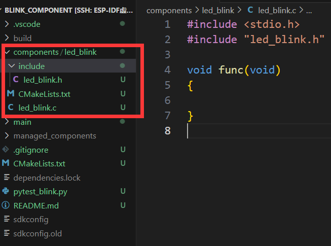

# ESP32自定义组件

> [!TIP] 🚀 ESP32 自定义组件 | 玩转组件开发与配置  
> - 💡 **碎碎念**😎：本节将介绍如何创建和配置 ESP32 自定义组件，帮助你模块化复用代码。  
> - 📺 **视频教程**：[点击观看](https://www.bilibili.com/video/BV182ftYHEox)  
> - 💾 **示例代码**：[ESP32-Guide/code/02.idf_basic/blink_component](https://github.com/DuRuofu/ESP32-Guide/tree/main/code/02.idf_basic/blink_component)  
> - 📚 **官方文档**：[API 指南 » 构建系统](https://docs.espressif.com/projects/esp-idf/zh_CN/v5.3.2/esp32/api-guides/build-system.html?highlight=kconfig%20projbuild#component-configuration)

## 一 、自定义组件介绍：

之前在[ESP-IDF的工程结构](../2.1-ESP32工程结构/ESP-IDF的工程结构.md)里提到esp-idf项目的结构如下：

```
- myProject/
             - CMakeLists.txt
             - sdkconfig
             - bootloader_components/ - boot_component/ - CMakeLists.txt
                                                        - Kconfig
                                                        - src1.c
             - components/ - component1/ - CMakeLists.txt
                                         - Kconfig
                                         - src1.c
                           - component2/ - CMakeLists.txt
                                         - Kconfig
                                         - src1.c
                                         - include/ - component2.h
             - main/       - CMakeLists.txt
                           - src1.c
                           - src2.c

             - build/
```

其中components文件夹就是我们自定义的组件。ESP-IDF组件机制就是代码模块化的一种体现，将特定功能的代码封装为一个个组件并对外暴露接口，增强代码的可复用性，提高代码维护效率。

## 二 、自定义组件示例：


下面我们基于[ESP-IDF项目配置](../2.2-ESP-IDF项目配置/ESP-IDF项目配置.md)中编写的[blink_menuconfig](https://github.com/DuRuofu/ESP32-Guide/tree/main/code/02.idf_basic/02/blink_menuconfig)工程来实现一个自定义的控制闪烁的组件。

复制工程，重命名为`blink_component`

使用命令：`idf.py -C components create-component led_blink`

目录下多出一个叫`led_blink`的组件



组件的代码结构如下：

```
- led_blink/ - CMakeLists.txt
			 - Kconfig
			 - led_blink.c
			 - include/ 
					 - led_blink.h
```

将点灯的函数定义裁剪到 `led_blink.c`

``` c
#include <stdio.h>
#include "led_blink.h"
#include "driver/gpio.h"
#include "esp_log.h"
#include "sdkconfig.h"

static const char *TAG = "led_blink";

#define BLINK_GPIO CONFIG_BLINK_GPIO

void blink_led(uint8_t s_led_state)
{
	/* Set the GPIO level according to the state (LOW or HIGH)*/
	gpio_set_level(BLINK_GPIO, s_led_state);
}

void configure_led(void)
{
	ESP_LOGI(TAG, "Example configured to blink GPIO LED!");
	gpio_reset_pin(BLINK_GPIO);
	/* Set the GPIO as a push/pull output */
	gpio_set_direction(BLINK_GPIO, GPIO_MODE_OUTPUT);
}
```


在头文件声明函数：
``` c
#ifndef LED_BLINK_H
#define LED_BLINK_H

#ifdef __cplusplus
extern "C"
{
#endif

#include <stdint.h>

	// Function declarations
	void blink_led(uint8_t s_led_state);
	void configure_led(void);

#ifdef __cplusplus
}
#endif

#endif /* LED_BLINK_H */


```

新建Kconfig文件，移植组件配置，参考[ESP-IDF项目配置](../2.2-ESP-IDF项目配置/ESP-IDF项目配置.md)

```
menu "点灯组件配置"
    choice BLINK_LED
        prompt "LED模式"
        default BLINK_LED_GPIO

        config BLINK_LED_GPIO
            bool "GPIO"
        config BLINK_LED_RMT
            bool "RMT - Addressable LED"
    endchoice

    config BLINK_GPIO
        int "LED引脚"
        default 2
        help
            This is an int BLINK_GPIO.
	
    config BLINK_PERIOD
        int "LED周期"
        default 1000
        help
            This is a int BLINK_GPIO.

endmenu

```

最后，由于我们在组件里使用了`driver/gpio.h`这个头文件，我们还需要在组件的`CMakeLists.txt`文件里声明组件依赖：

``` CMake
idf_component_register(SRCS "led_blink.c"
                    INCLUDE_DIRS "include"
                    REQUIRES "driver" 
                    )
```

这样就编写好了一个组件。


然后在main组件里引入模块使用即可：

```c
#include <stdio.h>
#include "freertos/FreeRTOS.h"
#include "freertos/task.h"
#include "esp_log.h"
#include "sdkconfig.h"
#include "led_blink.h"

static const char *TAG = "example";

static uint8_t s_led_state = 0;

void app_main(void)
{

    /* Configure the peripheral according to the LED type */
    configure_led();

    while (1) {
        ESP_LOGI(TAG, "Turning the LED %s!", s_led_state == true ? "ON" : "OFF");
        blink_led(s_led_state);
        /* Toggle the LED state */
        s_led_state = !s_led_state;
        vTaskDelay(CONFIG_BLINK_PERIOD / portTICK_PERIOD_MS);
    }
}

```


这样就完成了代码的模块化，关于组件依赖，依赖嵌套还有一些值得注意的地方，不过目前入门阶段不必深究，后续学习过程中会娓娓道来。

## 参考链接

1. https://docs.espressif.com/projects/esp-idf/zh_CN/latest/esp32/api-guides/build-system.html
2. https://developer.espressif.com/blog/2024/12/how-to-create-an-esp-idf-component/