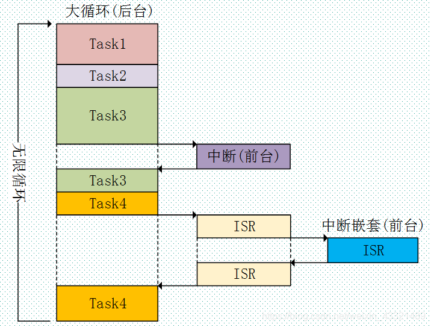
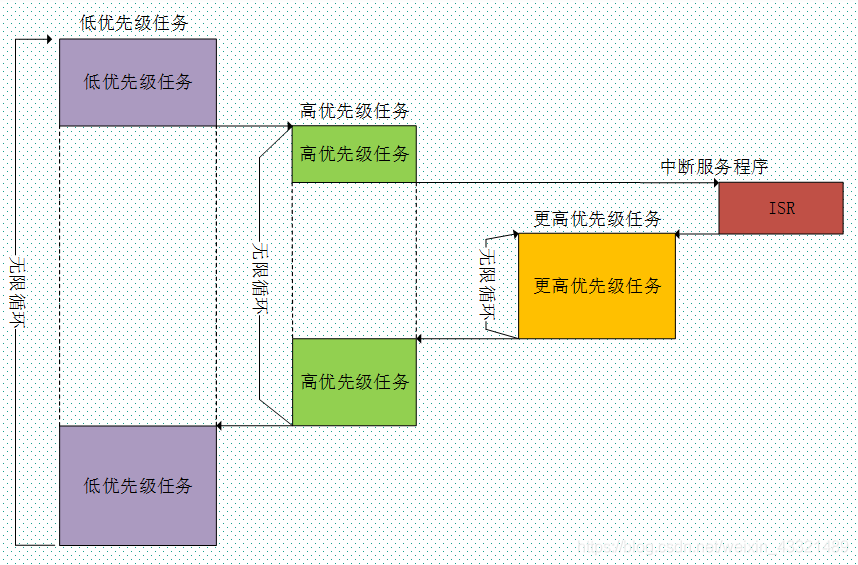
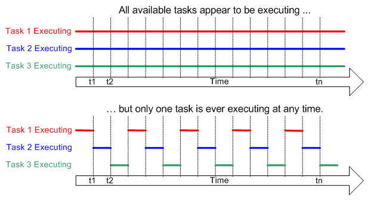

# FreeRTOS介绍

> [!TIP] 🚀 FreeRTOS | 实现实时操作系统的强大功能
> - 💡 **碎碎念**😎：本节将介绍 FreeRTOS，帮助你理解如何在 ESP32 上实现实时操作系统，提升任务调度和系统效率。  
> - 📺 **视频教程**：🚧 *开发中*  
> - 💾 **示例代码**：🚧 *开发中*  

FreeRTOS 是一个开源的 RTOS（实时操作系统）内核，它以组件的形式集成到 ESP-IDF 中。因此，所有的 ESP-IDF 应用程序及多种 ESP-IDF 组件都基于 FreeRTOS 编写。

## 1.1 RTOS是什么?

实时操作系统 (RTOS) 是一种体积小巧、确定性强的计算机操作系统。 RTOS 通常用于需要在严格时间限制内对外部事件做出反应的嵌入式系统，如医疗设备和汽车电子控制单元 (ECU)。 通常，此类嵌入式系统中只有一两项功能需要确定性时序，即使嵌入式系统不需要严格的实时反应，使用 RTOS 仍能提供诸多优势。RTOS 通常比通用操作系统体积更小、重量更轻，因此 RTOS 非常适用于 内存、计算和功率受限的设备。

## 1.2 与裸机的对比

### 1. 裸机：

在裸机系统中，所有的操作都是在一个无限的大循环里面实现,支持中断检测。外部中断紧急事件在中断里面标记或者响应，中断服务称为前台，main 函数里面的while(1)无限循环称为后台，按顺序处理业务功能，以及中断标记的可执行的事件。小型的电子产品用的都是裸机系统，而且也能够满足需求。但当程序复杂之后，这样的裸机程序难以阅读和维护。

### 2. RTOS：

在实时操作系统中，我们可以把要实现的功能划分为多个任务，每个任务负责实现其中的一部分，每个任务都是一个很简单的程序，通常是一个死循环。 RTOS操作系统的核心内容在于：实时内核。

RTOS的内核负责管理所有的任务，内核决定了运行哪个任务，何时停止当前任务切换到其他任务，这个是内核的多任务管理能力。多任务管理给人的感觉就好像芯片有多个CPU，多任务管理实现了CPU资源的最大化利用，多任务管理有助于实现程序的模块化开发，能够实现复杂的实时应用。可剥夺内核顾名思义就是可以剥夺其他任务的CPU使用权，它总是运行就绪任务中的优先级最高的那个任务。

加入操作系统后，开发人员不需要关注每个功能模块之间的冲突，重心放在子程序的实现。缺点是整个系统随之带来的额外RAM开销，但对目前的单片机的来影响不大。

## 1.3 RTOS多任务处理与并发的实现

常规单核处理器一次只能执行一个任务，但多任务操作系统可以快速切换任务， 使所有任务看起来像是同时在执行。

切换的过程由**任务调度器**实现，任务调度器就是使用相关的调度算法来决定当前需要执行的哪个任务。

FreeRTOS一共支持三种任务调度方式：

- **抢占式调度** ：主要是针对优先级不同的任务，每一个任务都有一个任务优先级，优先级高的任务可以抢占低优先级的任务的CPU使用权。
- **时间片调度** ：主要针对相同优先级的任务，当多个任务的优先级相同时，任务调度器会在每个时钟节拍到来的时候切换任务。
- **协程式调度** ：其实就是轮询，当前执行任务将会一直运行，同时高优先级的任务不会抢占低优先级任务。FreeRTOS现在虽然还在支持，但官方已经明确表示不再更新协程式调度。

总的来说：

1. 高优先级任务，优先执行。
2. 高优先级任务不停止，低优先级任务无法执行。
3. 被抢占的任务将会进去就绪态。

## 1.4 相关概念

### 时间片：

同等优先级任务轮流享有相同的CPU时间(可设置)，叫做时间片，在FreeRTOS中，一个时间片等于SysTick中断周期。
### 队列：

队列是一种只允许在表的前端（front）进行删除操作，而在表的后端（rear）进行插入操作。队尾放入数据，对头挤出。先进先出，称为FIFO
### 任务：

在裸机系统中，系统的主体就是 main 函数里面顺序执行的无限循环，这个无限循环里面 CPU 按照顺序完成各种事情。在多任务系统中，根据功能的不同，把整个系统分割成一个个独立的且无法返回的函数，这个函数我们称为任务。系统中的每一任务都有多种运行状态。系统初始化完成后，创建的任务就可以在系统中竞争一定的资源，由内核进行调度。

任务可以存在于以下状态中：

- **运行**
  当任务实际执行时，它被称为处于运行状态。任务当前正在使用处理器。 如果运行 RTOS 的处理器只有一个内核， 那么在任何给定时间内都只能有一个任务处于运行状态。
- **准备就绪**
  准备就绪任务指那些能够执行（它们不处于阻塞或挂起状态）， 但目前没有执行的任务， 因为同等或更高优先级的不同任务已经处于运行状态。
- **阻塞**
  如果任务当前正在等待时间或外部事件，则该任务被认为处于阻塞状态。 例如，如果一个任务调用vTaskDelay()，它将被阻塞（被置于阻塞状态）， 直到延迟结束——一个时间事件。 任务也可以通过阻塞来等待队列、信号量、事件组、通知或信号量 事件。处于阻塞状态的任务通常有一个"超时"期， 超时后任务将被超时，并被解除阻塞， 即使该任务所等待的事件没有发生。“阻塞”状态下的任务不使用任何处理时间，不能 被选择进入运行状态。
- **挂起**
  与“阻塞”状态下的任务一样， “挂起”状态下的任务不能 被选择进入运行状态，但处于挂起状态的任务 没有超时。相反，任务只有在分别通过 vTaskSuspend() 和 xTaskResume() API 调用明确命令时 才会进入或退出挂起状态。

### 临界区：

临界区就是一段在执行的时候不能被中断的代码段。在多任务操作系统里面，对全局变量的操作不能被打断，不能执行到一半就被其他任务再次操作。一般被打断，原因就是系统调度或外部中断。对临界区的保护控制，归根到底就是对系统中断的使能控制。
在使用临界区时，关闭中断响应，对部分优先级的中断进行屏蔽，因此临界区不允许运行时间过长。为了对临界区进行控制，就需要使用信号量通信，实现同步或互斥操作。

