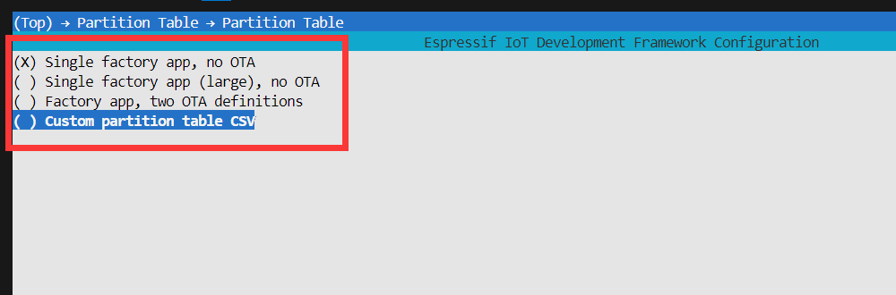
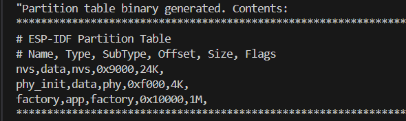
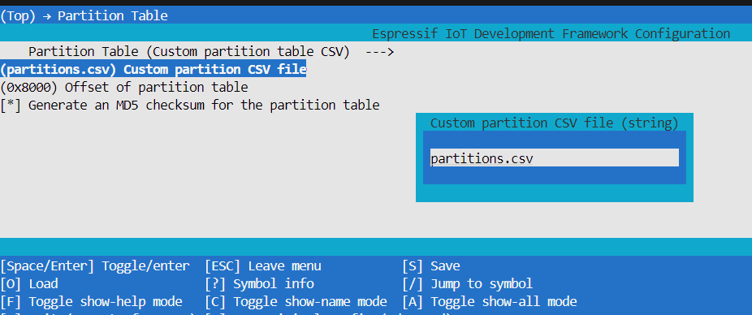

# ESP32存储-分区表入门

> [!TIP] 🚀 ESP32 存储-分区表入门 | 高效管理设备存储空间  
> - 💡 **碎碎念**😎：本节将介绍 ESP32 的分区表，帮助你合理分配存储空间，提高系统的存储效率。  
> - 📺 **视频教程**：🚧 *开发中*  
> - 💾 **示例代码**：[ESP32-Guide/code/04.peripheral/storage/partition](https://github.com/DuRuofu/ESP32-Guide/tree/main/code/04.peripheral/storage/partition)


> **flash**: 它在嵌入式系统中的功能可以和硬盘在PC中的功能相比。它们都是用来存储程序和数据的，好比是ROM。而且可以在掉电的情况下继续保存数据使其不会丢失。Flash memory（闪速存储器）作为一种安全、快速的存储体，具有体积小，容量大，成本低，掉电数据不丢失等一系列优点，已成为嵌入式系统中数据和程序最主要的载体。根据结构的不同可以将其分为**NOR Flash**和**NAND Flash**两种。NOR Flash的特点是应用程序可以直接在闪存中运行，不需要再把代码读到系统RAM中运行。NAND Flash不行。而我们单片机基本都是NOR FLASN。

分区表是划分ESP32内部flash的规则表，它将 flash 划分为多个不同功能的区域用于其他功能。

每片 ESP32 的 flash 可以包含多个应用程序，以及多种不同类型的数据（例如校准数据、文件系统数据、参数存储数据等），因此，我们在 flash 的 默认偏移地址 0x8000 处烧写一张分区表。

分区表的长度为 0xC00 字节，最多可以保存 95 条分区表条目。MD5 校验和附加在分区表之后，用于在运行时验证分区表的完整性。

分区表占据了整个 flash 扇区，大小为 0x1000 (4 KB)。因此，它后面的任何分区至少需要位于 ([默认偏移地址](https://docs.espressif.com/projects/esp-idf/zh_CN/latest/esp32/api-reference/kconfig.html#config-partition-table-offset)) + 0x1000 处。

分区表中的每个条目都包括以下几个部分：Name（标签）、Type（app、data 等）、SubType 以及在 flash 中的偏移量（分区的加载地址）。

### 1.1 分区表字段详解：

##### **(1) 基本**
- 字段之间的空字符会被忽略，任何以 # 开头的行（注释）都会被忽略。
- CSV 文件中的每个非注释行均为一个分区定义。
- 每个分区的 `Offset` 字段可以为空，`gen_esp32part.py` 工具会从分区表位置的后面开始自动计算并填充该分区的偏移地址，同时确保每个分区的偏移地址正确对齐。

##### **(2) Name —— 分区名**
- Name 字段可以是任何有意义的名称，但不能超过 16 个字符（之后的内容将被截断）。该字段对 ESP32 并不是特别重要。

##### **(3) Type —— 主类型**
- Type 字段可以指定为 app (0x00) 或者 data (0x01)，也可以直接使用数字 0-254（或者十六进制 0x00-0xFE）。注意，0x00-0x3F 不得使用（预留给 esp-idf 的核心功能）。

#####  (4) SubType —— 子类型

- 子类型用于明确具体类型，该字段本质上为长度 8 bit 的数字，内容与具体分区 Type 有关。目前，esp-idf 仅仅规定了 `“app”` 和 `“data”` 两种分区类型的子类型含义。

- 目前esp-idf能识别的已知关键字有：
	app 类型下：f`actory, test, ota_0, ota_1, ota_2, ota_3, ota_4, ota_5, ota_6, ota_7, ota_8, ota_9, ota_10, ota_11, ota_12, ota_13, ota_14, ota_15`
	data 类型下：`ota, phy, nvs, coredump, nvs_keys, efuse, esphttpd, fat, spiffs`
	
##### **(5) Offset & Size —— 偏移地址 & 分区大小**
 
- 偏移地址表示 SPI flash 中的分区地址，扇区大小为 0x1000 (4 KB)。因此，偏移地址必须是 4 KB 的倍数。语法上分区的大小和偏移地址可以采用以下表示方法：
	 - 十进制数（支持 K 或 M 的倍数单位（分别代表 `1024` 和 `1024²` 字节）
	 - 以 `0x` 为前缀的十六进制数.
	   
- 若 CSV 文件中的分区偏移地址为空，则该分区会接在前一个分区之后；若为首个分区，则将接在分区表之后。
- `app` 分区的偏移地址必须与 0x10000 (64 KB) 对齐。如果偏移字段留空，则 `gen_esp32part.py` 工具会自动计算得到一个满足对齐要求的偏移地址。如果 `app` 分区的偏移地址没有与 0x10000 (64 KB) 对齐，则该工具会报错。
- `app` 分区的大小必须与 flash 扇区大小对齐。为 `app` 分区指定未对齐的大小将返回错误。
- 若启用了安全启动 V1，则 `app` 分区的大小需与 0x10000 (64 KB) 对齐。
- `app` 分区的大小和偏移地址可以采用十进制数或是以 0x 为前缀的十六进制数，且支持 K 或 M 的倍数单位（K 和 M 分别代表 1024 和 1024*1024 字节）。

##### **(6) Flag —— 标记**

目前支持 `encrypted` 和 `readonly` 标记：

- 如果 Flags 字段设置为 `encrypted`，且已启用 Flash 加密 功能，则该分区将会被加密。注：无论是否设置 Flags 字段，`app` 分区都将保持加密。

- 如果 Flags 字段设置为 `readonly`，则该分区为只读分区。`readonly` 标记仅支持除 `ota` 和 `coredump` 子类型外的 `data` 分区。使用该标记，防止意外写入如出厂数据分区等包含关键设备特定配置数据的分区。

### 1.2 内置分区表

打开项目配置菜单（`idf.py menuconfig`），可以在 [CONFIG_PARTITION_TABLE_TYPE](https://docs.espressif.com/projects/esp-idf/zh_CN/latest/esp32/api-reference/kconfig.html#config-partition-table-type) 下看到内置预定义的分区表：
- "Single factory app, no OTA"（单APP，无OTA分区）
- "Factory app, two OTA definitions"（单APP + 两个OTA分区）

在以上两种选项中，出厂应用程序均将被烧录至 flash 的 0x10000 偏移地址处。

> 运行 `idf.py partition-tabl` ，即可以打印当前使用分区表的信息摘要。


下图是 "Single factory app, no OTA" 选项的分区表信息摘要:



- flash 的 0x10000 (64 KB) 偏移地址处存放一个标记为 "factory" 的二进制应用程序，且启动加载器将默认加载这个应用程序。
- 分区表中还定义了两个数据区域，分别用于存储 NVS 库专用分区和 PHY 初始化数据。


下图是 "Factory app, two OTA definitions" 选项的分区表信息摘要:

``` c
# ESP-IDF Partition Table
# Name,   Type, SubType, Offset,  Size, Flags
nvs,      data, nvs,     0x9000,  0x4000,
otadata,  data, ota,     0xd000,  0x2000,
phy_init, data, phy,     0xf000,  0x1000,
factory,  app,  factory, 0x10000,  1M,
ota_0,    app,  ota_0,   0x110000, 1M,
ota_1,    app,  ota_1,   0x210000, 1M,
```

- 分区表中定义了三个应用程序分区，这三个分区的类型都被设置为 “app”，但具体 app 类型不同。其中，位于 0x10000 偏移地址处的为出厂应用程序 (factory)，其余两个为 OTA 应用程序（ota_0，ota_1）。
- 新增了一个名为 “otadata” 的数据分区，用于保存 OTA 升级时需要的数据。启动加载器会查询该分区的数据，以判断该从哪个 OTA 应用程序分区加载程序。如果 “otadata” 分区为空，则会执行出厂程序。

### 1.3 自定义分区表

内置分区表功能很少，例如无文件系统等分区。我们如果想要使用文件系统就要自定义分区表。

使用自定义分区表时，要先在工程根目录下新建一个`*.csv`文件，内容按照上文规则编写自定义分区表。分区表文件名随意。如下`partitions.csv`

``` c
$ your_project
.
├── main
│   ├── CMakeLists.txt
│   └── Hello.cpp
├── CMakeLists.txt
└── partitions.csv	  #这个文件
```

之后打开`idf.py menuconfig` 参考上文打开分区表设置界面，选择第三项“自定义分区表 `CSV`文件”
然后填写自己的分区表即可。



之后使用`idf.py build` 和 `idf.py flash`即可编译并烧录整个应用程序。

>注：如果只是想编译分区表，请用`idf.py partition_table` 和`idf.py partition_table-flash`分别来编译和烧录分区表。

# 参考链接

1. https://docs.espressif.com/projects/esp-idf/zh_CN/latest/esp32/api-guides/partition-tables.html