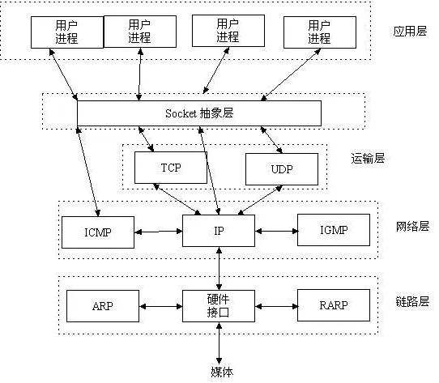
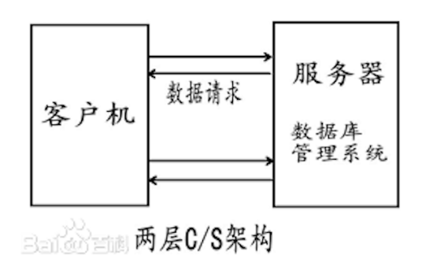
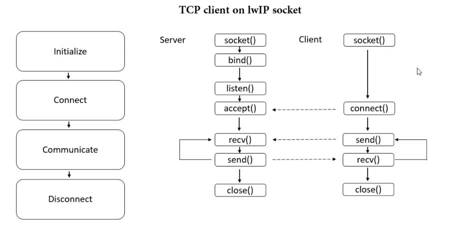
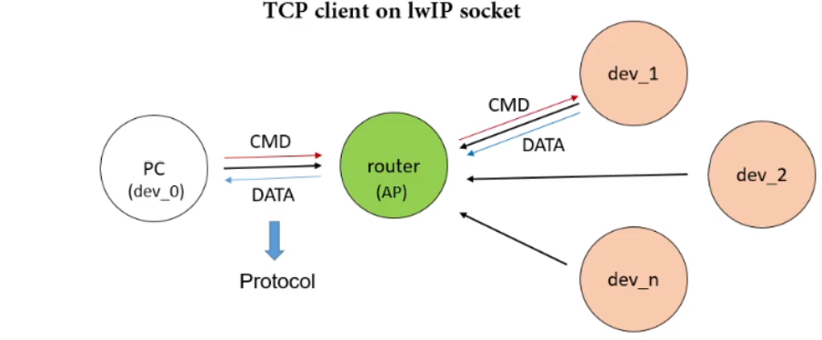
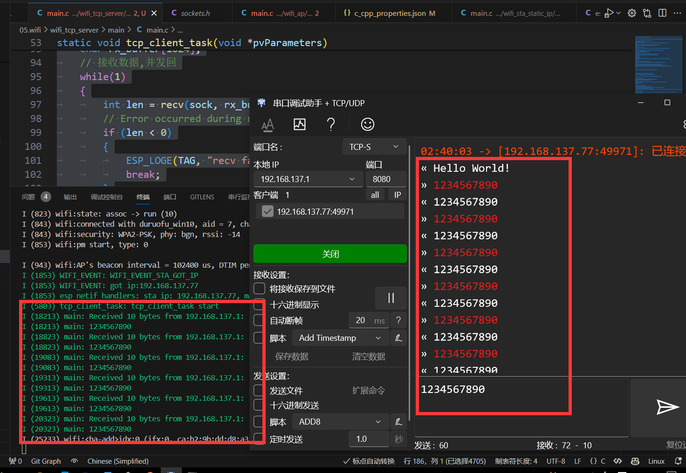
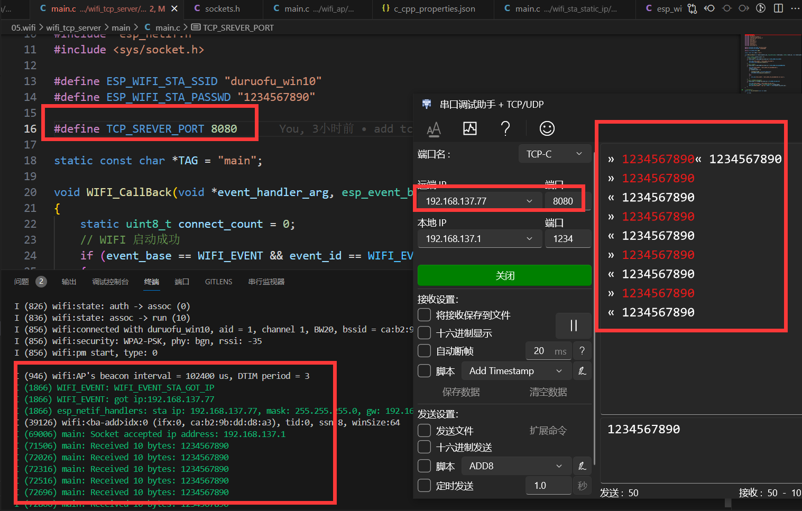

# ESP32网络入门 - TCP协议

> [!TIP] 🚀 TCP协议基础 | 可靠的网络通信 
> - 💡 **碎碎念**😎：本节将介绍如何在 ESP32 上使用 TCP 协议进行网络通信，帮助你理解 TCP 的工作原理，并在 ESP32 上实现客户端和服务器功能。  
> - 📺 **视频教程**：暂无  
> - 💾 **示例代码**：[ESP32-Guide/code/06.wifi/tcp](https://github.com/DuRuofu/ESP32-Guide/tree/main/code/06.wifi/tcp)


## 一、介绍

在开始使用TCP协议之前，我们需要掌握一些基本的概念和前置知识：

>最基本的一点：TCP/UDP工作在网络OSI的七层模型中的第四层——传输层，IP在第三层——网络层，WIFI（狭义上）在一二层-物理层和数据链路层。

### 1.1 套接字（socket）

> 下面的部分搬运自：[Socket介绍](https://zhuanlan.zhihu.com/p/106271407#:~:text=Socket%E6%98%AF%E5%BA%94%E7%94%A8%E5%B1%82%E4%B8%8ETCP%2FIP%E5%8D%8F%E8%AE%AE%E6%97%8F%E9%80%9A%E4%BF%A1%E7%9A%84%E4%B8%AD%E9%97%B4%E8%BD%AF%E4%BB%B6%E6%8A%BD%E8%B1%A1%E5%B1%82%EF%BC%8C%E5%AE%83%E6%98%AF%E4%B8%80%E7%BB%84%E6%8E%A5%E5%8F%A3%E3%80%82,%E5%9C%A8%E8%AE%BE%E8%AE%A1%E6%A8%A1%E5%BC%8F%E4%B8%AD%EF%BC%8CSocket%E5%85%B6%E5%AE%9E%E5%B0%B1%E6%98%AF%E4%B8%80%E4%B8%AA%E9%97%A8%E9%9D%A2%E6%A8%A1%E5%BC%8F%EF%BC%8C%E5%AE%83%E6%8A%8A%E5%A4%8D%E6%9D%82%E7%9A%84TCP%2FIP%E5%8D%8F%E8%AE%AE%E6%97%8F%E9%9A%90%E8%97%8F%E5%9C%A8Socket%E6%8E%A5%E5%8F%A3%E5%90%8E%E9%9D%A2%EF%BC%8C%E5%AF%B9%E7%94%A8%E6%88%B7%E6%9D%A5%E8%AF%B4%EF%BC%8C%E4%B8%80%E7%BB%84%E7%AE%80%E5%8D%95%E7%9A%84%E6%8E%A5%E5%8F%A3%E5%B0%B1%E6%98%AF%E5%85%A8%E9%83%A8%E3%80%82) *(如有侵权，请联系作者删除)*


Socket是应用层与TCP/IP协议族通信的中间软件抽象层，它是一组接口。在设计模式中，Socket其实就是一个门面模式，它把复杂的TCP/IP协议族隐藏在Socket接口后面，对用户来说，一组简单的接口就是全部。



网络协议是很复杂的，它的硬件接口可以是WIFI，网线，4G网卡等，我们开发网络程序，不可能亲自去了解这些物理层，链路层的网络协议和实现。我们通过抽象出统一的上层建筑（Socket）来完成代码编写，这样无论底层（链路层，网络层）是何种形式，我们需要考虑的东西都是相同的（Socket的概念是一样的）。

socket起源于Unix，而Unix/Linux 基本哲学之一就是“一切皆文件”，都可以用“打开open –> 读写write/read –> 关闭close”模式 来操作。Socket就是该模式的一个实现，socket即是一种特殊的文件，一些socket函数就是对其进行的操作（读/写IO、打开、关闭）

### 1.2 C/S模式

C/S分布式模式，是计算机用语。C是指Client，S是指Server，C/S模式就是指客户端/服务器模式。是计算机软件协同工作的一种模式，通常采取两层结构。服务器负责数据的管理，客户机负责完成与用户的交互任务。




### 1.3 TCP协议

>请自行了解

## 二、使用

>本节的工程基于[ESP32WIFI-1.WIFI连接](https://www.duruofu.top/2024/03/15/4.%E7%A1%AC%E4%BB%B6%E7%9B%B8%E5%85%B3/MCU/ESP32/05.ESP32WIFI%E5%85%A5%E9%97%A8/5.1-ESP32%E7%BD%91%E7%BB%9C%E5%85%A5%E9%97%A8-WIFI%E8%BF%9E%E6%8E%A5/ESP32%E7%BD%91%E7%BB%9C%E5%85%A5%E9%97%A8-WIFI%E8%BF%9E%E6%8E%A5/)中的[wifi_sta](https://github.com/DuRuofu/ESP32_Learning/tree/master/06.wifi/wifi_sta)历程

下图展示了TCP协议服务端和客户端的基本流程：



### 2.1 TCP客户端



客户端程序流程：初始化-连接-数据交换-断开连接


#### 2.1.1 准备工作

准备工作主要是连接wifi，为下面的网络协议提供支持，可以参考：[ESP32WIFI-1.WIFI连接](https://www.duruofu.top/2024/03/15/4.%E7%A1%AC%E4%BB%B6%E7%9B%B8%E5%85%B3/MCU/ESP32/05.ESP32WIFI%E5%85%A5%E9%97%A8/5.1-ESP32%E7%BD%91%E7%BB%9C%E5%85%A5%E9%97%A8-WIFI%E8%BF%9E%E6%8E%A5/ESP32%E7%BD%91%E7%BB%9C%E5%85%A5%E9%97%A8-WIFI%E8%BF%9E%E6%8E%A5/)

#### 2.1.2 创建套接字

使用函数`int socket(int domain,int type,int protocol)`创建套接字，参数分别为

- `domain`：指定协议家族或地址族，常用的有 `AF_INET`（IPv4 地址族）和 `AF_INET6`（IPv6 地址族）。
- `type`：指定套接字类型，常见的有 `SOCK_STREAM`（流套接字，提供面向连接的、可靠的数据传输）和 `SOCK_DGRAM`（数据报套接字，提供无连接的、不可靠的数据传输）。
- `protocol`：指定协议，一般为 0，默认由 `socket()` 函数根据前两个参数自动选择合适的协议。

```c
// 创建socket
int sock = socket(AF_INET, SOCK_STREAM, 0);
if (sock < 0) // 创建失败返回-1
{
	ESP_LOGE(TAG, "Unable to create socket: errno %d", errno);
	return;
}
```
#### 2.1.3 配置并连接服务端

使用函数`connect(int s,const struct sockaddr *name,socklen_t namelen)`连接服务端，参数分别为：

- `s`: 表示一个已经创建并绑定到本地地址的套接字描述符。
- `name`: 是一个指向目标服务器地址结构体的指针，通常是 `struct sockaddr` 结构体或其派生结构体，用来指定要连接的远程服务器的地址信息。
- `namelen`: 表示参数 `name` 指向的地址结构体的长度。

这里的` struct sockaddr `结构体用于配置IP协议，这里以IPV4为例，参数如下：

- `sin_len`: 该字段表示结构体的长度，单位为字节。在这个结构体中，用一个字节来表示结构体的长度。
- `sin_family`: 这是一个表示地址族（Address Family）的字段，用于指示地址的类型，如IPv4或IPv6。在这里，用`sa_family_t`类型来表示，可能是一个枚举值或整数值，用于指示IPv4地址族。（和上一步的`domain`参数相同）
- `sin_port`: 一个16位的整数，表示端口号。`in_port_t`类型通常被定义为一个16位的整数，用于存储端口号。
- `sin_addr`: 一个`struct in_addr`类型的结构体，用于存储IPv4地址信息。通常`struct in_addr`包含一个32位的整数，表示IPv4地址。

代码如下：

``` c
#define TCP_SREVER_ADDR "192.168.1.100"
#define TCP_SREVER_PORT 8080

// 设置服务器(IPV4)
struct sockaddr_in server_config;
server_config.sin_addr.s_addr = inet_addr(TCP_SREVER_ADDR);
server_config.sin_family = AF_INET;
server_config.sin_port = htons(TCP_SREVER_PORT); // 宏htons 用于将主机的无符号短整型数据转换成网络字节顺序(小端转大端)

// 连接服务器
int err = connect(sock, (struct sockaddr *)&server_config, sizeof(server_config));
if (err != 0)
{
	ESP_LOGE(TAG, "Socket unable to connect: errno %d", errno);
	break;
}
```

#### 2.1.4 发送消息

使用`send(int s,const void *dataptr,size_t size,int flags)`函数发送消息，参数为：
- `s`：指定的套接字描述符，即要发送消息的目标套接字。
- `dataptr`：指向要发送数据的指针，可以是任意类型的数据。
- `size`：要发送的数据大小，以字节为单位。
- `flags`：用于指定发送操作的附加选项，通常可以设为0。

例如：

```c
// 发送数据
const char *data = "Hello World!";
int len = send(sock, data, strlen(data), 0);
if (len < 0)
{
	ESP_LOGE(TAG, "Error occurred during sending: errno %d", errno);
	break;
}

```

#### 2.1.5 接收消息

使用`recv(int s,void *mem,size_t len,int flags)`接收数据，参数为：

- `s`：指定要接收数据的套接字描述符。
- `mem`：指向存放接收数据的缓冲区的指针。
- `len`：表示接收缓冲区的长度。
- `flags`：指定接收操作的附加选项，通常可以设置为 0。

例如：
```c

int len = recv(sock, rx_buffer, sizeof(rx_buffer), 0);
// Error occurred during receiving
if (len < 0)
{
	ESP_LOGE(TAG, "recv failed: errno %d", errno);
	return;
}
// Data received
else
{
	ESP_LOGI(TAG, "Received %d bytes from %s:", len, TCP_SREVER_ADDR);
	ESP_LOGI(TAG, "%.*s", len, rx_buffer);
}

```

完整程序请看下面第三部分：
### 2.1 TCP服务器

#### 2.2.1 准备工作

初始化NVS、 连接WIFI

#### 2.2.2 创建并配置socket


```c
// 创建套接字
int listen_sock = socket(AF_INET, SOCK_STREAM, 0);
if (listen_sock < 0)
{
	ESP_LOGE(TAG, "Unable to create socket: errno %d", errno);
	vTaskDelete(NULL);
	return;
}
// 设置套接字属性
int opt = 1;
setsockopt(listen_sock, SOL_SOCKET, SO_REUSEADDR, &opt, sizeof(opt));
ESP_LOGI(TAG, "Socket created");

```

这里使用了一个用于设置 socket 属性，用函数 `setsockopt()`，函数原形如下：

```c
int setsockopt(int sockfd, int level, int optname, const void *optval, socklen_t optlen);
```

-  `sockfd`：指定要设置选项的套接字文件描述符。
-  `level`：指定选项的协议级别。常见的级别包括 `SOL_SOCKET`（通用套接字选项）和 `IPPROTO_TCP`（TCP 协议选项）等。
- `optname`：指定要设置的选项名称，可以是下列之一或者协议特定的选项。常见的选项包括 `SO_REUSEADDR`（允许地址重用）、`SO_KEEPALIVE`（启用连接保活）、`SO_RCVBUF`（设置接收缓冲区大小）等。
- `optval`：指向包含选项值的缓冲区的指针。
-  `optlen`：指定选项值的长度。

#### 2.2.3 配置服务器信息

代码：

```c
// 设置服务器(IPV4)
struct sockaddr_storage dest_addr;
struct sockaddr_in *dest_addr_ip4 = (struct sockaddr_in *)&dest_addr;
dest_addr_ip4->sin_addr.s_addr = htonl(INADDR_ANY);
dest_addr_ip4->sin_family = AF_INET;
dest_addr_ip4->sin_port = htons(TCP_SREVER_PORT);

// 绑定套接字
int err = bind(listen_sock, (struct sockaddr *)&dest_addr, sizeof(dest_addr));
if (err != 0)
{
	ESP_LOGE(TAG, "Socket unable to bind: errno %d", errno);
	ESP_LOGE(TAG, "IPPROTO: %d", AF_INET);
	goto CLEAN_UP;
}
ESP_LOGI(TAG, "Socket bound, port %d", TCP_SREVER_PORT);

```

`bind` 函数用于将一个套接字与一个地址（通常是 IP 地址和端口号）绑定在一起，以便在该地址上监听连接或发送数据。它的原型如下：

```c
int bind(int sockfd, const struct sockaddr *addr, socklen_t addrlen);
```


1. `sockfd`：指定要绑定地址的套接字文件描述符。
2. `addr`：指向一个 `sockaddr` 结构体的指针，该结构体包含了要绑定的地址信息。在 IPv4 地址族中，可以使用 `sockaddr_in` 结构体；在 IPv6 地址族中，可以使用 `sockaddr_in6` 结构体。通常，你需要将地址信息转换为 `sockaddr` 结构体的形式，然后传递给 `bind` 函数。
3. `addrlen`：指定地址结构体的长度。

#### 2.2.4 监听客户端连接

```c
// 监听套接字
err = listen(listen_sock, 1);
if (err != 0)
{
	ESP_LOGE(TAG, "Error occurred during listen: errno %d", errno);
	goto CLEAN_UP;
}
```

`listen()` 函数用于将一个套接字（通常是服务器套接字）转换为被动套接字，即用于接受连接请求

1. `sockfd`：指定要监听的套接字文件描述符。
2. `backlog`：指定在内核中排队等待接受连接的最大连接数。这个参数限制了同时等待连接的数量，超过这个数量的连接请求将被拒绝。这并不是一个限制同时连接的数量，而是限制等待连接队列的长度。
3. `listen()` 函数在成功时返回 0，失败时返回 -1

#### 2.2.4 建立接收

```c
ESP_LOGI(TAG, "Socket listening");
struct sockaddr_storage source_addr; // Large enough for both IPv4 or IPv6
socklen_t addr_len = sizeof(source_addr);
int sock = accept(listen_sock, (struct sockaddr *)&source_addr, &addr_len);
if (sock < 0)
{
	ESP_LOGE(TAG, "Unable to accept connection: errno %d", errno);
	break;
}


// Set tcp keepalive option
int keepAlive = 1;
int keepIdle = 5;	  // TCP keep-alive idle time(s)
int keepInterval = 5; // TCP keep-alive interval time(s)
int keepCount = 3;	  // TCP keep-alive packet retry send counts

setsockopt(sock, SOL_SOCKET, SO_KEEPALIVE, &keepAlive, sizeof(int));
setsockopt(sock, IPPROTO_TCP, TCP_KEEPIDLE, &keepIdle, sizeof(int));
setsockopt(sock, IPPROTO_TCP, TCP_KEEPINTVL, &keepInterval, sizeof(int));
setsockopt(sock, IPPROTO_TCP, TCP_KEEPCNT, &keepCount, sizeof(int));


```

`sockaddr_storage` 是一个足够大的结构体，可用于存储任意地址族（IPv4 或 IPv6）的地址信息。

建立连接使用函数`accept()`,它用于接受传入的连接请求，并创建一个**新的套接字**来与客户端进行通信。它的原型如下：

```c
int accept(int sockfd, struct sockaddr *addr, socklen_t *addrlen);
```

参数：

-  `sockfd`：指定正在监听连接请求的套接字文件描述符。
-  `addr`：用于存储客户端地址信息的指针。当有连接请求到达时，`accept()` 函数会将客户端的地址信息填写到这个结构体中。
-  `addrlen`：指向一个整数的指针，表示传入的地址结构体的长度。在调用 `accept()` 函数之前，必须将这个参数设置为 `addr` 缓冲区的大小。当 `accept()` 函数返回时，这个参数会更新为实际填充到 `addr` 缓冲区中的地址结构体的长度。

建立连接成功后，通过调用 `setsockopt()` 函数，设置了套接字的 Keep-Alive 选项，以确保连接保持活跃状态。

- `SO_KEEPALIVE`：启用或禁用 TCP Keep-Alive 机制。
- `TCP_KEEPIDLE`：设置 TCP Keep-Alive 空闲时间，即连接空闲多长时间后开始发送 Keep-Alive 消息。
- `TCP_KEEPINTVL`：设置 TCP Keep-Alive 消息的发送间隔，即两次 Keep-Alive 消息之间的时间间隔。
- `TCP_KEEPCNT`：设置 TCP Keep-Alive 消息的发送次数，即发送多少次 Keep-Alive 消息后仍未收到响应才认为连接失效。
#### 2.2.6 接收/发送数据

接收和发送依然使用`recv`和`send`，下面实现了一个简单的数据接收，回传函数，参数为建立连接的套接字。

```c
// 数据接收与回传
static void do_retransmit(const int sock)
{
int len;
char rx_buffer[128];

do
{
	len = recv(sock, rx_buffer, sizeof(rx_buffer) - 1, 0);
	if (len < 0)
	{
		ESP_LOGE(TAG, "Error occurred during receiving: errno %d", errno);
	}
	else if (len == 0)
	{
		ESP_LOGW(TAG, "Connection closed");
	}
	else
	{
		rx_buffer[len] = 0; // Null-terminate whatever is received and treat it like a string
		ESP_LOGI(TAG, "Received %d bytes: %s", len, rx_buffer);

		// send() can return less bytes than supplied length.
		// Walk-around for robust implementation.
		int to_write = len;
		while (to_write > 0)
		{
			int written = send(sock, rx_buffer + (len - to_write), to_write, 0);
			if (written < 0)
			{
				ESP_LOGE(TAG, "Error occurred during sending: errno %d", errno);
				// Failed to retransmit, giving up
				return;
			}
			to_write -= written;
		}
	}
} while (len > 0);
}

```

程序解释如下：

- `recv()` 函数用于从套接字接收数据，并将接收到的数据存储在 `rx_buffer` 中。它的参数包括套接字文件描述符 `sock`、接收缓冲区 `rx_buffer`、缓冲区大小以及一些可选的标志参数。如果 `recv()` 返回值小于 0，则表示出现了错误；如果返回值为 0，则表示连接已关闭；否则，返回接收到的字节数。
- 如果接收到的字节数小于 0，表示发生了接收错误，这时会记录错误信息到日志。
- 如果接收到的字节数为 0，表示连接已关闭，这时会记录警告信息到日志。
- 如果接收到了数据，会记录接收到的数据字节数和数据内容到日志，并通过 `send()` 函数将接收到的数据回传给客户端。由于 `send()` 函数可能一次未能发送完所有数据，所以在一个循环中，将剩余的数据继续发送，直到所有数据都被发送出去。
- 如果在发送过程中出现了发送错误（`send()` 返回值小于 0），则会记录错误信息到日志，并返回函数，放弃继续回传数据。
- 整个函数在循环中进行，直到 `recv()` 返回值小于等于 0，表示接收到的数据长度为 0（连接关闭）或出现了接收错误。

#### 2.2.6 关闭连接和销毁套接字

- `shutdown();`：这个函数调用会关闭套接字的一部分或者全部通信。第二个参数指定了关闭方式：
    - 如果为 0，则表示关闭套接字的读取功能，即不能再从套接字中读取数据。
    - 如果为 1，则表示关闭套接字的写入功能，即不能再向套接字中写入数据。
    - 如果为 2，则表示关闭套接字的读取和写入功能，即完全关闭套接字的通信功能。
-  `close(sock);`：这个函数调用会彻底关闭套接字，释放它占用的资源。关闭套接字后，不能再对它进行任何操作。

以上就是基本的TCP服务的编程流程，关于服务器实例请参考第三部分
## 三、示例

### 3.1 TCP客户端程序

>代码见： https://github.com/DuRuofu/ESP32_Learning/tree/master/06.wifi/wifi_tcp_client

```c
#include <stdio.h>
#include <string.h>
#include "freertos/FreeRTOS.h"
#include "freertos/event_groups.h"
#include "esp_wifi.h"
#include "esp_log.h"
#include "esp_event.h"
#include "nvs_flash.h"
#include "esp_mac.h"
#include "esp_netif.h"
#include <sys/socket.h>

#define ESP_WIFI_STA_SSID "duruofu_win10"
#define ESP_WIFI_STA_PASSWD "1234567890"
#define TCP_SREVER_ADDR "192.168.137.1"
#define TCP_SREVER_PORT 8080

static const char *TAG = "main";

void WIFI_CallBack(void *event_handler_arg, esp_event_base_t event_base, int32_t event_id, void *event_data)
{
	static uint8_t connect_count = 0;
	// WIFI 启动成功
	if (event_base == WIFI_EVENT && event_id == WIFI_EVENT_STA_START)
	{
		ESP_LOGI("WIFI_EVENT", "WIFI_EVENT_STA_START");
		ESP_ERROR_CHECK(esp_wifi_connect());
	}
	// WIFI 连接失败
	if (event_base == WIFI_EVENT && event_id == WIFI_EVENT_STA_DISCONNECTED)
	{
		ESP_LOGI("WIFI_EVENT", "WIFI_EVENT_STA_DISCONNECTED");
		connect_count++;
		if (connect_count < 6)
		{
			vTaskDelay(1000 / portTICK_PERIOD_MS);
			ESP_ERROR_CHECK(esp_wifi_connect());
		}
		else
		{
			ESP_LOGI("WIFI_EVENT", "WIFI_EVENT_STA_DISCONNECTED 10 times");
		}
	}
	// WIFI 连接成功(获取到了IP)
	if (event_base == IP_EVENT && event_id == IP_EVENT_STA_GOT_IP)
	{
		ESP_LOGI("WIFI_EVENT", "WIFI_EVENT_STA_GOT_IP");
		ip_event_got_ip_t *info = (ip_event_got_ip_t *)event_data;
		ESP_LOGI("WIFI_EVENT", "got ip:" IPSTR "", IP2STR(&info->ip_info.ip));
	}
}

static void tcp_client_task(void *pvParameters)
{


	// 等待wifi连接成功(暂时这样处理)
	vTaskDelay(5000 / portTICK_PERIOD_MS);

	ESP_LOGI("tcp_client_task", "tcp_client_task start");

	// 创建socket
	int sock = socket(AF_INET, SOCK_STREAM, 0);
	if (sock < 0) // 创建失败返回-1
	{
		ESP_LOGE(TAG, "Unable to create socket: errno %d", errno);
		return;
	}

	// 设置服务器(IPV4)
	struct sockaddr_in server_config;
	server_config.sin_addr.s_addr = inet_addr(TCP_SREVER_ADDR);
	server_config.sin_family = AF_INET;
	server_config.sin_port = htons(TCP_SREVER_PORT); // 宏htons 用于将主机的无符号短整型数据转换成网络字节顺序(小端转大端)

	// 连接服务器
	int err = connect(sock, (struct sockaddr *)&server_config, sizeof(server_config));
	if (err != 0)
	{
		ESP_LOGE(TAG, "Socket unable to connect: errno %d", errno);
		return;
	}

	// 发送数据
	const char *data = "Hello World!";
	int len = send(sock, data, strlen(data), 0);
	if (len < 0)
	{
		ESP_LOGE(TAG, "Error occurred during sending: errno %d", errno);
		return;
	}

	char rx_buffer[1024];
	// 接收数据,并发回
	while(1)
	{
		int len = recv(sock, rx_buffer, sizeof(rx_buffer), 0);
		// Error occurred during receiving
		if (len < 0)
		{
			ESP_LOGE(TAG, "recv failed: errno %d", errno);
			break;
		}
		// Data received
		else
		{
			ESP_LOGI(TAG, "Received %d bytes from %s:", len, TCP_SREVER_ADDR);
			ESP_LOGI(TAG, "%.*s", len, rx_buffer);

			// 发送数据
			int len_end = send(sock, rx_buffer, len, 0);
			if (len_end < 0)
			{
				ESP_LOGE(TAG, "Error occurred during sending: errno %d", errno);
				break;
			}
		}
	}

	vTaskDelete(NULL);
}

// wifi初始化
static void wifi_sta_init(void)
{
	ESP_ERROR_CHECK(esp_netif_init());

	// 注册事件(wifi启动成功)
	ESP_ERROR_CHECK(esp_event_handler_instance_register(WIFI_EVENT, WIFI_EVENT_STA_START, WIFI_CallBack, NULL, NULL));
	// 注册事件(wifi连接失败)
	ESP_ERROR_CHECK(esp_event_handler_instance_register(WIFI_EVENT, WIFI_EVENT_STA_DISCONNECTED, WIFI_CallBack, NULL, NULL));
	// 注册事件(wifi连接失败)
	ESP_ERROR_CHECK(esp_event_handler_instance_register(IP_EVENT, IP_EVENT_STA_GOT_IP, WIFI_CallBack, NULL, NULL));

	// 初始化STA设备
	esp_netif_create_default_wifi_sta();

	/*Initialize WiFi */
	wifi_init_config_t cfg = WIFI_INIT_CONFIG_DEFAULT();
	// WIFI_INIT_CONFIG_DEFAULT 是一个默认配置的宏

	ESP_ERROR_CHECK(esp_wifi_init(&cfg));

	//----------------配置阶段-------------------
	// 初始化WIFI设备( 为 WiFi 驱动初始化 WiFi 分配资源，如 WiFi 控制结构、RX/TX 缓冲区、WiFi NVS 结构等，这个 WiFi 也启动 WiFi 任务。必须先调用此API，然后才能调用所有其他WiFi API)
	ESP_ERROR_CHECK(esp_wifi_set_mode(WIFI_MODE_STA));

	// STA详细配置
	wifi_config_t sta_config = {
		.sta = {
			.ssid = ESP_WIFI_STA_SSID,
			.password = ESP_WIFI_STA_PASSWD,
			.bssid_set = false,
		},
	};
	ESP_ERROR_CHECK(esp_wifi_set_config(WIFI_IF_STA, &sta_config));

	//----------------启动阶段-------------------
	ESP_ERROR_CHECK(esp_wifi_start());

	//----------------配置省电模式-------------------
	// 不省电(数据传输会更快)
	ESP_ERROR_CHECK(esp_wifi_set_ps(WIFI_PS_NONE));
}

void app_main(void)
{
	// Initialize NVS
	esp_err_t ret = nvs_flash_init();
	if (ret == ESP_ERR_NVS_NO_FREE_PAGES || ret == ESP_ERR_NVS_NEW_VERSION_FOUND)
	{
		ESP_ERROR_CHECK(nvs_flash_erase());
		ret = nvs_flash_init();
	}
	ESP_ERROR_CHECK(ret);

	// 创建默认事件循环
	ESP_ERROR_CHECK(esp_event_loop_create_default());

	// 配置启动WIFI
	wifi_sta_init();

	// 创建TCP客户端任务
	xTaskCreate(tcp_client_task, "tcp_client_task", 4096, NULL, 5, NULL);
}
```

程序效果如下，可以正常收发数据：




### 3.2 TCP服务端程序

>代码见： https://github.com/DuRuofu/ESP32_Learning/tree/master/06.wifi/wifi_tcp_server


```c
#include <stdio.h>
#include <string.h>
#include "freertos/FreeRTOS.h"
#include "freertos/event_groups.h"
#include "esp_wifi.h"
#include "esp_log.h"
#include "esp_event.h"
#include "nvs_flash.h"
#include "esp_mac.h"
#include "esp_netif.h"
#include <sys/socket.h>

#define ESP_WIFI_STA_SSID "duruofu_win10"
#define ESP_WIFI_STA_PASSWD "1234567890"

#define TCP_SREVER_PORT 8080

static const char *TAG = "main";

void WIFI_CallBack(void *event_handler_arg, esp_event_base_t event_base, int32_t event_id, void *event_data)
{
	static uint8_t connect_count = 0;
	// WIFI 启动成功
	if (event_base == WIFI_EVENT && event_id == WIFI_EVENT_STA_START)
	{
		ESP_LOGI("WIFI_EVENT", "WIFI_EVENT_STA_START");
		ESP_ERROR_CHECK(esp_wifi_connect());
	}
	// WIFI 连接失败
	if (event_base == WIFI_EVENT && event_id == WIFI_EVENT_STA_DISCONNECTED)
	{
		ESP_LOGI("WIFI_EVENT", "WIFI_EVENT_STA_DISCONNECTED");
		connect_count++;
		if (connect_count < 6)
		{
			vTaskDelay(1000 / portTICK_PERIOD_MS);
			ESP_ERROR_CHECK(esp_wifi_connect());
		}
		else
		{
			ESP_LOGI("WIFI_EVENT", "WIFI_EVENT_STA_DISCONNECTED 10 times");
		}
	}
	// WIFI 连接成功(获取到了IP)
	if (event_base == IP_EVENT && event_id == IP_EVENT_STA_GOT_IP)
	{
		ESP_LOGI("WIFI_EVENT", "WIFI_EVENT_STA_GOT_IP");
		ip_event_got_ip_t *info = (ip_event_got_ip_t *)event_data;
		ESP_LOGI("WIFI_EVENT", "got ip:" IPSTR "", IP2STR(&info->ip_info.ip));
	}
}

// 数据接收与回传
static void do_retransmit(const int sock)
{
	int len;
	char rx_buffer[128];

	do
	{
		len = recv(sock, rx_buffer, sizeof(rx_buffer) - 1, 0);
		if (len < 0)
		{
			ESP_LOGE(TAG, "Error occurred during receiving: errno %d", errno);
		}
		else if (len == 0)
		{
			ESP_LOGW(TAG, "Connection closed");
		}
		else
		{
			rx_buffer[len] = 0; // Null-terminate whatever is received and treat it like a string
			ESP_LOGI(TAG, "Received %d bytes: %s", len, rx_buffer);

			// send() can return less bytes than supplied length.
			// Walk-around for robust implementation.
			int to_write = len;
			while (to_write > 0)
			{
				int written = send(sock, rx_buffer + (len - to_write), to_write, 0);
				if (written < 0)
				{
					ESP_LOGE(TAG, "Error occurred during sending: errno %d", errno);
					// Failed to retransmit, giving up
					return;
				}
				to_write -= written;
			}
		}
	} while (len > 0);
}

// tcp服务器任务
static void tcp_server_task(void *pvParameters)
{
	// 创建套接字
	int listen_sock = socket(AF_INET, SOCK_STREAM, 0);
	if (listen_sock < 0)
	{
		ESP_LOGE(TAG, "Unable to create socket: errno %d", errno);
		vTaskDelete(NULL);
		return;
	}
	// 设置套接字属性
	int opt = 1;
	setsockopt(listen_sock, SOL_SOCKET, SO_REUSEADDR, &opt, sizeof(opt));
	ESP_LOGI(TAG, "Socket created");

	// 设置服务器(IPV4)
	struct sockaddr_storage dest_addr;
	struct sockaddr_in *dest_addr_ip4 = (struct sockaddr_in *)&dest_addr;
	dest_addr_ip4->sin_addr.s_addr = htonl(INADDR_ANY);
	dest_addr_ip4->sin_family = AF_INET;
	dest_addr_ip4->sin_port = htons(TCP_SREVER_PORT);

	// 绑定套接字
	int err = bind(listen_sock, (struct sockaddr *)&dest_addr, sizeof(dest_addr));
	if (err != 0)
	{
		ESP_LOGE(TAG, "Socket unable to bind: errno %d", errno);
		ESP_LOGE(TAG, "IPPROTO: %d", AF_INET);
		goto CLEAN_UP;
	}
	ESP_LOGI(TAG, "Socket bound, port %d", TCP_SREVER_PORT);

	// 监听套接字 (阻塞)
	err = listen(listen_sock, 1);
	if (err != 0)
	{
		ESP_LOGE(TAG, "Error occurred during listen: errno %d", errno);
		goto CLEAN_UP;
	}

	while (1)
	{
		char addr_str[128];

		ESP_LOGI(TAG, "Socket listening");
		struct sockaddr_storage source_addr; // Large enough for both IPv4 or IPv6
		socklen_t addr_len = sizeof(source_addr);
		int sock = accept(listen_sock, (struct sockaddr *)&source_addr, &addr_len);
		if (sock < 0)
		{
			ESP_LOGE(TAG, "Unable to accept connection: errno %d", errno);
			break;
		}

		// Set tcp keepalive option
		int keepAlive = 1;
		int keepIdle = 5;	  // TCP keep-alive idle time(s)
		int keepInterval = 5; // TCP keep-alive interval time(s)
		int keepCount = 3;	  // TCP keep-alive packet retry send counts

		setsockopt(sock, SOL_SOCKET, SO_KEEPALIVE, &keepAlive, sizeof(int));
		setsockopt(sock, IPPROTO_TCP, TCP_KEEPIDLE, &keepIdle, sizeof(int));
		setsockopt(sock, IPPROTO_TCP, TCP_KEEPINTVL, &keepInterval, sizeof(int));
		setsockopt(sock, IPPROTO_TCP, TCP_KEEPCNT, &keepCount, sizeof(int));
		
		// Convert ip address to string
		if (source_addr.ss_family == PF_INET)
		{
			inet_ntoa_r(((struct sockaddr_in *)&source_addr)->sin_addr, addr_str, sizeof(addr_str) - 1);
		}

		ESP_LOGI(TAG, "Socket accepted ip address: %s", addr_str);

		do_retransmit(sock);

		shutdown(sock, 0);
		close(sock);
	}

CLEAN_UP:
	close(listen_sock);
	vTaskDelete(NULL);
}

// wifi初始化
static void wifi_sta_init(void)
{
	ESP_ERROR_CHECK(esp_netif_init());

	// 注册事件(wifi启动成功)
	ESP_ERROR_CHECK(esp_event_handler_instance_register(WIFI_EVENT, WIFI_EVENT_STA_START, WIFI_CallBack, NULL, NULL));
	// 注册事件(wifi连接失败)
	ESP_ERROR_CHECK(esp_event_handler_instance_register(WIFI_EVENT, WIFI_EVENT_STA_DISCONNECTED, WIFI_CallBack, NULL, NULL));
	// 注册事件(wifi连接失败)
	ESP_ERROR_CHECK(esp_event_handler_instance_register(IP_EVENT, IP_EVENT_STA_GOT_IP, WIFI_CallBack, NULL, NULL));

	// 初始化STA设备
	esp_netif_create_default_wifi_sta();

	/*Initialize WiFi */
	wifi_init_config_t cfg = WIFI_INIT_CONFIG_DEFAULT();
	// WIFI_INIT_CONFIG_DEFAULT 是一个默认配置的宏

	ESP_ERROR_CHECK(esp_wifi_init(&cfg));

	//----------------配置阶段-------------------
	// 初始化WIFI设备( 为 WiFi 驱动初始化 WiFi 分配资源，如 WiFi 控制结构、RX/TX 缓冲区、WiFi NVS 结构等，这个 WiFi 也启动 WiFi 任务。必须先调用此API，然后才能调用所有其他WiFi API)
	ESP_ERROR_CHECK(esp_wifi_set_mode(WIFI_MODE_STA));

	// STA详细配置
	wifi_config_t sta_config = {
		.sta = {
			.ssid = ESP_WIFI_STA_SSID,
			.password = ESP_WIFI_STA_PASSWD,
			.bssid_set = false,
		},
	};
	ESP_ERROR_CHECK(esp_wifi_set_config(WIFI_IF_STA, &sta_config));

	//----------------启动阶段-------------------
	ESP_ERROR_CHECK(esp_wifi_start());

	//----------------配置省电模式-------------------
	// 不省电(数据传输会更快)
	ESP_ERROR_CHECK(esp_wifi_set_ps(WIFI_PS_NONE));
}

void app_main(void)
{
	// Initialize NVS
	esp_err_t ret = nvs_flash_init();
	if (ret == ESP_ERR_NVS_NO_FREE_PAGES || ret == ESP_ERR_NVS_NEW_VERSION_FOUND)
	{
		ESP_ERROR_CHECK(nvs_flash_erase());
		ret = nvs_flash_init();
	}
	ESP_ERROR_CHECK(ret);

	// 创建默认事件循环
	ESP_ERROR_CHECK(esp_event_loop_create_default());

	// 配置启动WIFI
	wifi_sta_init();

	// 创建TCP服务器任务
	xTaskCreate(tcp_server_task, "tcp_server_task", 4096, NULL, 5, NULL);
}

```


效果演示：



>值得注意的一点：这里将整个tcpserver的流程放在一个task里，以至于他只能一对一通信，若要连接多个，则需要将连接，接收的部分也作为task来编写。
>每次建立连接就会创建一个新的套接字，将这个新的套接字放到一个新的线程进行通信，就能实现多个客户端连接。

# 参考链接

1. https://github.com/espressif/esp-idf/blob/release/v5.1/examples/protocols/sockets/tcp_server/main/tcp_server.c