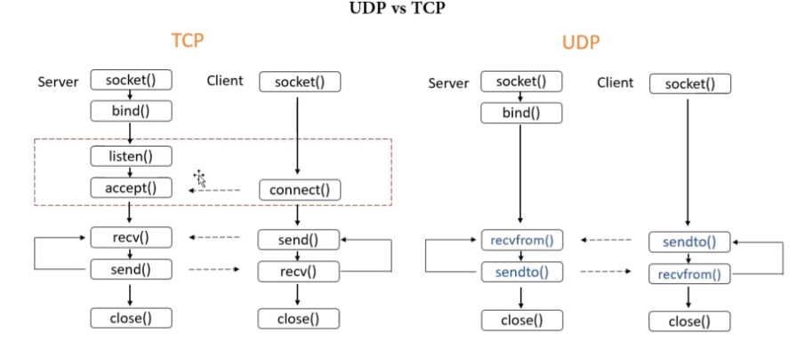
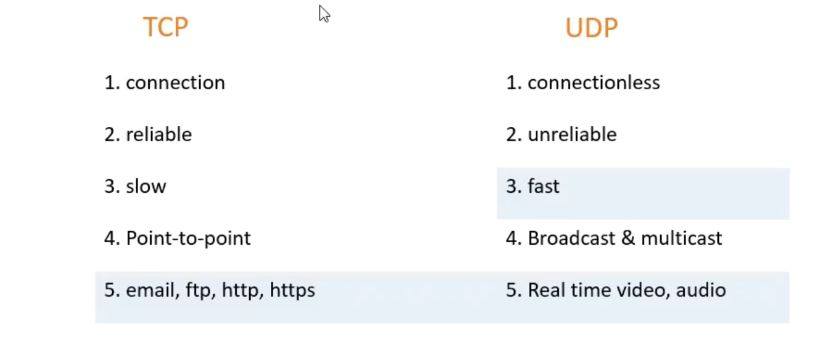
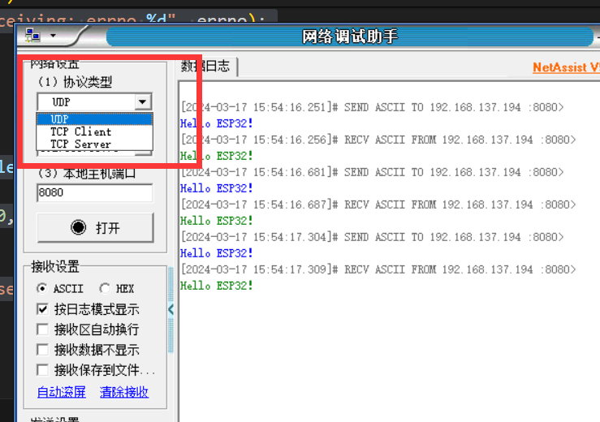
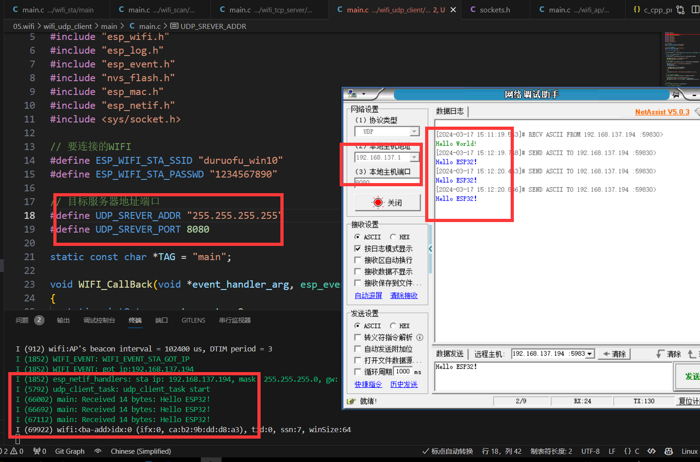
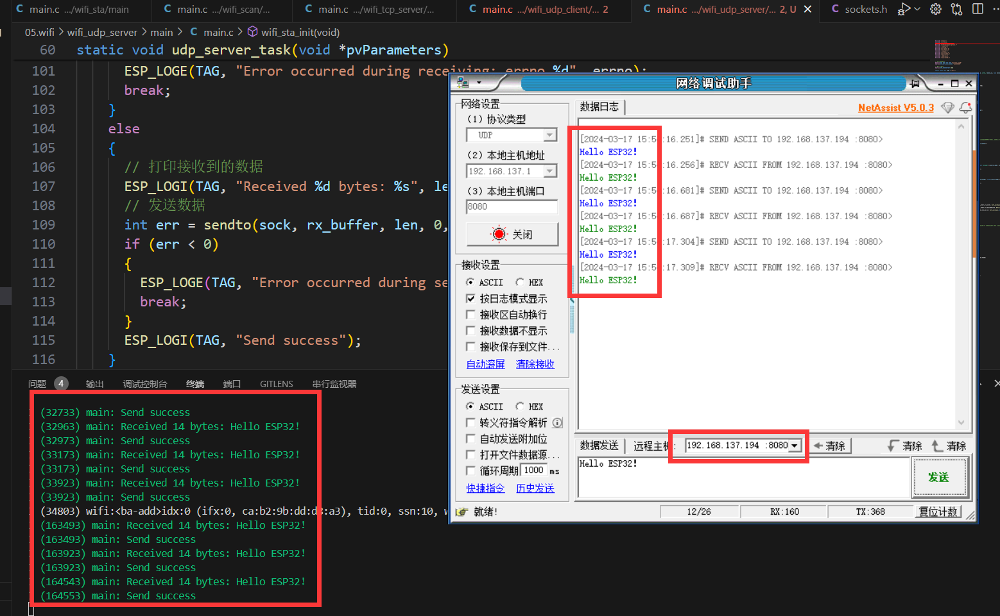

# ESP32网络入门 - UDP协议

> [!TIP] 🚀 UDP协议基础 | 快速但不可靠的通信  
> - 💡 **碎碎念**😎：本节将介绍如何在 ESP32 上使用 UDP 协议进行网络通信，了解 UDP 的特性和使用场景，并在 ESP32 上实现客户端和服务器功能。  
> - 📺 **视频教程**：暂无  
> - 💾 **示例代码**：[ESP32-Guide/code/06.wifi/udp](https://github.com/DuRuofu/ESP32-Guide/tree/main/code/06.wifi/udp)

## 一、概述

上一节教程[ESP32WIFI-2.TCP协议](https://www.duruofu.top/2024/03/15/4.%E7%A1%AC%E4%BB%B6%E7%9B%B8%E5%85%B3/MCU/ESP32/05.ESP32WIFI%E5%85%A5%E9%97%A8/5.2-ESP32%E7%BD%91%E7%BB%9C%E5%85%A5%E9%97%A8-TCP%E5%8D%8F%E8%AE%AE/ESP32%E7%BD%91%E7%BB%9C%E5%85%A5%E9%97%A8-TCP%E5%8D%8F%E8%AE%AE/)详细介绍了TCP协议，本机我们介绍UDP的使用。

UDP和TCP在程序上的区别，主要如下图：

>图来自[Michael_ee](https://space.bilibili.com/1338335828)的UDP教程。



最大的区别就是UDP没有建立连接的过程。

UDP和TCP的对比如下：



## 二、使用

> 学习了上一节TCP这部分就会很简单,足够简单就不多描述了。

### 2.1 UDP客户端

首先我们要初始化WIFI，连接WIFI，这是编写UDP程序的基础，连接WIFI在此不再赘述。

>后面的部分，默认已经连接好网络

#### 2.1.1 创建socket

```c
// 创建socket
int sock = socket(AF_INET, SOCK_DGRAM, 0);
if (sock < 0) // 创建失败返回-1
{
	ESP_LOGE(TAG, "Unable to create socket: errno %d", errno);
	return;
}
```
#### 2.1.2 配置发送目标服务器信息

```c
// 目标服务器地址端口
#define UDP_SREVER_ADDR "255.255.255.255"
#define UDP_SREVER_PORT 8080
// 设置服务器(IPV4)
struct sockaddr_in server_config;
server_config.sin_addr.s_addr = inet_addr(UDP_SREVER_ADDR);
server_config.sin_family = AF_INET;
server_config.sin_port = htons(UDP_SREVER_PORT); // 宏htons 用于将主机的无符号短整型数据转换成网络字节顺序(小端转大端)
```

服务器的地址选择 `255.255.255.255`，意思是不指定局域网内的某一设备，局域网所有的设备如果监听了这个端口号，那么都可以收到ESP32发来的消息

#### 2.1.3 发送数据
```c
// 发送数据
const char *data = "Hello World!";
int err = sendto(sock, data, strlen(data), 0, (struct sockaddr *)&server_config, sizeof(server_config));
if (err < 0)
{
	ESP_LOGE(TAG, "Error occurred during sending: errno %d", errno);
	close(sock);
}
```
#### 2.1.4 接收数据

```c
char rx_buffer[1024];
// 接收数据,并发回
while(1)
{
	// 清空缓存
	memset(rx_buffer, 0, sizeof(rx_buffer));
	// 接收数据

	struct sockaddr_in source_addr;
	socklen_t socklen = sizeof(source_addr);
	int len = recvfrom(sock, rx_buffer, sizeof(rx_buffer) - 1, 0, (struct sockaddr *)&source_addr, &socklen);
	if (len < 0)
	{
		ESP_LOGE(TAG, "Error occurred during receiving: errno %d", errno);
		break;
	}
	else
	{
		// 打印接收到的数据
		ESP_LOGI(TAG, "Received %d bytes: %s", len, rx_buffer);
	}
}
```


### 2.2 UDP服务端

>后面的部分，默认已经连接好网络
#### 2.2.1 创建socket

```c
// 创建socket
int sock = socket(AF_INET, SOCK_DGRAM, 0);
if (sock < 0) // 创建失败返回-1
{
	ESP_LOGE(TAG, "Unable to create socket: errno %d", errno);
	return;
}
```
#### 2.2.2 配置服务器信息

``` c
// 服务器地址端口
#define UDP_SREVER_PORT 8080
// 设置服务器(IPV4)
struct sockaddr_in server_config;
server_config.sin_addr.s_addr = htonl(INADDR_ANY);
server_config.sin_family = AF_INET;
server_config.sin_port = htons(UDP_SREVER_PORT); // 宏htons 用于将主机的无符号短整型数据转换成网络字节顺序(小端转大端)
```

这里就不需要配置服务器IP了，使用ESP32自身分配到的IP。
#### 2.2.3 绑定端口

```c
// 绑定端口
int err = bind(sock, (struct sockaddr *)&server_config, sizeof(server_config));
if (err < 0)
{
	ESP_LOGE(TAG, "Socket unable to bind: errno %d", errno);
}
ESP_LOGI(TAG, "Socket bound, port %d", UDP_SREVER_PORT);

```

#### 2.2.4 接收数据

```c
char rx_buffer[1024];
// 接收数据,并发回
while(1)
{
	// 清空缓存
	memset(rx_buffer, 0, sizeof(rx_buffer));
	// 接收数据

	struct sockaddr_in source_addr;
	socklen_t socklen = sizeof(source_addr);
	int len = recvfrom(sock, rx_buffer, sizeof(rx_buffer) - 1, 0, (struct sockaddr *)&source_addr, &socklen);
	if (len < 0)
	{
		ESP_LOGE(TAG, "Error occurred during receiving: errno %d", errno);
		break;
	}
	else
	{
		// 打印接收到的数据
		ESP_LOGI(TAG, "Received %d bytes: %s", len, rx_buffer);
	}
}
```

#### 2.2.5 发送数据

```c
// 发送数据
int err = sendto(sock, rx_buffer, len, 0, (struct sockaddr *)&source_addr, sizeof(source_addr));
if (err < 0)
{
	ESP_LOGE(TAG, "Error occurred during sending: errno %d", errno);
	break;
}
ESP_LOGI(TAG, "Send success");
```


>有没有发现这服务端代码相比UDP客户端除了多一个使用`bind`函数绑定地址，剩下都一模一样。（可不是我在水字数😀）

这就涉及到UDP本身的知识了，从套接字编程的角度来看，它是完全相同的。由于UDP是无连接的，因此服务器和客户端都将使用相同的sendto和recvfrom方法。

但是我们在通信时，一般来说以主从通信为主，我们更喜欢把主机称作为服务端。相比客户端，在DUP里服务端唯一的不同就是服务端的端口和地址是确定的。这样其他客户端才能准确无误向服务端发送消息。

所以上面的示例代码了，服务端多了一个绑定端口的步骤。其余的都是一样的。

使用我们使用网络调试助手会发现，协议类型一栏不分客户端和服务端。


## 三、案例（完整代码）

### 3.1 UDP客户端

>代码:https://github.com/DuRuofu/ESP32_Learning/tree/master/06.wifi/wifi_udp_client

```c
#include <stdio.h>
#include <string.h>
#include "freertos/FreeRTOS.h"
#include "freertos/event_groups.h"
#include "esp_wifi.h"
#include "esp_log.h"
#include "esp_event.h"
#include "nvs_flash.h"
#include "esp_mac.h"
#include "esp_netif.h"
#include <sys/socket.h>

// 要连接的WIFI
#define ESP_WIFI_STA_SSID "duruofu_win10"
#define ESP_WIFI_STA_PASSWD "1234567890"

// 目标服务器地址端口
#define UDP_SREVER_ADDR "255.255.255.255"
#define UDP_SREVER_PORT 8080

static const char *TAG = "main";

void WIFI_CallBack(void *event_handler_arg, esp_event_base_t event_base, int32_t event_id, void *event_data)
{
	static uint8_t connect_count = 0;
	// WIFI 启动成功
	if (event_base == WIFI_EVENT && event_id == WIFI_EVENT_STA_START)
	{
		ESP_LOGI("WIFI_EVENT", "WIFI_EVENT_STA_START");
		ESP_ERROR_CHECK(esp_wifi_connect());
	}
	// WIFI 连接失败
	if (event_base == WIFI_EVENT && event_id == WIFI_EVENT_STA_DISCONNECTED)
	{
		ESP_LOGI("WIFI_EVENT", "WIFI_EVENT_STA_DISCONNECTED");
		connect_count++;
		if (connect_count < 6)
		{
			vTaskDelay(1000 / portTICK_PERIOD_MS);
			ESP_ERROR_CHECK(esp_wifi_connect());
		}
		else
		{
			ESP_LOGI("WIFI_EVENT", "WIFI_EVENT_STA_DISCONNECTED 10 times");
		}
	}
	// WIFI 连接成功(获取到了IP)
	if (event_base == IP_EVENT && event_id == IP_EVENT_STA_GOT_IP)
	{
		ESP_LOGI("WIFI_EVENT", "WIFI_EVENT_STA_GOT_IP");
		ip_event_got_ip_t *info = (ip_event_got_ip_t *)event_data;
		ESP_LOGI("WIFI_EVENT", "got ip:" IPSTR "", IP2STR(&info->ip_info.ip));
	}
}

// udp客户端
static void udp_client_task(void *pvParameters)
{
	// 等待wifi连接成功(暂时这样处理)
	vTaskDelay(5000 / portTICK_PERIOD_MS);
	ESP_LOGI("udp_client_task", "udp_client_task start");

	// 创建socket
	int sock = socket(AF_INET, SOCK_DGRAM, 0);
	if (sock < 0) // 创建失败返回-1
	{
		ESP_LOGE(TAG, "Unable to create socket: errno %d", errno);
		return;
	}

	// 设置服务器(IPV4)
	struct sockaddr_in server_config;
	server_config.sin_addr.s_addr = inet_addr(UDP_SREVER_ADDR);
	server_config.sin_family = AF_INET;
	server_config.sin_port = htons(UDP_SREVER_PORT); // 宏htons 用于将主机的无符号短整型数据转换成网络字节顺序(小端转大端)


	// 发送数据
	const char *data = "Hello World!";
	int err = sendto(sock, data, strlen(data), 0, (struct sockaddr *)&server_config, sizeof(server_config));
	if (err < 0)
	{
		ESP_LOGE(TAG, "Error occurred during sending: errno %d", errno);
		close(sock);
	}

	char rx_buffer[1024];
	// 接收数据,并发回
	while(1)
	{
		// 清空缓存
		memset(rx_buffer, 0, sizeof(rx_buffer));
		// 接收数据

		struct sockaddr_in source_addr;
		socklen_t socklen = sizeof(source_addr);
		int len = recvfrom(sock, rx_buffer, sizeof(rx_buffer) - 1, 0, (struct sockaddr *)&source_addr, &socklen);
		if (len < 0)
		{
			ESP_LOGE(TAG, "Error occurred during receiving: errno %d", errno);
			break;
		}
		else
		{
			// 打印接收到的数据
			ESP_LOGI(TAG, "Received %d bytes: %s", len, rx_buffer);
		}
	}
	// 关闭socket
	close(sock);
	vTaskDelete(NULL);
}

// wifi初始化
static void wifi_sta_init(void)
{
	ESP_ERROR_CHECK(esp_netif_init());

	// 注册事件(wifi启动成功)
	ESP_ERROR_CHECK(esp_event_handler_instance_register(WIFI_EVENT, WIFI_EVENT_STA_START, WIFI_CallBack, NULL, NULL));
	// 注册事件(wifi连接失败)
	ESP_ERROR_CHECK(esp_event_handler_instance_register(WIFI_EVENT, WIFI_EVENT_STA_DISCONNECTED, WIFI_CallBack, NULL, NULL));
	// 注册事件(wifi连接失败)
	ESP_ERROR_CHECK(esp_event_handler_instance_register(IP_EVENT, IP_EVENT_STA_GOT_IP, WIFI_CallBack, NULL, NULL));

	// 初始化STA设备
	esp_netif_create_default_wifi_sta();

	/*Initialize WiFi */
	wifi_init_config_t cfg = WIFI_INIT_CONFIG_DEFAULT();
	// WIFI_INIT_CONFIG_DEFAULT 是一个默认配置的宏

	ESP_ERROR_CHECK(esp_wifi_init(&cfg));

	//----------------配置阶段-------------------
	// 初始化WIFI设备( 为 WiFi 驱动初始化 WiFi 分配资源，如 WiFi 控制结构、RX/TX 缓冲区、WiFi NVS 结构等，这个 WiFi 也启动 WiFi 任务。必须先调用此API，然后才能调用所有其他WiFi API)
	ESP_ERROR_CHECK(esp_wifi_set_mode(WIFI_MODE_STA));

	// STA详细配置
	wifi_config_t sta_config = {
		.sta = {
			.ssid = ESP_WIFI_STA_SSID,
			.password = ESP_WIFI_STA_PASSWD,
			.bssid_set = false,
		},
	};
	ESP_ERROR_CHECK(esp_wifi_set_config(WIFI_IF_STA, &sta_config));

	//----------------启动阶段-------------------
	ESP_ERROR_CHECK(esp_wifi_start());

	//----------------配置省电模式-------------------
	// 不省电(数据传输会更快)
	ESP_ERROR_CHECK(esp_wifi_set_ps(WIFI_PS_NONE));
}

void app_main(void)
{
	// Initialize NVS
	esp_err_t ret = nvs_flash_init();
	if (ret == ESP_ERR_NVS_NO_FREE_PAGES || ret == ESP_ERR_NVS_NEW_VERSION_FOUND)
	{
		ESP_ERROR_CHECK(nvs_flash_erase());
		ret = nvs_flash_init();
	}
	ESP_ERROR_CHECK(ret);

	// 创建默认事件循环
	ESP_ERROR_CHECK(esp_event_loop_create_default());

	// 配置启动WIFI
	wifi_sta_init();

	// 创建TCP客户端任务
	xTaskCreate(udp_client_task, "udp_client_task", 4096, NULL, 5, NULL);
}

```

效果：


### 3.2 UDP服务端

>代码：https://github.com/DuRuofu/ESP32_Learning/tree/master/06.wifi/wifi_udp_server

```c
#include <stdio.h>
#include <string.h>
#include "freertos/FreeRTOS.h"
#include "freertos/event_groups.h"
#include "esp_wifi.h"
#include "esp_log.h"
#include "esp_event.h"
#include "nvs_flash.h"
#include "esp_mac.h"
#include "esp_netif.h"
#include <sys/socket.h>
#include "lwip/err.h"
#include "lwip/sys.h"
#include <lwip/netdb.h>


// 要连接的WIFI
#define ESP_WIFI_STA_SSID "duruofu_win10"
#define ESP_WIFI_STA_PASSWD "1234567890"

// 服务器端口
#define UDP_SREVER_PORT 8080

static const char *TAG = "main";

void WIFI_CallBack(void *event_handler_arg, esp_event_base_t event_base, int32_t event_id, void *event_data)
{
	static uint8_t connect_count = 0;
	// WIFI 启动成功
	if (event_base == WIFI_EVENT && event_id == WIFI_EVENT_STA_START)
	{
		ESP_LOGI("WIFI_EVENT", "WIFI_EVENT_STA_START");
		ESP_ERROR_CHECK(esp_wifi_connect());
	}
	// WIFI 连接失败
	if (event_base == WIFI_EVENT && event_id == WIFI_EVENT_STA_DISCONNECTED)
	{
		ESP_LOGI("WIFI_EVENT", "WIFI_EVENT_STA_DISCONNECTED");
		connect_count++;
		if (connect_count < 6)
		{
			vTaskDelay(1000 / portTICK_PERIOD_MS);
			ESP_ERROR_CHECK(esp_wifi_connect());
		}
		else
		{
			ESP_LOGI("WIFI_EVENT", "WIFI_EVENT_STA_DISCONNECTED 10 times");
		}
	}
	// WIFI 连接成功(获取到了IP)
	if (event_base == IP_EVENT && event_id == IP_EVENT_STA_GOT_IP)
	{
		ESP_LOGI("WIFI_EVENT", "WIFI_EVENT_STA_GOT_IP");
		ip_event_got_ip_t *info = (ip_event_got_ip_t *)event_data;
		ESP_LOGI("WIFI_EVENT", "got ip:" IPSTR "", IP2STR(&info->ip_info.ip));
	}
}

// udp客户端
static void udp_server_task(void *pvParameters)
{
	// 等待wifi连接成功(暂时这样处理)
	vTaskDelay(5000 / portTICK_PERIOD_MS);
	ESP_LOGI("udp_server_task", "udp_server_task start");

	// 创建socket
	int sock = socket(AF_INET, SOCK_DGRAM, 0);
	if (sock < 0) // 创建失败返回-1
	{
		ESP_LOGE(TAG, "Unable to create socket: errno %d", errno);
		return;
	}

	// 设置服务器(IPV4)
	struct sockaddr_in server_config;
	server_config.sin_addr.s_addr = htonl(INADDR_ANY);
	server_config.sin_family = AF_INET;
	server_config.sin_port = htons(UDP_SREVER_PORT); // 宏htons 用于将主机的无符号短整型数据转换成网络字节顺序(小端转大端)
	
	// 绑定端口
	int err = bind(sock, (struct sockaddr *)&server_config, sizeof(server_config));
	if (err < 0)
	{
		ESP_LOGE(TAG, "Socket unable to bind: errno %d", errno);
	}
	ESP_LOGI(TAG, "Socket bound, port %d", UDP_SREVER_PORT);

	char rx_buffer[1024];
	// 接收数据,并发回
	while(1)
	{
		// 清空缓存
		memset(rx_buffer, 0, sizeof(rx_buffer));
		// 接收数据

		struct sockaddr_in source_addr;
		socklen_t socklen = sizeof(source_addr);
		int len = recvfrom(sock, rx_buffer, sizeof(rx_buffer) - 1, 0, (struct sockaddr *)&source_addr, &socklen);
		if (len < 0)
		{
			ESP_LOGE(TAG, "Error occurred during receiving: errno %d", errno);
			break;
		}
		else
		{
			// 打印接收到的数据
			ESP_LOGI(TAG, "Received %d bytes: %s", len, rx_buffer);
			// 发送数据
			int err = sendto(sock, rx_buffer, len, 0, (struct sockaddr *)&source_addr, sizeof(source_addr));
			if (err < 0)
			{
				ESP_LOGE(TAG, "Error occurred during sending: errno %d", errno);
				break;
			}
			ESP_LOGI(TAG, "Send success");
		}
	}
	// 关闭socket
	close(sock);
	vTaskDelete(NULL);
}

// wifi初始化
static void wifi_sta_init(void)
{
	ESP_ERROR_CHECK(esp_netif_init());

	// 注册事件(wifi启动成功)
	ESP_ERROR_CHECK(esp_event_handler_instance_register(WIFI_EVENT, WIFI_EVENT_STA_START, WIFI_CallBack, NULL, NULL));
	// 注册事件(wifi连接失败)
	ESP_ERROR_CHECK(esp_event_handler_instance_register(WIFI_EVENT, WIFI_EVENT_STA_DISCONNECTED, WIFI_CallBack, NULL, NULL));
	// 注册事件(wifi连接失败)
	ESP_ERROR_CHECK(esp_event_handler_instance_register(IP_EVENT, IP_EVENT_STA_GOT_IP, WIFI_CallBack, NULL, NULL));

	// 初始化STA设备
	esp_netif_create_default_wifi_sta();

	/*Initialize WiFi */
	wifi_init_config_t cfg = WIFI_INIT_CONFIG_DEFAULT();
	// WIFI_INIT_CONFIG_DEFAULT 是一个默认配置的宏

	ESP_ERROR_CHECK(esp_wifi_init(&cfg));

	//----------------配置阶段-------------------
	// 初始化WIFI设备( 为 WiFi 驱动初始化 WiFi 分配资源，如 WiFi 控制结构、RX/TX 缓冲区、WiFi NVS 结构等，这个 WiFi 也启动 WiFi 任务。必须先调用此API，然后才能调用所有其他WiFi API)
	ESP_ERROR_CHECK(esp_wifi_set_mode(WIFI_MODE_STA));

	// STA详细配置
	wifi_config_t sta_config = {
		.sta = {
			.ssid = ESP_WIFI_STA_SSID,
			.password = ESP_WIFI_STA_PASSWD,
			.bssid_set = false,
		},
	};
	ESP_ERROR_CHECK(esp_wifi_set_config(WIFI_IF_STA, &sta_config));

	//----------------启动阶段-------------------
	ESP_ERROR_CHECK(esp_wifi_start());

	//----------------配置省电模式-------------------
	// 不省电(数据传输会更快)
	ESP_ERROR_CHECK(esp_wifi_set_ps(WIFI_PS_NONE));
}

void app_main(void)
{
	// Initialize NVS
	esp_err_t ret = nvs_flash_init();
	if (ret == ESP_ERR_NVS_NO_FREE_PAGES || ret == ESP_ERR_NVS_NEW_VERSION_FOUND)
	{
		ESP_ERROR_CHECK(nvs_flash_erase());
		ret = nvs_flash_init();
	}
	ESP_ERROR_CHECK(ret);

	// 创建默认事件循环
	ESP_ERROR_CHECK(esp_event_loop_create_default());

	// 配置启动WIFI
	wifi_sta_init();

	// 创建TCP客户端任务
	xTaskCreate(udp_server_task, "udp_server_task", 4096, NULL, 5, NULL);
}

```

效果：




# 参考链接

1. https://www.bilibili.com/video/BV1iG411j7Gq/?spm_id_from=333.788&vd_source=ef5a0ab0106372751602034cdd9ab98e