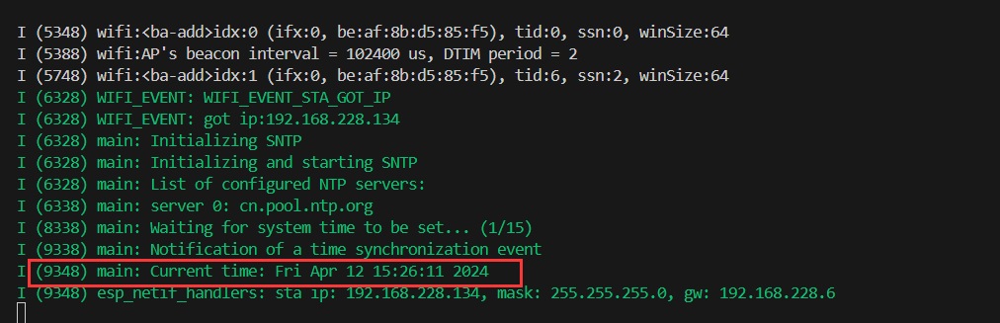

# ESP32网络入门 - SNTP校时

> [!TIP] 🚀 SNTP校时 | 精确同步ESP32的系统时间  
> - 💡 **碎碎念**😎：本节将介绍如何使用 SNTP 协议实现 ESP32 的系统时间同步。你将学习如何连接到网络时间服务器，并校准 ESP32 的本地时间。  
> - 📺 **视频教程**：暂无  
> - 💾 **示例代码**：[ESP32-Guide/code/06.wifi/sntp](https://github.com/DuRuofu/ESP32-Guide/tree/main/code/06.wifi/sntp)

## 一、介绍

SNTP 指 **简单网络时间协议**（Simple Network Time Protocol），一个合格的物联网设备，少不了一个准确的钟。通过SNTP，可以使ESP32设备通过网络校准本地时间。使用起来也非常简单。

## 二、使用

#### 2.1 初始化特定的 SNTP 服务器

要初始化特定的 SNTP 服务器并启动 SNTP 服务，只需创建有特定服务器名称的默认 SNTP 服务器配置，然后调用 [`esp_netif_sntp_init()`](https://docs.espressif.com/projects/esp-idf/zh_CN/latest/esp32s3/api-reference/network/esp_netif.html#_CPPv419esp_netif_sntp_initPK17esp_sntp_config_t "esp_netif_sntp_init") 注册该服务器并启动 SNTP 服务。

```c
esp_sntp_config_t config = ESP_NETIF_SNTP_DEFAULT_CONFIG("pool.ntp.org");
esp_netif_sntp_init(&config);
```

#### 2.1 启动 SNTP 服务

```c
	// Start SNTP
	esp_netif_sntp_start();
```

#### 2.3 同步时间

```c
	// wait for time to be set
	time_t now = 0;
	struct tm timeinfo = {0};
	int retry = 0;
	const int retry_count = 15;
	while (esp_netif_sntp_sync_wait(2000 / portTICK_PERIOD_MS) == ESP_ERR_TIMEOUT && ++retry < retry_count)
	{
		ESP_LOGI(TAG, "Waiting for system time to be set... (%d/%d)", retry, retry_count);
	}
	time(&now);
	localtime_r(&now, &timeinfo);

```

#### 2.4 其他

设置时区：

1. 调用 `setenv()`，将 `TZ` 环境变量根据设备位置设置为正确的值。时间字符串的格式与 [GNU libc 文档](https://www.gnu.org/software/libc/manual/html_node/TZ-Variable.html) 中描述的相同（但实现方式不同）。
2. 调用 `tzset()`，为新的时区更新 C 库的运行数据。

例：
```c
// Set timezone to Beijing time
setenv("TZ", "CST-8", 1); // CST-8 represents China Standard Time (UTC+8)
tzset();
```

## 三、示例

```c
#include <stdio.h>
#include <string.h>
#include "freertos/FreeRTOS.h"
#include "freertos/event_groups.h"
#include "esp_wifi.h"
#include "esp_log.h"
#include "esp_event.h"
#include "nvs_flash.h"
#include "esp_mac.h"
#include "esp_netif.h"
#include <sys/socket.h>
#include "esp_netif_sntp.h"
#include "lwip/ip_addr.h"
#include "esp_sntp.h"

// 要连接的WIFI
#define ESP_WIFI_STA_SSID "duruofu"
#define ESP_WIFI_STA_PASSWD "1234567890"


static const char *TAG = "main";

void time_sync_notification_cb(struct timeval *tv)
{
	ESP_LOGI(TAG, "Notification of a time synchronization event");
}

static void print_servers(void)
{
	ESP_LOGI(TAG, "List of configured NTP servers:");

	for (uint8_t i = 0; i < SNTP_MAX_SERVERS; ++i)
	{
		if (esp_sntp_getservername(i))
		{
			ESP_LOGI(TAG, "server %d: %s", i, esp_sntp_getservername(i));
		}
		else
		{
			// we have either IPv4 or IPv6 address, let's print it
			char buff[INET6_ADDRSTRLEN];
			ip_addr_t const *ip = esp_sntp_getserver(i);
			if (ipaddr_ntoa_r(ip, buff, INET6_ADDRSTRLEN) != NULL)
				ESP_LOGI(TAG, "server %d: %s", i, buff);
		}
	}
}

static void obtain_time(void)
{
	// Set timezone to Beijing time
	setenv("TZ", "CST-8", 1); // CST-8 represents China Standard Time (UTC+8)
	tzset();

	ESP_LOGI(TAG, "Initializing SNTP");
	esp_sntp_config_t config = ESP_NETIF_SNTP_DEFAULT_CONFIG("cn.pool.ntp.org");
	config.sync_cb = time_sync_notification_cb;
	config.renew_servers_after_new_IP = true,

	// Initialize SNTP with the provided configuration
	esp_netif_sntp_init(&config);

	// Start SNTP
	esp_netif_sntp_start();

	ESP_LOGI(TAG, "Initializing and starting SNTP");

	print_servers();

	// wait for time to be set
	time_t now = 0;
	struct tm timeinfo = {0};
	int retry = 0;
	const int retry_count = 15;
	while (esp_netif_sntp_sync_wait(2000 / portTICK_PERIOD_MS) == ESP_ERR_TIMEOUT && ++retry < retry_count)
	{
		ESP_LOGI(TAG, "Waiting for system time to be set... (%d/%d)", retry, retry_count);
	}
	time(&now);
	localtime_r(&now, &timeinfo);


	// Print current time
	char strftime_buf[64];
	strftime(strftime_buf, sizeof(strftime_buf), "%c", &timeinfo);
	ESP_LOGI(TAG, "Current time: %s", strftime_buf);
}


void WIFI_CallBack(void *event_handler_arg, esp_event_base_t event_base, int32_t event_id, void *event_data)
{
	static uint8_t connect_count = 0;
	// WIFI 启动成功
	if (event_base == WIFI_EVENT && event_id == WIFI_EVENT_STA_START)
	{
		ESP_LOGI("WIFI_EVENT", "WIFI_EVENT_STA_START");
		ESP_ERROR_CHECK(esp_wifi_connect());
	}
	// WIFI 连接失败
	if (event_base == WIFI_EVENT && event_id == WIFI_EVENT_STA_DISCONNECTED)
	{
		ESP_LOGI("WIFI_EVENT", "WIFI_EVENT_STA_DISCONNECTED");
		connect_count++;
		if (connect_count < 6)
		{
			vTaskDelay(1000 / portTICK_PERIOD_MS);
			ESP_ERROR_CHECK(esp_wifi_connect());
		}
		else
		{
			ESP_LOGI("WIFI_EVENT", "WIFI_EVENT_STA_DISCONNECTED 10 times");
		}
	}
	// WIFI 连接成功(获取到了IP)
	if (event_base == IP_EVENT && event_id == IP_EVENT_STA_GOT_IP)
	{
		ESP_LOGI("WIFI_EVENT", "WIFI_EVENT_STA_GOT_IP");
		ip_event_got_ip_t *info = (ip_event_got_ip_t *)event_data;
		ESP_LOGI("WIFI_EVENT", "got ip:" IPSTR "", IP2STR(&info->ip_info.ip));
		// 更新时间
		obtain_time();
	}
}

// wifi初始化
static void wifi_sta_init(void)
{
	ESP_ERROR_CHECK(esp_netif_init());

	// 注册事件(wifi启动成功)
	ESP_ERROR_CHECK(esp_event_handler_instance_register(WIFI_EVENT, WIFI_EVENT_STA_START, WIFI_CallBack, NULL, NULL));
	// 注册事件(wifi连接失败)
	ESP_ERROR_CHECK(esp_event_handler_instance_register(WIFI_EVENT, WIFI_EVENT_STA_DISCONNECTED, WIFI_CallBack, NULL, NULL));
	// 注册事件(wifi连接失败)
	ESP_ERROR_CHECK(esp_event_handler_instance_register(IP_EVENT, IP_EVENT_STA_GOT_IP, WIFI_CallBack, NULL, NULL));

	// 初始化STA设备
	esp_netif_create_default_wifi_sta();

	/*Initialize WiFi */
	wifi_init_config_t cfg = WIFI_INIT_CONFIG_DEFAULT();
	// WIFI_INIT_CONFIG_DEFAULT 是一个默认配置的宏

	ESP_ERROR_CHECK(esp_wifi_init(&cfg));

	//----------------配置阶段-------------------
	// 初始化WIFI设备( 为 WiFi 驱动初始化 WiFi 分配资源，如 WiFi 控制结构、RX/TX 缓冲区、WiFi NVS 结构等，这个 WiFi 也启动 WiFi 任务。必须先调用此API，然后才能调用所有其他WiFi API)
	ESP_ERROR_CHECK(esp_wifi_set_mode(WIFI_MODE_STA));

	// STA详细配置
	wifi_config_t sta_config = {
		.sta = {
			.ssid = ESP_WIFI_STA_SSID,
			.password = ESP_WIFI_STA_PASSWD,
			.bssid_set = false,
		},
	};
	ESP_ERROR_CHECK(esp_wifi_set_config(WIFI_IF_STA, &sta_config));

	//----------------启动阶段-------------------
	ESP_ERROR_CHECK(esp_wifi_start());

	//----------------配置省电模式-------------------
	// 不省电(数据传输会更快)
	ESP_ERROR_CHECK(esp_wifi_set_ps(WIFI_PS_NONE));
}


void app_main(void)
{
	// Initialize NVS
	esp_err_t ret = nvs_flash_init();
	if (ret == ESP_ERR_NVS_NO_FREE_PAGES || ret == ESP_ERR_NVS_NEW_VERSION_FOUND)
	{
		ESP_ERROR_CHECK(nvs_flash_erase());
		ret = nvs_flash_init();
	}
	ESP_ERROR_CHECK(ret);

	// 创建默认事件循环
	ESP_ERROR_CHECK(esp_event_loop_create_default());

	// 配置启动WIFI
	wifi_sta_init();

	// 使用SNTP校准时间

}


```

效果：



# 参考链接

1. https://docs.espressif.com/projects/esp-idf/zh_CN/latest/esp32s3/api-reference/system/system_time.html?highlight=sntp
2. https://github.com/espressif/esp-idf/blob/5a40bb8746633477c07ff9a3e90016c37fa0dc0c/examples/protocols/sntp/main/sntp_example_main.c