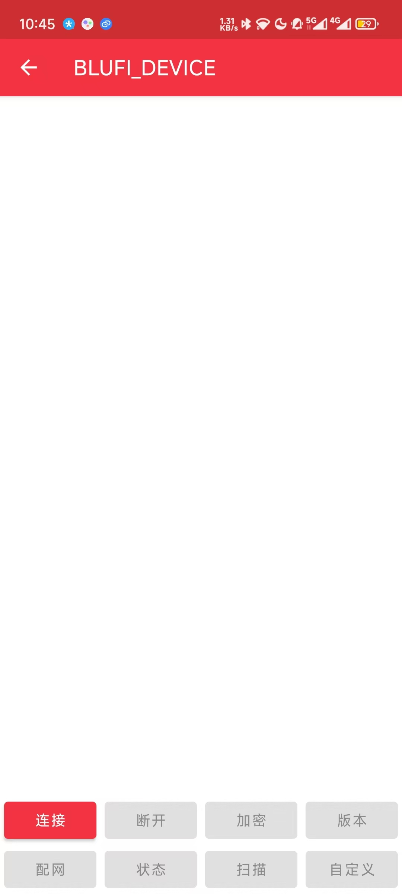
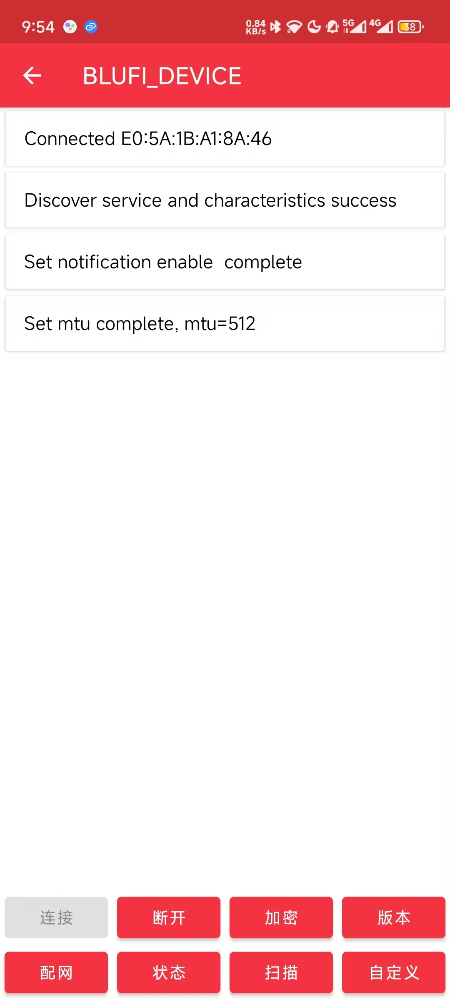
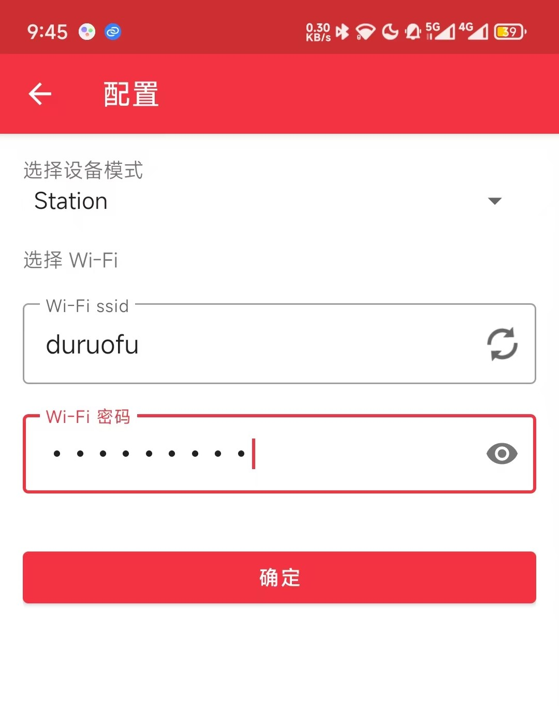
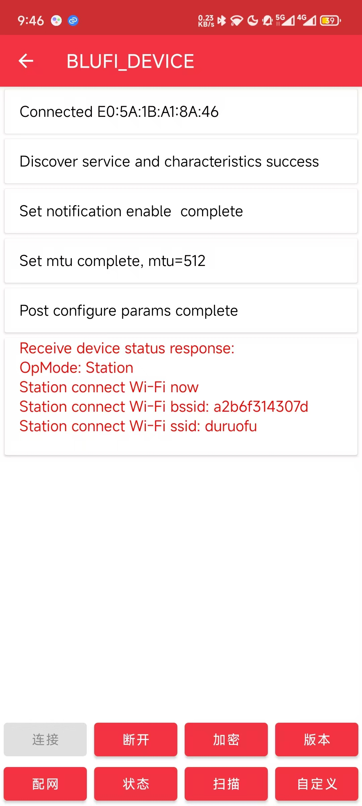

# ESP32网络入门 - BluFi配网

> [!TIP] 🚀 BluFi配网 | 快速实现ESP32的WiFi配网功能  
> - 💡 **碎碎念**😎：本节将介绍如何使用 BluFi 协议完成 ESP32 的 WiFi 配网程序，并讲解官方提供的配网小程序示例。  
> - 📺 **视频教程**：暂无  
> - 💾 **示例程序**：[ESP32-Guide/code/09.extra/wifi_config/blufi](https://github.com/DuRuofu/ESP32-Guide/tree/main/code/09.extra/wifi_config/blufi) 
> - 📚 **官方文档**：[API 指南 » 低功耗蓝牙® » BluFi](https://docs.espressif.com/projects/esp-idf/zh_CN/v5.3.2/esp32/api-guides/ble/blufi.html?highlight=blufi)

## 一、介绍

这里搬运一下官方的介绍：

### 1.1 BluFi是什么

BluFi 是一项基于蓝牙通道的 Wi-Fi 网络配置功能，适用于 ESP32。它通过安全协议将 Wi-Fi 的 SSID、密码等配置信息传输到 ESP32。基于这些信息，ESP32 可进而连接到 AP 或建立 SoftAP。

BluFi 流程的关键部分包括数据的分片、加密以及校验和验证。

用户可按需自定义用于对称加密、非对称加密以及校验的算法。此处，我们采用 DH 算法进行密钥协商，128-AES 算法用于数据加密，CRC16 算法用于校验和验证。

### 1.2 配网流程

BluFi 配网流程包含配置 SoftAP 和配置 Station 两部分。


1. ESP32 开启 GATT Server 模式，发送带有特定 _advertising data_ 的广播。该广播不属于 BluFi Profile，可以按需对其进行自定义。
2. 使用手机应用程序搜索到该广播后，手机将作为 GATT Client 连接 ESP32。该步骤对具体使用哪款手机应用程序并无特殊要求。
3. 成功建立 GATT 连接后，手机会向 ESP32 发送数据帧进行密钥协商（详见 [BluFi 中定义的帧格式](https://docs.espressif.com/projects/esp-idf/zh_CN/v5.3.2/esp32/api-guides/ble/blufi.html?highlight=blufi#frame-formats) ）。
4. ESP32 收到密钥协商的数据帧后，会按照自定义的协商方法进行解析。
5. 手机与 ESP32 进行密钥协商。协商过程可使用 DH/RSA/ECC 等加密算法。
6. 协商结束后，手机端向 ESP32 发送控制帧，用于设置安全模式。
7. ESP32 收到控制帧后，使用共享密钥以及安全配置对通信数据进行加密和解密。
8. 手机向 ESP32 发送 [BluFi 中定义的帧格式](https://docs.espressif.com/projects/esp-idf/zh_CN/v5.3.2/esp32/api-guides/ble/blufi.html?highlight=blufi#frame-formats) 中定义的数据帧，包括 SSID、密码等 Wi-Fi 配置信息。
9. 手机向 ESP32 发送 Wi-Fi 连接请求的控制帧。ESP32 收到控制帧后，即默认手机已完成必要信息的传输，准备连接 Wi-Fi。
10. 连接到 Wi-Fi 后，ESP32 发送 Wi-Fi 连接状态报告的控制帧到手机。至此，配网结束。

>1. ESP32 收到安全模式配置的控制帧后，会根据定义的安全模式进行相关操作。
>2. 进行对称加密和解密时，加密和解密前后的数据长度必须一致。支持原地加密和解密。

## 二、尝试编译使用官方示例

首先我们先获取官方的[Blufi 配网例程](https://github.com/espressif/esp-idf/tree/master/examples/bluetooth/blufi)，让后尝试编译烧录：


烧录完成后，串口打印如下：


然后安装乐鑫提供的配套 EspBlufi app，并打开 Wi-Fi 和蓝⽛，下载链接：

- Android：[EspBlufi](https://github.com/EspressifApp/EspBlufiForAndroid/releases/tag/v1.6.3)
- IOS: [EspBlufi](https://apps.apple.com/cn/app/espblufi/id1450614082)

打开安装好的 EspBlufi 软件，在 app 界⾯面下拉刷新，可以看到周围的蓝⽛牙设备，如下图：


点击设备，跳转到设备界⾯面：




点击连接，连接成功后如图所示：




点击配网，输入Wifi连接信息（同时还可以选择Wifi的模式）：




确定后，如果连接成功会输出连接信息：




同时ESP32串口输入如下，表示配网成功：


我们还可以使用乐鑫提供的小程序进行配网：


上述过程中使用到的APP和小程序源码都可以在乐鑫官方的仓库中找到，大家也可以根据自己的需求进行二次开发和学习。
## 三、示例代码解读

### 3.1 ESP32端

示例程序目录如下：

```
├── CMakeLists.txt
├── main
│   ├── blufi_example.h
│   ├── blufi_example_main.c
│   ├── blufi_init.c
│   ├── blufi_security.c
│   ├── CMakeLists.txt
│   └── Kconfig.projbuild
├── README.md
├── sdkconfig
├── sdkconfig.defaults
├── sdkconfig.defaults.esp32
├── sdkconfig.defaults.esp32c2
├── sdkconfig.defaults.esp32c3
├── sdkconfig.defaults.esp32c6
└── sdkconfig.defaults.esp32s3
```

我们这里主要关注`blufi_example.h`，`blufi_example_main.c`,`blufi_init.c`,`blufi_security.c`这四个文件：


### 3.2 APP或小程序端

# 参考链接

1. https://github.com/espressif/esp-idf/tree/master/examples/bluetooth/blufi
2. https://www.espressif.com/sites/default/files/documentation/esp32_bluetooth_networking_user_guide_cn.pdf