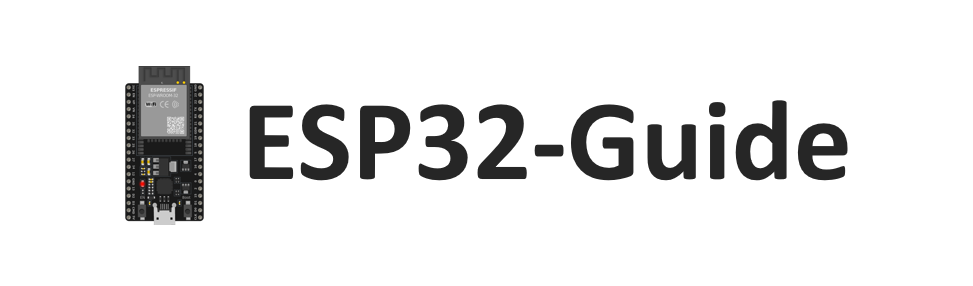

# ESP32从初见到入门 —— 目录

## 许可协议：

本仓库中的文本、代码、图片和视频均采用知识共享署名-非商业性使用-相同方式共享 4.0 国际许可协议— [CC BY-NC-SA 4.0](https://creativecommons.org/licenses/by-nc-sa/4.0/)。

## 〇、常见问题及解决方案：

本部分记录搭建环境和开发过程中常见的问题和解决方案，都是本人在开发过程中遇到的，作为经验积累，分享给大家。

> 常见问题及解决方案：[常见问题及解决方案.md](./00.常见问题及解决方案/常见问题及解决方案.md)

## 一、认识ESP32 【完结】

> 目标：学会安装ESP-IDF开发环境，并使用其烧录代码，掌握ESP32的基本特点及工具使用。  

### 1.1 什么是ESP32

本节主要介绍ESP32的基本概念，包括其硬件特点、应用场景及功能优势。通过本节内容，初学者可以快速了解ESP32的核心能力以及在物联网开发中的广泛应用。  

- 📄在线文字教程：[ESP32介绍.md](./01.认识ESP32/1.1-ESP32介绍/ESP32介绍.md)
- 📺在线视频教程：[ESP32介绍](https://www.bilibili.com/video/BV1u861YHEso/?spm_id_from=333.1007.top_right_bar_window_history.content.click&vd_source=ef5a0ab0106372751602034cdd9ab98e)

### 1.2 ESP32开发环境搭建

本节将详细讲解如何在不同操作系统（Windows/Linux/Mac）上搭建ESP-IDF开发环境，涵盖工具链安装、环境变量配置及调试工具的准备等内容。通过本节，读者可以完成开发环境的搭建，为后续开发做好准备。  

- 📄在线文字教程-1：[环境搭建-Windows.md](./01.认识ESP32/1.2-ESP32开发环境搭建/1.环境搭建-Windows.md)
- 📄在线文字教程-2：[环境搭建-Ubuntu虚拟机.md](./01.认识ESP32/1.2-ESP32开发环境搭建/2.环境搭建-Ubuntu虚拟机.md)
- 📄在线文字教程-3：[环境搭建-Windows与虚拟机组合使用.md](./01.认识ESP32/1.2-ESP32开发环境搭建/3.环境搭建-Windows与虚拟机组合使用.md)
- 📺在线视频教程-1：[认识ESP32—1.2.1 Win下安装ESP-IDF开发环境](https://www.bilibili.com/video/BV14o62YQEBC?vd_source=ef5a0ab0106372751602034cdd9ab98e&spm_id_from=333.788.videopod.sections)
- 📺在线视频教程-2：[认识ESP32—1.2.2 Linux下安装ESP-IDF开发环境](https://www.bilibili.com/video/BV1vLrKYHExy/?vd_source=ef5a0ab0106372751602034cdd9ab98e#reply251069588753)
- 📺在线视频教程-3：[认识ESP32—1.2.3 Windows下使用ssh调用Linux系统下的开发环境](https://www.bilibili.com/video/BV1vLrKYHExy/?vd_source=ef5a0ab0106372751602034cdd9ab98e#reply251069588753)

### 1.3 初试ESP32-IDF.py的基本使用

本节通过“Hello World”示例代码，指导读者创建第一个ESP32工程，并完成编译、烧录及运行调试流程。通过本节内容，初学者可以初步体验ESP-IDF的开发流程，快速进入ESP32开发的世界。  

- 📄在线文字教程：[ESP32初体验-idf.py的基本使用.md](./01.认识ESP32/1.3-初试ESP32-idf.py的基本使用/idf.py的基本使用.md)
- 📺在线视频教程：[ESP32初体验-idf.py的基本使用](https://www.bilibili.com/video/BV1VLrSY3E15?spm_id_from=333.788.videopod.sections&vd_source=ef5a0ab0106372751602034cdd9ab98e)
- 💾教程配套代码：[ESP32-Guide/code/01.start/hello_world](https://github.com/DuRuofu/ESP32-Guide/tree/main/code/01.start/hello_world)

---

## 二、IDF基础与工具使用 【完结】

> 目标：熟悉ESP-IDF的架构与开发流程，掌握常用开发工具及调试方法，建立高效开发基础。 

### 2.1 ESP32工程结构

本节详细介绍ESP-IDF项目的基本目录结构，包括CMake工具的基础知识，帮助读者掌握ESP32工程的整体组织方式，为日后开发复杂项目奠定基础。  

- 📄在线文字教程：[ESP32工程结构.md](./02.ESP-IDF基础/2.1-ESP32工程结构/ESP-IDF的工程结构.md)
- 📺在线视频教程：[ESP32工程结构](https://www.bilibili.com/video/BV1CfrzYcEkK/?spm_id_from=333.1387.homepage.video_card.click&vd_source=ef5a0ab0106372751602034cdd9ab98e)
- 💾教程配套代码：[ESP32-Guide/code/02.idf_basic/sample_project](https://github.com/DuRuofu/ESP32-Guide/tree/main/code/02.idf_basic/sample_project)  

### 2.2 ESP-IDF项目配置

本节将重点讲解如何使用`menuconfig`工具配置项目，包含常见的配置选项及其实际用途。通过本节学习，读者可以根据项目需求快速定制和优化ESP32项目配置。  

- 📄在线文字教程：[ESP-IDF项目配置.md](./02.ESP-IDF基础/2.2-ESP-IDF项目配置/ESP-IDF项目配置.md)
- 📺在线视频教程：[ESP-IDF项目配置详解](https://www.bilibili.com/video/BV15xwbeiEnD/)
- 💾教程配套代码：[ESP32-Guide/code/02.idf_basic/config](https://github.com/DuRuofu/ESP32-Guide/tree/main/code/02.idf_basic/config)  

### 2.3 ESP-IDF自定义组件

本节讲解如何创建和管理ESP-IDF的自定义组件，包括组件的目录结构、声明与调用方法，以及组件的复用和共享技巧，帮助读者构建模块化项目。  

- 📄在线文字教程：[ESP-IDF自定义组件.md](./02.ESP-IDF基础/2.3-ESP-IDF自定义组件/ESP-IDF自定义组件.md)
- 📺在线视频教程：[ESP-IDF自定义组件](https://www.bilibili.com/video/BV182ftYHEox/?spm_id_from=333.1387.upload.video_card.click&vd_source=ef5a0ab0106372751602034cdd9ab98e)
- 💾教程配套代码：[ESP32-Guide/code/02.idf_basic/blink_component](https://github.com/DuRuofu/ESP32-Guide/tree/main/code/02.idf_basic/blink_component)  

### 2.4 ESP-IDF组件管理器

本节重点介绍ESP-IDF组件管理器的功能与使用方法，涵盖如何通过组件管理器导入外部库、配置组件依赖，使用官方提供的外部组件。

- 📄在线文字教程：[ESP-IDF组件管理器.md](./02.ESP-IDF基础/2.4-ESP-IDF组件管理器/ESP-IDF组件管理器.md)
- 📺在线视频教程：[ESP-IDF组件管理器详解](https://www.bilibili.com/video/BV1etfHYgE6M/)
- 💾教程配套代码：[ESP32-Guide/code/02.idf_basic/button_blink](https://github.com/DuRuofu/ESP32-Guide/tree/main/code/02.idf_basic/button_blink)  

---

## 三、FreeRTOS基础（更新中）

> 目标：学习FreeRTOS的核心概念与基本功能，掌握任务管理与调度机制，为实时系统开发打下基础。  

### 3.1 FreeRTOS介绍与引入

本节将介绍FreeRTOS的核心概念，包括实时操作系统的特点、FreeRTOS的基本架构和设计思想，以及其在嵌入式开发中的应用场景，帮助读者快速了解FreeRTOS的基础知识。  

- 📄在线文字教程：[FreeRTOS概述.md](./03.FreeRTOS基础/3.1-FreeRTOS概述/FreeRTOS概述.md)
- 📺在线视频教程：🚧 开发中

### 3.2 FreeRTOS多任务与任务管理  

本节讲解FreeRTOS中的多任务机制及任务管理方法，包括任务创建、任务删除、任务优先级和任务状态的管理。通过本节学习，读者可以初步掌握在FreeRTOS中实现并发任务的基本技巧。  

- 📄在线文字教程：[FreeRTOS多任务与任务管理.md](./03.FreeRTOS基础/3.2-FreeRTOS多任务与任务管理/FreeRTOS多任务与任务管理.md)
- 📺在线视频教程：🚧 开发中
- 💾教程配套代码：[ESP32-Guide/code/03.freertos_basic/task](https://github.com/DuRuofu/ESP32-Guide/tree/main/code/03.freertos_basic/task)

### 3.3 FreeRTOS任务看门狗

本节讲解 FreeRTOS 中任务看门狗机制的原理包括如何监控任务执行状态、检测任务卡死以及触发系统恢复等功能。通过学习任务看门狗，读者可以掌握提高系统可靠性的重要技巧，确保任务能够在异常情况下得到及时处理。

- 📄在线文字教程：[FreeRTOS任务看门狗.md](./03.FreeRTOS基础/3.3-FreeRTOS任务看门狗/FreeRTOS任务看门狗.md)
- 📺在线视频教程：🚧 开发中
- 💾教程配套代码：[ESP32-Guide/code/03.freertos_basic/watchdog](https://github.com/DuRuofu/ESP32-Guide/tree/main/code/03.freertos_basic/watchdog)

### 3.4 FreeRTOS软件定时器 (Software Timer)

  通过软件定时器实现定时触发任务逻辑，学习其管理及高级用法。  

- 📄在线文字教程：[FreeRTOS软件定时器.md](./03.FreeRTOS基础/3.4-FreeRTOS软件定时器/FreeRTOS软件定时器.md)  
- 📺在线视频教程：🚧 开发中
- 💾教程配套代码：[ESP32-Guide/code/03.freertos_basic/timer](https://github.com/DuRuofu/ESP32-Guide/tree/main/code/03.freertos_basic/timer)

---

## 四、外设学习  （更新中）

> 目标：掌握ESP32常用外设的基本操作方法，学会与硬件交互并控制外设设备。  

### 4.1 基础外设  

#### 4.1.1 GPIO  

本节介绍GPIO（通用输入输出）的基本功能，包括输入、输出及中断操作。通过实际案例，学习如何控制外部设备并响应硬件信号。  

- 📄在线文字教程：[外设-GPIO入门.md](./04.外设学习/4.1-基础外设/4.1.1-GPIO/GPIO入门.md)  
- 📺在线视频教程：🚧 开发中
- 💾教程配套代码：[ESP32-Guide/code/04.peripheral/basics/gpio](https://github.com/DuRuofu/ESP32-Guide/tree/main/code/04.peripheral/basics/gpio)

#### 4.1.2 UART  

本节讲解UART串口通信的原理及在ESP32中的实现，内容涵盖UART初始化、数据收发及常见调试方法。  

-  📄在线文字教程：[外设-UART串口.md](./04.外设学习/4.1-基础外设/4.1.2-UART/UART串口通信.md)  
- 📺在线视频教程：🚧 开发中
- 💾教程配套代码：[ESP32-Guide/code/04.peripheral/basics/uart](https://github.com/DuRuofu/ESP32-Guide/tree/main/code/04.peripheral/basics/uart)

#### 4.1.3 定时器  

本节内容包括ESP32硬件定时器的初始化、配置及应用，通过案例学习如何实现精确的时间控制与定时任务。  

- 📄在线文字教程：[外设-硬件定时器.md](./04.外设学习/4.1-基础外设/4.1.3-定时器/定时器.md)  
- 📺在线视频教程：🚧 开发中
- 💾教程配套代码：[ESP32-Guide/code/04.peripheral/basics/gptimer](https://github.com/DuRuofu/ESP32-Guide/tree/main/code/04.peripheral/basics/gptimer)

#### 4.1.4 ADC（模数转换）  

本节讲解ESP32的ADC模块，包括采样的基本配置与信号转换，并通过示例学习如何读取模拟信号。  

- 📄在线文字教程：[ADC模数转换.md](./04.外设学习/4.1-基础外设/4.1.4-ADC/ADC模数转换.md)  
- 📺在线视频教程：🚧 开发中
- 💾教程配套代码：[ESP32-Guide/code/04.peripheral/basics/adc](https://github.com/DuRuofu/ESP32-Guide/tree/main/code/04.peripheral/basics/adc)

#### 4.1.5 DAC（数模转换）  

本节讲解DAC模块的基本操作，学习如何将数字信号转换为模拟信号输出。  

-  📄在线文字教程：[DAC数模转换.md](./04.外设学习/4.1-基础外设/4.1.5-DAC/DAC数模转换.md)
-  📺在线视频教程：🚧 开发中
-  💾教程配套代码：[ESP32-Guide/code/04.peripheral/basics/dac](https://github.com/DuRuofu/ESP32-Guide/tree/main/code/04.peripheral/basics/dac)

#### 4.1.6 LED PWM  

本节介绍LED PWM（脉宽调制）的原理及操作方法，通过实际案例学习如何控制LED亮度。  

- 📄在线文字教程：[LED PWM控制.md](./04.外设学习/4.1-基础外设/4.1.6-LED_PWM/LED_PWM控制.md)
- 📺在线视频教程：🚧 开发中
- 💾教程配套代码：[ESP32-Guide/code/04.peripheral/basics/led_pwm](https://github.com/DuRuofu/ESP32-Guide/tree/main/code/04.peripheral/basics/led_pwm)

#### 4.1.7 I2C  

本节讲解I2C通信协议及在ESP32中的实现，内容涵盖设备寻址、数据收发及实际应用。  

- 📄在线文字教程：[I2C通信.md](./04.外设学习/4.1-基础外设/4.1.7-I2C/I2C通信.md)  
- 📺在线视频教程：🚧 开发中
- 💾教程配套代码：[ESP32-Guide/code/04.peripheral/basics/i2c](https://github.com/DuRuofu/ESP32-Guide/tree/main/code/04.peripheral/basics/i2c)

#### 4.1.8 SPI  

本节介绍SPI通信协议及其在ESP32中的使用，学习如何通过SPI与外部设备通信。  

-  📄在线文字教程：[SPI通信.md](./04.外设学习/4.1-基础外设/4.1.8-SPI/SPI通信.md)  
- 📺在线视频教程：🚧 开发中
- 💾教程配套代码：[ESP32-Guide/code/04.peripheral/basics/spi](https://github.com/DuRuofu/ESP32-Guide/tree/main/code/04.peripheral/basics/spi)

#### 4.1.9 I2S

本节介绍I2S通信协议及其在ESP32中的使用，学习如何通过I2S与外部设备通信。  

- 📄在线文字教程：[I2S通信.md](./04.外设学习/4.1-基础外设/4.1.9-I2S/I2S入门.md)  
- 📺在线视频教程：🚧 开发中
- 💾教程配套代码：[ESP32-Guide/code/04.peripheral/basics/i2s](https://github.com/DuRuofu/ESP32-Guide/tree/main/code/04.peripheral/basics/i2s)
### 4.2 存储外设  

#### 4.2.1 分区表设计  

本节讲解ESP32的分区表结构及设计方法，学习如何规划存储空间以满足不同开发需求。  

- 📄在线文字教程：[分区表设计.md](./04.外设学习/4.2-存储外设/4.2.1-分区表/分区表.md)  
- 📺在线视频教程：🚧 开发中
- 💾教程配套代码：[ESP32-Guide/code/04.peripheral/storage/partition](https://github.com/DuRuofu/ESP32-Guide/tree/main/code/04.peripheral/storage/partition)

#### 4.2.2 非易失性存储（NVS）  

本节介绍NVS的使用方法，学习如何在ESP32中存储和读取持久化数据。  

- 📄在线文字教程：[非易失性存储.md](./04.外设学习/4.2-存储外设/4.2.2-非易失性存储/非易失性存储.md)  
- 📺在线视频教程：🚧 开发中
- 💾教程配套代码：[ESP32-Guide/code/04.peripheral/storage/nvs](https://github.com/DuRuofu/ESP32-Guide/tree/main/code/04.peripheral/storage/nvs)

#### 4.2.3 FAT文件系统  

本节讲解FAT文件系统的基本操作，学习如何在ESP32中管理文件及目录。  

- 📄在线文字教程：[FAT文件系统.md](./04.外设学习/4.2-存储外设/4.2.3-FAT文件系统/FAT文件系统.md)  
- 📺在线视频教程：🚧 开发中
- 💾教程配套代码：[ESP32-Guide/code/04.peripheral/storage/flash_fatfs](https://github.com/DuRuofu/ESP32-Guide/tree/main/code/04.peripheral/storage/flash_fatfs)

#### 4.2.4 SPIFFS文件系统  

本节介绍SPIFFS文件系统的基本操作，学习如何在ESP32中使用轻量级文件系统进行数据存储与读取。  

-  📄在线文字教程：[SPIFFS文件系统.md](./04.外设学习/4.2-存储外设/4.2.4-SPIFFS文件系统/SPIFFS文件系统.md)  
- 📺在线视频教程：🚧 开发中
- 💾教程配套代码：[ESP32-Guide/code/04.peripheral/storage/flash_spiffs](https://github.com/DuRuofu/ESP32-Guide/tree/main/code/04.peripheral/storage/flash_spiffs)

#### 4.2.5 ESP32存储-SD、SDIO、MMC 驱动

本节介绍ESP32存储-SD、SDIO、MMC 驱动的基本操作.

- 📄在线文字教程：[SD卡驱动.md](./04.外设学习/4.2-存储外设/4.2.5-SD卡驱动/SD卡驱动.md)  
- 📺在线视频教程：🚧 开发中
- 💾教程配套代码：[ESP32-Guide/code/04.peripheral/storage/sdmmc](https://github.com/DuRuofu/ESP32-Guide/tree/main/code/04.peripheral/storage/sdmmc)
### 4.3 其他外设  

---

## 五、FreeRTOS进阶  （更新中）

> 目标：学习FreeRTOS任务间通信与系统优化技术，为后续高级外设的使用打下基础。  

### 5.1 队列 (Queue)  

  学习FreeRTOS中队列的基本概念及用法，掌握如何在任务之间传递数据，并理解阻塞与优先级特性。  

- 📄在线文字教程：[FreeRTOS队列使用教程.md](./05.FreeRTOS进阶/5.1-队列/FreeRTOS队列使用教程.md)  
- 📺在线视频教程：🚧 开发中
- 💾教程配套代码：[ESP32-Guide/code/05.freertos_advanced/queue](https://github.com/DuRuofu/ESP32-Guide/tree/main/code/05.freertos_advanced/queue)
### 5.2 信号量 (Semaphore)  和互斥量 (Mutex)

  理解信号量的分类（计数信号量与二值信号量），学习如何通过信号量实现任务同步及资源管理。  

- 📄在线文字教程：[FreeRTOS信号量教程.md](./05.FreeRTOS进阶/5.2-信号量/FreeRTOS信号量教程.md)  
- 📺在线视频教程：🚧 开发中
- 💾教程配套代码：[ESP32-Guide/code/05.freertos_advanced/semphr](https://github.com/DuRuofu/ESP32-Guide/tree/main/code/05.freertos_advanced/semphr)

### 5.3 互斥量 (Mutex)

  掌握互斥量的作用及优先级反转问题，学习如何保护共享资源以避免竞争条件。  

- 📄在线文字教程：[FreeRTOS互斥量教程.md](./05.FreeRTOS进阶/5.3-互斥量/FreeRTOS互斥量教程.md)
- 📺在线视频教程：🚧 开发中
- 💾教程配套代码：[ESP32-Guide/code/05.freertos_advanced/semphr](https://github.com/DuRuofu/ESP32-Guide/tree/main/code/05.freertos_advanced/semphr)

### 5.4 事件组 (Event Group)

  学习如何通过事件组实现复杂的任务同步逻辑及事件管理。

- 📄在线文字教程：[FreeRTOS事件组教程.md](./05.FreeRTOS进阶/5.4-事件组/FreeRTOS事件组教程.md)
- 📺在线视频教程：🚧 开发中
- 💾教程配套代码：[ESP32-Guide/code/05.freertos_advanced/event_group](https://github.com/DuRuofu/ESP32-Guide/tree/main/code/05.freertos_advanced/event_group)

### 5.5 任务通知 (Task Notifications)

  了解任务通知的特点，掌握其在任务间高效通信中的实际应用。  

- 📄在线文字教程：[FreeRTOS任务通知教程.md](./05.FreeRTOS进阶/5.5-任务通知/FreeRTOS任务通知教程.md)  
- 📺在线视频教程：🚧 开发中
- 💾教程配套代码：[ESP32-Guide/code/05.freertos_advanced/task_notify](https://github.com/DuRuofu/ESP32-Guide/tree/main/code/05.freertos_advanced/task_notify)

---

## 六、Wi-Fi功能与相关协议  （更新中）

> 目标：学会使用ESP32的Wi-Fi功能，实现无线网络连接及常见通信协议的应用开发。  

### 6.1 Wi-Fi功能基础  

#### 6.1.1 Wi-Fi模式与介绍

本节介绍ESP32的Wi-Fi模式，包括STA模式和AP模式，以及如何进行基本的Wi-Fi操作，如连接网络和设置路由器等。  

- 📄在线文字教程：[Wi-Fi模式与介绍.md](./06.Wi-Fi功能与相关协议/6.1-Wi-Fi功能入门/6.1.1-Wi-Fi模式与介绍/Wi-Fi模式与介绍.md)  
- 📺在线视频教程：🚧 开发中

#### 6.1.2 Wi-Fi STA与AP配置  

本节介绍如何在ESP32中配置Wi-Fi STA（Station）和AP（Access Point）模式，帮助用户快速实现设备与路由器或其他设备的连接。  

- 📄在线文字教程：[Wi-Fi的STA与AP配置.md](./06.Wi-Fi功能与相关协议/6.1-Wi-Fi功能入门/6.1.2-Wi-Fi的STA与AP配置/Wi-Fi的STA与AP配置.md)
- 📺在线视频教程:  🚧 开发中
- 💾教程配套代码：[ESP32-Guide/code/06.wifi/wifi_basic](https://github.com/DuRuofu/ESP32-Guide/tree/main/code/06.wifi/wifi_basic)

### 6.2 网络协议应用  

#### 6.2.1 TCP协议  

本节讲解TCP协议的原理及在ESP32中的实现，包含连接、数据传输及断开连接的操作步骤。  

- 📄在线文字教程：[TCP协议应用.md](./06.Wi-Fi功能与相关协议/6.2-网络协议应用/6.2.1-TCP协议/TCP协议应用.md)  
- 📺在线视频教程：🚧 开发中
- 💾教程配套代码：[ESP32-Guide/code/06.wifi/tcp](https://github.com/DuRuofu/ESP32-Guide/tree/main/code/06.wifi/tcp)

#### 6.2.2 UDP协议  

本节介绍UDP协议的工作原理及在ESP32上的应用，包含数据发送与接收的实现方法。  

- 📄在线文字教程：[UDP协议应用.md](./06.Wi-Fi功能与相关协议/6.2-网络协议应用/6.2.2-UDP协议/UDP协议应用.md)  
- 📺在线视频教程：🚧 开发中
- 💾教程配套代码：[ESP32-Guide/code/06.wifi/udp](https://github.com/DuRuofu/ESP32-Guide/tree/main/code/06.wifi/udp)

#### 6.2.3 HTTP协议  

本节介绍ESP32如何实现HTTP协议，包括创建HTTP客户端和服务器的步骤，以及常见的应用场景。  

- 📄在线文字教程-1：[HTTP协议(服务端).md](./06.Wi-Fi功能与相关协议/6.2-网络协议应用/6.2.3-HTTP协议/HTTP协议(服务端)/HTTP协议（服务端）.md)  
- 📄在线文字教程-2：[HTTP协议(客户端).md](./06.Wi-Fi功能与相关协议/6.2-网络协议应用/6.2.3-HTTP协议/HTTP协议(客户端)/HTTP协议（客户端）.md)  
- 📺在线视频教程：🚧 开发中
- 💾教程配套代码：[ESP32-Guide/code/06.wifi/http](https://github.com/DuRuofu/ESP32-Guide/tree/main/code/06.wifi/http)

#### 6.2.4 WebSocket协议  

本节讲解WebSocket协议在ESP32中的应用，如何通过WebSocket实现实时双向通信。  

-  📄在线文字教程：[WebSocket协议应用.md](./06.Wi-Fi功能与相关协议/6.2-网络协议应用/6.2.4-WebSocket协议/WebSocket协议.md)  
- 📺在线视频教程：🚧 开发中
- 💾教程配套代码：[ESP32-Guide/code/06.wifi/websocket](https://github.com/DuRuofu/ESP32-Guide/tree/main/code/06.wifi/websocket)

#### 6.2.5 MQTT协议  

本节介绍ESP32如何实现MQTT协议，包括客户端连接、订阅和发布消息的基本操作。  

- 📄在线文字教程：[MQTT协议应用.md](./06.Wi-Fi功能与相关协议/6.2-网络协议应用/6.2.5-MQTT协议/MQTT协议应用.md)  
- 📺在线视频教程：🚧 开发中
- 💾教程配套代码：[ESP32-Guide/code/06.wifi/mqtt](https://github.com/DuRuofu/ESP32-Guide/tree/main/code/06.wifi/mqtt)

#### 6.2.6 ESP-NOW协议  

本节介绍ESP32的ESP-NOW协议，讲解其在无需Wi-Fi路由器的情况下实现设备间直接通信的应用场景。  

- 📄在线文字教程：[ESP-NOW协议应用.md](./06.Wi-Fi功能与相关协议/6.2-网络协议应用/6.2.6-ESP-NOW协议/ESP-NOW协议应用.md)  
- 📺在线视频教程：🚧 开发中
- 💾教程配套代码：[ESP32-Guide/code/06.wifi/espnow](https://github.com/DuRuofu/ESP32-Guide/tree/main/code/06.wifi/espnow)

#### 6.2.7 SNTP校时 

本节介绍使用SNTP从网络获取准确时间。

- 📄在线文字教程：[SNTP校时.md](./06.Wi-Fi功能与相关协议/6.2-网络协议应用/6.2.7-SNTP校时/SNTP校时.md)
- 📺在线视频教程：🚧 开发中
- 💾教程配套代码：[ESP32-Guide/code/06.wifi/sntp](https://github.com/DuRuofu/ESP32-Guide/tree/main/code/06.wifi/sntp)
---

## 七、蓝牙功能与相关协议  （更新中）

> 目标：掌握ESP32蓝牙功能的配置与使用，实现蓝牙低功耗和经典蓝牙的通信功能。  

### 7.1 蓝牙功能基础

- BLE与经典蓝牙的区别  
- 蓝牙开发环境配置  

### 7.2 BLE开发  

- BLE广播与扫描  
- BLE连接与数据传输  

### 7.3 经典蓝牙开发  

- SPP协议基础  
- 经典蓝牙数据传输  

---

## 八、图形界面开发  （更新中）

> 目标：学习LVGL图形库的基础知识，掌握图形界面开发的核心方法，设计简单的GUI界面。  

### 8.1 LVGL基础  

- LVGL环境搭建  
- LVGL的基本架构  

### 8.2 常用组件与布局  

- 常用控件的使用（按钮、标签等）  
- 布局系统与屏幕适配  

### 8.3 图形界面项目开发  

- 动态界面更新  
- 图形界面优化技巧  

---
## 九、其他实用内容

> 补充一些综合性性案例，与实用功能，为前八章做补充。

### 9.1 Wi-Fi配网技术  

#### 9.1.1 Blufi配网
  
- 📄在线文字教程：[BluFi配网.md](./09.其他实用内容/9.1-ESP32配网/9.1.1-BluFi配网/BluFi配网.md)
- 📺在线视频教程：🚧 开发中
- 💾教程配套代码：[ESP32-Guide/code/09.extra/wifi_config/blufi](https://github.com/DuRuofu/ESP32-Guide/tree/main/code/09.extra/wifi_config/blufi)
#### 9.1.2 Smartconfig配网
  
- 📄在线文字教程：[Smartconfig配网.md](./09.其他实用内容/9.1-ESP32配网/9.1.2-Smartconfig配网/Smartconfig配网.md)
- 📺在线视频教程：🚧 开发中
- 💾教程配套代码：[ESP32-Guide/code/09.extra/wifi_config/smart_config](https://github.com/DuRuofu/ESP32-Guide/tree/main/code/09.extra/wifi_config/smart_config)

#### 9.1.3 SoftAP配网

  
- 📄在线文字教程：[SoftAP配网.md](./09.其他实用内容/9.1-ESP32配网/9.1.3-SoftAP配网/SoftAP配网.md)
- 📺在线视频教程：🚧 开发中
- 💾教程配套代码：🚧 开发中

###  9.2 Web服务程序(Vue3+element-plus)

- 📄在线文字教程：[WEB服务程序(Vue3+element-plus).md](./09.其他实用内容/9.2-WEB服务程序(Vue3+element-plus)/WEB服务程序.md)
- 📺在线视频教程：🚧 开发中
- 💾教程配套代码：[ESP32-Guide/code/09.extra/restful_server_vue3](https://github.com/DuRuofu/ESP32-Guide/tree/main/code/09.extra/restful_server_vue3)

###  9.3 OTA功能

- 📄在线文字教程：[ESP32-OTA初探.md](./09.其他实用内容/9.3-ESP32实现OTA/ESP32-OTA初探.md)
- 📺在线视频教程：🚧 开发中
- 💾教程配套代码：🚧 开发中

###  9.4 ModBus功能

- 📄在线文字教程：[ESP32上ModBus的使用-串口从站.md](./09.其他实用内容/9.4-ESP32上ModBus的使用/ESP32上ModBus的使用-串口从站.md)
- 📺在线视频教程：🚧 开发中
- 💾教程配套代码：[ESP32-Guide/code/09.extra/modbus](https://github.com/DuRuofu/ESP32-Guide/tree/main/code/09.extra/modbus)

## 十、项目实战

> 目标：通过综合项目实践，整合所学知识，独立开发基于ESP32的完整应用，提升实战能力。  

## 参考链接

- 孤独的二进制： https://space.bilibili.com/1375767826
- Augtons正(单片机)： https://blog.csdn.net/m0_50064262/article/details/120250151
- 乐鑫文档： https://docs.espressif.com/projects/esp-idf/zh_CN/release-v4.4/esp32c3/index.html
- 第九个下弦月： https://space.bilibili.com/34165842?spm_id_from=333.999.0.0
- **Michael_ee**： https://space.bilibili.com/505630520/fans/follow?tagid=529812

